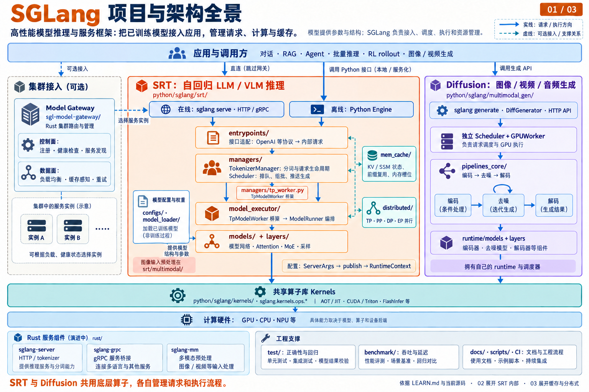
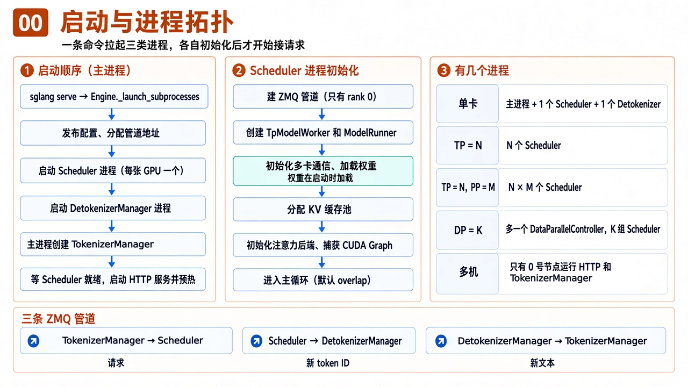
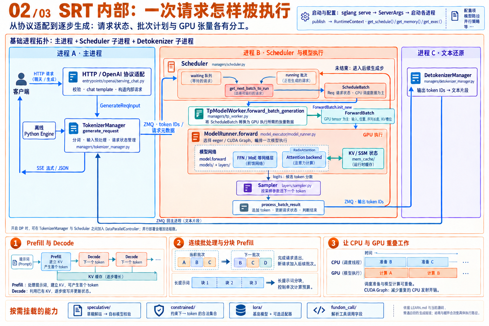
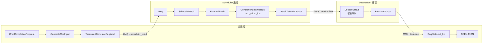
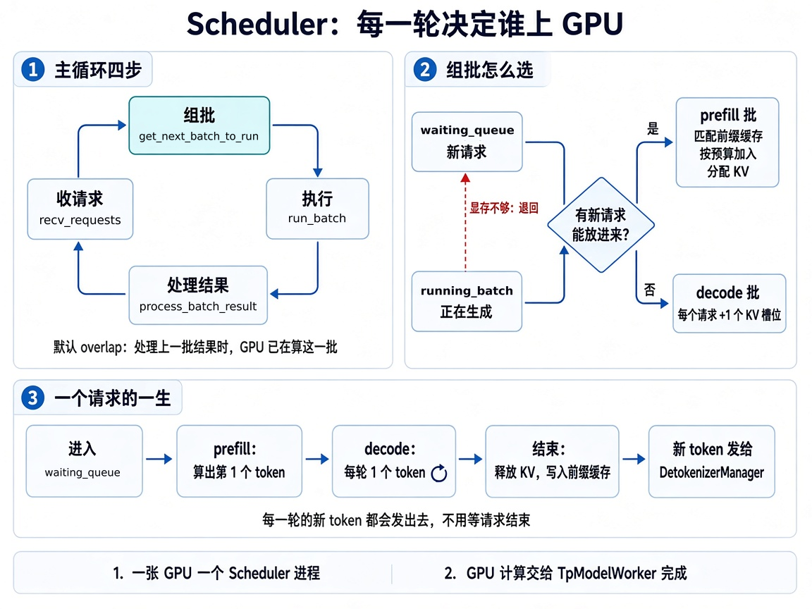
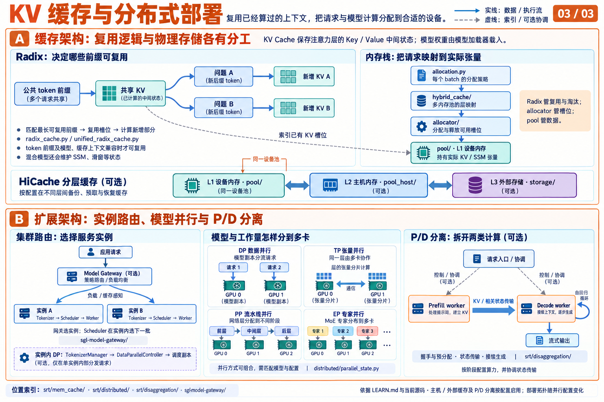

# LEARN: SGLang 怎么读

**当前默认学习路线：[Overlap 学习路线与现状](LEARN.overlap.md)。** 模型固定为 `Qwen3_5ForConditionalGeneration(Qwen3VLForConditionalGeneration)`：先读模型初始化与权重加载，再从非流式请求出发，只沿 `event_loop_overlap` 阅读；不展示 `event_loop_normal` 独有路径。以后询问“学习路线”“学习现状”“学了多少”“接下来读什么”，先运行 `python quick_learn/update_overlap_progress.py` 从当前源码重算，再给出总进度、阶段进度和按阅读顺序排列的方法表。表格固定为 **序号｜状态｜类名｜方法名｜作用**，一个方法一行，已读、推定已读和未读都展示，方法名链接源码；优先说明下一步尚未覆盖的模型初始化、推理核心方法。需要同步文档时加 `--write`；只读查询不写文件。

Overlap 路线 v3 使用独立的 **127 方法**范围和统计；下文第 8 节的 **160 方法**是全核心总览 v4，包含启动、配置和 normal/overlap，不用它代替当前路线进度。两者都已补入指定模型的初始化、推理路径，以及 QKV 投影与父类的核心方法。直接注释、链路补全、分支补全的判定原则沿用，只在各自范围内计算。

这份文档回答一件事：**从哪里开始读代码，才能用最少时间摸到引擎的骨头。**

仓库很大（约 225 万行真实代码）。不要通读。先把下面的**核心链路**和**核心文件**走通，再按任务下钻。

- 会用 API：`sglang serve` + OpenAI `/v1/chat/completions`，大约 1–2 天。
- 能改调度 / KV / 模型前向：有 vLLM 一类经验大约 3–6 周。
- 真正要精读的热路径大约 **3–4 万行**，不是 SRT（SGLang Runtime）的 72 万行。

行数是 2026-09 对本仓库的扫描（含空行与注释）。文件会涨，以路径为准。学习方法见 [快速学习.md](快速学习.md)，中文文章索引见 [user_guide_zh/README.md](user_guide_zh/README.md)。

---

## 1. 项目全景与子系统

SGLang 把已训练模型组织成推理服务。下图展示应用入口、SRT 与 Diffusion 两个运行时、共享算子库，以及可选的集群网关。



[查看原图](assets/sglang-architecture-overview-zh.png) · [完整架构图解与源码依据](assets/sglang-architecture-zh.md) · [绘图提示词](assets/sglang-architecture-zh.prompts.md)

按产品分 **5 个子系统**，学推理服务引擎先只啃 SRT：


| 子系统               | 路径                              | 大约代码量             | 干什么                                           | 现在学吗          |
| ----------------- | ------------------------------- | ----------------- | --------------------------------------------- | ------------- |
| **SRT**           | `python/sglang/srt/`            | 72.5 万行 Python    | 自回归 LLM / VLM：调度、KV、前向、OpenAI API             | **先学这个**      |
| **Kernels**       | `python/sglang/kernels/`        | 36 万行（含 CUDA/C++） | 统一算子：AOT、JIT、Triton / FlashInfer              | 改性能再进         |
| **Diffusion**     | `python/sglang/multimodal_gen/` | 32.7 万行 Python    | 图像 / 视频 / 音频扩散，**独立运行时**                      | 做生成图片、视频时再学   |
| **Model Gateway** | `sgl-model-gateway/`            | 9.4 万行（Rust）      | 多实例路由、PD 负载均衡、缓存感知                            | 做集群再学（见第 9 节） |
| **Rust 前端**       | `rust/`                         | 2.6 万行            | `sglang-server` / `sglang-grpc` / `sglang-mm` | 可选，进行中        |


支撑目录：`test/`（48 万行，CI）、`docs/`、`benchmark/`、`scripts/`、`.github/`。

- 正式入口是 `sglang serve`（`python/sglang/cli/`），`launch_server.py` 是兼容层。
- `python/sglang/lang/` 是旧前端 DSL，不再维护；TPU / JAX 在独立仓库 [sglang-jax](https://github.com/sgl-project/sglang-jax)。

---


## 2. 心智模型：进程、管道、配置

以单卡部署为例，SRT 是**三类进程 + 三条 ZMQ 管道**。开启多卡并行、DP 或多机部署后，进程数量会增加，但分工不变。



### 2.1 三类进程


| 进程             | 里面有什么                                        | 数量                  | 学习文档                                                                                                            |
| -------------- | -------------------------------------------- | ------------------- | --------------------------------------------------------------------------------------------------------------- |
| 主进程            | HTTP 服务、Engine、TokenizerManager              | 1 个                 | [核心组件一：Engine](user_guide_zh/核心组件一：Engine.md)、[核心组件二：TokenizerManager](user_guide_zh/核心组件二：TokenizerManager.md) |
| Scheduler 进程   | Scheduler、TpModelWorker、ModelRunner（同进程函数调用） | 每张卡一个，共 `tp × pp` 个 | [核心组件四：Scheduler](user_guide_zh/核心组件四：Scheduler.md)                                                             |
| Detokenizer 进程 | DetokenizerManager                           | 1 个                 | [核心组件三：DetokenizerManager](user_guide_zh/核心组件三：DetokenizerManager.md)                                           |


- **DP = K**：多一个 `DataParallelController` 进程，下面挂 K 组 Scheduler，每组都是一份完整模型。
- **多机**：只有 0 号节点运行 HTTP、TokenizerManager 和 Detokenizer，其他节点只有 Scheduler（`engine.py` 中 `node_rank >= 1` 提前返回）。
- **多个 tokenizer / detokenizer worker**：`--tokenizer-worker-num`、`--detokenizer-worker-num` 大于 1 时，对应组件变成多个进程，前面加一个 router 分流。


### 2.2 三条 ZMQ 管道


| 方向                             | 地址（`PortArgs` 字段）          | 谁 bind                 | 传什么                              |
| ------------------------------ | -------------------------- | ---------------------- | -------------------------------- |
| TokenizerManager → Scheduler   | `scheduler_input_ipc_name` | TokenizerManager（PUSH） | `TokenizedGenerateReqInput`      |
| Scheduler → Detokenizer        | `detokenizer_ipc_name`     | Detokenizer（PULL）      | `BatchTokenIDOutput`（新 token ID） |
| Detokenizer → TokenizerManager | `tokenizer_ipc_name`       | TokenizerManager（PULL） | `BatchStrOutput`（新文本）            |


- Scheduler 这一侧只有 rank 0 建管道；TP 大于 1 时由 rank 0 把请求广播给同组其他 rank。
- 控制请求的回复（如 `flush_cache`）由 Scheduler 直接发到 `tokenizer_ipc_name`，不经过 Detokenizer。
- 消息默认用 pickle 序列化（`SGLANG_USE_PICKLE_IPC`）。
- 细节见 [PortArgs](python/sglang/srt/server_args.py.PortArgs.md) 和 [基础知识：ZeroMQ 进程间通信](user_guide_zh/基础知识：ZeroMQ 进程间通信.md)。


### 2.3 启动顺序

1. `sglang serve` → `launch_server` → `[Engine._launch_subprocesses](python/sglang/srt/entrypoints/engine.py._launch_subprocesses.md)`。
2. `publish(server_args, role="tokenizer")` 发布配置，`PortArgs.init_new` 分配管道地址。
3. 按 `pp_rank × tp_rank` 为每张卡起一个 Scheduler 进程；DP 大于 1 时改为起 `DataParallelController`。
4. 起 Detokenizer 进程；主进程创建 TokenizerManager。
5. 等所有 Scheduler 报告就绪，再启动 HTTP 服务并预热，见 [HTTP 服务启动](python/sglang/srt/entrypoints/http_server.py._setup_and_run_http_server.md)。

Scheduler 进程自己的初始化：建管道 → 创建 TpModelWorker 和 ModelRunner（**权重在这里加载，不是推理时**）→ 分配 KV 缓存池 → 初始化注意力后端 → 捕获 CUDA Graph → 进入主循环（默认 `event_loop_overlap`）。

### 2.4 配置分层与两套状态

- **配置**：`ServerArgs` 是启动时的原始记录（约 1.1 万行旗标）。每个进程启动时调用 `publish()`，之后业务代码读 `runtime_context` 的配置分组（`get_schedule()` / `get_memory()` / `get_exec()` 等），不要在热路径里直接翻 `ServerArgs`。见 [publish](python/sglang/srt/runtime_context.py.publish.md)。
- **两套状态**：CPU 侧和 GPU 侧是两套结构，官方写在 `[schedule_batch.py](python/sglang/srt/managers/schedule_batch.py)` 文件头：

```
Req → ScheduleBatch（Scheduler，多半在 CPU）
        ↓  ForwardBatch.init_new
     ForwardBatch（ModelRunner，多半是 GPU tensor）
```

中间的桥是 `TpModelWorker`。Scheduler **不直接**调 `ModelRunner`。

---


## 3. 核心链路：一次请求怎样被执行

这是学习 SRT 时首先要跟通的请求路径。投机解码、PD 分离、LoRA 等特性都在这条主线上展开。



[查看 SRT 内部架构原图](assets/sglang-architecture-srt-zh.png)。下图补上每一跳的数据对象，以及跨进程时走哪条管道：




下面沿实际调用链跟代码：

```
sglang serve
    → http_server / Engine
        → OpenAI serving_chat：ChatCompletionRequest → GenerateReqInput
            → TokenizerManager.generate_request：登记 ReqState、分词
                → ZMQ → Scheduler.event_loop_overlap（默认）
                    → 收请求：process_input_requests → Req → waiting_queue
                    → 组批：get_next_batch_to_run → ScheduleBatch
                    → 执行：run_batch
                        → TpModelWorker.forward_batch_generation
                            → ForwardBatch.init_new
                            → ModelRunner.forward（model.forward + Attention backend，读写 KV）
                            → ModelRunner.sample → Sampler
                    → 处理结果：process_batch_result（update_finish_state、释放 KV）
                    → stream_output → ZMQ → DetokenizerManager（增量解码）
                → ZMQ → TokenizerManager.handle_loop：按 rid 写入 ReqState
        → HTTP SSE / JSON 回客户端
```


| 步       | 发生什么                                      | 跟到哪个文件                                                                                                                                                                                              | 学习文档                                                                                                                                                                                                                     |
| ------- | ----------------------------------------- | --------------------------------------------------------------------------------------------------------------------------------------------------------------------------------------------------- | ------------------------------------------------------------------------------------------------------------------------------------------------------------------------------------------------------------------------ |
| 1 启动    | 解析参数，拉起三类进程                               | `[serve.py](python/sglang/cli/serve.py)` → `[engine.py](python/sglang/srt/entrypoints/engine.py)`、`[http_server.py](python/sglang/srt/entrypoints/http_server.py)`                                  | [Engine](user_guide_zh/核心组件一：Engine.md)、[_launch_subprocesses](python/sglang/srt/entrypoints/engine.py._launch_subprocesses.md)                                                                                          |
| 2 配置    | `ServerArgs` 发布成 RuntimeContext 配置分组      | `[server_args.py](python/sglang/srt/server_args.py)`、`[runtime_context.py](python/sglang/srt/runtime_context.py)`                                                                                   | [publish](python/sglang/srt/runtime_context.py.publish.md)、[PortArgs](python/sglang/srt/server_args.py.PortArgs.md)、[ModelConfig 精度](python/sglang/srt/configs/model_config.py._get_and_verify_dtype.md)                 |
| 3 API   | HTTP 协议变成 `GenerateReqInput`              | `[serving_chat.py](python/sglang/srt/entrypoints/openai/serving_chat.py)`                                                                                                                           | [docs/learn/01](docs/learn/01-http-tokenizer-manager.md)、[serving_chat 说明](python/sglang/srt/entrypoints/openai/serving_chat_说明.md)                                                                                      |
| 4 分词    | chat template、tokenize，经 ZMQ 发给 Scheduler | `[tokenizer_manager.py](python/sglang/srt/managers/tokenizer_manager.py)`                                                                                                                           | [TokenizerManager](user_guide_zh/核心组件二：TokenizerManager.md)                                                                                                                                                              |
| 5 调度    | 等待 / 运行队列、Radix 匹配、组成 `ScheduleBatch`     | `[scheduler.py](python/sglang/srt/managers/scheduler.py)`、`[schedule_batch.py](python/sglang/srt/managers/schedule_batch.py)`、`[schedule_policy.py](python/sglang/srt/managers/schedule_policy.py)` | [Scheduler](user_guide_zh/核心组件四：Scheduler.md)、[收请求](python/sglang/srt/managers/scheduler.py.process_input_requests.md)、[组批](python/sglang/srt/managers/scheduler.py.get_next_batch_to_run.md)                            |
| 6 桥接    | `ScheduleBatch` → `ForwardBatch`          | `[tp_worker.py](python/sglang/srt/managers/tp_worker.py)`                                                                                                                                           | [TpModelWorker 与 ModelRunner](user_guide_zh/核心组件五：TpModelWorker与ModelRunner.md)、[执行与处理结果](python/sglang/srt/managers/scheduler.py.run_batch.md)                                                                          |
| 7 前向    | eager / CUDA Graph，`model.forward`        | `[model_runner.py](python/sglang/srt/model_executor/model_runner.py)`、`[forward_batch_info.py](python/sglang/srt/model_executor/forward_batch_info.py)`                                             | [核心组件五（执行分派）](user_guide_zh/核心组件五：TpModelWorker与ModelRunner.md)、[docs/learn/04](docs/learn/04-model-forward-execution.md)                                                                                                |
| 8 计算+缓存 | Attention 读写 KV；allocator 分槽位；radix 决定复用  | `[layers/attention/](python/sglang/srt/layers/attention/)`、`[memory_pool.py](python/sglang/srt/mem_cache/memory_pool.py)`、`[radix_cache.py](python/sglang/srt/mem_cache/radix_cache.py)`            | [组批（KV 分配、前缀缓存）](python/sglang/srt/managers/scheduler.py.get_next_batch_to_run.md)                                                                                                                                       |
| 9 采样回包  | 采下一个 token，增量解码，流式回 HTTP                  | `[sampler.py](python/sglang/srt/layers/sampler.py)`、`[detokenizer_manager.py](python/sglang/srt/managers/detokenizer_manager.py)`                                                                   | [核心组件五（采样）](user_guide_zh/核心组件五：TpModelWorker与ModelRunner.md)、[DetokenizerManager](user_guide_zh/核心组件三：DetokenizerManager.md)、[增量解码](python/sglang/srt/managers/detokenizer_manager.py._decode_batch_token_id_output.md) |


Scheduler 主循环的骨架（当前路线只沿 `event_loop_overlap` 阅读）：

```
recv_requests → process_input_requests → get_next_batch_to_run → run_batch → process_batch_result
```

overlap 版本把 `process_batch_result` 推迟一轮：先下发本批，再处理上一批的结果，让 CPU 处理和 GPU 计算重叠。PP、PD 分离等变体都是这个骨架的分支。IPC 消息类型全部在 `[io_struct.py](python/sglang/srt/managers/io_struct.py)`，改协议、加字段先看它。

### 3.1 固定模型：Qwen3_5ForConditionalGeneration

核心模型链路固定读 [qwen3_5.py](python/sglang/srt/models/qwen3_5.py) 中的 `Qwen3_5ForConditionalGeneration`，包括**初始化、权重加载、Prefill/Decode 推理**。它继承 [qwen3_vl.py](python/sglang/srt/models/qwen3_vl.py) 的 `Qwen3VLForConditionalGeneration.forward`；继承的是外层执行组织，文本计算由构造时注入的 Qwen 3.5 主干完成。

| 对象 | 实际类型 / 来源 | 负责什么 |
| --- | --- | --- |
| `ModelRunner.model` | `qwen3_5.Qwen3_5ForConditionalGeneration` | 服务持有的外层模型；定义构造、权重加载，继承父类前向 |
| 外层模型的 `self.model` | `qwen3_5.Qwen3_5ForCausalLM` | embedding → 按配置逐层执行 decoder → 最终归一化，返回 hidden states |
| `self.model.layers[i]` | `Qwen3_5AttentionDecoderLayer` 或 `Qwen3_5LinearDecoderLayer` | 普通 Attention 或 GatedDeltaNet，加上各层的 dense MLP 与残差处理 |
| 外层模型的 `self.lm_head` | `ParallelLMHead`，或满足条件时复用 embedding | 保存词表投影权重 |
| 外层模型的 `self.logits_processor` | `LogitsProcessor` | 选取需要输出的位置，执行 LM head 投影，形成 logits |

注意同名类：[qwen3_5_text.py](python/sglang/srt/models/qwen3_5_text.py) 也有 `Qwen3_5ForCausalLM`，它是另一个完整文本模型入口。本路线的 `self.model` 使用 **qwen3_5.py** 中的类；不因同名再绕进另一套外层封装。

**初始化与权重加载：** 以常规 `DefaultModelLoader` 为代表，沿下面两个阶段读。这里的启动期准备只执行一次，后续请求复用创建好的模型。

```text
ModelRunner.load_model
  → load_model_with_memory_saver
    → DefaultModelLoader.load_model
      ① _initialize_model → 解析模型架构 → Qwen3_5ForConditionalGeneration.__init__
           → Qwen3VLForConditionalGeneration.__init__
             → language_model_cls = qwen3_5.Qwen3_5ForCausalLM
             → self.model：embedding + layers + final norm
                  layers_block_type[i] == attention
                    → Qwen3_5AttentionDecoderLayer.__init__
                  layers_block_type[i] == linear_attention
                    → Qwen3_5LinearDecoderLayer.__init__
                      → Qwen3_5GatedDeltaNet.__init__
                  两类 dense 层各自创建 Qwen2MoeMLP
             → self.lm_head + self.logits_processor
      ② load_weights_and_postprocess
           → Qwen3_5ForConditionalGeneration.load_weights
             → checkpoint 名称映射、合并投影分片加载、参数 weight_loader
      → model.eval() → 保存到 ModelRunner.model
```

父类接收子类传入的 `language_model_cls`，用 `config.text_config` 创建文本主干；主干依据 `layers_block_type` 选择层类型。父类还按 `language_model_only` 决定是否创建视觉模块；**这不是“当前请求有没有图片”的判断**。dense 路线中的 `Qwen2MoeMLP` 是共用前馈实现，不因名字含 `Moe` 就进入专家路由。权重加载入口是外层子类的 `load_weights`，它遍历整棵参数树；不必再经过主干同名方法。

**推理：** 先沿 Eager 看清张量流向，再看 CUDA Graph 重放的条件。Overlap 改变批次提交和结果处理的时序，模型内部仍沿相同的前向组织执行。

```text
TpModelWorker.forward_batch_generation → ForwardBatch.init_new
  → ModelRunner.forward → _forward_raw
    → EagerRunner.execute → _execute_extend / _execute_decode
      → Qwen3VLForConditionalGeneration.forward（self 是 Qwen3_5 子类实例）
        ├─ language_model_only=True：self.model(input_ids, ...)
        └─ language_model_only=False：general_mm_embed_routine
             → 纯文本路径：embed_tokens(input_ids) → self.model(input_embeds, ...)
        → qwen3_5.Qwen3_5ForCausalLM.forward
             → embedding / 已给定 input_embeds
             → 逐层：普通 Attention → RadixAttention → 普通注意力后端
                   或 GatedDeltaNet → RadixLinearAttention → 线性注意力后端
             → 每层 dense MLP 与残差处理 → final norm → hidden states
        → LogitsProcessor.forward → _get_logits → _compute_lm_head
          → LogitsProcessorOutput
  → ModelRunner.sample → Sampler.forward → next_token_ids
```

`general_mm_embed_routine` 的纯文本分支也在本路线内；只有满足多模态输入条件时才进入视觉编码/融合专题。普通 LM head 投影为 `hidden_states × lm_head.weight.T`。常规生成时，Prefill 通常取每个请求最后一个待采样位置，Decode 每个请求通常有一个新位置；输入 logprobs 等条件会改变需要保留的位置，不能把所有模式都写成“只取最后一个 token”。主干返回 hidden states，外层返回 logits，采样在 `ModelRunner` 中完成。

上图按常规单卡文本生成理解；PP 非末 rank 会返回 `PPProxyTensors`，只有末 rank 做最终归一化与 logits。完整方法清单和实时状态见 [初始化与请求路线](LEARN.overlap.md)；视觉编码、MoE、GDN 状态池与底层算子后续另开专题。

---


## 4. 核心组件导读


| 组件                          | 一句话                                                          | 关键方法                                           | 文档与科普图                                                                                                                |
| --------------------------- | ------------------------------------------------------------ | ---------------------------------------------- | --------------------------------------------------------------------------------------------------------------------- |
| Engine                      | 推理接口，负责拉起三类进程、关闭资源                                           | `_launch_subprocesses`                         | [核心组件一](user_guide_zh/核心组件一：Engine.md)                                                                                |
| TokenizerManager            | 主进程里的请求入口：分词、提交请求、按 rid 收结果                                  | `generate_request` / `handle_loop`             | [核心组件二](user_guide_zh/核心组件二：TokenizerManager.md) · [科普图](python/sglang/srt/managers/tokenizer_manager_科普图.png)        |
| Scheduler                   | 每张卡一个进程：收请求、组批、执行、处理结果                                       | `event_loop_overlap` / `get_next_batch_to_run` | [核心组件四](user_guide_zh/核心组件四：Scheduler.md) · [科普图](user_guide_zh/assets/scheduler-overview-4x3.png)                    |
| TpModelWorker / ModelRunner | 桥接与执行：`ForwardBatch.init_new` → `forward` → `sample`；启动时加载权重 | `forward_batch_generation` / `initialize`      | [核心组件五](user_guide_zh/核心组件五：TpModelWorker与ModelRunner.md) · [docs/learn/04](docs/learn/04-model-forward-execution.md) |
| DetokenizerManager          | 独立进程：把 token ID 增量解码成文本                                      | `event_loop` / `_decode_batch_token_id_output` | [核心组件三](user_guide_zh/核心组件三：DetokenizerManager.md) · [科普图](user_guide_zh/assets/detokenizer-manager-overview-4x3.png) |




三大中枢类是 `Scheduler`、`TokenizerManager`、`ModelRunner`，写法约定见 `[.claude/skills/large-class-style/SKILL.md](.claude/skills/large-class-style/SKILL.md)`。`ModelRunner` 已冻结为编排层，领域逻辑在协作组件里；`Scheduler` 的协作组件在 `managers/scheduler_components/`。

---


## 5. KV 缓存与并行



[查看缓存与分布式架构原图](assets/sglang-architecture-scaling-zh.png)。主机 / 外部缓存及 P/D 分离按配置启用；Radix 管复用与淘汰，allocator 管槽位，pool 持有实际数据。

KV 栈分层（读 `[mem_cache/README.md](python/sglang/srt/mem_cache/README.md)` 比直接跳进 6 万行代码快）：

```
scheduler / model_runner / attention backend
                    ↓
            allocation.py          每 batch 分配策略
                    ↓
            hybrid_cache/          layer_id → pool
                    ↓
            allocator/             need_size → 槽位
                    ↓
            pool/ (GPU L1)  --hicache-->  pool_host/ (Host L2)  -->  storage/ (L3)
            radix cache                前缀 → 节点（复用 / 淘汰）
```

Scheduler 组批时用到的三个内存对象：`req_to_token_pool`（每个请求一行，记录它的 KV 放在哪）、`token_to_kv_pool_allocator`（分配和回收 KV 槽位）、`tree_cache`（前缀缓存，决定哪些 KV 能复用），详见[组批](python/sglang/srt/managers/scheduler.py.get_next_batch_to_run.md)。

多卡跑同一份模型有两种切法，PP 是**纵向**切，TP 是**横向**切：


| 方式       | 怎么切      | 每张卡上有什么           | 通信                          |
| -------- | -------- | ----------------- | --------------------------- |
| PP 流水线并行 | 按层纵向切    | 连续的一段层            | 只在两段交接处传一次中间结果，适合跨机器        |
| TP 张量并行  | 在每层内部横向切 | 全部层，但每层只有 1/N 的权重 | 每层都要合并各卡结果，需要高速互联，一般在同一台机器里 |


两者可以组合，一份完整模型占 `tp × pp` 张卡；DP 再把整份模型复制 K 份。详见 [1.7 长上下文流水线并行](user_guide_zh/1.7 长上下文流水线并行(Pipeline Parallelism for Long Context).md) 和 [1.3 并行策略与模型网关](user_guide_zh/1.3 并行策略与模型网关(Parallelism and Model Gateway).md)。

---


## 6. 核心文件（按这个顺序读）


### P0 — 热路径上每一个都要打开


| 文件                                                                                                                 | 约行数  | 为什么必须读                                          |
| ------------------------------------------------------------------------------------------------------------------ | ---- | ----------------------------------------------- |
| `[python/sglang/srt/managers/scheduler.py](python/sglang/srt/managers/scheduler.py)`                               | 5400 | 连续批处理主循环，几乎所有 serving 特性都挂在这里；主路径只有约 1000 行要精读  |
| `[python/sglang/srt/managers/schedule_batch.py](python/sglang/srt/managers/schedule_batch.py)`                     | 3500 | `Req` / `ScheduleBatch`：请求状态和 batch 字段          |
| `[python/sglang/srt/managers/tokenizer_manager.py](python/sglang/srt/managers/tokenizer_manager.py)`               | 3800 | 主进程：tokenize、限流、和 Scheduler / Detokenizer 的 IPC |
| `[python/sglang/srt/managers/io_struct.py](python/sglang/srt/managers/io_struct.py)`                               | 2500 | 进程间消息 schema                                    |
| `[python/sglang/srt/managers/tp_worker.py](python/sglang/srt/managers/tp_worker.py)`                               | 730  | **Scheduler → ModelRunner 的桥**，漏读这个会以为调度直接调模型   |
| `[python/sglang/srt/model_executor/model_runner.py](python/sglang/srt/model_executor/model_runner.py)`             | 2200 | GPU worker 编排根，冻结文件                             |
| `[python/sglang/srt/model_executor/forward_batch_info.py](python/sglang/srt/model_executor/forward_batch_info.py)` | 1900 | 一步 forward 的 GPU 布局，连接调度和 kernel                |


建议读法：用一个最短 generate 请求，对着上表从 HTTP 跟到 `ModelRunner.forward`，再跟回 HTTP。不要平行打开 7 个文件扫一遍。

### P1 — 热路径的两端（启动、缓存、回包）


| 文件                                                                                                             | 约行数  | 为什么要读                             |
| -------------------------------------------------------------------------------------------------------------- | ---- | --------------------------------- |
| `[python/sglang/srt/entrypoints/engine.py](python/sglang/srt/entrypoints/engine.py)`                           | 1900 | 三类进程怎么被拉起                         |
| `[python/sglang/srt/entrypoints/http_server.py](python/sglang/srt/entrypoints/http_server.py)`                 | 2800 | HTTP 路由进 TokenizerManager         |
| `[python/sglang/srt/entrypoints/openai/serving_chat.py](python/sglang/srt/entrypoints/openai/serving_chat.py)` | 2700 | 最常用的 OpenAI chat 适配               |
| `[python/sglang/srt/mem_cache/memory_pool.py](python/sglang/srt/mem_cache/memory_pool.py)`                     | 5200 | 设备 KV / SSM pool，Radix 之下的物理层     |
| `[python/sglang/srt/mem_cache/radix_cache.py](python/sglang/srt/mem_cache/radix_cache.py)`                     | 860  | 前缀缓存，SGLang 相对 vLLM 的标志设计         |
| `[python/sglang/srt/mem_cache/unified_radix_cache.py](python/sglang/srt/mem_cache/unified_radix_cache.py)`     | 3000 | 正在收敛的统一 radix（Full / SWA / Mamba） |
| `[python/sglang/srt/managers/detokenizer_manager.py](python/sglang/srt/managers/detokenizer_manager.py)`       | 600  | token → 文本，体积小但在回包路径上             |
| `[python/sglang/srt/layers/sampler.py](python/sglang/srt/layers/sampler.py)`                                   | 800  | 采样                                |
| `[python/sglang/srt/layers/radix_attention.py](python/sglang/srt/layers/radix_attention.py)`                   | 640  | 模型层怎么接到 attention backend         |


再加 **一个** dense 模型：从 `Qwen3_5ForConditionalGeneration` 的初始化、权重加载读到继承的 `forward` 和文本主干，见第 3.1 节；以及 **一个**普通 Attention backend（本清单选 `[flashattention_backend.py](python/sglang/srt/layers/attention/flashattention_backend.py)`）。Qwen 3.5 的线性注意力分支跟到 GatedDeltaNet 与 RadixLinearAttention 接口。不要读 `[models/](python/sglang/srt/models/)` 下 220 个文件。

### P2 — 改配置、并行、调度策略时再读


| 文件                                                                                                   | 约行数       | 什么时候读                                   |
| ---------------------------------------------------------------------------------------------------- | --------- | --------------------------------------- |
| `[python/sglang/srt/managers/schedule_policy.py](python/sglang/srt/managers/schedule_policy.py)`     | 1500      | 改 FCFS / 优先级 / 缓存感知策略                   |
| `[python/sglang/srt/distributed/parallel_state.py](python/sglang/srt/distributed/parallel_state.py)` | 3100      | 做 TP / PP / DP / EP                     |
| `[python/sglang/srt/configs/model_config.py](python/sglang/srt/configs/model_config.py)`             | 2300      | 从 HF config 投影运行时能力                     |
| `[python/sglang/srt/runtime_context.py](python/sglang/srt/runtime_context.py)`                       | 1700      | 读配置、改 override 的正确入口                    |
| `[python/sglang/srt/environ.py](python/sglang/srt/environ.py)`                                       | 1800      | `SGLANG_*` 环境变量登记处                      |
| `[python/sglang/srt/server_args.py](python/sglang/srt/server_args.py)`                               | **11300** | 旗标百科，**搜索，不要通读**                        |
| `[.claude/skills/sglang-runtime-context/SKILL.md](.claude/skills/sglang-runtime-context/SKILL.md)`   | —         | RuntimeContext 设计：publish、配置分组、禁止读 seed |


---


## 7. 怎么学

**2 周：能跟请求、能改小功能**

1. 读完 P0 + `engine.py`。
2. 自己加一个 `ServerArgs` 字段，在 Scheduler 里打日志，确认请求能走到那一行（配合 `[log_config_debug.json](log_config_debug.json)` 打出文件名和行号）。
3. 对照 `test/registered/core/` 跑一个最小测试。

产出：能画出三类进程图，能回答「这个请求卡在哪一层」。

**6 周：能改调度或 KV**

1. 精读 `schedule_batch.py`、`radix_cache.py` / `unified_radix_cache.py`、`memory_pool.py`。
2. 跟一个 CUDA Graph runner（`model_executor/runner/decode_cuda_graph_runner.py`）。
3. 对照 `test/registered/radix_cache/`、`test/registered/scheduler/`。

产出：能独立做 prefix cache / 批策略类 PR。

**不要一上来做的**：通读 `server_args.py`；通读 `layers/attention/`（约 6 万行）；通读 `models/`（220 个模型文件）；先学 NPU / MLX / XPU（`hardware_backend/`）、Diffusion 或 Gateway。

**SRT 一级包**：约 42 个。必须认门的是 `managers/`、`model_executor/`、`mem_cache/`、`entrypoints/`、`layers/`（重点读 `radix_attention.py`、`sampler.py`、一个 attention backend，以及 `linear.py` 和 `quantization/unquant.py` 中所列的 QKV 投影核心方法）、`models/`（只读一个 dense 模型）、`sampling/`、`configs/`；`speculative/`、`disaggregation/`、`lora/` 等做对应特性时再打开；`hardware_backend/`、`debug_utils/`、`ray/` 等默认跳过。

---


## 8. 学习进度（核心链路阅读覆盖）

以**固定核心方法清单中，按约定视为已读的方法占比**作为学习进度。不要求考试、复述或练习验收；AI 生成文档、图片和笔记的数量不计入已读证据。

### 8.1 固定分母：核心概念方法

范围和链路保存在 [LEARN.scope.json](quick_learn/LEARN.scope.json)。v4 共 **160 个方法、30 个概念分支**，覆盖常规文本生成的启动、配置、请求、调度、执行、KV、采样与回包，包括 normal/overlap、chunked prefill、基础 decode CUDA Graph 和指定 Qwen 3.5 dense 模型的初始化、权重加载与文本推理。

- 每个方法等权计 1，只归属一个分支；方法长短、注释多少、被调用次数不增加权重。
- 保留承载 SGLang 核心状态、策略或数据转换的方法，例如组批、PrefillAdder、KV 槽位分配、前缀匹配、ForwardBatch、Attention 和采样。
- 日志、通用序列化、socket 包装、字符串处理、简单 getter/setter 等基础操作不计入分母，也不要求逐个加注释。
- 同类实现选一个代表：Qwen 3.5 dense、FlashAttention、基础 RadixCache、paged KV allocator。Qwen 3.5 同时列出普通 Attention 层与 GatedDeltaNet 线性注意力层；线性注意力跟到 RadixLinearAttention 接口。其它模型、后端和缓存变体不重复扩展分母。
- 运维接口、权重更新、LoRA、PD/EPD、推测解码、MoE/EP、复杂并行拓扑、视觉编码与多模态融合、独立 Mamba/SWA 专题、GDN 状态池与后端算子、量化、硬件专用分支和底层 kernel 暂不计入。后续专题可单独统计。

v2 调整（2026-10-04）：按当前学习目标，将 Llama 的 5 个前向方法替换为 Qwen 3.5 的 8 个方法，总数由 137 变为 140。实际入口为 `Qwen3_5ForConditionalGeneration`，其 `forward` 定义在父类 `Qwen3VLForConditionalGeneration`；内部文本主干使用 `qwen3_5.py` 的 `Qwen3_5ForCausalLM`。两类解码层复用 `Qwen2MoeMLP.forward` 的 dense 前馈实现。直接证据、链路补全、分支补全规则及固定基线沿用原口径。

v3 调整（2026-10-07）：继续固定上述模型，增加 **12 个模型构造/加载方法**（`ModelRunner.load_model` 原已在范围中）、`general_mm_embed_routine` 的文本入口和 `LogitsProcessor._compute_lm_head`，共新增 14 项，140 → 154。Overlap 路线同步升为 v2：原先没有启动期 `ModelRunner.load_model`，因此新增 15 项，106 → 121。新旧版本分母不同，百分比不能直接视为学习增减；新增文档本身不计为已读。

v4 调整（2026-10-07）：补入 **6 个 QKV 线性投影核心方法**，全核心 154 → 160；Overlap 路线升为 v3，121 → 127。构造阶段包含 `QKVParallelLinear.__init__`、`ColumnParallelLinear.__init__`、`LinearBase.__init__`、`UnquantizedLinearMethod.create_weights`；前向阶段包含 `ColumnParallelLinear.forward`、`UnquantizedLinearMethod.apply`。继承方法按实际定义计数；`LinearBase.forward` 抽象占位、PyTorch 通用机制及量化/硬件变体不计入。父类初始化与权重创建、QKV 投影与 RadixAttention 分别按独立调用分支判定，原 D/C/B 规则和固定基线不变。

原来的约 5% 将点名文件中的所有方法纳入分母，共 1372 个，混入了大量非核心操作和变体；该口径停用。本节百分比仅对应上述核心范围。

### 8.2 已读判定：直接证据 → 链路补全 → 分支补全

| 标记 | 含义 | 明确规则 |
| --- | --- | --- |
| D | 直接注释证据 | 当前工作区相对固定基线，在该方法内或紧贴定义前新增/改写了中文注释、中文 docstring 或独立说明字符串。 |
| C | 链路补全 | 白名单链路上的两个 D 之间，所有核心中间节点视为已读。例如 a → b → c 中 a、c 是 D，则 b 是 C。 |
| B | 分支补全 | 同一预定义分支至少有 **2 个 D**，且链路补全后的 **(D+C)/分支方法数 ≥ 2/3**，其余节点全部视为已读。 |
| U | 待覆盖 | 没有直接证据，且未满足上述补全规则；不据此断言实际没有读过。 |

具体执行约束：

1. **先确定 D，再做一轮 C，最后做一轮 B。** C、B 不充当新的链路端点；一个分支补全后，也不继续推动其它分支补全。优先级为 D > C > B > U，同一方法不重复计数。
2. 链路以 `quick_learn/LEARN.scope.json` 的 `chains` 为准，按实际代码关系列出调用、子进程入口、IPC 消息交接、结果唤醒路径；中间可略过不计分的基础方法。同一调用者的不同子分支，不会仅因先后执行就串成一条链。
3. 分支以该文件的 `branches` 为准，按核心概念划分，不以整个源码文件为分支。例如一个分支有 6 个方法，其中 2 个 D、2 个 C，达到 4/6 后，其余 2 个记为 B；旁边另一个分支不受影响。
4. 中文说明通过 Python 的 token/AST 识别，包含多行 docstring。普通业务字符串、错误消息、未改变的原有中文说明不算新增证据；同一方法中仅移动已有说明或只修改同行代码也不新增证据。嵌套函数/类的说明不算外层方法的直接证据。英文 `# NOTE` 本身不计分。
5. 基线固定为 `6388b6cfb1d93c253714a408f1d66a093302acd7`（制定口径时的 main 提交），读取当前工作区，包含未提交修改。后续 main 移动不会改变对照基线。
6. 每项 D 记录注释行号，C 记录链路和两个直接证据端点，B 记录分支及补全前覆盖数，详见 [LEARN.methods.md](LEARN.methods.md)，其中逐项标记已读、推定已读和未读。范围、阈值或代表实现调整时应递增范围版本，并说明变化；不为追求某个百分比改动分母。

**学习进度 = (D + C + B) / 核心方法总数。** 这是双方约定的阅读覆盖统计；分支达到 100% 表示按该规则全部计入已读，不表示所有实现细节均已掌握。

### 8.3 当前统计

<!-- LEARN-PROGRESS:START -->

**当前核心链路阅读覆盖：119/160（74.4%）。**

其中：直接注释 **101** 个，链路补全 **11** 个，分支补全 **7** 个；待覆盖 **41** 个。该数值表示按约定视为已读的核心方法比例。

| 核心阶段 | 直接注释 D | 链路补全 C | 分支补全 B | 已覆盖 / 总数 | 覆盖率 |
| --- | ---: | ---: | ---: | ---: | ---: |
| 1 启动与进程 | 23 | 3 | 1 | 27/31 | 87.1% |
| 2 配置发布 | 2 | 0 | 0 | 2/4 | 50.0% |
| 3 API 与请求转换 | 4 | 0 | 2 | 6/6 | 100.0% |
| 4 分词与请求提交 | 10 | 0 | 0 | 10/10 | 100.0% |
| 5 调度与组批 | 22 | 0 | 1 | 23/29 | 79.3% |
| 6 执行桥接与 overlap 数据交接 | 6 | 0 | 1 | 7/7 | 100.0% |
| 7 模型前向与 Attention | 10 | 4 | 1 | 15/24 | 62.5% |
| 8 KV 分配与前缀缓存 | 9 | 0 | 0 | 9/24 | 37.5% |
| 9 采样、结果处理与回包 | 15 | 4 | 1 | 20/25 | 80.0% |

统计范围版本：v4，30 个分支，39 个源码文件中的白名单方法。读取当前工作区（含未提交修改），HEAD `81827dda8cfb`，固定对照基线 `6388b6cfb1d9`。
源码指纹 `3d4616def05bfd13`；范围指纹 `7bf85107846c0057`。完整指纹和逐方法依据见 [LEARN.methods.md](LEARN.methods.md)。

<!-- LEARN-PROGRESS:END -->

### 8.4 更新方法与资料导航

加完学习注释后，运行以下命令同步本文统计区和方法清单。脚本仅解析源码和 Git 基线，不启动 SGLang，也不需要 GPU：

```bash
python quick_learn/update_learn_progress.py --write
python quick_learn/update_overlap_progress.py --write
```

不带参数只预览；分别加 `--check` 检查三份文档是否与当前源码一致。脚本发现白名单方法不存在或重名时会报错，不会悄悄减少分母。

以下文档保留为阅读导航，不参与计分：

| 阶段 | 资料 |
| --- | --- |
| 启动与配置 | [Engine](user_guide_zh/核心组件一：Engine.md)、[启动编排](python/sglang/srt/entrypoints/engine.py._launch_subprocesses.md)、[HTTP 服务启动](python/sglang/srt/entrypoints/http_server.py._setup_and_run_http_server.md)、[publish](python/sglang/srt/runtime_context.py.publish.md)、[PortArgs](python/sglang/srt/server_args.py.PortArgs.md) |
| 请求与分词 | [HTTP 与 TokenizerManager](docs/learn/01-http-tokenizer-manager.md)、[TokenizerManager](user_guide_zh/核心组件二：TokenizerManager.md) |
| 调度与组批 | [Scheduler](user_guide_zh/核心组件四：Scheduler.md)、[组批](python/sglang/srt/managers/scheduler.py.get_next_batch_to_run.md) |
| 桥接与模型执行 | [TpModelWorker 与 ModelRunner](user_guide_zh/核心组件五：TpModelWorker与ModelRunner.md)、[模型前向](docs/learn/04-model-forward-execution.md) |
| 采样与回包 | [DetokenizerManager](user_guide_zh/核心组件三：DetokenizerManager.md)、[核心组件五](user_guide_zh/核心组件五：TpModelWorker与ModelRunner.md) |

---


## 9. 后续待办


### 9.1 核心链路补全

1. 优先跟通第 3.1 节的 `Qwen3_5ForConditionalGeneration`：构造与权重加载 → 继承的 `forward` → 两类解码层 → logits 与采样。再补 `ForwardBatch` 字段、一个普通 attention backend、`memory_pool.py` 和 `radix_cache.py`。
2. 第 2、3 步补全：RuntimeContext 配置分组；`serving_chat` 如何把 HTTP 请求转成 `GenerateReqInput`。
3. 动手练习：在 Scheduler 四步各打一条日志，跑一个请求验证主循环；对照 `test/registered/core/` 跑最小测试。


### 9.2 加速策略


| 类别    | 特性                                                               | 已有中文文章                                                                                                                                                                                                                                                                                                                                                                                                                                                                                                            | 待办                                        |
| ----- | ---------------------------------------------------------------- | ----------------------------------------------------------------------------------------------------------------------------------------------------------------------------------------------------------------------------------------------------------------------------------------------------------------------------------------------------------------------------------------------------------------------------------------------------------------------------------------------------------------- | ----------------------------------------- |
| 调度    | 重叠调度、分块预填充、PP 调度与动态分块、TBO / SBO                                  | [1.7 长上下文流水线并行](user_guide_zh/1.7 长上下文流水线并行(Pipeline Parallelism for Long Context).md)、[1.4 专家并行](user_guide_zh/1.4 专家并行(Expert Parallelism).md)                                                                                                                                                                                                                                                                                                                                                                  | 重叠调度的 FutureMap 细节；`event_loop_pp` 源码     |
| 缓存与显存 | Radix 前缀缓存、会话感知 Radix、HiCache、HiSparse、权重量化、KV 量化                | [2.3 会话感知基数缓存](user_guide_zh/2.3 会话感知基数缓存(Session-Aware Radix Cache).md)、[2.2 分层稀疏注意力](user_guide_zh/2.2 分层稀疏注意力(Hierarchical Sparse Attention).md)、[4.1 模型量化入门](user_guide_zh/4.1 模型量化入门(Model Quantization).md)、[4.2 量化键值缓存](user_guide_zh/4.2 量化键值缓存(Quantized KV Cache).md)                                                                                                                                                                                                                                   | 基础 Radix 与 HiCache 专篇                     |
| 解码加速  | EAGLE / EAGLE3、MTP（NEXTN）、STANDALONE、NGRAM、DFLASH、DSPARK、自适应推测解码 | [3.1 推测解码](user_guide_zh/3.1 推测解码：MTP 与 EAGLE-3(Speculative Decoding).md)、[3.2 自适应推测解码](user_guide_zh/3.2 自适应推测解码(Adaptive Speculative Decoding).md)、[docs/learn/02 DFlash](docs/learn/02-dflash.md)                                                                                                                                                                                                                                                                                                              | NGRAM、STANDALONE、DSPARK                   |
| 并行与部署 | PD 分离、EPD 分离、DP Attention、EP / EPLB / 弹性 EP、解码上下文并行、LoRA、R-Fork  | [1.5 PD 分离](user_guide_zh/1.5 预填充与解码分离(PD Disaggregation).md)、[1.6 EPD 分离](user_guide_zh/1.6 编码、预填充与解码分离(EPD Disaggregation).md)、[1.3 并行策略](user_guide_zh/1.3 并行策略与模型网关(Parallelism and Model Gateway).md)、[1.4 专家并行](user_guide_zh/1.4 专家并行(Expert Parallelism).md)、[2.4 解码上下文并行](user_guide_zh/2.4 解码上下文并行(Decode Context Parallelism).md)、[1.5 LoRA 服务](user_guide_zh/1.5 LoRA 服务(LoRA Serving).md)、[1.11 R-Fork](user_guide_zh/1.11 远程权重加载(R-Fork).md)、[docs/learn/03 PD](docs/learn/03-pd-disaggregation.md) | PD 分离下 Scheduler 的 `disagg` 主循环           |
| 计算优化  | Decode CUDA Graph、分段 CUDA Graph、torch.compile                    | [5.1 分段 CUDA 图](user_guide_zh/5.1 分段 CUDA 图(Piecewise CUDA Graph).md)                                                                                                                                                                                                                                                                                                                                                                                                                                             | Decode CUDA Graph runner、torch.compile 专篇 |
| 其他    | 结构化输出、确定性推理、多 tokenizer / detokenizer worker                     | [1.1 大模型服务功能与配置](user_guide_zh/1.1 大模型服务功能与配置(LLM Serving Features).md)（部分）                                                                                                                                                                                                                                                                                                                                                                                                                                       | 确定性推理、多 worker 专篇                         |


英文原文集中在 `docs/docs/advanced_features/`（如 `speculative_decoding.mdx`、`hicache.mdx`、`pd_disaggregation.mdx`）。

### 9.3 Model Gateway

- **是什么**：`sgl-model-gateway/`，Rust 写的生产级路由网关（约 9.4 万行），负责注册、健康检查、服务发现，按策略把 HTTP / gRPC / OpenAI 流量分到多个 SGLang 实例；支持 PD 分离路由。
- **关键模块**：`src/routers/{http,grpc,openai}/`、`src/policies/`（cache_aware、round_robin、power_of_two 等）、`src/core/`（worker 注册、熔断）、`src/service_discovery.rs`。
- **先读**：`sgl-model-gateway/README.md` → `src/main.rs` → `src/routers/factory.rs`；英文文档 `docs/docs/advanced_features/sgl_model_gateway.mdx`。
- `experimental/sgl-router/` 是精简的单模型实验路由，生产功能在 `sgl-model-gateway/`。


### 9.4 其他子系统

- **Diffusion**（`python/sglang/multimodal_gen/`）：独立的扩散推理运行时，有自己的 Scheduler 和 GPU worker，不复用 SRT。先读包内 `README.md` → `runtime/entrypoints/diffusion_generator.py` → `runtime/managers/scheduler.py`。
- **Kernels**（`python/sglang/kernels/`）：统一入口 `sglang.kernels.ops.`*。先读 `README.md` → `registry.py` → 任一 `ops/layernorm/`。
- **Rust 前端**（`rust/` + `managers/rust_server.py`）：`SGLANG_RUST_SERVER=1` 时，用 Rust 线程在 Scheduler 进程内替代 HTTP、TokenizerManager 和 Detokenizer，默认关闭。先读 `rust_server.py` 的模块说明。

---


## 附录：代码量


| 范围                             | 大约行数   |
| ------------------------------ | ------ |
| 全仓库代码（py / rs / cu / c++ / go） | 225 万  |
| `python/`                      | 149 万  |
| `test/`                        | 48 万   |
| SRT Python                     | 72.5 万 |
| Kernels（含 CUDA）                | 36 万   |
| Diffusion                      | 32.7 万 |
| Gateway                        | 9.4 万  |
| Rust 前端                        | 2.6 万  |


SRT 里体积最大的三块：`models` 16.5 万、`layers` 15.1 万 Python、`mem_cache` 6.3 万。它们大，不代表都要读。

## 相关文档


| 文档                                                                               | 用途                                                 |
| -------------------------------------------------------------------------------- | -------------------------------------------------- |
| [快速学习.md](快速学习.md)                                                               | 学习方法：链路位置图、时序图、类图、落文档的格式                           |
| [user_guide_zh/README.md](user_guide_zh/README.md)                               | 中文文章索引：核心组件系列和各特性文章                                |
| [docs/learn/](docs/learn/)                                                       | 请求链路学习笔记：HTTP 与 TokenizerManager、DFlash、PD 分离、模型前向 |
| `[python/sglang/srt/mem_cache/README.md](python/sglang/srt/mem_cache/README.md)` | KV 分层                                              |
| `[python/sglang/kernels/README.md](python/sglang/kernels/README.md)`             | 算子命名空间                                             |
| `[test/README.md](test/README.md)`                                               | 怎么跑 / 注册 CI                                        |
| [docs.sglang.io](https://docs.sglang.io/)                                        | 安装、API、特性说明                                        |


读代码从本文的「核心链路」和「核心文件」开始，其它文档是词典，不是路线图。
