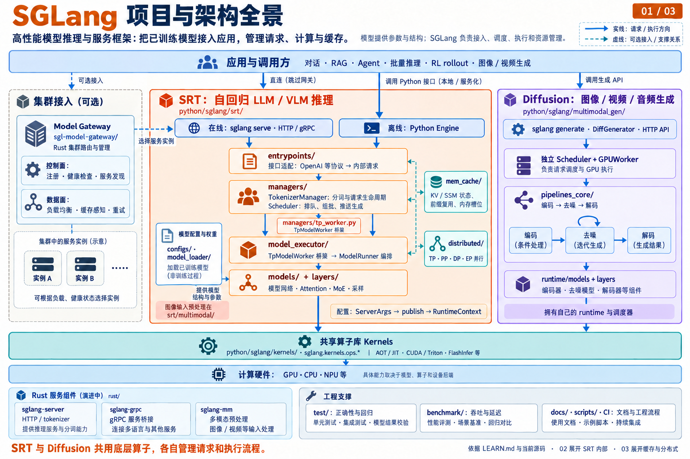
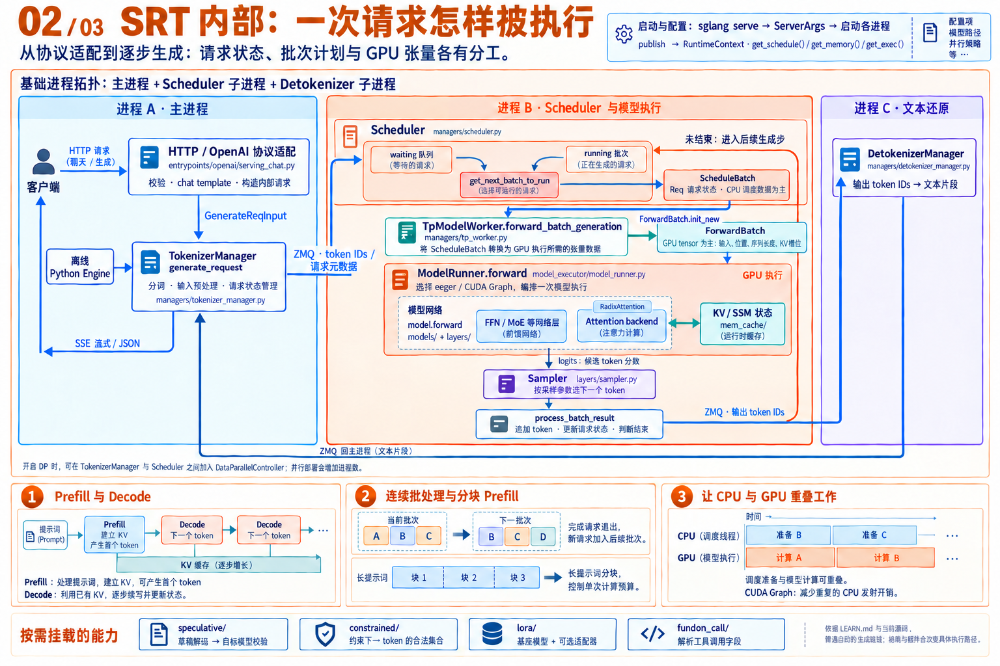
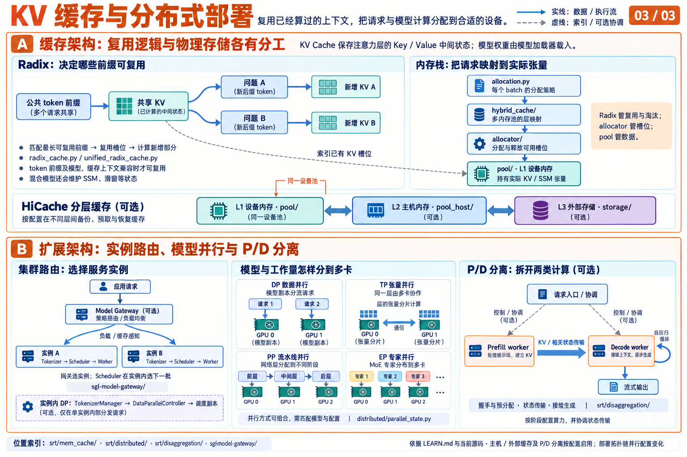

# SGLang 项目与架构图解（详细版）

依据 [LEARN.md](../LEARN.md) 与当前工作区源码绘制。研究快照的 Git HEAD 为 `6e0b862b1`。三张图依次解释项目全景、核心引擎内部、缓存与分布式架构；由内置 `image_gen` 生成，[完整提示词](sglang-architecture-zh.prompts.md)一并保存。

图片尺寸均为 1536 × 1024，PNG 格式。可点击原图查看细节；三张图也已嵌入 `LEARN.md` 的对应章节。

## 01 项目与架构全景

SGLang 把已训练模型的结构、权重和底层计算能力组织成可供应用使用的推理服务。入口既有 HTTP / gRPC，也有本地 Python 调用；对话、RAG、Agent、批量推理和 RL rollout 可以使用它的模型执行能力。

仓库中的几个主要子系统有不同边界：

- **SRT** 管理自回归 LLM / VLM 的请求、批调度、模型前向、采样和 KV / SSM 状态。图中的层次表示逻辑职责；进程边界在第二张图展开。
- **Diffusion** 有自己的 Scheduler、GPUWorker 和组合式 pipeline。典型流程是条件编码、迭代去噪、结果解码。
- **Kernels** 为两个运行时提供共享算子接口与多种实现。模型、算子、设备后端共同决定实际执行路径。
- **Model Gateway** 在集群层选择服务实例，负责路由、健康检查、服务发现及相关可靠性机制。它可以作为可选网络入口。
- **rust/** 中的服务、协议桥接、多模态预处理组件持续演进；这些组件与 `sgl-model-gateway/` 是不同的源码子系统。

主要依据：[Python 目录说明](../python/sglang/README.md)、[接口入口](../python/sglang/srt/entrypoints/README.md)、[共享算子库](../python/sglang/kernels/README.md)、[DiffGenerator](../python/sglang/multimodal_gen/runtime/entrypoints/diffusion_generator.py)、[Diffusion Scheduler](../python/sglang/multimodal_gen/runtime/managers/scheduler.py)、[GPUWorker](../python/sglang/multimodal_gen/runtime/managers/gpu_worker.py)、[组合式 Pipeline](../python/sglang/multimodal_gen/runtime/pipelines_core/composed_pipeline_base.py)、[Model Gateway](../sgl-model-gateway/README.md)。

## 02 SRT 内部：一次请求怎样被执行

在线请求经协议适配转换为内部请求；离线 `Engine` 可直接进入管理器。TokenizerManager 处理输入并把请求发给 Scheduler。调度器维护请求状态与 waiting / running 队列，决定下一轮应该执行哪个批次。

`ScheduleBatch` 表达调度视角的状态。`TpModelWorker.forward_batch_generation` 通过 `ForwardBatch.init_new` 构造模型执行需要的张量和元数据，再调用 `ModelRunner.forward`。ModelRunner 编排执行模式和模型前向，Attention 后端访问运行时缓存。模型输出 logits 后，worker 通过独立的 `ModelRunner.sample` 操作调用采样逻辑。Scheduler 随后处理结果、更新状态、判断是否结束，并继续推进尚未完成的请求。

输出 token 经 DetokenizerManager 转为文本，再回到 TokenizerManager，由入口层返回 SSE 流式片段或 JSON。基础拓扑中的 HTTP / Engine / TokenizerManager 在主进程，Scheduler 与其 worker 编排在子进程，Detokenizer 在另一子进程；开启并行或其它部署模式后，进程数量和连接方式会变化。

连续批处理允许完成请求退出、新请求加入后续批次；分块 Prefill 控制一次处理的提示词预算；overlap 调度让 CPU 准备工作与 GPU 执行交叠。投机解码、结构化约束、LoRA 和工具调用解析是按需接入的能力。

主要依据：[Engine](../python/sglang/srt/entrypoints/engine.py)、[HTTP 启动入口](../python/sglang/srt/entrypoints/http_server.py)、[TokenizerManager](../python/sglang/srt/managers/tokenizer_manager.py)、[Scheduler](../python/sglang/srt/managers/scheduler.py)、[ScheduleBatch](../python/sglang/srt/managers/schedule_batch.py)、[TpModelWorker](../python/sglang/srt/managers/tp_worker.py)、[ForwardBatch](../python/sglang/srt/model_executor/forward_batch_info.py)、[ModelRunner](../python/sglang/srt/model_executor/model_runner.py)、[Sampler](../python/sglang/srt/layers/sampler.py)、[DetokenizerManager](../python/sglang/srt/managers/detokenizer_manager.py)、[RuntimeContext](../python/sglang/srt/runtime_context.py)。

## 03 KV 缓存与分布式部署

KV Cache 保存已处理上下文在注意力层中的 Key / Value 中间状态。Radix 缓存按 token 前缀查找可复用状态；缓存命名空间、模型及适配器等上下文也影响是否可复用。逻辑前缀索引与物理内存管理是两个维度：Radix 负责复用和淘汰，allocator 管理槽位，pool 持有张量。HiCache 可按配置把状态扩展到设备、主机和外部存储层。混合模型还可能有 SSM、滑窗等额外状态与内存池。

集群路由选择服务实例，实例中的 Scheduler 决定下一批工作。开启系统级 DP 时，DataParallelController 可以在 TokenizerManager 与调度副本之间分发请求。TP、PP、DP、EP 分别从张量、网络层、副本、MoE 专家等角度组织并行，具体组合取决于模型与配置。

P/D 分离把处理提示词的 Prefill 与持续生成的 Decode 放到不同执行单元，通过握手、预分配和 KV / 相关状态传输接续请求。这与增加普通服务副本、切分模型参数都是不同的架构选择。

主要依据：[缓存分层说明](../python/sglang/srt/mem_cache/README.md)、[Radix 缓存](../python/sglang/srt/mem_cache/radix_cache.py)、[统一 Radix 缓存](../python/sglang/srt/mem_cache/unified_radix_cache.py)、[DataParallelController](../python/sglang/srt/managers/data_parallel_controller.py)、[并行组](../python/sglang/srt/distributed/parallel_state.py)、[Prefill 生命周期](../python/sglang/srt/disaggregation/prefill.py)、[Decode 生命周期](../python/sglang/srt/disaggregation/decode.py)、[状态传输结构](../python/sglang/srt/disaggregation/base/conn.py)。

## 图中简化范围

这些图表达项目与普通推理路径的职责关系，省略了每种 Attention 后端、模型家族、通信组与硬件分支。第一张是逻辑架构图，第二张是基础进程与执行图，第三张是存储和扩展方式图。模型权重、请求状态、缓存索引、实际 KV 张量分别承担不同职责；可选网关、主机 / 外部缓存、P/D 分离不要求在每次部署中同时启用。
