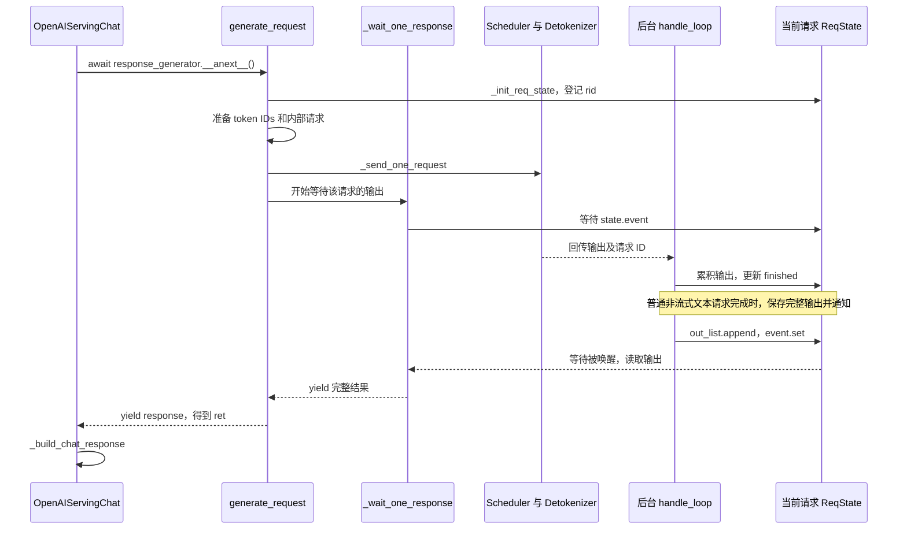

# 一、HTTP 服务 + TokenizerManager

主题：**用户发来一段文本，SGLang 怎样把它交给推理引擎，又怎样把结果返回给用户**


## 1. 系统角色与整体链路

普通单 worker 部署中，一个 SGLang 服务实例包含三个主要进程角色：

```text
主进程：HTTP 服务 + Engine + TokenizerManager
    │   接收请求、准备输入、提交请求、等待并返回结果
    │
    └── 已分词的请求 ──→ Scheduler 子进程
                             │   调度请求、组 batch、调用模型执行
                             │   同时处理 Prefill 和 Decode 两个阶段
                             ↓
                       DetokenizerManager 子进程
                             │   将输出 token IDs 转换为文本
                             ↓
                       回到 TokenizerManager → HTTP 响应
```

源码依据：[Engine 类说明](./sglang/python/sglang/srt/entrypoints/engine.py:208)。注意，是Engine 负责把整个流程启动、组装起来，并配置组件间的通信。

这里需要先分清两个概念：

- **进程角色**：TokenizerManager、Scheduler、DetokenizerManager 各自承担什么工作。
- **部署方式**：是否将 Prefill 和 Decode 分开部署，是否启动多个 Tokenizer worker。

普通部署中，一个 Scheduler 同时负责 Prefill 和 Decode。开启 PD 分离后，Prefill 和 Decode 由不同实例处理，实例之间传输 KV Cache。本章先介绍普通部署的核心链路。

本章读完应当能顺着这条线找到代码：

```text
HTTP 请求
    → 接口协议适配
    → GenerateReqInput
    → 准备 token IDs、采样参数和请求状态
    → TokenizedGenerateReqInput
    → ZeroMQ 发送给 Scheduler
    → 等待下游输出
    → 组装 HTTP 响应
```

## 2. HTTP 接入与协议适配

HTTP 服务接收请求，将接口层数据转换为 `GenerateReqInput`，交给 `TokenizerManager.generate_request()`。本章以 `/v1/chat/completions` 的非流式文本请求为例：

```python
@app.post("/v1/chat/completions", dependencies=[Depends(validate_json_request)])
async def openai_v1_chat_completions(
    request: ChatCompletionRequest, raw_request: Request
):
    # 找到当前应用中的 Chat 处理器，调用其统一入口。
    return await raw_request.app.state.openai_serving_chat.handle_request(
        request, raw_request
    )
```

入口位置：[openai_v1_chat_completions](/Users/bytedance/github/sglang/python/sglang/srt/entrypoints/http_server.py:1726)。

`OpenAIServingChat` 继承 `OpenAIServingBase`。父类提供处理顺序，子类实现 Chat 场景的具体操作：

```text
OpenAIServingBase.handle_request()
    → self._validate_request()               校验 Chat 请求
    → self._convert_to_internal_request()    转为引擎内部请求
    → 根据 stream 选择处理方式
    → self._handle_non_streaming_request()   执行 Chat 的非流式实现
```

运行时 `self` 是 `OpenAIServingChat` 实例，统一入口会调用它实现的校验、转换及非流式处理方法。

| 方法 | 应该看哪里 |
|---|---|
| 统一入口、异常转响应 | [OpenAIServingBase.handle_request](/Users/bytedance/github/sglang/python/sglang/srt/entrypoints/openai/serving_base.py:73) |
| Chat 参数校验 | [OpenAIServingChat._validate_request](/Users/bytedance/github/sglang/python/sglang/srt/entrypoints/openai/serving_chat.py:867) |
| 协议转换 | [OpenAIServingChat._convert_to_internal_request](/Users/bytedance/github/sglang/python/sglang/srt/entrypoints/openai/serving_chat.py:968) |
| 非流式具体实现 | [OpenAIServingChat._handle_non_streaming_request](/Users/bytedance/github/sglang/python/sglang/srt/entrypoints/openai/serving_chat.py:1811) |

`OpenAIServingChat` 代码多，是因为它还需要处理对话模板、工具调用格式、reasoning 字段、流式响应及各种协议选项。它属于对话协议适配层；Qwen、DeepSeek 等模型的前向计算实现在下游模型层。

### 2.1 将接口请求转换为内部请求

```python
adapted_request, processed_request = self._convert_to_internal_request(
    request, raw_request
)
```

| 对象 | 可以怎样理解 |
|---|---|
| `request` / `processed_request` | 接口层请求；Chat 场景是 `ChatCompletionRequest`，包含 messages、model、响应选项等信息。 |
| `adapted_request` | 转换后的 `GenerateReqInput`，包含引擎需要的输入、采样参数、请求 ID 等。 |
| `raw_request` | FastAPI 的原始 HTTP 请求对象，用于读取请求头、应用状态和检查客户端连接。 |

`_convert_to_internal_request()` 会处理 messages、应用对话模板、转换采样选项，再构造 `GenerateReqInput`。当前 Chat 实现返回 `adapted_request, request`，所以 `processed_request` 不一定是新建的对象。

### 2.2 调用生成入口并组装响应

```python
# 调用异步生成器函数，得到生成器对象。
response_generator = self.tokenizer_manager.generate_request(
    adapted_request, raw_request
)

# 驱动生成器，等待下一次 yield；本章的非流式单请求在完成时产出完整结果。
ret = await response_generator.__anext__()

# 统一为列表，交给响应组装逻辑。
if not isinstance(ret, list):
    ret = [ret]

response = self._build_chat_response(request, ret, int(time.time()))
```

耗时的请求处理、下游推理和等待输出，都包含在驱动生成器的过程中。`_build_chat_response()` 再把结果组装为 `choices`、`usage`、模型名等 OpenAI 格式字段；按需解析工具调用、reasoning，但这里不执行工具。

## 3. TokenizerManager.generate_request：协调一次请求

先把 [generate_request](/Users/bytedance/github/sglang/python/sglang/srt/managers/tokenizer_manager.py:798) 看成请求的总协调方法：

| 顺序 | 操作 | 一句话说明 |
|---|---|---|
| 1 | `auto_create_handle_loop()` | 确保接收下游输出的后台任务已经启动。 |
| 2 | `normalize_batch_and_arguments()` | 整理单条/批量输入、请求 ID 等字段。 |
| 3 | 默认优先级及条件校验 | 按配置补默认值，检查思考预算、DP 路由等选项。 |
| 4 | `_init_req_state()` | 登记请求状态，让后续结果能够找到对应请求。 |
| 5 | 日志、暂停等待、模型读锁、LoRA 校验 | 记录请求，并等待满足处理条件。 |
| 6 | `_tokenize_one_request()` | 准备 token IDs、校验输入、构造已分词请求。 |
| 7 | `_send_one_request()` | 把请求交给通信层，发送到 Scheduler 链路。 |
| 8 | `_wait_one_response()` | 等待这个请求的输出。 |
| 9 | `yield response` | 把结果交回上层调用方。 |

单条请求的核心片段是：

```python
# 准备输入，得到下游使用的请求对象。
tokenized_obj = await self._tokenize_one_request(obj)

# 提交已经准备好的请求。
self._send_one_request(tokenized_obj)

# 等待本次请求的结果，并交给调用方。
async for response in self._wait_one_response(obj, request):
    yield response
```

模型前向由下游执行；这个方法负责准备请求、提交请求并等待结果。

### 3.1 登记请求状态 ReqState

发送与回包不在同一条直接调用栈中。下游返回结果时，需要通过请求 ID 找回“谁在等待”。

[_init_req_state](/Users/bytedance/github/sglang/python/sglang/srt/managers/tokenizer_manager.py:3507) 会检查重复请求 ID，为每条请求创建 `ReqState`，存到：

```python
self.rid_to_state[rid] = state
```

| 字段 | 含义 |
|---|---|
| `rid` | 当前请求的 ID，是 `rid_to_state` 的键。 |
| `state.obj` | 当前请求对象。 |
| `state.out_list` | 等待上游读取的输出。 |
| `state.finished` | 请求是否已经结束。 |
| `state.event` | 有结果时通知等待方的 `asyncio.Event`。 |
| `state.time_stats` | 请求各阶段耗时和链路追踪信息。 |

`for rid, sub_obj, bootstrap_room in items` 是把每个三元组拆开：请求 ID、单条请求对象、PD 配对编号。`bootstrap_room` 在这个初始化方法中用于关联追踪信息，普通请求可以为 `None`。

## 4. 输入 token 化

我们已经经过的第一个关键步骤，就是**把模型需要处理的输入准备好**。

### 4.1 输入字段

各字段分别表示文本、token 编号或直接提供的向量，具体使用哪些字段取决于请求的输入方式：

| 参数 | 内容 | 普通文本生成时的情况 |
|---|---|---|
| `input_text` | 人能读的输入文本。 | 从请求的 `text` 取得；只传 IDs 时可以为空。 |
| `input_ids` | 输入 token 的整数编号序列。 | 分词产生，或由调用方/上层直接提供。 |
| `input_embeds` | 调用方直接提供的输入向量。 | 通常为 `None`，普通路径的向量表示由下游模型的 embedding 层产生。 |
| `mm_inputs` | 预处理后的多模态数据。 | 普通纯文本请求为 `None`。 |
| `token_type_ids` | 各 token 的类型或分段编号，类型是 `Optional[List[int]]`。 | 普通文本生成通常为 `None`。 |

简化的普通文本路径是：

```text
文本 → tokenizer 编码 → token IDs → 下游模型 embedding 层 → 模型计算
```

`input_embeds` 是另一种输入方式，不代表请求一定是“向量化模型请求”。

### 4.2 获取或复用 token IDs

[_tokenize_one_request](/Users/bytedance/github/sglang/python/sglang/srt/managers/tokenizer_manager.py:1030) 在普通文本场景下，可以简化为：

```python
input_text = obj.text

if obj.input_ids is not None:
    # 已有 token IDs，直接复用。
    input_ids = obj.input_ids
else:
    # 只有文本时，调用 tokenizer 编码为 token IDs。
    input_ids, token_type_ids = await self._tokenize_texts(input_text, False)

self._validate_one_request(obj, input_ids)
```

需要补充我们沿着 Chat 接口阅读时容易忽略的一点：**Chat 适配层应用对话模板时，可能已经调用 tokenizer 生成了 token IDs。** 当前常规 Jinja 模板路径就是先渲染文本，再 `encode()`；转换后的 `GenerateReqInput` 会携带这些 IDs，TokenizerManager 复用它们。

对应代码：[Chat 模板渲染与编码](/Users/bytedance/github/sglang/python/sglang/srt/entrypoints/openai/serving_chat.py:1377)。所以“文本转 token IDs”发生在输入准备阶段，但不保证所有接口都在 `_tokenize_texts()` 里完成这一步。

### 4.3 调用 tokenizer 编码文本

当输入还需要编码时，看 [_tokenize_texts](/Users/bytedance/github/sglang/python/sglang/srt/managers/tokenizer_manager.py:957)。我们重点看过的分支是：

```python
if not is_cross_encoder and (not getattr(self.tokenizer, "is_fast", False)):
    # 对每条输入文本调用 encode，得到每条文本的 token ID 序列。
    input_ids = [self.tokenizer.encode(t) for t in tokenizer_input]
    token_type_ids = None
else:
    # 把一批输入交给 tokenizer 的批量接口。
    encoded = self.tokenizer(tokenizer_input, **tokenizer_kwargs)
    input_ids = encoded["input_ids"]
```

第一种列表推导式等价于逐条执行的 `for` 循环：当前文本编码完成后，才调用下一条。`batch` 表示输入里有多条文本，并不自动意味着并行。

该方法还支持动态批处理，并在结束时统一输出形态：单条文本取出一组 IDs，批量文本保留多组 IDs。不要仅凭中间出现二维列表，就判断原始请求一定是批量请求。

## 5. 校验输入并组装内部请求

### 5.1 上下文长度：输入与输出上限一起算

[_validate_one_request](/Users/bytedance/github/sglang/python/sglang/srt/managers/tokenizer_manager.py:1243) 会检查输入长度，并按配置检查总 token 预算：

```text
总预算 = 输入 token 数 + max_new_tokens（最多生成多少 token）
```

假设上下文长度为 4096：

| 输入 token 数 | `max_new_tokens` | 总预算 | 按总预算检查的结果 |
|---:|---:|---:|---|
| 3000 | 500 | 3500 | 没超过上下文限制。 |
| 3000 | 1500 | 4500 | 超过上下文限制。 |

这里假设没有额外预留 token，并开启总预算检查。代码还会考虑 `num_reserved_tokens`；输入长度检查与总预算检查的条件也不同。启用 `allow_auto_truncate` 时，代码可以截断输入或调小生成上限，否则拒绝超限请求。

`max_new_tokens` 是上限，不是已生成数量。模型可能提前遇到结束条件，所以实际输出可以更短。

### 5.2 _create_tokenized_object 主要是封装请求

[_create_tokenized_object](/Users/bytedance/github/sglang/python/sglang/srt/managers/tokenizer_manager.py:1422) 收到的 `input_ids` 已经准备好。它主要完成：

```text
整理 token ID 的存储形式
    → 合并默认采样参数和请求采样参数
    → 构造 SamplingParams，规范化并校验
    → 构造 TokenizedGenerateReqInput
    → 关联时间统计
```

其中：

```python
# q 表示有符号 long long 整数数组，这里用于紧凑存储 token IDs。
input_ids_arr = array("q", input_ids) if input_ids is not None else None
```

这一步不会把 token ID 变成 embedding，也不是重新执行文本分词。

### 5.3 整理并校验采样参数

生成模型每一步给出候选 token 的分数，采样参数控制如何选择下一个 token，例如 `temperature`、`top_p`、`top_k`。这个对象也包含生成上限、停止条件等选项，是推理参数中的一部分。

```python
# 后面的请求参数覆盖同名服务端默认值。
sampling_kwargs = {**self.preferred_sampling_params, **obj.sampling_params}

# 当前类通常是 SamplingParams；** 将字典展开为关键字参数。
sampling_params = self.sampling_params_class(**sampling_kwargs)
sampling_params.normalize(self.tokenizer)
sampling_params.verify(self.model_config.vocab_size)
```

上面合并字典的代码对应“存在服务端默认参数”的分支。实际代码在没有默认值时直接使用 `obj.sampling_params`。

| 步骤 | 核心作用 |
|---|---|
| 构造 `SamplingParams` | `msgspec.Struct` 提供构造逻辑，创建对象后调用 `__post_init__()` 处理默认值、别名等。无需去寻找普通 Python 手写的 `SamplingParams.__init__()`。 |
| `normalize(tokenizer)` | 统一停止字符串、停止正则的表示，计算需要的长度信息，检查相关功能是否有 tokenizer 支持。 |
| `verify(vocab_size)` | 检查温度、概率范围、生成数量、惩罚参数、`logit_bias` 的 token ID 范围，以及互斥的结构化输出约束等。 |

`stop_strs` 是“生成中遇到哪些字符串就停止”的内部字段。例如 `stop="结束"` 会规范为列表形式。`normalize` 包含校验，但主要目的是将不同输入形态统一成后续代码方便使用的形式。

`vocab_size` 来自模型配置。它可以因对齐或预留行大于 tokenizer 的有效词表规模；必须保证 token ID 的映射匹配、模型能接受这些 IDs，不能仅凭两个大小接近就互换 tokenizer。`verify(vocab_size)` 中用它检查的是 `logit_bias` 键的范围，不是校验整个 tokenizer 与模型是否匹配。

位置：[SamplingParams](/Users/bytedance/github/sglang/python/sglang/srt/sampling/sampling_params.py:45)。

## 6. ZeroMQ：连接各进程的请求与结果通道

SGLang 使用 ZeroMQ 在 TokenizerManager、Scheduler 和 DetokenizerManager 之间传递消息。每个进程创建自己的 `zmq.Socket`，通过约定的地址发送或接收数据：

```text
请求通道：TokenizerManager → Scheduler
结果通道：Scheduler → DetokenizerManager → TokenizerManager
```

请求通道传递已分词的内部请求，结果通道传递输出 token IDs、文本及请求 ID。TokenizerManager 收到结果后，按 `rid` 找到等待中的请求。

### 6.1 创建请求通道

`get_zmq_socket()` 创建并配置**当前进程自己的 Socket 对象**；`scheduler_input_ipc_name` 是双方约定使用的**通信地址字符串**，例如本机 IPC 地址形式 `ipc://...`。

单 Tokenizer worker 模式的发送端：

```python
self.send_to_scheduler = get_zmq_socket(
    context,  # ZeroMQ 上下文，用于创建 Socket。
    zmq.PUSH,  # 角色是发送端。
    port_args.scheduler_input_ipc_name,  # 发送端和接收端共用的通信地址。
    True,  # 当前端绑定这个地址，即 bind。
)
```

Scheduler 创建对应的接收端：

```python
recv_from_tokenizer = get_zmq_socket(
    context,
    zmq.PULL,  # 角色是接收端。
    port_args.scheduler_input_ipc_name,  # 使用同一个地址。
    False,  # 当前端连接这个地址，即 connect。
)
```

保留我们在代码注释里画的结构：

```text
TokenizerManager 进程                                                           Scheduler 进程
          |                                                                            |
     PUSH socket  ---- 已分词的请求(共用通信地址 scheduler_input_ipc_name) ---->  PULL socket
          |                                                                            |
       send()                                                                       recv()
```

两组配置各自解决不同问题：

- **`PUSH / PULL`**：当前 Socket 负责发送，还是接收。
- **`bind / connect`**：哪一方绑定地址，哪一方连接地址。发送方也可以是绑定方。

这段代码中，TokenizerManager 绑定请求地址，Scheduler 连接该地址并持续接收请求。

位置：[TokenizerManager.init_ipc_channels](/Users/bytedance/github/sglang/python/sglang/srt/managers/tokenizer_manager.py:558)、[get_zmq_socket](/Users/bytedance/github/sglang/python/sglang/srt/utils/network.py:377)、[Scheduler 接收端](/Users/bytedance/github/sglang/python/sglang/srt/managers/scheduler_components/ipc_channels.py:37)。

### 6.2 提交已组装的请求

走到 [_send_one_request](/Users/bytedance/github/sglang/python/sglang/srt/managers/tokenizer_manager.py:1658) 时，输入已经准备成 `TokenizedGenerateReqInput`。发送流程是：

```text
_send_one_request(tokenized_obj)
    → 整理传输字段、记录发送时间
    → _dispatch_to_scheduler(tokenized_obj)
    → sock_send(self.send_to_scheduler, obj)
    → Scheduler 从接收端读取请求
```

`sock_send()` 将请求序列化，再交给 ZeroMQ 发送：

```python
def sock_send(socket: zmq.Socket, obj: Any, flags: int = 0) -> None:
    if _USE_PICKLE_IPC:
        # 使用 pickle 序列化对象并发送。
        socket.send_pyobj(obj, flags=flags, protocol=pickle.HIGHEST_PROTOCOL)
        return

    # 使用 MessagePack 序列化，再交给 ZeroMQ 发送。
    socket.send(msgpack_encode(obj), flags=flags)
```

位置：[io_struct.sock_send](/Users/bytedance/github/sglang/python/sglang/srt/managers/io_struct.py:2472)。Scheduler 收到请求后进入调度和模型执行；推理结果通过结果通道返回，由 TokenizerManager 的 `handle_loop` 接收。

## 7. 多 Tokenizer worker：分担请求并路由结果

**每个 Tokenizer worker 是一个独立的请求处理进程**。多个 worker 可以加载同一个模型配套的 tokenizer，分担不同请求。每个请求在所属 worker 内完成输入准备，再提交给 Scheduler。

```mermaid
flowchart TB
    subgraph W0["Tokenizer worker 0"]
        A["收到请求 A 的原始文本"] --> AT["准备 token IDs"]
        AT --> AS["提交 A，附上 worker 0 回包地址"]
    end
    subgraph W1["Tokenizer worker 1"]
        B["收到请求 B 的原始文本"] --> BT["准备 token IDs"]
        BT --> BS["提交 B，附上 worker 1 回包地址"]
    end
    AS --> F["内部路由器：转发已分词的请求"]
    BS --> F
    F --> S["Scheduler 调度、模型执行、输出处理"]
    S --> R["内部路由器：按回包地址分发结果"]
    R --> RA["回到 worker 0：唤醒请求 A"]
    R --> RB["回到 worker 1：唤醒请求 B"]
```



假设 A 原本是文本，它在 worker 0 的输入处理过程中分词一次；B 在 worker 1 中分词一次。可能是在各自的 Chat 适配层，也可能是在 TokenizerManager，取决于输入路径。

### 7.1 共用请求入口与独立回包地址

在当前多 Tokenizer worker 模式下：

| 地址 | 通信方向 | 分配方式 |
|---|---|---|
| `tokenizer_worker_ipc_name` | 各 Tokenizer worker → 内部路由器 | 多个 worker 共用同一个路由器请求入口。 |
| `scheduler_input_ipc_name` | 内部路由器 → Scheduler | 使用通往 Scheduler 的共同请求入口。 |
| 每个 worker 的 `tokenizer_ipc_name` | 内部路由器 → 对应 Tokenizer worker | 每个 worker 独立，用于接收属于自己的结果。 |

路由器自身也有接收 Detokenizer 输出的地址。这里说“每个 worker 独立”，指 worker 初始化时重新生成的 `port_args.tokenizer_ipc_name`，不要把不同进程中这个字段的值当成始终相同。

源码：[每个 HTTP/Tokenizer worker 创建回包地址](/Users/bytedance/github/sglang/python/sglang/srt/entrypoints/http_server.py:239)、[MultiTokenizerRouter](/Users/bytedance/github/sglang/python/sglang/srt/managers/multi_tokenizer_mixin.py:440)。

### 7.2 给请求标记回包地址

```python
def _dispatch_to_scheduler(self, obj: Any) -> None:
    if self.tokenizer_ipc_name is not None:
        # 多 worker 模式：把当前 worker 的回包地址写进请求。
        stamp_http_worker_ipc(obj, self.tokenizer_ipc_name)

    # 发出请求；多 worker 模式先发给内部路由器。
    sock_send(self.send_to_scheduler, obj)
```

- `IPC` 是 Inter-Process Communication，即进程间通信。
- `stamp` 是“打标记”；单条请求的核心操作是 `obj.http_worker_ipc = ipc_name`。
- 单 worker 模式下，这个用于打标记的 `self.tokenizer_ipc_name` 被设为 `None`，因此跳过标记。它仍然有接收结果的 Socket，不代表回包通道不存在。

`rid` 和 `http_worker_ipc` 分别解决两层定位：先按地址把结果送回正确进程，再按请求 ID 找到进程内的 `ReqState`。

位置：[_dispatch_to_scheduler](/Users/bytedance/github/sglang/python/sglang/srt/managers/tokenizer_manager.py:595)、[stamp_http_worker_ipc](/Users/bytedance/github/sglang/python/sglang/srt/managers/tokenizer_manager.py:3778)。

## 8. 接收结果、唤醒请求并返回响应

这是另一条必须接上的主线：**当前请求负责等，后台任务负责收，两者通过同一个 ReqState 配合。**



图中展示便于理解的一种时序。Event 会保留已设置的通知：如果执行某次 `wait()` 时事件已经被设置，就可以直接继续，不需要收包方与等待方恰好同时运行。

### 8.1 启动共用的后台接收任务

[auto_create_handle_loop](/Users/bytedance/github/sglang/python/sglang/srt/managers/tokenizer_manager.py:2241) 在处理请求时检查是否已经初始化；没有则创建后台接收任务：

```python
loop = get_or_create_event_loop()
self.asyncio_tasks.add(
    loop.create_task(print_exception_wrapper(self.handle_loop))
)
```

逐层理解：

1. `get_or_create_event_loop()`：获取当前线程正在运行的事件循环；没有则创建并设置一个。
2. `loop.create_task(...)`：把接收任务交给这个事件循环调度。
3. `self.asyncio_tasks.add(...)`：保存接收任务的 Task 引用。

`asyncio.get_running_loop()` 是 Python 标准库函数；[get_or_create_event_loop](/Users/bytedance/github/sglang/python/sglang/srt/utils/common.py:4714) 是项目封装。

一个 TokenizerManager 的多个请求共用这个接收任务，按照 `rid` 分别处理各自的输出。

### 8.2 handle_loop：持续从通信通道收包

[handle_loop](/Users/bytedance/github/sglang/python/sglang/srt/managers/tokenizer_manager.py:2281) 的核心动作是：

```python
# 持续从下游结果通道接收消息。
recv_obj = await async_sock_recv(self.recv_from_detokenizer)

# 生成输出会交给这个方法处理；其他类型有各自的分派逻辑。
await self._handle_batch_output(recv_obj)
```

[_handle_batch_output](/Users/bytedance/github/sglang/python/sglang/srt/managers/tokenizer_manager.py:2296) 会：

```text
遍历结果中的请求 ID
    → 在 rid_to_state 中找到请求状态
    → 累积文本和输出 token IDs，整理 meta_info
    → 根据 finished_reason 更新 finished
    → 将可交付结果存入 out_list
    → event.set() 通知等待方
```

当前普通非流式 `BatchStrOutput` 分支在未完成时主要累积输出，完成后才组装完整 `out_dict` 并通知。批量回包不等于原始 HTTP 请求一定是批量请求：Scheduler 可以把不同用户的单条请求组成 batch。

### 8.3 _wait_one_response：只等待自己的请求

[_wait_one_response](/Users/bytedance/github/sglang/python/sglang/srt/managers/tokenizer_manager.py:1793) 开始时拿到自己的 `state`：

```python
state = self.rid_to_state[obj.rid]

# 实际代码带超时包装，以便定期检查客户端连接等状态。
await asyncio.wait_for(
    state.event.wait(), timeout=_REQUEST_STATE_WAIT_TIMEOUT
)

# 取出已到达的输出，并清空这次通知。
out_list = state.out_list
state.out_list = []
finished = state.finished
state.event.clear()
```

它不会在等待期间一直占用 CPU 空转；遇到需要等待的异步操作时，事件循环可以调度其他任务。

非流式路径在请求结束时 `yield` 完整结果。流式路径则允许中途多次 `yield`，这就是我们选择先看 `stream=false` 的原因：先理解“发一次请求、等完整结果、组装一次响应”。

完成后，回包处理侧会从 `rid_to_state` 中移除请求；等待方已经持有 `state` 对象，仍然可以读取最后的输出。异常退出会清理残留状态；客户端断开时，等待逻辑会按条件向下游发出终止请求。

## 9. 下一步：进入 Scheduler 的接收与调度链路

本章已经把“输入 token 化、提交请求、等待与返回结果”接起来了。下一章可以从 Scheduler 接收请求的位置开始：

```python
# Scheduler.event_loop_normal 中的入口片段。
recv_reqs = self.request_receiver.recv_requests()
self.process_input_requests(recv_reqs)
```

接收侧内部通过 `sock_recv(self.recv_from_tokenizer, zmq.NOBLOCK)` 读取当前可用的消息，再进入调度逻辑。`NOBLOCK` 表示暂时没有消息时立即返回控制权，Scheduler 还能继续处理现有 batch。

后续阅读顺序：

| 顺序 | 核心入口 | 下一步要弄清楚的问题 |
|---|---|---|
| 1 | [Scheduler.event_loop_normal](/Users/bytedance/github/sglang/python/sglang/srt/managers/scheduler.py:1782) | 接收、组 batch、执行、处理结果如何在循环中配合？ |
| 2 | [SchedulerRequestReceiver.recv_requests](/Users/bytedance/github/sglang/python/sglang/srt/managers/scheduler_components/request_receiver.py:76) | 从 Socket 收到的对象如何进入 Scheduler？ |
| 3 | [Scheduler.process_input_requests](/Users/bytedance/github/sglang/python/sglang/srt/managers/scheduler.py:1940) | 生成请求被交给哪个具体处理方法？ |

对应整体路线：[LEARN.md](/Users/bytedance/github/sglang/LEARN.md)。回到主进程这部分时，优先复看 `generate_request → _tokenize_one_request → _send_one_request → _wait_one_response`，以及后台的 `handle_loop → _handle_batch_output`。

## 10. FAQ：阅读源码时的补充说明

### OpenAI 接口与原生 /generate 在哪里汇合？

两个接口各自接收 HTTP 请求，随后汇合到 `TokenizerManager.generate_request()`：

```text
/v1/chat/completions → OpenAIServingChat → TokenizerManager.generate_request
/generate → http_server.generate_request → TokenizerManager.generate_request
```

对应源码：[原生 HTTP 入口](/Users/bytedance/github/sglang/python/sglang/srt/entrypoints/http_server.py:899)、[TokenizerManager 生成入口](/Users/bytedance/github/sglang/python/sglang/srt/managers/tokenizer_manager.py:798)。

### tokenizer 在 CPU 还是 GPU 上执行？

本章常见的 Hugging Face 文本 tokenizer 在 CPU 上执行，模型前向由下游 GPU worker 执行。`is_fast=True` 通常表示 Rust 实现。具体执行设备取决于 tokenizer 后端；评估分词瓶颈时，需要测量分词耗时和吞吐量。

### 使用哪个 tokenizer，由哪里配置？

启动配置中的 `tokenizer_path` 指定加载路径；未指定时，默认使用 `model_path`。`tokenizer_mode`、`tokenizer_backend` 控制实现方式。代码通过 `get_serving()` 读取当前进程内已经准备好的 serving 配置组，再加载 tokenizer。

对应源码：[tokenizer_path 默认值](/Users/bytedance/github/sglang/python/sglang/srt/server_args.py:4569)、[get_serving](/Users/bytedance/github/sglang/python/sglang/srt/runtime_context.py:1174)、[初始化 tokenizer](/Users/bytedance/github/sglang/python/sglang/srt/managers/tokenizer_manager.py:487)。

### Processor 是什么？

Processor 是模型配套的输入预处理器，多模态模型可以通过它组合文本 tokenizer、图像预处理器和音频特征提取器。`get_processor_wrapper()` 按配置加载 Processor，`get_tokenizer_from_processor()` 取出负责文本的 tokenizer。普通文本模型直接走 `get_tokenizer()` 分支。

对应源码：[get_processor_wrapper](/Users/bytedance/github/sglang/python/sglang/srt/managers/tokenizer_manager.py:3729)、[get_tokenizer_from_processor](/Users/bytedance/github/sglang/python/sglang/srt/utils/hf_transformers/common.py:648)。

### 提交前的 wrap_shm_features、wrap_pickle_fields 做什么？

它们负责整理跨进程传输的字段。`wrap_shm_features()` 将多模态 CPU 张量包装为共享内存引用，减少大张量随消息序列化传输的开销；普通纯文本请求可直接继续。`wrap_pickle_fields()` 将相关字段包装成适合传输的形式。随后由 `sock_send()` 序列化并发送整个请求。

模型输入准备集中在 `_tokenize_one_request()` 和 `_create_tokenized_object()`；这些包装操作属于发送前的传输准备。对应入口：[_send_one_request](/Users/bytedance/github/sglang/python/sglang/srt/managers/tokenizer_manager.py:1658)。

### generate_request 和 __anext__ 怎样配合执行？

`TokenizerManager.generate_request()` 使用 `async def`，函数体里还有 `yield`，因此它是**异步生成器函数**：

```text
response_generator = generate_request(...)
    → 得到异步生成器对象，函数体还没有开始执行

ret = await response_generator.__anext__()
    → 驱动函数体执行
    → 中间可以等待分词、下游结果等操作
    → 遇到下一次 yield response
    → response 成为 ret 的值
```

`__anext__()` 是 Python 异步迭代协议的方法，不是 SGLang 的另一个推理入口。它取得的是“下一次产出”，并不天然等于一个 token，也不天然表示整次生成完成；本章的完整结果来自非流式分支的控制逻辑。[Python 异步生成器说明](https://docs.python.org/3/reference/expressions.html#asynchronous-generator-functions)

普通协程和异步生成器要分别理解：

| 写法 | 调用后得到什么 | 怎样推进执行 |
|---|---|---|
| `async def`，没有 `yield` | 协程对象 | `await coroutine`，也可以创建 Task 调度。 |
| `async def`，包含 `yield` | 异步生成器对象 | `await generator.__anext__()` 或 `async for`。 |

例如之前看到的 LoRA 调用：

```python
async with self.model_update_lock.reader_lock:
    # 等待校验、解析操作完成，再继续执行后面的普通代码。
    await self._validate_and_resolve_lora(obj)

    if obj.is_single:
        ...
```

`async with` 负责进入和退出支持异步操作的读锁；`await` 等待协程完成。去掉这里的 `await`，又不使用其他方式调度协程，就只是创建一个协程对象，不会执行它的函数体。`async` 也不会把后面的普通 `for` 循环自动变成并行计算。

### 多 worker 和 TOKENIZERS_PARALLELISM 有什么区别？

| 机制 | 哪一层在分担工作 |
|---|---|
| 多 Tokenizer worker | 多个工作进程处理不同请求。 |
| `TOKENIZERS_PARALLELISM` | Hugging Face `tokenizers` 库内部的 CPU 多线程并行。 |
| 动态批处理 tokenizer | 将待处理的单文本请求凑成批次，再交给 tokenizer 执行。 |

我们看到的 `os.environ["TOKENIZERS_PARALLELISM"] = "false"` 出现在 Processor 初始化分支，关闭的是该库内部的并行能力，不会关闭所有 Tokenizer worker，也不会让 Python 的列表推导式自动改变执行方式。[Tokenizers 并行控制实现](https://github.com/huggingface/tokenizers/blob/main/tokenizers/src/utils/parallelism.rs)

当前动态批处理实现在后台使用单线程执行器，主要用于让事件循环保持响应、减少批处理调用开销，不能把它直接等同于启动多个分词进程。位置：[async_dynamic_batch_tokenizer.py](/Users/bytedance/github/sglang/python/sglang/srt/managers/async_dynamic_batch_tokenizer.py)。

### 其他请求字段和分支

这些选项解释了方法里为什么有很多分支，但不必为了看一条普通文本请求而逐个深入。

| 字段或分支 | 一句话说明 |
|---|---|
| `priority` | 请求优先级，类型为 `Optional[int]`；启用优先级调度、请求未提供且配置了默认值时才补默认值。 |
| `max_thinking_tokens` | 请求的思考 token 预算；`generate_request()` 在该值存在时要求启用严格思考支持。 |
| `routed_dp_rank` | 指定请求应路由到哪个 DP worker；DP 表示数据并行，不等于一台物理服务器。 |
| `bootstrap_room` | PD 分离时关联同一次 KV 传输的配对编号，不是 GPU 编号或会话 ID。 |
| `SessionParams` | 控制服务端会话上下文的延续、插入、替换等；各字段有适用条件。普通 Chat 消息历史不必启用这个功能。 |
| LoRA 校验 | 请求指定 adapter 时，检查功能是否启用并解析 adapter。 |
| `contains_mm_input()`、`mm_inputs` | 多模态输入相关；普通纯文本路径可以跳过。 |
| `get_disagg().language_only` | EPD 分离中的语言模型侧处理分支，不是“当前请求是普通纯文本”的判断。 |

PD 是 Prefill–Decode 分离；DP 是 Data Parallel。Tokenizer worker 是请求处理进程角色，和这两种部署/并行方式需要分别理解。
