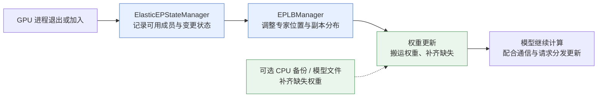
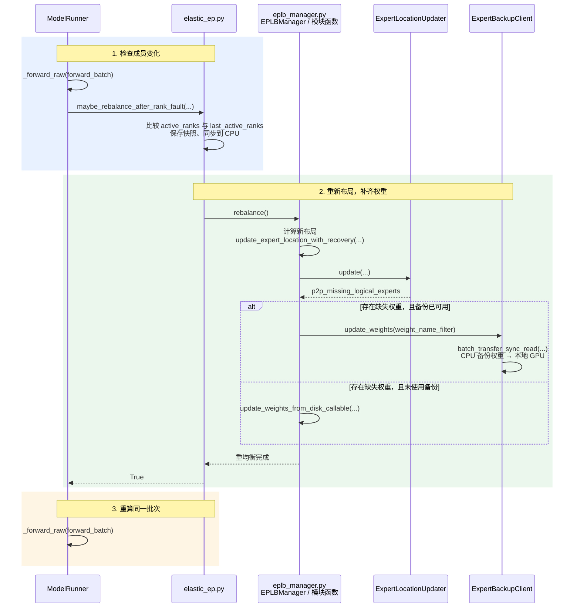

# 1.4.1 弹性专家并行(Elastic Expert Parallelism)

> 弹性专家并行(Elastic Expert Parallelism，Elastic EP)处理的是：参与 MoE 推理的 GPU 进程发生变化时，怎样调整通信成员、专家位置和权重，让服务继续工作或利用新增资源。

本文依据当前仓库代码整理，承接[专家并行(Expert Parallelism)](<../../../../user_guide_zh/1.4 专家并行(Expert Parallelism).md>)，重点说明恢复与扩容的机制及代码入口。

## 背景：固定的专家分布，遇到变化怎么办？

混合专家模型(Mixture of Experts，MoE)包含多个专家网络；专家并行(Expert Parallelism，EP)把不同专家放到不同 GPU，MoE 层内的路由器(Router)为每个词元(Token)选择专家，并把数据送到相应 GPU。

常规 EP 按启动时的进程组(Process Group)和专家分布协同计算。如果某个 GPU 进程退出，其他进程可能等不到通信结果，而且部分专家权重也可能无法访问；如果加入新 GPU，还需要让通信、专家映射和请求分发认识这些新成员。

| 场景 | 要解决的问题 | 当前代码中的路径 |
|---|---|---|
| GPU 进程故障、随后重启 | 把专家重新安排到可用 GPU，补齐权重，再接纳恢复的进程 | 故障重均衡与 `--elastic-ep-join-mode recover` |
| 运行时增加 GPU 进程 | 扩大参与计算的成员集合，更新专家槽位、通信及请求分发 | 扩容接口与 `--elastic-ep-join-mode scale` |

这里的“弹性”描述资源成员变化，与 Elasticsearch 无关。它主要面向多 GPU MoE 服务的恢复与扩容；增加 GPU 后的性能收益仍取决于负载和通信成本，不能直接按 GPU 数量推算。

## 思路与原理：谁可用、专家放哪、权重从哪来

1. **记录谁可用。** 活跃进程掩码(Active Rank Mask) `active_ranks` 标记哪些进程可以参与；进程编号(Rank)通常对应一个 GPU 工作进程。
2. **重新安排专家。** 专家负载均衡(Expert Parallel Load Balancing，EPLB)结合活跃成员与负载，更新“逻辑专家 → 物理副本”的映射。逻辑专家(Logical Expert)是模型中的专家身份；物理副本(Physical Replica)是这组权重在某张 GPU 上的一份实际存储。
3. **把权重放到新位置。** 优先复用本地权重或通过 GPU 间点对点通信(Peer-to-Peer，P2P)搬运；无法从该路径取得的权重，再通过可用的 CPU 备份或模型文件补齐。

例如，某层有 8 个逻辑专家，4 张 GPU 各分配 3 个专家槽位，共 12 个物理副本，其中包含重复副本。一张卡退出后还剩 9 个槽位，可以重新布局以覆盖全部 8 个专家；缺失权重需要重新加载。**如果剩余槽位不足以容纳全部专家，CPU 中有备份也不能凭空增加 GPU 容量。**

下面是机制总览；CPU 备份属于可选的故障恢复路径，当前不能与运行时扩容同时开启。

### 专家备份(Expert Backup)到底备份什么？

`ExpertBackupManager.backup_weights_from_disk()` 在启动时读取模型检查点(Checkpoint)，把本节点负责的一段专家编号对应的权重放进连续的 CPU 内存缓冲区；各节点分担备份，并非每台机器都保存完整模型。

备份管理器用 ZeroMQ 发布权重名称、内存地址和会话标识等元数据(Metadata)。需要恢复时，`ExpertBackupClient.update_weights()` 根据新的专家映射，通过 Mooncake Transfer Engine 把对应权重读入本进程的 GPU 参数存储。

**这是“提前把权重准备在内存里”，不是持续给 GPU 做快照。** 备份内容是专家权重，不包含请求状态或键值缓存(Key-Value Cache，KV Cache)；它能否帮助恢复，还取决于备份进程及其内存是否可访问。

## 实现：核心文件、类与方法

`elastic_ep/` 目录中的三个文件负责弹性状态与专家备份；模型执行、专家重均衡和请求分发还需要目录外的模块配合。

| 文件与核心对象 | 关键方法 | 职责 |
|---|---|---|
| [`elastic_ep.py`](elastic_ep.py)：`ElasticEPState`、`ElasticEPStateManager` | `init()`、`request_scale()`、`commit_scale()` | 保存活跃成员、当前/待扩容规模和扩容阶段；协调状态切换 |
| 同文件中的恢复函数 | `maybe_rebalance_after_rank_fault()`、`maybe_recover_ep_ranks()`、`try_recover_ranks()` | 触发故障重均衡，检查重启进程是否就绪，恢复通信组并同步专家映射 |
| [`expert_backup_manager.py`](expert_backup_manager.py)：`ExpertBackupManager` | `backup_weights_from_disk()`、`start_transfer_server()` | 在独立进程中准备 CPU 权重缓冲区，并注册给传输引擎 |
| [`expert_backup_client.py`](expert_backup_client.py)：`ExpertBackupClient` | `_receive_loop()`、`update_weights()` | 接收备份地址信息，把需要的权重读入本地 GPU |
| [`model_runner.py`](../model_executor/model_runner.py)：`ModelRunner` | `forward()`、`_maybe_rebalance_after_rank_fault()`、`maybe_join_ep_ranks()` | 把故障重均衡、当前批次重算、恢复/扩容接入模型执行过程 |
| [`eplb_manager.py`](../eplb/eplb_manager.py)：`EPLBManager` 及模块函数 | `rebalance()`、`update_expert_location_with_recovery()` | 生成专家布局，协调权重搬运和缺失权重加载 |
| [`expert_location_updater.py`](../eplb/expert_location_updater.py)：`ExpertLocationUpdater` | `update()` | 执行权重位置更新，返回因故障无法通过 P2P 取得的专家列表 |

### 启动时：把状态和可选备份准备好

[`Engine._launch_subprocesses()`](../entrypoints/engine.py#L1145) 在同时设置 `enable_elastic_expert_backup` 和 `elastic_ep_backend` 时，调用 `run_expert_backup_manager()` 启动备份子进程。

调度器(Scheduler)子进程中的 `ModelRunner.maybe_init_elastic_ep()` 初始化弹性状态；`maybe_init_expert_backup_client()` 按相同开关创建备份客户端。管理器准备好权重并等待客户端就绪后，发布 `BackupDramReq`；客户端接收地址信息、注册本地 GPU 内存，为后续读取做准备。

### 故障时：调整位置、补齐权重、重新计算

以通信后端已反映成员失效为前提，`ModelRunner.forward()` 在一次 `_forward_raw()` 后检查活跃成员变化。检测到变化就同步执行重均衡，完成后对同一个 `ForwardBatch` 再执行一次 `_forward_raw()`，避免直接沿用受故障影响的那次计算结果。

图中的检查通过 `ModelRunner._maybe_rebalance_after_rank_fault()` 调用模块函数；表中保留了这两个相近的方法名，便于沿代码阅读。没有缺失权重时，不进入备份或磁盘加载分支；备份传输失败会报错，并非自动改走磁盘。

故障进程重启并以 `recover` 模式加入后，现有进程在 `maybe_join_ep_ranks()` 中调用 `maybe_recover_ep_ranks()`，恢复相关通信组，并从健康进程同步专家位置；重启侧由 `post_capture_elastic_ep_recover()` 完成对应的加入与同步。**重新启动进程仍需要外部操作或部署系统完成。**

### 扩容时：从“申请增加成员”到“开始接收请求”

1. [`POST /scale_elastic_ep`](../entrypoints/elastic_ep.py) 接收 `{"new_ep_size": 6}` 等请求，经 `TokenizerManager.scale_elastic_ep()` 到 [`Scheduler.handle_scale_elastic_ep()`](../managers/scheduler.py#L5062)，再由 `ElasticEPStateManager.request_scale()` 记录目标规模；接口成功只表示申请已受理。
2. 外部启动带 `--elastic-ep-join-mode scale` 的新进程组，并用 `--elastic-ep-join-rank-offset` 标明新增编号的起点。新进程调用 `register_scale_cohort()` 登记这批成员的目标规模，再调用 `join_scale_process_group()` 加入。
3. 现有进程在 `ModelRunner.maybe_join_ep_ranks()` 中检查目标与成员就绪情况，调用 `try_admit_scale_ranks()` 接纳；`_finalize_scale_up()` 扩展专家映射、更新通信后端与注意力数据并行(Data Parallelism Attention，DPA)状态，等待新旧成员同步后 `commit_scale()`，再重新启用 EPLB。
4. 完成消息 `ElasticScaleUpdateReq` 经 `TokenizerManager` 传给 [`DataParallelController.add_elastic_workers()`](../managers/data_parallel_controller.py#L266)，激活预留的工作进程槽位。可通过 `GET /is_scaling_elastic_ep` 查看当前规模、待扩容规模、阶段和错误信息。

## 关键配置与当前边界

| 配置 | 含义 |
|---|---|
| `--elastic-ep-backend` | 选择弹性通信后端，默认未启用；与传输词元数据的 `--moe-a2a-backend` 分开配置 |
| `--enable-eplb`、`--eplb-algorithm` | 开启专家重均衡；弹性模式下 `auto` 解析为 `elasticity_aware`，考虑活跃成员 |
| `--ep-num-redundant-experts` | 增加冗余专家副本，为负载均衡及故障后重新布局提供容量空间 |
| `--enable-elastic-expert-backup` | 启用 CPU 内存专家权重备份，需要同时配置弹性后端 |
| `--elastic-ep-join-mode recover / scale` | 分别表示恢复原有成员，或加入新增成员 |
| `--max-ep-size`、`--elastic-ep-initial-size` | 扩容上限与初始规模；上限需要在启动时预留 |

当前 [`ServerArgs._handle_elastic_ep()`](../server_args.py#L7911) 要求弹性模式 `pp_size=1`；运行时扩容仅支持增加成员，并要求 Mooncake 弹性后端、NIXL 全互连通信(All-to-All)后端、DPA 及输出头数据并行，同时关闭预填充/解码(Prefill/Decode)的 CUDA 图(CUDA Graph)。其余进程数量与并行组约束也在该方法中校验。

**运行时扩容不能同时开启专家备份；扩容后暂不支持故障成员恢复，需要重启扩容后的部署。** CPU 备份可以减少恢复时重新读取模型文件的成本，但增加了主机内存与初始化开销；实际恢复耗时和扩容收益需要在目标硬件与工作负载上测试。

备份客户端还依赖模型的专家权重命名与参数布局，例如 `gate_proj`、`down_proj`、`up_proj` 与融合参数的对应关系；不能据此认为任意 MoE 权重格式都可直接使用。

对应手工测试入口：[故障恢复](../../../../test/manual/ep/test_elastic_recover.py)、[运行时扩容](../../../../test/manual/ep/test_elastic_scale.py)、[专家备份](../../../../test/manual/ep/test_mooncake_expert_backup.py)。这些文件便于查看完整启动参数；本文未运行其中的多 GPU 测试。

## 术语与生词表

| 术语或单词 | 中文释义 | 简明英文释义 |
|---|---|---|
| Elastic /ɪˈlæstɪk/ | 弹性的；这里指能适应参与计算的资源变化 | Able to adapt as available resources change. |
| MoE — Mixture of Experts | 混合专家：为每个词元选择部分专家参与计算 | A model that selects a subset of experts for each token. |
| EP — Expert Parallelism | 专家并行：把不同专家分布到多个设备 | Distributing model experts across devices. |
| EPLB — Expert Parallel Load Balancing | 专家负载均衡：调整专家位置与副本分布 | Adjusting expert placement to balance work. |
| DPA — Data Parallelism Attention | 注意力数据并行：不同进程处理不同请求的注意力计算 | Distributing attention work for different requests across processes. |
| P2P — Peer-to-Peer | 点对点通信；这里用于进程之间搬运专家权重 | Direct communication between two peers. |
| Rank /ræŋk/ | 分布式计算中标识一个进程的编号 | An identifier for a process in a distributed group. |
| Replica /ˈreplɪkə/ | 副本；这里指同一专家权重的一份物理存储 | A copy of the same expert weights. |
| Backup /ˈbækʌp/ | 备份；这里是预先准备在 CPU 内存中的专家权重 | An extra copy kept for recovery. |
| Recovery /rɪˈkʌvəri/ | 恢复；这里包括补齐权重及重新接纳故障成员 | Restoring operation after a failure. |
| Cohort /ˈkəʊhɔːt/ | 一批成员；这里指一次扩容共同加入的进程 | A group of processes joining together. |
