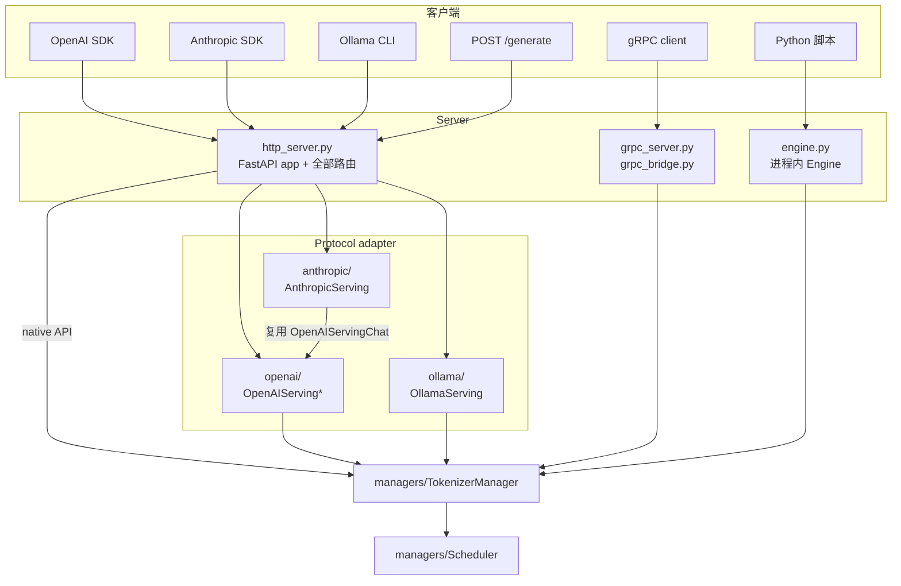

# `entrypoints/`

把外部请求变成 SGLang 请求的一层：HTTP / gRPC server、讲 OpenAI / Anthropic / Ollama 协议的
protocol adapter，以及供离线使用的进程内 `Engine`。这一层只负责 wire format——请求一旦变成
`GenerateReqInput`，就归 `managers/` 管了。

## 规模

60 个 Python 文件，约 25.9k 行。

| 子包 | 文件数 | 行数 | 负责的协议 |
|---|---|---|---|
| *(顶层)* | 18 | 7,921 | HTTP server、gRPC server、native `Engine` |
| [`openai/`](openai/README.md) | 33 | 15,081 | OpenAI REST + Realtime WS |
| `anthropic/` | 3 | 1,995 | Anthropic Messages（`/v1/messages`） |
| `ollama/` | 4 | 783 | Ollama（`/api/chat`、`/api/generate` 等） |
| `search/` | 2 | 139 | 内置 web search tool 的 Exa client |

## 分层

`AnthropicServing` 只是一层翻译壳：把 Anthropic messages 转成 OpenAI 的
`ChatCompletionRequest`，交给现成的 `OpenAIServingChat`，再把结果翻译回去。
`OllamaServing` 不走这条路，直接构造 `GenerateReqInput`。

## 顶层模块

| 文件 | 行数 | 作用 |
|---|---|---|
| `http_server.py` | 2,833 | FastAPI app 本体。声明所有路由，转发给挂在 `app.state` 上的 adapter。 |
| `engine.py` | 1,860 | `Engine`——离线 / 库模式入口，不经过 HTTP。 |
| `grpc_bridge.py` | 816 | native gRPC 链路的 Python 侧（schema 在 `proto/sglang/runtime/v1/`）。 |
| `grpc_server.py` | 272 | gRPC servicer 接线。 |
| `harmony_utils.py`、`context.py`、`tool.py` | 943 | gpt-oss / Harmony 的 conversation context，以及内置的 browser、python tool，供 Responses API 使用。 |
| `http_server_engine.py`、`EngineBase.py`、`engine_score_mixin.py` | 340 | Engine 基类、scoring mixin，以及把子进程 server 当 engine 驱动的 adapter。 |
| `v1_loads.py`、`warmup.py`、`elastic_ep.py` | 403 | 负载上报、启动 warmup、elastic EP 扩缩容端点。 |
| `sidecar.py`、`engine_info_bootstrap_server.py` | 238 | 多进程部署下的 sidecar 拉起与 engine info bootstrap。 |
| `request_headers.py`、`ssl_utils.py`、`http_request_decompression.py` | 216 | 基于 header 的字段 override、SSL 热重载、请求体解压 middleware。 |

## 代码该放哪

| 要加的东西 | 位置 |
|---|---|
| 新的 OpenAI 端点 | `openai/serving_<name>.py`，请求/响应模型放 `openai/protocol.py` |
| 新的非 OpenAI wire protocol | 在 `anthropic/`、`ollama/` 旁边新建子包 |
| *内部* 请求结构上的字段 | `managers/io_struct.py`，不在这里 |
| gRPC message | `proto/sglang/runtime/v1/sglang.proto` |
| tool call / reasoning 输出的解析 | `srt/function_call/`、`srt/parser/` |

Rust 侧在 `sgl-model-gateway/` 和 `rust/sglang-server/` 下各有一套独立实现，与本包不共享代码。
