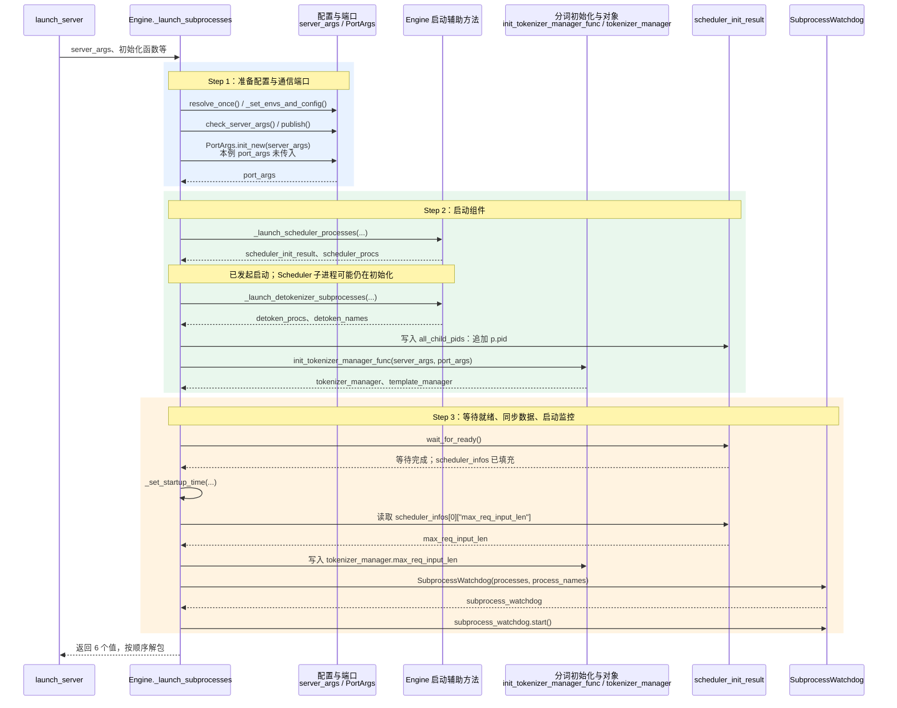
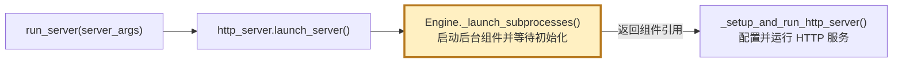

[打开交互时序图（浏览器）](./engine.py._launch_subprocesses.html) · 支持蓝色方法名的悬浮、点击说明；下方为静态图。

## 2. 浅层时序图(Sequence Diagram)

蓝色为 Step 1 配置准备，绿色为 Step 2 组件启动，橙色为 Step 3 等待与状态同步；文字标签也与代码注释一致。
实线箭头表示调用或明确标注的数据读写，虚线箭头表示返回；同类辅助方法合并为一列，列内实现不继续展开。

`wait_for_ready()` 在当前实现中通过进程间通信(Inter-Process Communication，IPC)接收 Scheduler 的初始化信息，填充 `scheduler_infos`；细节留到阅读该方法时再展开。
它的调用返回后，才能可靠地读取初始化结果。返回到 `launch_server()` 后，还会继续配置 HTTP 服务和执行预热(Warmup)。

## 3. 跟着图阅读代码

| 步骤 | 对齐的代码 | 重点核对的数据或行为 |
|---|---|---|
| Step 1 | `server_args.resolve_once()`、`publish()`、`PortArgs.init_new()` | 解析和发布配置；创建组件间通信所需的地址、端口信息 |
| Step 2 | `_launch_scheduler_processes()`、`_launch_detokenizer_subprocesses()` | 返回进程引用及初始化结果对象；将 Detokenizer 的进程 ID 追加到 `all_child_pids` |
| Step 2 | `init_tokenizer_manager_func()` | 使用配置与端口，返回分词管理器和模板管理器 |
| Step 3 | `wait_for_ready()`、`_set_startup_time()` | 等待调度器就绪；记录启动耗时 |
| Step 3 | `tokenizer_manager.max_req_input_len = ...` | 从 Scheduler 初始化信息读取最大输入长度，写入 TokenizerManager |
| Step 3 | `SubprocessWatchdog(...)`、`start()`、`return` | 监控子进程存活状态；将 6 个结果交回调用方 |

| 返回值 | 含义 |
|---|---|
| `tokenizer_manager` | 主进程中的分词管理器，接收请求并与 Scheduler 通信 |
| `template_manager` | 管理对话模板、补全模板等 |
| `port_args` | 组件通信所用的地址、端口配置 |
| `scheduler_init_result` | 保存初始化信息、子进程 ID，以及等待就绪等回调 |
| `subprocess_watchdog` | 已启动的子进程存活监控对象 |
| `weight_cache_daemon_procs` | 权重缓存守护进程列表；本例未开启，返回空列表 |

## 4. 在总体链路中的位置

下面只保留当前方法前后的局部启动链路；高亮节点是本次阅读对象。

源码入口：[launch_server.py](../../launch_server.py)、[http_server.py](http_server.py)。

## 术语与生词

| 术语或单词 | 中文释义 | 简明英文释义 |
|---|---|---|
| IPC — Inter-Process Communication | 进程间通信：不同进程交换数据的机制 | Mechanisms that let processes exchange data. |
| Watchdog /ˈwɑːtʃdɔːɡ/ | 监控器：这里负责检测子进程是否退出 | A component that monitors whether another component is still running. |
| Warmup /ˈwɔːrmʌp/ | 预热：正式处理请求前，先执行准备性的运行 | An initial run that prepares a system for regular use. |
