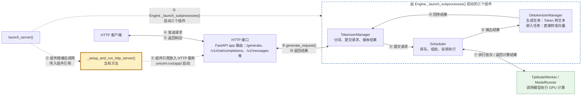
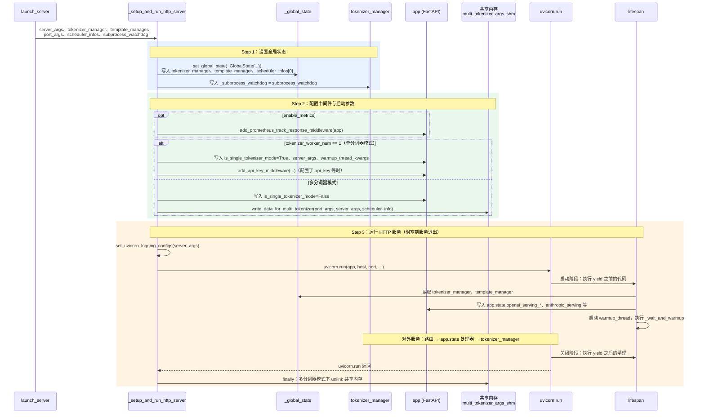

## 1. 在核心链路中的位置

序号按发生顺序排列：①–③ 是启动阶段（虚线箭头），④–⑪ 是一次请求的处理链路（实线箭头）；双向连线的标签上行是去程、下行是回程。黄色粗框为当前方法。
启动时，`launch_server()` 先通过 [Engine._launch_subprocesses()](engine.py._launch_subprocesses.md) 启动虚线框中的三个组件；组件就绪后，再把 `tokenizer_manager` 等组件引用传给本方法，由本方法写入 `_global_state`、放进 HTTP 服务并运行 uvicorn。
HTTP 接口只直接持有 TokenizerManager；OpenAI、Anthropic 等协议按 URL 路径区分，最终都汇到 TokenizerManager。

源码入口：[http_server.py](http_server.py)、[engine.py](engine.py)。

## 2. 浅层时序图(Sequence Diagram)

蓝色为 Step 1 设置全局状态，绿色为 Step 2 配置中间件与启动参数，橙色为 Step 3 运行 HTTP 服务；文字标签与代码注释一致。
实线箭头表示调用或数据写入，虚线箭头表示返回；图中只画默认的 `uvicorn.run(app)` 分支。

- **Step 1**：`set_global_state(_GlobalState(...))` 把 `tokenizer_manager`、`template_manager`、`scheduler_infos[0]` 写入模块级变量 `_global_state`，路由函数和 `lifespan` 都从这里读取；`tokenizer_manager._subprocess_watchdog` 保存看门狗，供 SIGQUIT 信号处理使用。
- **Step 2**：开启指标(metrics)时，`add_prometheus_track_response_middleware(app)` 统计请求响应。
- **Step 2**：单分词器模式借 `app` 的属性（`is_single_tokenizer_mode`、`server_args`、`warmup_thread_kwargs`）把参数传给 `lifespan`；API Key 鉴权 `add_api_key_middleware(...)` 只在这个模式下支持。
- **Step 2**：多分词器模式用 `write_data_for_multi_tokenizer(...)` 写入共享内存；每个 uvicorn worker 进程里的 `lifespan` 先通过 `init_multi_tokenizer()` 读取参数、重建分词器，再构造处理器。
- **Step 3**：`lifespan` 不是本方法直接调用的，而是 `uvicorn.run(app)` 启动时由 FastAPI 自动触发；画出来是为了说明 Step 1、Step 2 写入的数据在哪里被消费。
- **Step 3**：预热线程 `_wait_and_warmup` 向本服务发 `/model_info`、`/generate` 请求，成功后打印 `The server is fired up and ready to roll!`，再执行 `launch_callback`。
- **Step 3**：图中省略的 HTTP 服务器分支：`enable_http2` 走 `_run_granian_server(...)`（Granian 支持 HTTP/2）；`enable_ssl_refresh` 走 `uvicorn.Server(config)` 配合 `SSLCertRefresher` 自动刷新证书；`tokenizer_worker_num > 1` 走 `uvicorn.run("sglang.srt.entrypoints.http_server:app", workers=N)`。
- **Step 3**：`finally` 中，多分词器模式下释放共享内存、清理 socket。

## 术语与生词

| 术语或单词 | 中文释义 | 简明英文释义 |
|---|---|---|
| Lifespan /ˈlaɪfspæn/ | 生命周期钩子：`yield` 前在服务启动时执行，`yield` 后在服务关闭时执行 | A hook that runs setup code on startup and cleanup code on shutdown. |
| Middleware /ˈmɪdlwer/ | 中间件：在每个请求进出路由前后统一执行的逻辑，如鉴权、统计 | Logic that wraps every request, e.g. auth or metrics. |
| Uvicorn /ˈjuːvɪkɔːrn/ | Python 的异步 HTTP 服务器，负责监听端口并运行 FastAPI 应用 | An ASGI server that listens on a port and runs the FastAPI app. |
| Shared Memory | 共享内存：多个进程可读写的同一块内存，这里用来给 worker 进程传参 | Memory that multiple processes can read and write. |
