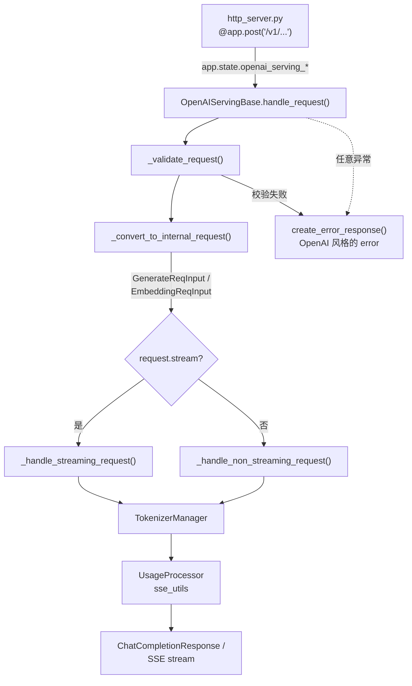
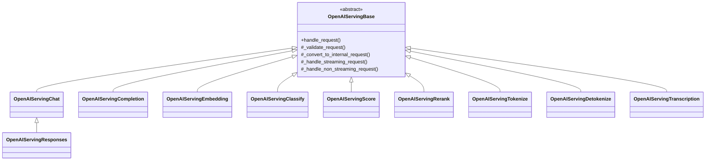

# `entrypoints/openai/`

OpenAI 兼容层：所有请求/响应的 Pydantic 模型、每个端点一个 `OpenAIServing*` 类，以及把
chat messages 编码成 prompt token 的 encoder。路由本身在
[`../http_server.py`](../http_server.py)，本包装的是这些路由转发过来之后的逻辑。

## 规模

33 个 Python 文件，约 15.1k 行。

| 分组 | 文件数 | 行数 |
|---|---|---|
| Serving 类（`serving_*.py`） | 10 | 8,539 |
| 协议模型（`protocol.py`） | 1 | 2,116 |
| Chat encoding（`chat_encoding.py`、`encoding_dsv*.py`） | 3 | 1,568 |
| 公共 helper（`utils.py`、`usage_processor.py`、`sse_utils.py`、`tool_server.py` 等） | 7 | 967 |
| `transcription_adapters/` | 8 | 949 |
| `realtime/` | 4 | 942 |

## 请求流程

`serving_base.py` 里的 `handle_request` 是唯一的漏斗：记录 receive time、校验、转换成内部请求
类型、按 `stream` 分流，并把各类异常统一映射成 OpenAI 风格的 error body。子类只需要实现
`_convert_to_internal_request`、两个 `_handle_*_request` 方法和 `_request_id_prefix`。

## 端点

| 路由 | 类 | 文件 | 行数 |
|---|---|---|---|
| `/v1/chat/completions` | `OpenAIServingChat` | `serving_chat.py` | 2,725 |
| `/v1/responses` | `OpenAIServingResponses` | `serving_responses.py` | 2,604 |
| `/v1/audio/transcriptions` | `OpenAIServingTranscription` | `serving_transcription.py` | 816 |
| `/v1/completions` | `OpenAIServingCompletion` | `serving_completions.py` | 689 |
| `/v1/rerank` | `OpenAIServingRerank` | `serving_rerank.py` | 609 |
| `/v1/embeddings` | `OpenAIServingEmbedding` | `serving_embedding.py` | 308 |
| `/v1/classify` | `OpenAIServingClassify` | `serving_classify.py` | 204 |
| `/v1/tokenize`、`/v1/detokenize` | `OpenAIServingTokenize`、`OpenAIServingDetokenize` | `serving_tokenize.py` | 189 |
| `/v1/score` | `OpenAIServingScore` | `serving_score.py` | 102 |
| `/v1/realtime`（WebSocket） | `RealtimeConnection` | `realtime/` | 942 |

`/v1/models` 足够简单，直接写在 `http_server.py` 里。`OpenAIServingResponses` 继承的是
`OpenAIServingChat` 而不是基类，并且在 `try` 里构造——可选依赖加载失败时只会带 warning 禁用该
端点，不会让启动挂掉。

## 类继承关系

实例化哪个 chat 类是 model 的属性，不是写死的 import：`http_server.py` 取的是
`tokenizer_manager.serving_chat_class`，所以 `TokenizerManager` 的子类可以替换成自己的实现。

## 支撑模块

| 文件 | 作用 |
|---|---|
| `protocol.py` | 所有请求/响应模型——`ChatCompletionRequest`、`UsageInfo`、`ErrorResponse`、多模态 content part，以及 SGLang 自己的 `SglExt` 扩展字段。 |
| `chat_encoding.py` | chat encoder 的唯一 dispatch 点，保证 serving 路径和离线工具（benchmark、eval）选到同一个 encoder。 |
| `encoding_dsv32.py`、`encoding_dsv4.py` | 自包含的 DeepSeek V3.2 / V4 chat encoder（tool call、thinking mode），从模型 release 移植而来。 |
| `usage_processor.py` | token 统计，含 cached token 和 speculative decoding 的明细字段。 |
| `sse_utils.py` | 流式热路径上预编码的 `data: ` / `\n\n` SSE framing。 |
| `utils.py` | logprob 转换等公共响应整形逻辑。 |
| `tool_server.py` | Responses API 的 `ToolServer` 实现：`MCPToolServer`、`DemoToolServer`、`NativeToolServer`。 |
| `audio_chunking.py` | 长音频按能量最低点切分，避免切在词中间。 |
| `streaming_asr.py` | Realtime transcription 路径的增量 ASR 状态。 |
| `transcription_adapters/` | 按模型划分的 ASR adapter：Whisper、Qwen2-Audio、Qwen3-ASR、GLM-ASR、Granite Speech、MiMo-v2-ASR。 |
| `realtime/` | Realtime WebSocket 的 session 状态、事件协议和 handler（只实现 transcription 子集）。 |

## 边界

- 内部请求类型（`GenerateReqInput`、`EmbeddingReqInput`）定义在 `srt/managers/io_struct.py`。
  本包只负责转换成它们，不越过这条线。
- 把模型输出解析回 OpenAI 字段的逻辑在别处：`tool_calls` 在 `srt/function_call/`，
  `reasoning_content` 在 `srt/parser/reasoning_parser.py`，chat template 在
  `srt/parser/template_manager.py`。
- `anthropic/` 和 `ollama/` 是同级兄弟，不是建在本包之上的层；只有 `AnthropicServing` 复用了
  `OpenAIServingChat`。
