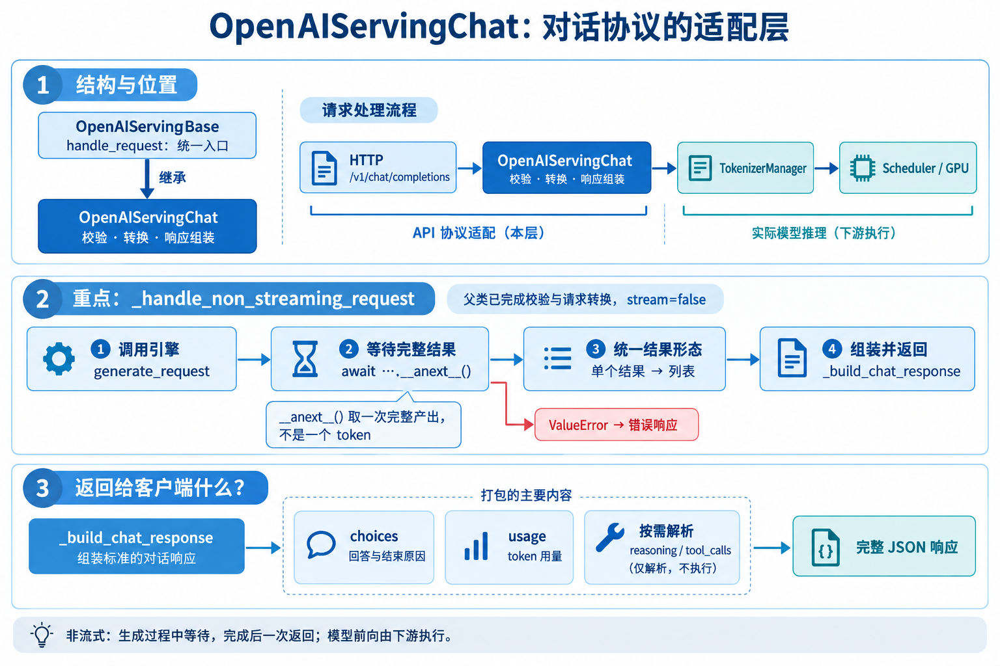
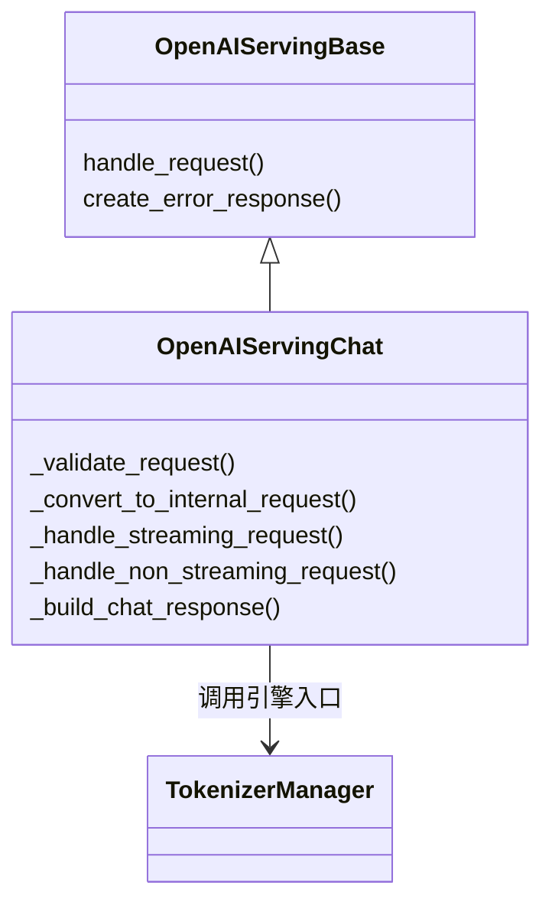
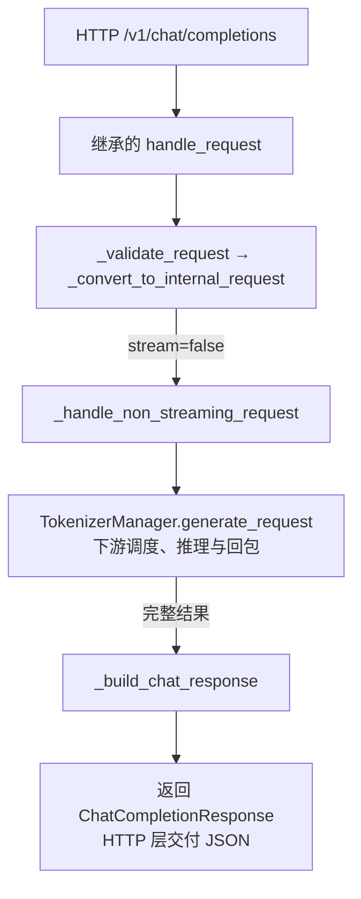

# OpenAIServingChat 类说明

对应 `serving_chat.py`；负责 OpenAI 对话协议适配，重点看非流式请求（`stream=false`）。

## 1. 类结构与职责

父类提供统一处理流程，通过 `self` 调用子类的校验、转换与响应方法；模板处理也在 Chat 适配层。
TokenizerManager 管理分词、发送与回包；实际模型前向在下游 worker / ModelRunner 执行。

## 2. 一次非流式请求的位置

## 3. 重点方法：_handle_non_streaming_request

- `adapted_request`：转换后的 GenerateReqInput，供引擎使用。
- `request`：ChatCompletionRequest，保留响应组装需要的模型名、n、解析选项等。
- `raw_request`：HTTP Request，向下传递以支持连接状态检查等。
1. `await self.tokenizer_manager.generate_request(...).__anext__()`：驱动异步生成器，等待一次产出。
2. 非流式路径通常在完成时才 yield，因此这里取得完整结果；**不是只取一个 token**。
3. 若等待调用抛出 `ValueError`，通过 `create_error_response` 返回错误；其他异常交由外层处理。
4. 若 `ret` 不是列表，包装成 `[ret]`，统一单个结果和多个候选结果的处理形式。
5. 调用 `_build_chat_response(request, ret, int(time.time()))`，然后返回构造好的响应。

## 4. _build_chat_response 做什么？

逐个结果构建 `choices`：回答内容、结束原因及按需返回的 logprobs 等；按配置解析 reasoning 和 tool_calls（不执行工具）。
汇总 `usage`，附上 id、created、model 等字段，构造 ChatCompletionResponse；解析失败时可能返回错误响应。
