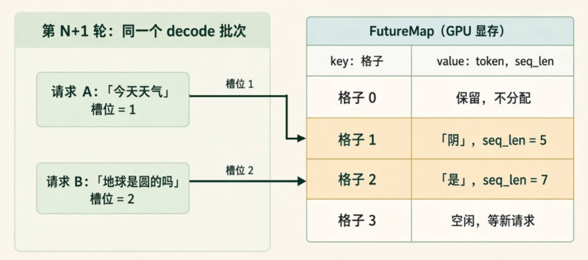

# FutureMap 说明

FutureMap（定义在 `overlap_utils.py`）是一个常驻、按请求池下标索引的中转站，用来在迭代之间传值：forward 通过 `publish` / `stash` 写入，下一轮迭代通过 `resolve_forward_inputs` / `resolve_seq_lens_cpu` 读出。

- 常驻（Always-on）：不管开不开 overlap 都会创建，下一轮的 `input_ids` 都从这里取。
- 按请求池下标索引（pool-indexed）：每个请求固定占 `req_pool_idx`（槽位）那一行，跟它在 batch 里的位置无关。
- 为什么需要：overlap 模式下，CPU 调度第 N+1 轮时，第 N 轮的 GPU 计算还没结束，CPU 拿不到刚采样出的 token。所以 GPU 把结果按槽位写进 FutureMap，下一轮 GPU 自己去取，CPU 不用等。

## 1. 核心数据结构

图里的 key-value 表并不是一个 dict，而是两个预先分配好的 GPU tensor，形状都是 `[req_pool_size]`，类型都是 int64：

| 字段 | 含义 | 写 | 读 |
| --- | --- | --- | --- |
| `output_tokens_buf` | 槽位上的请求最新采样出的 token | `stash()` | `resolve_forward_inputs()` |
| `new_seq_lens_buf` | 原始输入加上已生成的全部 token 的数量 | `publish()` | `resolve_seq_lens_cpu()` |

- key（格子号）不单独存，它就是数组下标。比如 `output_tokens_buf[1]` 就是格子 1 的 token。
- 每一轮都会覆盖；请求结束、槽位被新请求占用后，也会被覆盖。
- 格子 0 保留不分配。它对应 KV（Key-Value）cache 的 padding 行，CUDA Graph 补齐出来的行即使读写到这里也没有影响。
- FutureMap 不存 KV cache，也不存位置：位置记在 `req_to_token_pool.req_to_token`，KV 本身存在 `token_to_kv_pool`。

## 2. 示例：「今天天气」→「阴天」

请求 A 的输入是「今天天气」，假设一个字一个 token，占槽位 1，不开 speculative decoding：

| 轮次 | `input_ids` | `seq_lens` | 采样结果 | 写回 `output_tokens_buf[1]` | 写回 `new_seq_lens_buf[1]` |
| --- | --- | --- | --- | --- | --- |
| N（prefill） | 今天天气 | 4 | 阴 | 阴 | 5 |
| N+1（decode） | 阴 | 5 | 天 | 天 | 6 |
| N+2（decode） | 天 | 6 | EOS（End Of Sequence） | 请求结束 | 请求结束 |

- `seq_lens` 是这个请求的总长度，不是 `input_ids` 的长度。decode 时 `input_ids` 只有 1 个 token，但 attention 要看全部 `seq_lens` 个 token 的 KV（Key-Value）cache。
- `new_seq_lens` 把刚采样出、KV 还没写入的那个 token 也算进去了，所以第 N 轮写回的是 4 + 1 = 5。
- 请求 B「地球是圆的吗」同理：6 个 token 做完 prefill 后，写回「是」和 `seq_len = 7`。

## 3. 一轮里的读写顺序

在 `scheduler.py` 的 `run_batch` 里，一轮的顺序如下：

1. `future_map.resolve_seq_lens_cpu(batch)`：读 `new_seq_lens_buf`，作为 `batch.seq_lens`。只有 speculative decoding 会读。
2. `resolve_forward_inputs(batch, future_map)`：读 `output_tokens_buf[req_pool_indices]`，作为 `batch.input_ids`。prefill 时则从 pinned 内存做 H2D（Host to Device）拷贝。
3. `model_worker.forward_batch_generation(batch)`：前向计算并采样。
4. `future_map.publish(...)`：写 `new_seq_lens_buf`。
5. `_relay_forward_payload(...)` 调用 `future_map.stash(...)`：把 `next_token_ids` 写进 `output_tokens_buf`。

## 4. 开不开 speculative decoding 的区别

- 不开：每轮固定多 1 个 token，`publish` 写入 `seq_lens + 1`。`new_seq_lens_buf` 虽然会写，但下一轮不读，CPU 自己做 +1。
- 开：每轮接受几个 token，要等 GPU 验证完才知道，所以由 worker 通过 `on_publish` 回调写入 `seq_lens + accept_lens`，下一轮必须从 `new_seq_lens_buf` 读。
- 开启时还会在 `_lazy_init_forward_buf` 里懒加载 `topk_p_buf`、`topk_index_buf`、`hidden_states_buf` 等，同样按槽位索引，由 `stash` 一起写入。
