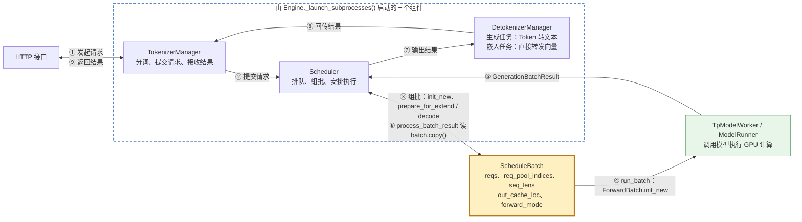
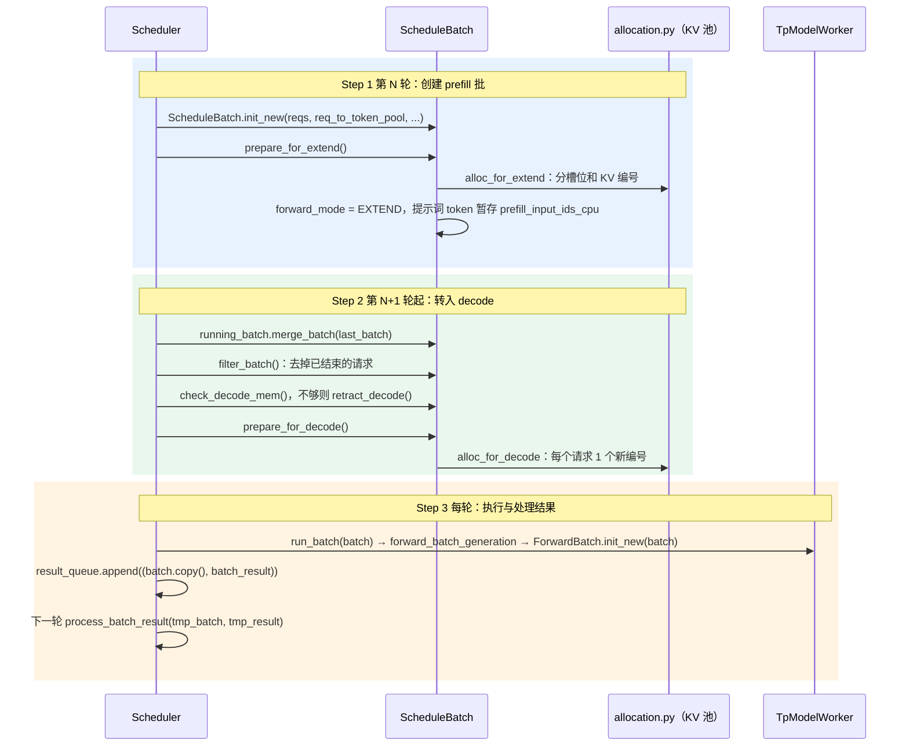
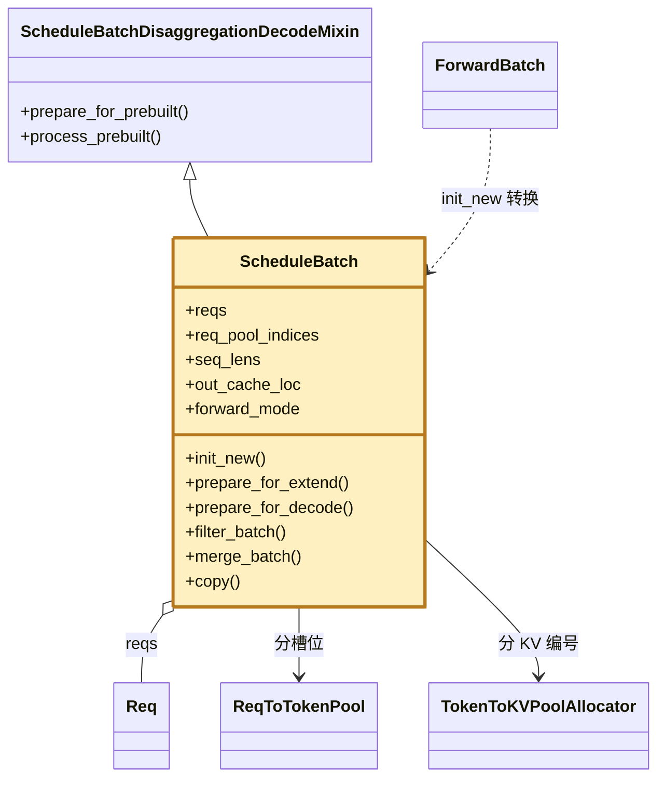

# ScheduleBatch：Scheduler 组好的一批请求

> **作用：保存一批请求在调度阶段的全部信息（请求列表、槽位、序列长度、新分配的 KV 编号、采样参数、prefill 还是 decode），在组批时创建、前向时转成 `ForwardBatch`、处理结果时再读一次。** 下文路径相对 `python/sglang/srt/`

## 1. 在核心链路中的位置

序号按发生顺序排列，全是一次请求的处理链路（实线箭头）；双向连线的标签上行是去程、下行是回程。黄色粗框为 `ScheduleBatch`。

- ③ 组批：`managers/scheduler.py` 的 `_get_new_batch_prefill_raw()` 从 `waiting_queue` 挑出请求后 `ScheduleBatch.init_new(...)`；decode 时复用 `running_batch` 这个对象。
- ④ 前向：`TpModelWorker.forward_batch_generation()` 里 `ForwardBatch.init_new(batch, self.model_runner, ...)`，把它转成 GPU 前向用的输入。
- ⑥ 处理结果：overlap 下 `run_batch` 后 `self.result_queue.append((batch.copy(), batch_result))`，下一轮 `process_batch_result(tmp_batch, tmp_result)` 用这份副本更新每个请求。

## 2. 浅层时序图(Sequence Diagram)

以请求 A「今天天气」→「阴天」为例：第 N 轮 prefill，第 N+1 轮起 decode。

- **Step 1**：`ScheduleBatch.init_new()` 只记下 `reqs` 和各个池的引用；`prepare_for_extend()` 算出 `prefix_lens`、`extend_lens`、`seq_lens`，调 `alloc_for_extend(...)` 得到 `out_cache_loc` 和 `req_pool_indices`，再 `self.prefill_input_ids_cpu = pinned_input_ids`，最后 `self.sampling_info = SamplingBatchInfo.from_schedule_batch(...)`。
- **Step 2**：`get_next_batch_to_run()` 把上一轮的 prefill 批 `merge_batch` 进 `running_batch`；`update_running_batch()` 先 `filter_batch()`，显存不够时 `retract_decode()` 把部分请求撤回 `waiting_queue`，再 `prepare_for_decode()`：`self.forward_mode = ForwardMode.DECODE`、`self.out_cache_loc = alloc_for_decode(self, token_per_req=1)`、`self.seq_lens = self.seq_lens + 1`；`input_ids` 是 `None`，前向时从 FutureMap 取。
- **Step 3**：`run_batch` 结束时 `batch.input_ids = None`；原 batch 下一轮还会被 `filter_batch` / `merge_batch` 改掉，所以入队的是 `batch.copy()`，只保留处理结果要用的字段。
- 省略：混合批 `mix_with_running()`、投机解码、PD 分离、混合 Mamba、滑动窗口（`maybe_evict_swa`）等分支。

## 3. 继承关系与职责

| 类 | 职责 | 核心方法 | 说明 |
|---|---|---|---|
| `ScheduleBatch` | 保存一批请求的调度数据，准备每轮前向 | `init_new`、`prepare_for_extend` | 建 prefill 批：分配槽位和 KV 编号，提示词暂存 CPU 锁页内存 |
| - | - | `prepare_for_decode`、`check_decode_mem`、`retract_decode` | decode 前每个请求再分 1 个编号；显存不够就撤回部分请求 |
| - | - | `merge_batch`、`filter_batch`、`copy` | 并入、去掉请求；`copy` 给 `process_batch_result` 留一份副本 |
| `ScheduleBatchDisaggregationDecodeMixin` | PD 分离时 decode 实例专用 | `prepare_for_prebuilt`、`process_prebuilt` | KV 已由 prefill 实例传来，`forward_mode = PREBUILT`，不跑前向 |

- `ScheduleBatch` 是 `@dataclasses.dataclass`，字段很多；PD 分离的逻辑放在 Mixin 里，主类只保留通用的组批流程。

## 术语与生词

| 术语或单词 | 中文释义 | 简明英文释义 |
|---|---|---|
| Mixin /ˈmɪksɪn/ | 混入类：只提供一组方法，被别的类继承复用 | A class that only adds methods for other classes to reuse. |
| Dataclass /ˈdeɪtəklæs/ | 数据类：按字段自动生成构造函数的 Python 类 | A Python class whose constructor is generated from its fields. |
| Retract /rɪˈtrækt/ | 撤回：把请求退回等待队列，释放它占的 KV | Send a request back to the waiting queue and free its KV. |
| Prebuilt /ˌpriːˈbɪlt/ | 预先构建：KV 已由别的实例算好并传来 | KV already computed and transferred by another instance. |
| PD（Prefill-Decode）分离 | 把 prefill 和 decode 放到不同实例上 | Run prefill and decode on separate instances. |
