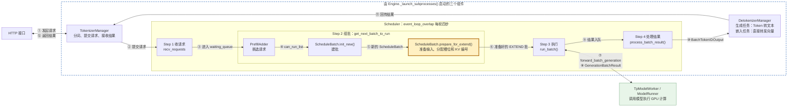
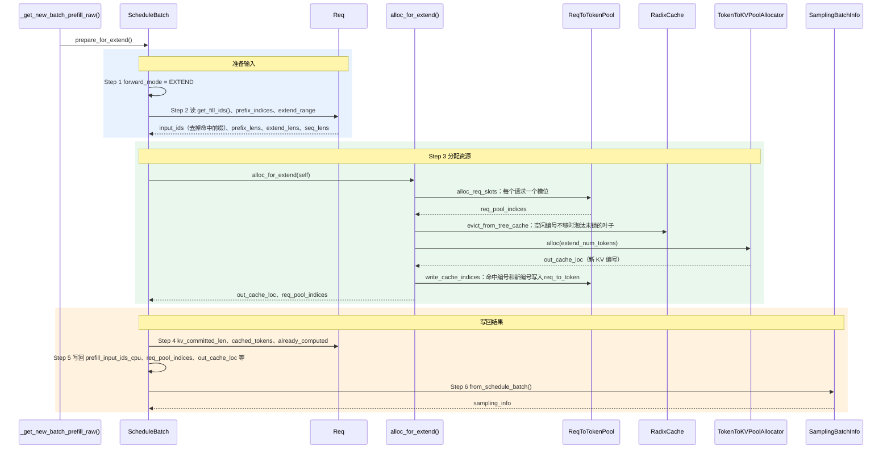

# prepare_for_extend：为 prefill 批准备输入，分配槽位和 KV 编号

> **`PrefillAdder` 选好请求、`ScheduleBatch.init_new()` 建好批之后，`prepare_for_extend()` 把批变成可以前向的状态：算出每个请求本轮要算的 token，分配槽位和 KV 编号并写入 `req_to_token`，再打包采样参数。**

## 1. 在核心链路中的位置

序号按发生顺序排列：①–⑫ 都是一次请求的处理链路（实线箭头），本方法不涉及启动阶段；双向连线的标签上行是去程、下行是回程。黄色粗框为本文讲的 `prepare_for_extend()`。

- 本方法是 Step 2 组批的最后一步：`scheduler.py` 的 `Scheduler._get_new_batch_prefill_raw()` 里，`new_batch = ScheduleBatch.init_new(...)` 之后调用 `new_batch.prepare_for_extend()`。
- prefill 批在代码里叫扩展(Extend)批（`ForwardMode.EXTEND`），只计算命中前缀之后的 token。
- 组批时 `PrefillAdder` 只扣预算、不分配资源；真正分配槽位和 KV 编号就在本方法里。
- 只讲默认路径：单卡、`RadixCache`、`page_size = 1`；多模态、Mamba、编码器-解码器(Encoder-Decoder)、扩散语言模型(DLLM)不展开。

## 2. 浅层时序图(Sequence Diagram)

蓝、绿、橙三段分别是准备输入、分配资源、写回结果；实线箭头是调用或数据读写，虚线箭头是返回。Step 编号与代码里的 `【Step N】` 注释一一对应。

- **Step 1 设前向模式**：`self.forward_mode = ForwardMode.EXTEND`；扩散语言模型改用 `DLLM_EXTEND`，图中省略。
- **Step 2 算本轮输入**：
  - `input_ids = r.get_fill_ids()[len(r.prefix_indices):]`：只取命中前缀之后的 token；`extend_num_tokens` 是全批要新算的 token 总数，也就是要分配的 KV 编号数。
  - `seq_lens` 取 `r.extend_range.end`，即本轮算完后的总长度；`prefix_lens`、`extend_lens` 分别是命中长度和本轮新算的长度。
  - `input_ids` 先拼成锁页(pinned) CPU 张量存进 `prefill_input_ids_cpu`，到前向流上再由 `resolve_forward_inputs` 拷到 GPU。
- **Step 3 分配资源**（`mem_cache/allocation.py` 的 `alloc_for_extend()`）：
  - `alloc_req_slots`：给每个请求分配一个槽位，写入 `req.req_pool_idx`；分块续算的请求复用原来的槽位；槽位不够时抛 `RuntimeError`。
  - `alloc_token_slots`：先 `evict_from_tree_cache` 淘汰 RadixCache 里未锁的叶子补足缺口，再调 `allocator.alloc(extend_num_tokens)` 得到 `out_cache_loc`；`page_size > 1` 时改走 `alloc_paged_token_slots_extend`。
  - `write_cache_indices`：`req_to_token[槽位, :prefix_len]` 写命中的编号 `prefix_indices`，`req_to_token[槽位, prefix_len:seq_len]` 写新编号 `out_cache_loc`。
  - 这里只分配编号，K/V 在前向时才按 `out_cache_loc` 写进 KV 池。
- **Step 4 更新请求状态**：逐个请求记 `kv_committed_len = seq_len`、命中统计 `cached_tokens`（撤回过的请求不重复统计）和 `already_computed`；需要返回 logprob 时还会算 `extend_input_logprob_token_ids`，图中省略。
- **Step 5 写回批字段**：`prefill_input_ids_cpu`、`req_pool_indices`、`out_cache_loc`、`seq_lens_sum` 等，之后 `run_batch` 用它们构造 `ForwardBatch`。
- **Step 6 打包采样参数**：`SamplingBatchInfo.from_schedule_batch()` 把各请求的温度、top_p 等拼成张量，存到 `self.sampling_info`。

## 术语与生词

| 术语或单词 | 中文释义 | 简明英文释义 |
|---|---|---|
| Extend /ɪkˈstend/ | 扩展：prefill 在代码里的叫法，只算命中前缀之后的 token | Prefill that computes only tokens after the cached prefix. |
| pinned memory | 锁页内存：不会被换出的 CPU 内存，拷到 GPU 更快，可以异步拷贝 | Page-locked host memory for fast, asynchronous copies to the GPU. |
| logprob | 对数概率：token 概率取对数 | The log of a token's probability. |
| DLLM — Diffusion Large Language Model | 扩散语言模型：按扩散方式生成文本的大模型 | A language model that generates text by diffusion. |
