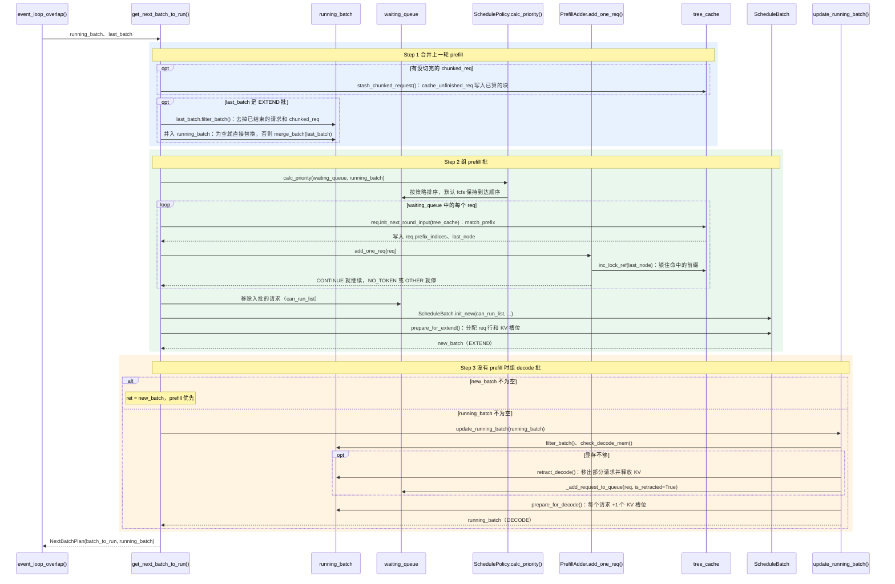

# 组批：每一轮跑哪些请求

> **每轮先把上一轮预填充(Prefill)完的请求并入 `running_batch`，再优先组新的预填充批；组不出来，就让 `running_batch` 解码(Decode)一步。**

## 1. 在核心链路中的位置

- Scheduler 主循环 [`event_loop_overlap`](scheduler.py#L1824) 每轮四步：Step 1 收请求 → **Step 2 组批** → Step 3 执行 → Step 4 处理结果；本方法就是 [Step 2](scheduler.py#L1860)，全貌见 [核心组件四：Scheduler](../../../../user_guide_zh/核心组件四：Scheduler.md)。
- 输入 `running_batch`（正在 decode 的请求）和 `last_batch`（上一轮跑的批），并读取 `waiting_queue`（Step 1 收进来的请求）；输出 [`NextBatchPlan`](schedule_batch.py#L3539)：`batch_to_run` 交给 Step 3 执行，`running_batch` 写回 `self.running_batch`。
- prefill 批在代码里叫扩展(Extend)批（`ForwardMode.EXTEND`），只计算已缓存前缀之后的 token；decode 批是 `ForwardMode.DECODE`。
- 只讲默认路径：单卡；`tree_cache` 是基数树缓存(Radix Cache)，即前缀缓存(Prefix Cache)，相同前缀的请求共享键值缓存(Key-Value Cache，KV Cache)。流水线并行、预填充与解码分离、推测解码不展开。

## 2. 浅层时序图(Sequence Diagram)

蓝色为 Step 1，绿色为 Step 2，橙色为 Step 3；实线箭头是调用或数据读写，虚线箭头是返回。

- **Step 1 合并上一轮 prefill**：上一轮若是 EXTEND 批，把其中没结束的请求并入 `running_batch`，从本轮起一起 decode；见[合并代码](scheduler.py#L3214)。
  - 对齐代码：[`filter_batch`](schedule_batch.py#L3254) 去掉已结束的请求和 `chunked_req`；[`merge_batch`](schedule_batch.py#L3341) 拼接 `req_pool_indices`、`seq_lens` 等张量。
  - 关键数据：分块预填充(Chunked Prefill)没切完的请求记在 `self.chunked_req`，暂不并入；[`stash_chunked_request`](scheduler.py#L3111) 调 [`cache_unfinished_req`](../mem_cache/radix_cache.py#L516)，把算完的块写入 radix 树并更新 `prefix_indices`，下一块从这里接着算。
  - 省略：超时 abort、分层稀疏注意力、扩散语言模型等分支。
- **Step 2 组 prefill 批**：[`get_new_batch_prefill`](scheduler.py#L3371) 调 [`_get_new_batch_prefill_raw`](scheduler.py#L3398)，从 `waiting_queue` 挑请求组成新的 EXTEND 批。
  - 提前返回 `None`：`running_batch` 已满，或队列为空且没有 `chunked_req`；请求槽位（[`get_num_allocatable_reqs`](scheduler.py#L3351)）用完也停。
  - 排序：[`calc_priority`](schedule_policy.py#L237)。默认 `schedule_policy=fcfs`，保持到达顺序；`lpm` 会先匹配前缀，命中长的排前面。
  - 预算(Budget)：[`PrefillAdder(...)`](scheduler.py#L3473) 记录本轮还能用多少 token；上一轮的 `chunked_req` 先用 `add_chunked_req` 续上。
  - 逐个试：[`init_next_round_input`](schedule_batch.py#L1323) 调 [`match_prefix`](../mem_cache/radix_cache.py#L377) 填 `prefix_indices`，最多匹配到输入长度减 1；[`adder.add_one_req(...)`](scheduler.py#L3569) 返回 `CONTINUE` 才试下一个。
  - 建批：入批请求移出 `waiting_queue`，被截断的记为 `self.chunked_req`；[`ScheduleBatch.init_new(...)`](scheduler.py#L3631) 只挂上请求、内存池和 `tree_cache`，[`prepare_for_extend`](schedule_batch.py#L2423) 才算出 `prefix_lens`、`extend_lens`、`seq_lens` 并分配内存。
  - 省略：LoRA、分层缓存、优先级抢占、预填充与解码分离的额外检查。
- **Step 3 没有 prefill 时组 decode 批**：[prefill 优先](scheduler.py#L3314)，`new_batch` 为空才调 [`update_running_batch`](scheduler.py#L3724)，让 `running_batch` 再走一步 decode。
  - 对齐代码：`filter_batch` → [`check_decode_mem`](schedule_batch.py#L2899)（缺口先从 radix 树驱逐）→ [`prepare_for_decode`](schedule_batch.py#L3162)（每个请求分 1 个 KV 槽位，`seq_lens` 加 1）。
  - 显存仍不够：[`retract_decode`](schedule_batch.py#L2906) 逐个退回(Retract)请求，默认先退输出最短的；释放 KV 但不写入 radix 树，再经 [`_add_request_to_queue`](scheduler.py#L3796) 回到 `waiting_queue`，之后连同已生成的 token 重新 prefill。
  - 关键数据：prefill 和 decode 都没有时，`batch_to_run` 为 `None`，本轮空转。
  - 省略：数据并行注意力的同步、decode 转 extend、`prefill_decode_interval` 推迟 prefill。

## 3. 预算与内存

| PrefillAdder 预算 | 来源 | 限制什么 |
|---|---|---|
| [`rem_total_tokens`](schedule_policy.py#L671) | 空闲 KV 槽位 + radix 树可驱逐的 token，减去运行中和本轮已入批请求的预留 | 总显存：新请求要 `extend 长度 + max_new_tokens + page_size`，不够返回 `NO_TOKEN` |
| [`rem_input_tokens`](schedule_policy.py#L537) | `max_prefill_tokens`，默认 16384 | 本批 prefill 的输入 token 总数，用完返回 `OTHER` |
| [`rem_chunk_tokens`](schedule_policy.py#L538) | `chunked_prefill_size`，按显存自动取 2048–16384，`-1` 关闭 | 本批还能算的输入 token；单个请求超出就按页截断，成为 `chunked_req` |

- 判断在 [`add_one_req`](schedule_policy.py#L1208)，扣减在 [`_update_prefill_budget`](schedule_policy.py#L864)，[`budget_state`](schedule_policy.py#L841) 决定继续还是停。
- 命中的前缀不算进 extend 长度，命中越多越容易入批；新请求按 `max_new_tokens` 全额预留（最多 4096），运行中请求按剩余量乘 `new_token_ratio` 预留，这个比例每步 decode 衰减、retract 后重新估算。

| 内存对象 | 职责 | 关键方法 |
|---|---|---|
| `req_to_token_pool`（[`ReqToTokenPool`](../mem_cache/memory_pool.py#L256)） | 每个请求占一行，按位置记录每个 token 的 KV 槽位编号 | [`alloc`](../mem_cache/memory_pool.py#L292) 分一行（`req_pool_idx`）/ [`free`](../mem_cache/memory_pool.py#L340) 归还 |
| `token_to_kv_pool_allocator`（[`TokenToKVPoolAllocator`](../mem_cache/allocator/token.py#L28)） | 管理 KV 池的空闲槽位 | [`alloc`](../mem_cache/allocator/token.py#L54) 取 N 个槽位（`out_cache_loc`）/ [`free`](../mem_cache/allocator/token.py#L65) 归还 |
| `tree_cache`（[`RadixCache`](../mem_cache/radix_cache.py#L303)） | 按 token 前缀共享 KV；没被锁住的前缀可驱逐 | [`match_prefix`](../mem_cache/radix_cache.py#L377) 找最长的已缓存前缀 |
| - | - | [`cache_unfinished_req`](../mem_cache/radix_cache.py#L516) / [`cache_finished_req`](../mem_cache/radix_cache.py#L459) 把请求的 KV 写入树 |
| - | - | [`inc_lock_ref`](../mem_cache/radix_cache.py#L623) 锁住在用的前缀 / [`evict`](../mem_cache/radix_cache.py#L593) 释放没锁的叶子 |

- extend 分配：[`alloc_for_extend`](../mem_cache/allocation.py#L282) 先用 [`alloc_req_slots`](../mem_cache/allocation.py#L229) 分一行，再用 [`alloc_token_slots`](../mem_cache/allocation.py#L150) 为前缀之后的 token 分槽位（不够先驱逐），最后把前缀和新槽位写进这一行。
- decode 分配：[`alloc_for_decode`](../mem_cache/allocation.py#L528) 每个请求分 1 个槽位，写在这一行第 `seq_lens` 个位置。

## 4. 例子：数三个数字

- 假设：请求 `你数三个数字` 切成 4 个 token `[你, 数, 三个, 数字]`（忽略对话模板），`max_new_tokens=16`，默认 `page_size=1`；模型依次输出 `1`、`2`、`3`、`<eos>`。
- **第 1 轮 prefill，未命中**：`match_prefix` 没找到前缀，`prefix_indices` 为空；`add_one_req` 要 `4 + 16 + 1 = 21` 个 token 的预算，够就入批；`prepare_for_extend` 分到一行和 4 个 KV 槽位，Step 3 前向计算后采样出 `1`。
- **如果命中**：之前的 `你数三个字母` 已写入 radix 树，就命中 `[你, 数, 三个]`，只为 `数字` 分 1 个槽位、只算 1 个 token，预算只要 `1 + 16 + 1 = 18`；命中的节点被 `inc_lock_ref` 锁住，运行期间不会被驱逐。
- **第 2 轮合并并 decode**：`last_batch` 是 EXTEND 批，`running_batch` 原本为空，直接用 `last_batch` 顶替；队列已空，走 `update_running_batch`：分 1 个槽位，`seq_lens` 从 4 变 5，输入 `1` 输出 `2`。重叠调度(Overlap Scheduling)下 `1` 这时还没回到 CPU，输入先用占位值。
- **第 3、4 轮**：每轮再加 1 个槽位：输入 `2` 输出 `3`，输入 `3` 输出 `<eos>`。
- **结束**：Step 4 读到 `<eos>`，[`release_kv_cache`](../mem_cache/common.py#L202) 调 `cache_finished_req` 把 KV 写进 radix 树等后续命中，并释放 `req_to_token_pool` 的行；之后的 `filter_batch` 把请求移出 `running_batch`。overlap 下结果晚一轮处理，期间可能多跑一步 decode，这步结果直接丢弃。

## 术语与生词

| 术语或单词 | 中文释义 | 简明英文释义 |
|---|---|---|
| Prefill /ˈpriːfɪl/ | 预填充：一次算完输入的所有 token，建立 KV 缓存并得到第一个输出 token | Processing the whole prompt at once to build the KV cache. |
| Decode /diːˈkoʊd/ | 解码：每步为每个请求生成 1 个新 token | Generating one new token per request per step. |
| Extend /ɪkˈstend/ | 扩展：SGLang 的 prefill 前向模式，只算已缓存前缀之后的 token | SGLang's prefill mode that computes only the tokens after the cached prefix. |
| Chunked Prefill | 分块预填充：太长的输入切成几块，分几轮算完 | Splitting a long prompt into chunks prefilled over several rounds. |
| Radix /ˈreɪdɪks/ Cache / Prefix Cache | 基数树缓存 / 前缀缓存：相同前缀的请求共享 KV，命中部分不用重算 | A prefix tree that lets requests reuse the KV of shared prefixes. |
| Retract /rɪˈtrækt/ | 退回：显存不够时释放请求的 KV，放回等待队列，之后重算 | Freeing a running request's KV and re-queuing it when memory runs short. |
| Budget /ˈbʌdʒɪt/ | 预算：本轮组批还能用的 token 数 | The number of tokens still available in this round. |
