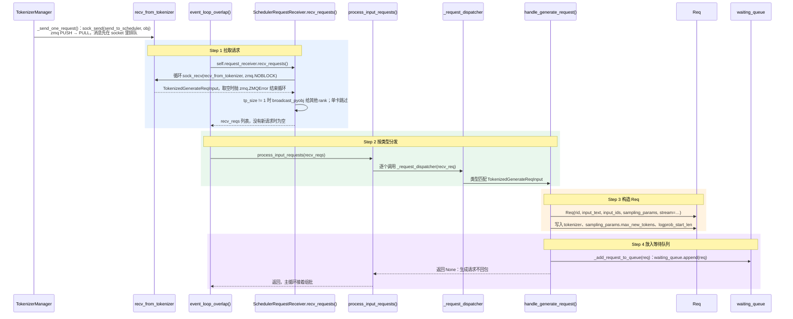

# 收请求：请求怎样变成 Req 进入等待队列

> **调度器(Scheduler)每轮循环先把新到的请求一次收完、按类型分发；生成请求被包装成 `Req`，追加到等待队列(Waiting Queue)，等组批时再挑。**

## 1. 在核心链路中的位置

- Scheduler 默认主循环 [`event_loop_overlap`](scheduler.py#L1824) 每轮四步：Step 1 收请求 → Step 2 组批 → Step 3 执行 → Step 4 处理结果；本文讲 [Step 1 收请求](scheduler.py#L1849)。总览见 [核心组件四：Scheduler](../../../../user_guide_zh/核心组件四：Scheduler.md)。
- 上游：TokenizerManager 分词后，[`_send_one_request`](tokenizer_manager.py#L1700) 把 [`TokenizedGenerateReqInput`](io_struct.py#L979) 经 zmq 发给 Scheduler，消息先在 `recv_from_tokenizer` 里排队。
- 下游：本步只把请求放进 `waiting_queue`，不分配显存、不碰 GPU；同一轮 Step 2 组批时它就可能被挑中。
- 例子：用户问“你数三个数字”，分词为 `[你, 数, 三个, 数字]`（示意，4 个 token）；本步结束时它只是队列里一个没有输出的 `Req`，“1，2，3”要等后续组批、执行后才逐个生成。

## 2. 浅层时序图(Sequence Diagram)

只画单卡默认路径：不开流水线并行(Pipeline Parallelism，PP)、PD 分离(Prefill-Decode Disaggregation)和推测解码(Speculative Decoding)。图中 Step 1–4 是“收请求”内部的四小步，不是主循环的四步。

- **Step 1 拉取请求**：主循环调 [`recv_requests`](scheduler_components/request_receiver.py#L76)，把 socket 里已到的请求一次取完。
  - 对齐代码：[`self.request_receiver`](scheduler.py#L2110) 是 [`SchedulerRequestReceiver`](scheduler_components/request_receiver.py#L49)；[`_pull_raw_reqs`](scheduler_components/request_receiver.py#L105) 循环 [`sock_recv(..., zmq.NOBLOCK)`](scheduler_components/request_receiver.py#L123)，再同样收 `recv_from_rpc`；张量并行(Tensor Parallelism，TP)多卡时由 [`broadcast_pyobj`](scheduler_components/request_receiver.py#L211) 广播(Broadcast)给其他 rank。
  - 重点核对：非阻塞(Non-blocking)，没有新请求就返回空列表，主循环照常推进运行中的请求；每轮最多收 `max_recv_per_poll` 条（`SGLANG_SCHEDULER_MAX_RECV_PER_POLL`，默认 -1 不限）。本例 `recv_reqs` 含一条 `TokenizedGenerateReqInput`。
  - 重点核对：只有 rank 0（`pp_rank`、`attn_tp_rank`、`attn_cp_rank` 均为 0 的进程）持有真实 socket，见 [`init_ipc_channels`](scheduler.py#L766) → [`SchedulerIpcChannels.create`](scheduler_components/ipc_channels.py#L25)；其他 rank 靠广播拿到同一批请求，各卡才能组出相同的批次。
  - 省略：`recv_skipper`、`input_blocker`、Rust 服务端环形缓冲、PP 后级从前一级接收、DP 注意力(Data Parallel Attention)拆分工作 / 控制请求、多模态共享内存特征。
- **Step 2 按类型分发**：[`process_input_requests`](scheduler.py#L1963) 逐条调用 [`_request_dispatcher`](scheduler.py#L1988)，按请求类型找处理方法。
  - 对齐代码：分发器(Dispatcher)由 [`init_request_dispatcher`](scheduler.py#L1595) 建成“类型 → 处理方法”表，其中 [`TokenizedGenerateReqInput` 对应 `handle_generate_request`](scheduler.py#L1599)；[`TypeBasedDispatcher.__call__`](../../utils.py#L631) 先精确匹配类型，再按注册顺序用 `isinstance` 匹配。
  - 重点核对：表里其余类型有批量生成、嵌入（含批量）请求，以及控制请求：abort 与会话、清缓存与分层缓存(Hierarchical Cache，HiCache)、权重与 LoRA 更新、暂停 / 继续、profile、RPC、关机、日志配置等。
  - 重点核对：返回值决定回不回包。生成请求返回 `None`，不回包；控制请求的返回值经 [`send_to_tokenizer`](scheduler.py#L1999) 直接发回 TokenizerManager，不经 Detokenizer。
  - 省略：服务忙时跳过健康检查请求；CUDA VMM 多模态输入整理；会话过期清理；RPC 与 Rust 服务端的回包分支。
- **Step 3 构造 Req**：[`handle_generate_request`](scheduler.py#L2511) 用 `recv_req` 的字段执行 [`req = Req(...)`](scheduler.py#L2546)，得到 Scheduler 内部跟踪请求的 [`Req`](schedule_batch.py#L827) 对象。
  - 对齐代码：随后 [`req.tokenizer = self.tokenizer`](scheduler.py#L2590)（之后判断结束符要用）；[`init_req_max_new_tokens`](scheduler.py#L2314) 按上下文长度和 KV 缓存(KV Cache)容量收紧 `max_new_tokens`；[`validate_input_length`](utils.py#L206) 检查输入长度；最后设置 `logprob_start_len`。
  - 重点核对：`origin_input_ids` 直接取自 `input_ids`，`output_ids` 为空，显存相关字段还是空值（见第 3 节）。长度等校验失败时不直接报错，而是 `set_finish_with_abort` 后照常入队，由后续流程统一回包。
  - 省略：会话分支（radix 原生会话、传统会话、会话不存在）、束搜索(Beam Search)、PD 分离的 bootstrap 检查、DFLASH / DSPARK 校验、`return_sampling_mask` 限制、多模态 token 展开与填充、routed experts 校验。
- **Step 4 放入等待队列**：[`process_req_with_grammar`](scheduler.py#L2841) 返回 `False` 时，[`_add_request_to_queue`](scheduler.py#L2902) 执行 [`self.waiting_queue.append(req)`](scheduler.py#L2910)。
  - 对齐代码：入队前校验优先级、检查队列上限（`max_queued_requests` 默认不限）、开 HiCache 存储后端时预取 KV；入队后记录入队时间。
  - 重点核对：[`waiting_queue`](scheduler.py#L1181) 是普通列表 `List[Req]`；本步不回包，生成结果要等主循环“处理结果”那一步再发出。
  - 省略：带 `json_schema`、`regex` 等约束且语法还没编译好时，先进语法队列，编好后才入队；PD 分离模式改入 bootstrap / prealloc 队列。

## 3. Req 的关键字段

“入队时”是本步结束时的值；后面的值在组批、执行、处理结果时才写入。

| 字段 | 含义 | 在本例中的值 |
|---|---|---|
| [`rid`](schedule_batch.py#L878) | 请求 ID(Request ID，rid)，各组件按它对齐同一请求 | 未指定时由 `uuid.uuid4().hex` 生成，32 位十六进制串 |
| [`origin_input_ids`](schedule_batch.py#L879) | 输入 token ID，取自 `recv_req.input_ids` | `[你, 数, 三个, 数字]` 的 ID（示意） |
| [`output_ids`](schedule_batch.py#L889) | 已生成的 token ID，只追加 | 入队时为空；结束时为 `[1, ，, 2, ，, 3, <eos>]`（示意） |
| [`full_untruncated_fill_ids`](schedule_batch.py#L893) | 完整序列：输入 + 已生成输出，组批时刷新 | 入队时为空；组批时填成 4 个输入 token |
| [`extend_range`](schedule_batch.py#L894) | 本轮要计算的 token 区间 `Range(start, end)` | 入队时 `None`；组批时若没命中前缀缓存(Prefix Cache)，设为 `Range(0, 4)` |
| [`kv_committed_len`](schedule_batch.py#L906) | 已写入 KV 缓存的 token 数 | 入队时 0；准备预填充(Prefill)时设为 4，之后每轮解码(Decode)加 1 |
| [`sampling_params`](schedule_batch.py#L939) | 采样参数：`temperature`、`top_p`、`max_new_tokens`、`stop` 等 | `max_new_tokens` 已在 Step 3 收紧；本例 6 个 token 就遇到 `<eos>`，用不满 |
| [`req_pool_idx`](schedule_batch.py#L958) | 在 `ReqToTokenPool`（每个请求一行，记录各 token 的 KV 位置）中的行号 | 入队时 `None`；组批时分配 |
| [`finished_reason`](schedule_batch.py#L979) | 结束原因，`None` 表示未结束 | 入队时 `None`；生成 `<eos>` 后为 [`FINISH_MATCHED_TOKEN`](schedule_batch.py#L241) |
| [`stream`](schedule_batch.py#L988) | 是否流式返回 | 本例设为 `True`：“1”“，”“2”… 逐段返回 |
| [`prefix_indices`](schedule_batch.py#L1016) | 命中前缀缓存的那部分 KV 下标 | 入队时为空张量；首次请求无命中，仍为空 |

- 没有 `req.extend_input_len` 字段：本轮算多少 token 在组批时才定，写进 `extend_range`（见 [`set_extend_range`](schedule_batch.py#L1296)）。

## 术语与生词

| 术语或单词 | 中文释义 | 简明英文释义 |
|---|---|---|
| Scheduler /ˈskedʒuːlər/ | 调度器：排队、组批、安排 GPU 执行的独立进程 | The process that queues requests, forms batches and drives GPU runs. |
| Dispatcher /dɪˈspætʃər/ | 分发器：按消息类型交给对应的处理方法 | A component that routes each message to its handler by type. |
| Non-blocking /ˌnɑːnˈblɑːkɪŋ/ | 非阻塞：没有数据时立即返回，不原地等待 | Returning at once when no data is ready, instead of waiting. |
| Broadcast /ˈbrɔːdkæst/ | 广播：一个进程把同一份数据发给组内所有进程 | Sending the same data from one process to all others in a group. |
| Waiting Queue /ˈweɪtɪŋ kjuː/ | 等待队列：已收到、还没进入批次的请求 | Received requests not yet placed into a batch. |
| TP（Tensor Parallelism） | 张量并行：每层权重切到多张 GPU；每张卡一个进程，编号叫 rank | Splitting each layer's weights across GPUs, one process (rank) per GPU. |
