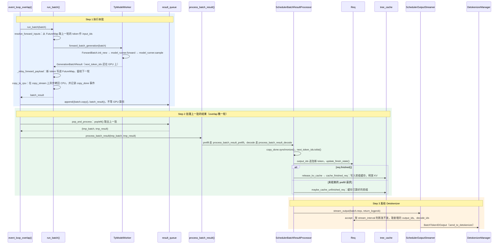

# 执行与处理结果：调用模型、判断结束、发给 Detokenizer

> **`run_batch` 让 GPU 算出每个请求的下一个 token；`process_batch_result` 把它追加到请求里、判断是否结束，再打包发给 DetokenizerManager。**

## 1. 在核心链路中的位置

- Scheduler 主循环 `event_loop_overlap` 每轮四步：Step 1 收请求 → Step 2 组批 → Step 3 执行 → Step 4 处理结果；本文讲后两步，全貌见[核心组件四：Scheduler](../../../../user_guide_zh/核心组件四：Scheduler.md)。
- Step 3 执行：[`run_batch`](scheduler.py#L3870) 把组好的 `ScheduleBatch` 交给 TpModelWorker，做一次前向(Forward)并采样(Sampling)，得到 `GenerationBatchResult`。
- Step 4 处理结果：[`process_batch_result`](scheduler.py#L4212) 更新每个请求、判断是否结束，把新 token 打包成 `BatchTokenIDOutput`，发给下游的[核心组件三：DetokenizerManager](../../../../user_guide_zh/核心组件三：DetokenizerManager.md)。
- 默认开启重叠调度(Overlap Scheduling)：Step 4 处理的是上一轮那批的结果，CPU 处理结果时，GPU 已经在算本批。

## 2. 浅层时序图(Sequence Diagram)

蓝、绿、橙三段是图内的 Step 1–3：Step 1 对应主循环的 Step 3，Step 2、3 对应主循环的 Step 4；只画默认的 overlap、非推测解码(Speculative Decoding)路径。

- **Step 1 执行本批**：主循环的 [Step 3](scheduler.py#L1883) 调 [`run_batch`](scheduler.py#L3870)，把 `batch.copy()` 和结果放进 `result_queue` 就往下走，不等 GPU 算完。
  - 取输入：[`resolve_forward_inputs`](overlap_utils.py#L87) 准备 `input_ids`。预填充(Prefill)批把 CPU 上暂存的输入 token 拷到 GPU；解码(Decode)批从[未来映射表(FutureMap)](overlap_utils.py#L248)按请求槽位取上一轮采样出的 token，CPU 不用等它拷回来。
  - 前向和采样：[`forward_batch_generation`](tp_worker.py#L595) 依次调用 [`ForwardBatch.init_new`](tp_worker.py#L610)、[`model_runner.forward`](tp_worker.py#L630)（得到对数几率(Logits)）、[`model_runner.sample`](tp_worker.py#L674)（得到 `next_token_ids`）。没有推测解码时，`model_worker` 就是 `tp_worker`。
  - 接力给下一轮：[`_relay_forward_payload`](scheduler.py#L4121) 把 `next_token_ids` 写进 FutureMap；`future_map.publish` 记下新长度 `seq_lens + 1`。
  - 拷回 CPU：[`copy_to_cpu`](scheduler.py#L3985) 在单独的 CUDA 流(CUDA Stream) `copy_stream` 上做设备到主机拷贝(Device to Host，D2H)，和下一轮前向并行；随后记录 `copy_done` 事件，等它完成才能读 `next_token_ids`。
  - 入队：先 [`_apply_war_barrier`](scheduler.py#L1888)，让调度流上之后的写操作等本次前向读完；`batch.copy()` 只留处理结果要用的字段，因为原 batch 下一轮组批时还会被改。
  - 核对 [`GenerationBatchResult`](utils.py#L45)：`logits_output`、`next_token_ids`、`copy_done`、`delay_sample_func`。
  - 例：第 1 轮 prefill 一次算完「你数三个数字」，采样出 `1`；之后每轮 decode 以上一个 token 为输入，依次得到 `，`、`2`、`，`、`3` 和序列结束符(End of Sequence，EOS)。
  - 省略：非 overlap 路径在 [L4036](scheduler.py#L4036) 调用同一个方法，结果不异步拷回；推测解码、PD 分离、pdmux 拆分 prefill、嵌入和奖励模型、弹性 EP、scripted hook 等分支。
  - 省略：带 grammar（结构化输出）或开启 `SGLANG_ENABLE_DELAY_SAMPLE` 时延迟采样：[前向完先返回](tp_worker.py#L651)，等上一批处理完，再由 [`launch_batch_sample_if_needed`](scheduler.py#L4174) 采样。
- **Step 2 处理上一批的结果（overlap 晚一轮）**：主循环的 [Step 4](scheduler.py#L1894) 用 [`pop_and_process`](scheduler.py#L1838) 从 `result_queue` 取出上一批，交给 [`process_batch_result`](scheduler.py#L4212)，再按批次类型分给 [`SchedulerBatchResultProcessor`](scheduler_components/batch_result_processor.py#L79)。
  - prefill：[`process_batch_result_prefill`](scheduler_components/batch_result_processor.py#L240) 先 `copy_done.synchronize()` 等拷贝完成；每个请求 [`output_ids.append`](scheduler_components/batch_result_processor.py#L327) 第一个生成的 token，再 [`update_finish_state`](scheduler_components/batch_result_processor.py#L331)。
  - prefill 收尾：结束的请求 [`release_kv_cache`](scheduler_components/batch_result_processor.py#L335)；没结束的由 [`maybe_cache_unfinished_req`](scheduler_components/batch_result_processor.py#L338) 把已算好的前缀放进前缀缓存(Prefix Cache) `tree_cache`，供别的请求复用。
  - decode：[`process_batch_result_decode`](scheduler_components/batch_result_processor.py#L870) 同样先同步；每个请求 [`output_ids.extend`](scheduler_components/batch_result_processor.py#L949)（非推测解码时 1 个 token），再 [`update_finish_state`](scheduler_components/batch_result_processor.py#L954)；结束的在 [`_handle_finish_state_updated_req`](scheduler_components/batch_result_processor.py#L1105) 里 `release_kv_cache`。
  - 核对：overlap 下，已结束或被退回(Retract)的请求还会多出一轮结果，[直接跳过](scheduler_components/batch_result_processor.py#L937)；为它多分配的 KV 在 `release_kv_cache` 里一起释放。
  - 例：第 2 轮 GPU 在算 `1` 后面的 token 时，CPU 才把 `1` 追加进 `req.output_ids`。
  - 省略：[`is_disable_overlap_for_batch`](scheduler.py#L1914) 为真时（如开启 `SGLANG_DISABLE_CONSECUTIVE_PREFILL_OVERLAP` 后连续两个 prefill），[先处理上一批](scheduler.py#L1872)再执行本批；idle 批、PD 分离的 prefill、dLLM、logprob、hidden states、grammar、指标上报。
- **Step 3 发给 Detokenizer**：prefill 和 decode 处理完都调 [`stream_output`](scheduler_components/output_streamer.py#L118)，由 [`_stream_output_generation`](scheduler_components/output_streamer.py#L146) 挑出要发的请求，组成 `BatchTokenIDOutput`，经 [`send_to_detokenizer`](scheduler_components/output_streamer.py#L217) 发出。
  - 发不发：[`accept`](scheduler_components/output_streamer.py#L420) 判断。请求结束必发一次；流式请求按流式间隔(Stream Interval)发，默认 1，即每个 token 都发，末尾可能是停止字符串的开头时先不发；非流式请求每 50 个 token 发一次（`SGLANG_FORCE_STREAM_INTERVAL`）。
  - 发什么：`output_ids` 只放上次发送之后的新 token；`decode_ids` 来自 [`init_incremental_detokenize`](schedule_batch.py#L1450)，第一次带上输入末尾最多 5 个 token 作解码上下文，之后只放新增部分。
  - 核对 [`to_payload`](scheduler_components/output_streamer.py#L692)：`rids`、`finished_reasons`（未结束为 `None`）、`decode_ids`、`read_offsets`、`output_ids`，按下标一一对应。
  - 例：第 2 轮发出 `1`，之后每轮发一个新 token；第 7 轮处理 EOS 时发出最后一条，`finished_reasons` 不再是 `None`。
  - 省略：已发过结束消息的请求[不再重复发](scheduler_components/output_streamer.py#L183)；嵌入模型走 `_stream_output_embedding`；Rust 服务模式改用 `rust_server.push_generation`；logprob 等附加字段。

## 3. normal 和 overlap 的区别

| 主循环 | 何时处理结果 | GPU 是否等 CPU | 代价 |
|---|---|---|---|
| [`event_loop_normal`](scheduler.py#L1789) | 本轮 `run_batch` 之后马上处理 | 等：CPU 处理结果、组下一批时 GPU 空闲 | GPU 有空闲时间，吞吐较低 |
| [`event_loop_overlap`](scheduler.py#L1824)（默认） | 下一轮下发新批之后才处理 | 基本不等：CPU 处理上一批时 GPU 在算本批 | 结果晚一轮；结束的请求多算一步；要靠 FutureMap、copy_stream 等配合 |

例：「你数三个数字」在 overlap 下每轮做什么（假设只有这一个请求）：

| 轮次 | 执行本批（GPU） | 处理上一批（CPU） |
|---|---|---|
| 1 | prefill：一次算完输入，采样出 `1` | 无 |
| 2 | decode：输入 `1`，采样出 `，` | 追加 `1`，发给 Detokenizer |
| 3–5 | decode：依次采样出 `2`、`，`、`3` | 依次追加 `，`、`2`、`，` |
| 6 | decode：输入 `3`，采样出 EOS | 追加 `3` |
| 7 | decode：输入 EOS，多算一步 | 追加 EOS，判定结束，释放 KV |
| 8 | 请求已移出 `running_batch`，没有批次 | 第 7 轮的结果属于已结束的请求，跳过 |

normal 模式下，第 6 轮采样出 EOS 后当轮就判定结束，不会多算第 7 轮。

## 4. 结束判断

每次追加 token 后，[`Req.update_finish_state`](schedule_batch.py#L1654) 依次检查下面三类条件，命中就写入 `req.finished_reason`（中止、非法 token、grammar 终止等检查略过）：

- **停止字符串或正则**：[`_check_str_based_finish`](schedule_batch.py#L1570) 把末尾几个 token 解码成文本，匹配 `stop_strs` 或 `stop_regex_strs`，原因记为 `FINISH_MATCHED_STR` 或 `FINISHED_MATCHED_REGEX`。
- **停止 token 或 EOS**：[`_check_token_based_finish`](schedule_batch.py#L1518) 看新 token 是否在 `stop_token_ids` 或模型的 EOS 列表里，原因记为 `FINISH_MATCHED_TOKEN`；`ignore_eos=True` 时跳过。例子里第 6 个 token 是 EOS，在这里结束。
- **最大长度**：[`len(output_ids) >= max_new_tokens`](schedule_batch.py#L1685) 时结束，原因记为 `FINISH_LENGTH`。

结束之后：[`release_kv_cache`](../mem_cache/common.py#L202) 调 [`tree_cache.cache_finished_req`](../mem_cache/common.py#L219)，把输入加输出的 KV 写入前缀缓存、释放重复部分，再释放多分配的 KV 和请求槽位；同一次处理最后由 `stream_output` 发出带 `finished_reasons` 的消息，下一轮组批时 `filter_batch` 把请求移出 `running_batch`。

## 术语与生词

| 术语或单词 | 中文释义 | 简明英文释义 |
|---|---|---|
| Overlap /ˈoʊvərlæp/ Scheduling | 重叠调度：GPU 算本批时，CPU 同时处理上一批的结果 | Handling the last batch's results on the CPU while the GPU runs the current batch. |
| FutureMap | 未来映射表：GPU 上按请求槽位存上一轮采样出的 token，下一轮前向直接读取 | A GPU buffer that relays each request's sampled token to the next forward pass. |
| Logits /ˈloʊdʒɪts/ | 对数几率：模型给词表里每个 token 的原始打分，采样前的输出 | Raw scores over the vocabulary, produced before sampling. |
| CUDA Stream（CUDA — Compute Unified Device Architecture） | CUDA 流：GPU 上按顺序执行的任务队列，不同流之间可以并行 | An ordered queue of GPU work; different streams can run concurrently. |
| D2H — Device to Host | 设备到主机拷贝：把 GPU 显存里的数据拷回 CPU 内存 | Copying data from GPU memory back to CPU memory. |
| EOS — End of Sequence | 序列结束符：模型生成它表示回答结束 | A special token that marks the end of generation. |
| Stream Interval /ˈɪntərvl/ | 流式间隔：每生成多少个 token 向下游发一次结果 | How many tokens are generated between two streamed outputs. |
