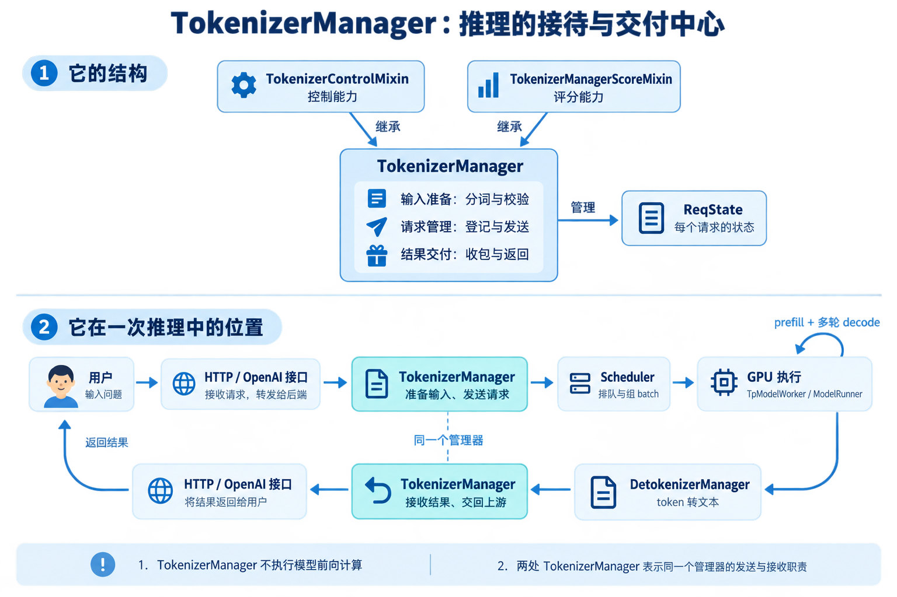
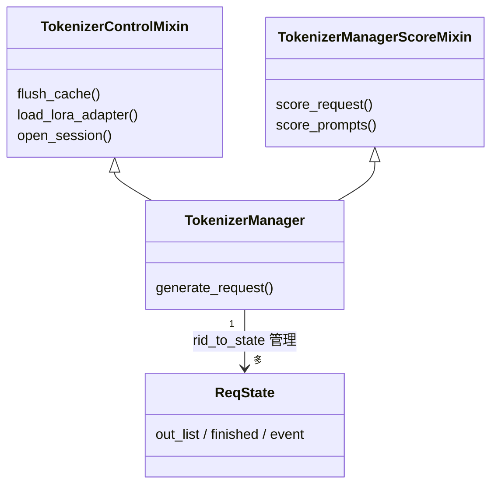
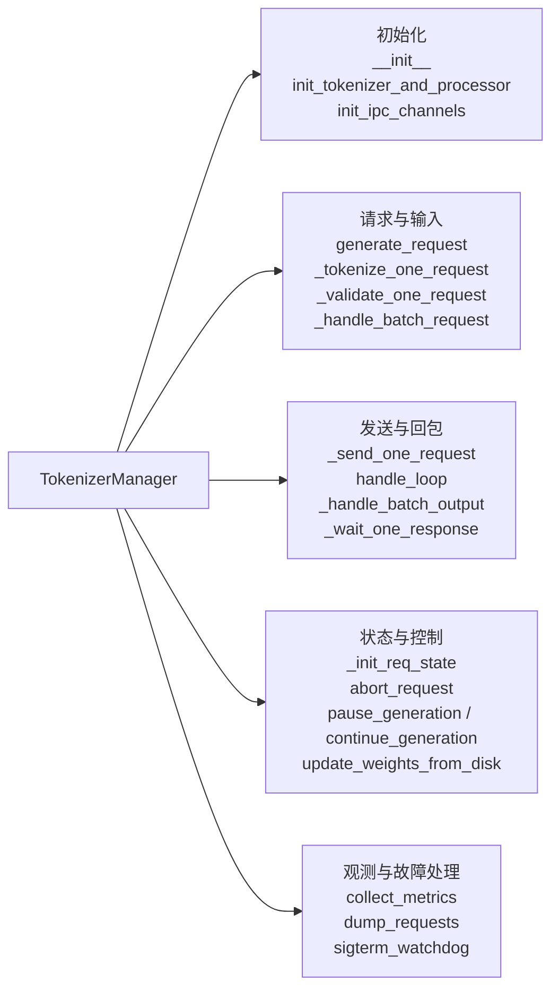
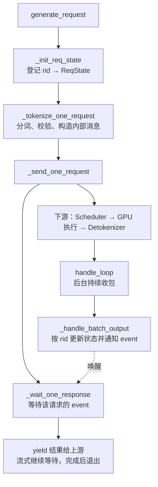

# TokenizerManager 类说明

负责输入准备、请求状态和异步回包；GPU 调度与前向计算在下游。以下只列主要方法。

## 1. 继承结构

Mixin 是提供一组能力的父类；TokenizerManager 通过多继承获得控制与评分方法。

## 2. 本类主要方法分组

下图表示职责归属，不表示调用顺序。

## 3. 核心协作：发送与收包分开运行

请求登记后用 rid 对齐回包；ReqState 是状态对象，不是父类。完整生成通常包含 prefill 和多轮 decode。
