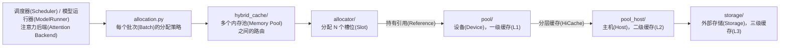

# `mem_cache/`

该目录包含负责管理键值缓存(Key/Value Cache, KV Cache)和状态空间模型(State Space Model, SSM)状态内存的实现：由谁分配槽位(Slot)、由谁在设备(Device)上存放实际数据、由谁将数据镜像到主机(Host)和磁盘，以及由哪个基数树缓存(Radix Cache)决定保留哪些缓存。目录布局见 [#25371](https://github.com/sgl-project/sglang/issues/25371)。

## 分层(Layers)

| 层(Layer) | 关注内容 | 输入(Input) → 输出(Output) |
|---|---|---|
| `allocation.py` | 每个批次(Batch)的分配策略(Allocation Policy) | `batch` → `out_cache_loc` |
| `hybrid_cache/` | 根据模型层，在多个内存池(Memory Pool)之间路由 | `layer_id` → 内存池(Pool) |
| `allocator/` | 哪些槽位(Slot)空闲 | `need_size` → `indices`，即槽位索引(Indices) |
| `pool/` | KV / SSM 状态的物理布局(Physical Layout) | `(layer_id, indices)` ↔ 张量(Tensor) |
| `pool_host/` | 主机镜像(Host Mirror)，以及主机到设备(Host-to-Device, H2D)和设备到主机(Device-to-Host, D2H)的数据传输 | `device_indices` ↔ `host_indices` |
| `storage/` | 三级缓存后端(L3 Backend)，如文件、NIXL、HF3FS、Mooncake 等 | 哈希值(Hash) → 字节数据(Bytes) |
| 基数树缓存(Radix Cache) | 保留哪些缓存、淘汰哪些缓存 | 词元前缀(Token Prefix) → 树节点(Node) |

另外两组实现位于上述分层之外：

- **基数树缓存(Radix Cache)** 是独立的一条管理维度。针对不同模型的变体，如 `radix_cache.py`、`swa_radix_cache.py`、`mamba_radix_cache.py`、`hiradix_cache.py` 和 `chunk_cache.py`，正在向**统一基数树缓存(Unified Radix Cache)**收敛。实现位于 `unified_cache/`，相关讨论见 [#20415](https://github.com/sgl-project/sglang/issues/20415)。其全注意力(Full Attention)、滑动窗口注意力(Sliding Window Attention, SWA)和 Mamba 的组件模型(Component Model)，见 [`unified_cache/components/README.md`](unified_cache/components/README.md)。
- **构造(Construction)** 逻辑贯穿各层：`kv_cache_configurator.py`、`kv_cache_builder.py`、`cache_init_params.py`、`allocation_sizing.py`、`kv_cache_dtype.py`、`kv_vmm_backing.py` 和 `hybrid_cache/hybrid_pool_assembler.py` 负责确定形状(Shape)，并构建上述对象。

## 类(Class)应该放在哪？

根据基类(Base Class)确定归属，不根据类名确定：

| 继承的基类(Base Class) | 所属位置 |
|---|---|
| `BaseTokenToKVPoolAllocator` | `allocator/<family>.py` |
| `KVCache`, `BaseSWAKVPool`, `ReqToTokenPool`, `MambaPool` | `pool/<family>.py` |
| `HostKVCache` | `pool_host/<family>.py` |
| `HiCacheStorage` | `storage/<backend>/` |
| `BasePrefixCache` | `mem_cache/` 根目录下的一个模块(Module) |

`<family>` 表示注意力(Attention)或状态类别(State Family)，例如 `mha`、`mla`、`dsa`、`mamba`、`swa`、`hisparse` 和 `deepseek_v4`。现有类别新增量化(Quantization)或布局(Layout)变体时，应在该类别的模块(Module)中新增文件，而不是在一个包罗所有类别的模块中新增类。

分配器(Allocator)有两种不同含义，分别放在不同目录中：

- **槽位分配器(Slot Allocator)**：`BaseTokenToKVPoolAllocator` 的子类(Subclass)，负责分配 KV 槽位(Slot)，位于 `allocator/`。
- **主机张量分配器(Host Tensor Allocator)**：`HostTensorAllocator` 及其子类(Subclass)，负责分配主机锁页内存(Pinned Host Memory)，位于 `pool_host/common.py` 和 `storage/`。

## 约定(Conventions)

- **名称应去掉没有区分作用的词缀(Affix)。** 如果一个目录中的所有文件都承担目录名称已经表明的职责，重复的词缀就没有意义：使用 `pool_host/mha.py`，而不是 `pool_host/mha_pool_host.py`。只有同目录中的文件职责不同时，才保留表示职责的词缀。
- **一个类别(Family)对应一个模块(Module)，模块可以组织为包(Package)。** 默认每个类别使用一个文件；超过约 1500 行时，将该类别组织为包。
- **各层不向上导入(Import)。** `pool/` 和 `pool_host/` 不得导入 `allocator/`、`hybrid_cache/` 或 `allocation.py`；`allocator/` 可以持有它负责分配槽位的内存池(Pool)，内存池不得反向持有分配器(Allocator)。`allocator/`、`pool/` 和 `pool_host/` 这三层都不得导入构造层(Construction Layer)。
