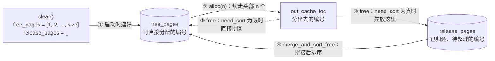
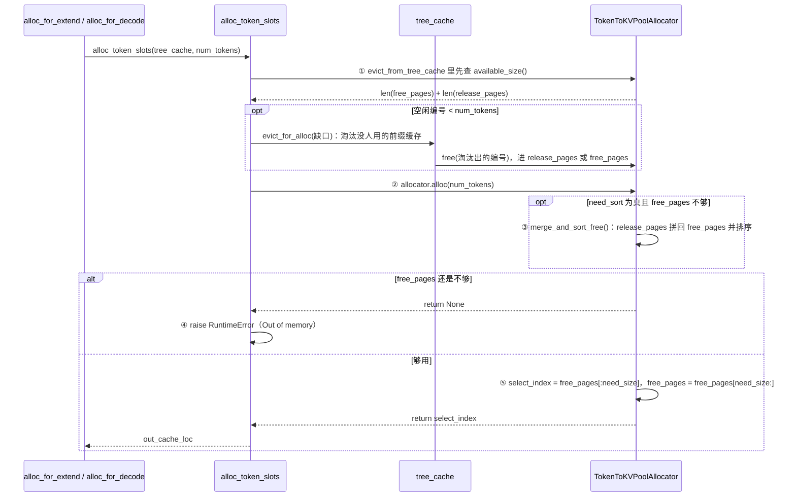

# BaseTokenToKVPoolAllocator：KV 编号分配器

> 只管 KV（Key-Value）编号的分配和归还，不存 K/V 本身；默认实现是 `token.py` 的 `TokenToKVPoolAllocator`（`page_size = 1`，一个编号对应一个 token）。下文路径相对 `python/sglang/srt/mem_cache/`

## 1. 内存结构



```text
启动        free_pages = [1, 2, 3, 4, 5, 6]          release_pages = []
alloc(3)    返回 [1, 2, 3]，free_pages = [4, 5, 6]
free([3, 1])（need_sort 为真）                       release_pages = [3, 1]
alloc(4)    free_pages 只有 3 个，先 merge_and_sort_free：
            free_pages = sort(cat([4, 5, 6], [3, 1])) = [1, 3, 4, 5, 6]，release_pages = []
            再返回 [1, 3, 4, 5]，free_pages = [6]
```

- `free_pages`、`release_pages` 都是 GPU 上的 int64 一维张量，空闲编号 = 两者之和：`available_size()` 返回 `(len(free_pages) + len(release_pages)) * page_size`。
- 0 号保留：`clear()` 里 `torch.arange(1, self.size + 1)`，0 号给补齐出来的空 token 写占位输出。
- `need_sort` 只在 PD 分离时为真（`kv_cache_configurator.py` 里 `need_sort=get_disagg().disaggregation_mode in ("decode", "prefill")`）；不分离时归还的编号直接拼回 `free_pages`，`release_pages` 一直为空。
- `merge_and_sort_free()`：`free_pages = torch.cat((free_pages, release_pages))` → `torch.sort(...)` → 清空 `release_pages`，排序后分出去的编号更连续。

## 2. 核心字段

| 字段 | 含义 |
|---|---|
| `size` | KV 编号总数，即启动时算出的 `max_total_num_tokens` |
| `page_size` | 一页几个 token，是分配的最小单位；`TokenToKVPoolAllocator` 固定为 1，分页实现里 `free_pages` 存的是页号 |
| `dtype` / `device` | KV Cache 的数据类型（如 bf16、fp8）；编号张量所在的卡 |
| `_kvcache` | 真正存 K/V 的 `token_to_kv_pool`（如 `MHATokenToKVPool`），`get_kvcache()` 取出 |
| `need_sort` | 归还的编号是否先进 `release_pages`、用时再排序合并 |
| `free_pages` | 可直接分配的空闲编号，`alloc` 从头部切走 |
| `release_pages` | 已归还、还没合并排序的编号，只在 `need_sort` 为真时使用 |
| `free_group` | `None` 时 `free` 立即归还；`free_group_begin()` 后先攒进列表，`free_group_end()` 一次 `torch.cat` 后归还 |

## 3. alloc 时序图



```python
# allocation.py：alloc_token_slots(tree_cache, num_tokens)，组批时由 alloc_for_extend / alloc_for_decode 调用
evict_from_tree_cache(tree_cache, num_tokens)          # ① 空闲编号不够时，先淘汰前缀缓存，编号经 free() 归还
out_cache_loc = allocator.alloc(num_tokens)            # ② 分配
if out_cache_loc is None: raise RuntimeError(...)      # ④ 还是不够：Out of memory

# allocator/token.py：TokenToKVPoolAllocator.alloc(need_size)
if self.need_sort and need_size > len(self.free_pages):
    self.merge_and_sort_free()                         # ③ 定义在 base.py，release_pages 拼回 free_pages 并排序
if need_size > len(self.free_pages):
    return None
select_index = self.free_pages[:need_size]             # ⑤ 从头部切走 need_size 个，就是 out_cache_loc
self.free_pages = self.free_pages[need_size:]
return select_index
```

## 术语与生词

| 术语或单词 | 中文释义 | 简明英文释义 |
|---|---|---|
| Allocator /ˈæləkeɪtər/ | 分配器：管理空闲编号的分配和归还 | Hands out and takes back free indices. |
| Evict /ɪˈvɪkt/ | 淘汰：把前缀缓存里没人用的 KV 编号收回 | Reclaim unused cached KV indices. |
| Page /peɪdʒ/ | 页：一次分配的最小单位，包含若干 token | The smallest allocation unit, holding some tokens. |
