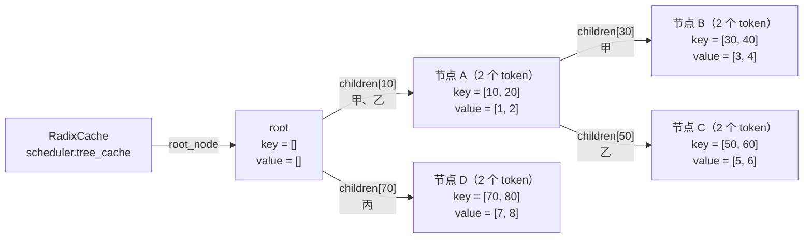
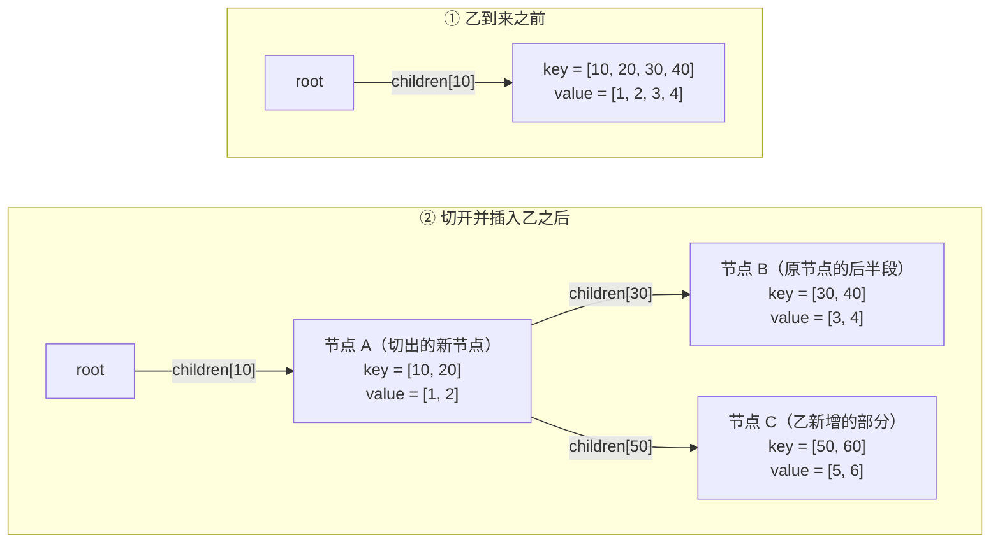
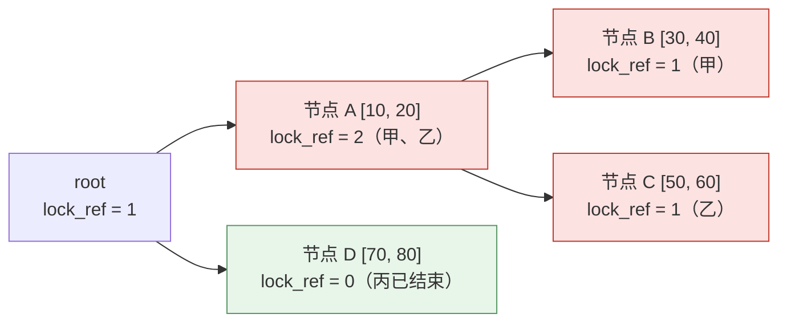

# TreeNode：前缀 KV（Key-Value）缓存树上的一个节点

调度器上的 `tree_cache` 默认是一个 `RadixCache`，里面只有一棵基数树（Radix Tree），根是 `root_node`。`TreeNode` 是这棵树上的一个节点，**保存一段连续的 token 和这些 token 的 KV 编号**。下文代码都在 `python/sglang/srt/mem_cache/radix_cache.py`。

## 1. 一个节点存一段 token

- 普通前缀树（Trie）一个节点只存 1 个 token；基数树把中间没有分叉的一串 token 压进同一个节点，所以一个节点可以存多个 token。
- `key` 是这段 token id（`RadixKey`）；`value` 是同样长度的 KV 编号张量，`key[i]` 这个 token 的 K/V 存在 `value[i]` 号位置。
- `len(node.key)` 只是本节点这一段的长度；从根走到某个节点，把路上各段 `key` 拼起来，才是一条完整前缀。
- `children` 是字典，键是子节点那段的第一个 token（`page_size > 1` 时是第一页 token 组成的元组，见 `RadixKey.child_key()`）；`parent` 指回父节点；根的 `key`、`value` 都为空。

例子：下面三条请求的 KV 都写进同一个 `RadixCache`。甲、乙开头都是 `10, 20`，共用节点 A 和 KV 编号 `[1, 2]`，从第 3 个 token 分叉；丙开头是 `70`，成为根的另一个子节点。

```text
甲  token [10, 20, 30, 40]    KV 编号 [1, 2, 3, 4]
乙  token [10, 20, 50, 60]    KV 编号 [1, 2, 5, 6]
丙  token [70, 80]            KV 编号 [7, 8]
```



- 甲的完整前缀是 A 的 `[10, 20]` 加 B 的 `[30, 40]`，共 4 个 token，但 `len(B.key)` 只有 2。
- 新请求调用 `match_prefix()` 时从根往下逐段比对，返回命中部分拼起来的 KV 编号（存到 `req.prefix_indices`）和走到的最深节点（存到 `req.last_node`）。

## 2. 节点分裂：新请求在一段中间分叉

假设起初只有甲，树里只有一个节点存 `[10, 20, 30, 40]`。乙 `[10, 20, 50, 60]` 只和它的前 2 个 token 相同，这个节点就要切成两段。



- 切分由 `_split_node(key, child, split_len)` 完成：新节点拿走前 `split_len` 个 token（`new_node.key = child.key[:split_len]`），原节点只留后半段（`child.key = child.key[split_len:]`），新节点复制原节点的 `lock_ref`、`hit_count`。
- 乙到达时，`match_prefix()` 发现只匹配到节点的一部分（`_match_prefix_helper()` 里 `prefix_len < len(child.key)`）就先切开；乙命中 `[10, 20]`，直接复用 KV 编号 `[1, 2]`。
- 乙的 KV 写回树时（`cache_finished_req()` / `cache_unfinished_req()` 调 `insert()`），只为 `[50, 60]` 新建节点 C 挂到 A 下；`[5, 6]` 是乙 prefill 时新分配的 KV 编号。

## 3. 核心字段

| 字段 | 含义 | 在哪读写 |
| --- | --- | --- |
| `key` / `value` | 本节点这段 token id / 同长度的 KV 编号；`value is None` 表示这段 KV 已从显存淘汰（`evicted` 属性） | `_insert_helper()` 创建，`_split_node()` 切分，`evict()` 释放 |
| `children` / `parent` | 子节点字典（键是子节点首 token 或首页）/ 父节点 | 匹配、插入时往下走；`inc_lock_ref()`、`dec_lock_ref()` 沿 `parent` 往上走 |
| `lock_ref` | 正在使用这个节点的请求数，大于 0 时不会被淘汰；根在初始化时设为 1，永不淘汰 | `inc_lock_ref()` / `dec_lock_ref()` |
| `last_access_time` | 最近一次被匹配或插入经过的时间 | 默认的 LRU（Least Recently Used）淘汰策略按它排序 |
| `hit_count` | `insert()` 经过本节点的次数（分块请求的后续块不计） | LFU（Least Frequently Used）、SLRU（Segmented Least Recently Used）淘汰策略读取；HiCache（Hierarchical Cache）达到 `write_through_threshold` 就把 KV 备份到 CPU 内存 |
| `host_value` 等 | CPU 内存上的 KV 编号、存储操作的引用计数等 | 仅 HiCache 使用 |

## 4. lock_ref 与可淘汰 / 受保护的 token 数

- 组批时 `PrefillAdder._req_inc_lock_ref()` 调 `inc_lock_ref(req.last_node)`：从该节点沿 `parent` 走到根（不含根），每个节点 `lock_ref += 1`；某节点从 0 变成 1 时，把它的 `len(node.key)` 个 token 从 `evictable_size_` 挪到 `protected_size_`。
- 请求结束时 `cache_finished_req()` 调 `dec_lock_ref()` 反向操作；`cache_unfinished_req()` 先解锁旧的 `last_node`，再锁新的。
- `evictable_size_`、`protected_size_` 的单位是 token 数，不是节点数。
- `evict()` 只从 `lock_ref == 0` 的叶子开始淘汰；删掉一个叶子后，父节点如果变成未锁的叶子，也加入候选。

例子：甲、乙正在运行，各自锁住自己的路径；丙已结束。



- `protected_size_` = 2 + 2 + 2 = 6，`evictable_size_` = 2（只有 D）。
- 显存不够时 `evict()` 只能淘汰 D，释放 KV 编号 `[7, 8]`；A、B、C 要等甲、乙结束、`lock_ref` 归 0 后才能淘汰。

## 术语与生词

| 术语 | 说明 |
| --- | --- |
| 基数树（Radix Tree） | 把没有分叉的一串 token 合并成一个节点的前缀树 |
| 前缀树（Trie） | 每个节点只存一个 token 的树 |
| 节点分裂 | 新 key 只匹配到某节点的一部分时，把该节点切成前后两段 |
| `lock_ref` | 节点的引用计数，大于 0 不可淘汰 |
| LRU（Least Recently Used） | 先淘汰最久没被访问的节点 |
| LFU（Least Frequently Used） | 先淘汰 `hit_count` 最小的节点 |
| HiCache（Hierarchical Cache） | 显存、CPU 内存、外部存储多级 KV 缓存 |
