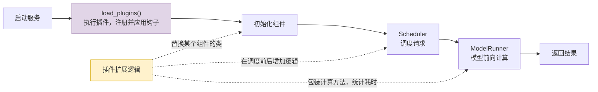
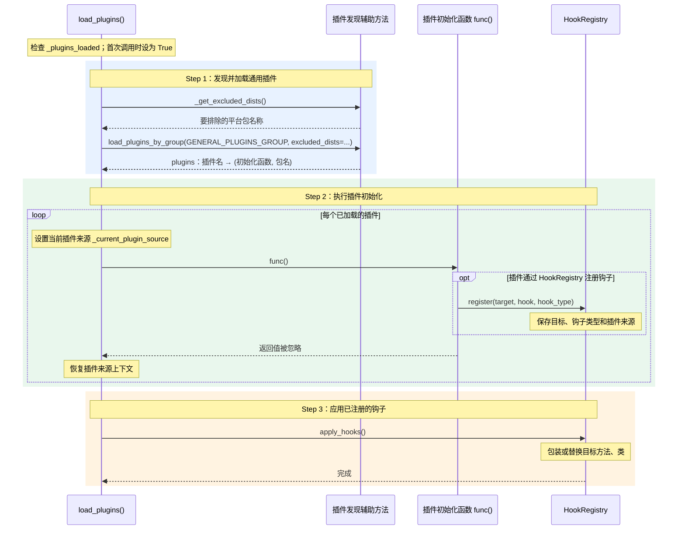

# load_plugins()：加载插件，让扩展逻辑生效

`load_plugins()` 在进程启动早期加载并执行通用插件(General Plugin)，再应用插件注册的钩子(Hook)。插件可以给方法增加逻辑、包装方法或替换类；本函数忽略插件的返回值。

**启动时完成“接上扩展逻辑”，后续执行到对应方法时，钩子才随之执行。** 插件初始化函数本身则在加载时执行。

## 插件可能生效的位置

下面是启动与请求处理的简图。虚线表示插件可能介入的位置，具体挂载哪个方法或类，由插件决定；这些是用途示例，不代表默认已经安装了对应插件。



例如，给模型计算方法增加耗时统计：

```text
原来：模型计算
加入钩子后：记录开始时间 → 模型计算 → 记录结束时间、输出耗时
```

钩子支持执行前(BEFORE)、执行后(AFTER)、包装执行(AROUND)和整体替换(REPLACE)；上面的计时示例适合包装执行。

## 方法内部的浅层时序图(Sequence Diagram)

下面展示本进程首次调用的正常路径；再次调用时，检查到 `_plugins_loaded` 为 `True` 就直接返回。



## 跟着图阅读代码

| 代码 | 做什么 |
|---|---|
| `_plugins_loaded` | 防止同一进程重复加载；体现幂等性(Idempotency) |
| `_get_excluded_dists()` | 设置 `SGLANG_PLATFORM` 时，排除未选中的平台插件包 |
| `load_plugins_by_group(...)` | 从 Python 入口点(Entry Point)组 `sglang.srt.plugins` 发现插件；按 `SGLANG_PLUGINS` 筛选，并加载初始化函数 |
| `func()` | 执行插件初始化；可能注册钩子或直接进行其他扩展操作 |
| `_current_plugin_source` | 让钩子注册时能够记录来自哪个插件；执行结束后恢复上下文 |
| `HookRegistry.apply_hooks()` | 将已注册的钩子应用到目标方法或类，使后续调用经过扩展逻辑 |

插件导入或初始化失败时，当前实现会记录异常并继续；`_plugins_loaded` 已在开头设为 `True`，再次调用本函数不会自动重试失败插件。

## 为什么启动流程里又调用一次？

`Engine.__init__` 或命令行入口(Command-line Interface，CLI)可能已经调用过，但 `Engine._launch_subprocesses()` 仍会确保调用一次，避免其他启动路径漏掉插件初始化。同一进程内重复调用会直接返回；使用 `spawn` 创建的新进程需要自行加载插件。

在当前阅读的链路中，它位于配置与环境准备之后、`check_server_args()` 和自动解析器选择之前。插件可能注册新的解析器(Parser)，因此要先加载插件，再进行选择。

## 术语与生词

| 术语或单词 | 中文释义 | 简明英文释义 |
|---|---|---|
| Plugin /ˈplʌɡɪn/ | 插件：为已有程序增加或调整功能的扩展 | An extension that adds or changes a program's behavior. |
| Hook /hʊk/ | 钩子：接入目标操作前后或替换目标操作的扩展机制 | A mechanism for attaching custom behavior to an operation. |
| Idempotent /ˌaɪdəmˈpoʊtənt/ | 幂等的：重复调用不会重复产生同一种效果 | Having the same effect when applied once or repeatedly. |
| Entry Point | 入口点：Python 包声明的可被发现并加载的对象入口 | A named reference that lets installed packages expose loadable objects. |
