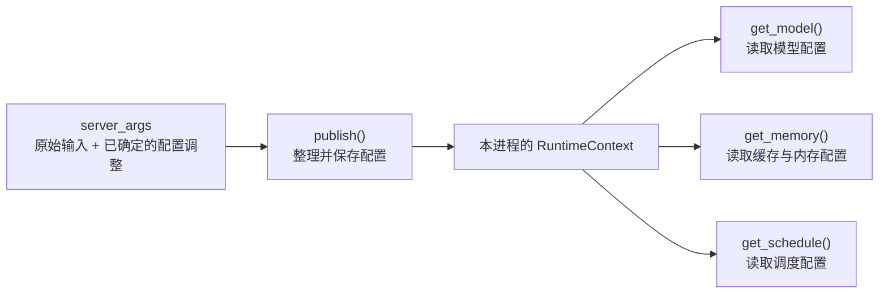

# publish()：发布本进程配置

`publish(server_args, role="tokenizer")` 的作用是：**把当前配置放入本进程的运行时上下文(RuntimeContext)，供后续各模块统一读取。**

可以理解为：**前面准备配置，这里让配置正式可用。**

它内部主要做三件事：

1. 调用 `resolve_once()`，确保配置已完成解析。
2. 保存 `server_args`，并将解析后的配置按用途分组，形成供运行时读取的配置快照(Snapshot)。
3. 记录当前进程角色为 `"tokenizer"`，供配置访问审计、检查使用。**这里并不创建 TokenizerManager**，它在后面初始化。

和 `resolving_view()` 连起来看：

- `resolving_view()`：准备配置时，读取截至当前的配置值。
- `publish()`：把准备好的配置保存为本进程统一使用的配置。

这里的“发布”只发生在**当前进程内存中**，其他进程需要在各自的初始化路径中完成配置发布。

> 运行时上下文意味着：完成 `publish()` 后，同一进程内的各模块可以通过 `get_model()`、`get_memory()` 等统一入口读取配置，不必层层传递 `server_args` 或手动持有上下文对象。这些入口背后仍然访问 `RuntimeContext` 对象；配置也不会自动跨进程共享。
