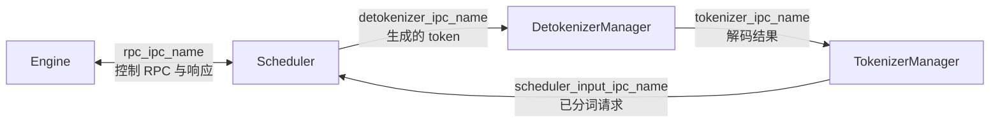
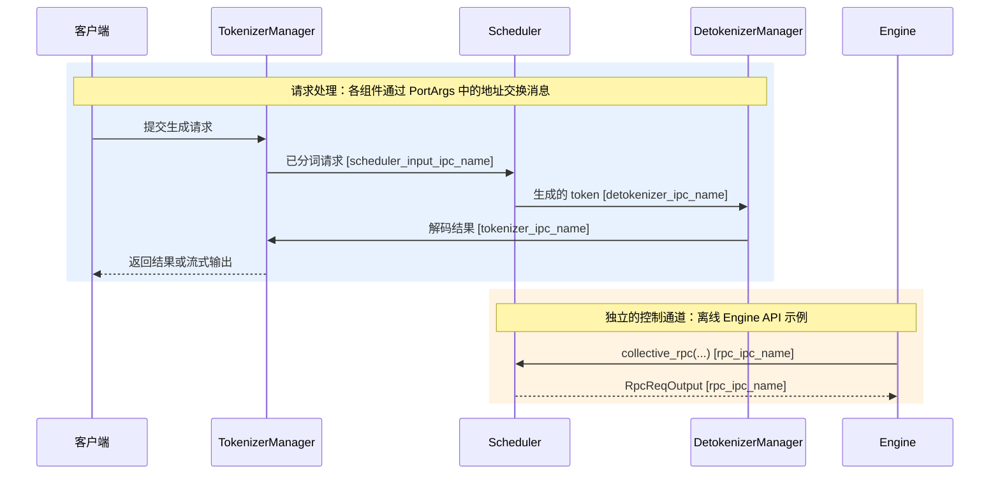
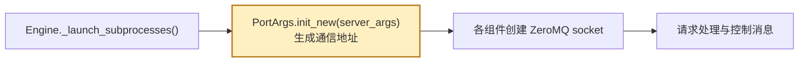

# PortArgs：服务组件之间的通信地址

## 组件通信流程图

主请求链路中的三条箭头分别对应 `TokenizerManager.send_to_scheduler`、`DetokenizerManager.recv_from_scheduler`、`TokenizerManager.recv_from_detokenizer` 等 socket；`Engine` 通过 `rpc_ipc_name` 发送管理 RPC 并接收结果。单次普通 HTTP 推理请求不会先经过 `Engine` 的 RPC。

## 整体链路的简短时序图

蓝色为一次请求的消息流；橙色是单独的 Engine 控制调用示例。图中字段名均与 `PortArgs` 一致。

## PortArgs 在启动链路中的位置

这里的 `nccl_port` 用于分布式通信初始化；`metrics_ipc_name`、`tokenizer_worker_ipc_name` 和 `decoupled_spec_ipc_config` 服务于监控或可选模式，因此没有放进上面的普通请求时序图。
