# Qwen3.5 核心类 UML 关系

## 1.1 模型外层的继承

<!-- mermaid:id=inherit_1_1 -->
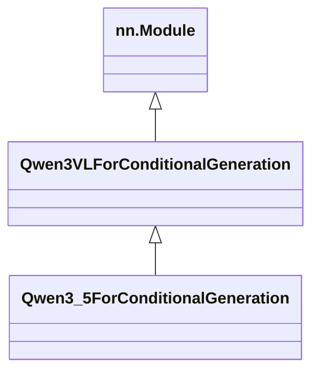
```mermaid
classDiagram
direction TB
class Module["nn.Module"]
class Qwen3VLForConditionalGeneration["Qwen3VLForConditionalGeneration"]
class Qwen3_5ForConditionalGeneration["Qwen3_5ForConditionalGeneration"]
Module <|-- Qwen3VLForConditionalGeneration
Qwen3VLForConditionalGeneration <|-- Qwen3_5ForConditionalGeneration
```

## 1.2 文本模型与 Decoder 层的继承

<!-- mermaid:id=inherit_1_2 -->
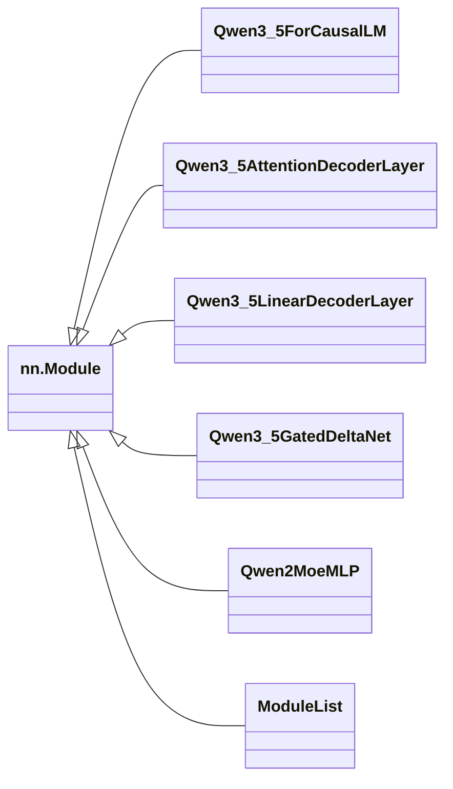
```mermaid
classDiagram
direction LR
class Module["nn.Module"]
class Qwen3_5ForCausalLM["Qwen3_5ForCausalLM"]
class Qwen3_5AttentionDecoderLayer["Qwen3_5AttentionDecoderLayer"]
class Qwen3_5LinearDecoderLayer["Qwen3_5LinearDecoderLayer"]
class Qwen3_5GatedDeltaNet["Qwen3_5GatedDeltaNet"]
class Qwen2MoeMLP["Qwen2MoeMLP"]
class ModuleList["ModuleList"]
Module <|-- Qwen3_5ForCausalLM
Module <|-- Qwen3_5AttentionDecoderLayer
Module <|-- Qwen3_5LinearDecoderLayer
Module <|-- Qwen3_5GatedDeltaNet
Module <|-- Qwen2MoeMLP
Module <|-- ModuleList
```

## 1.3 注意力入口与输出模块的继承

<!-- mermaid:id=inherit_1_3 -->
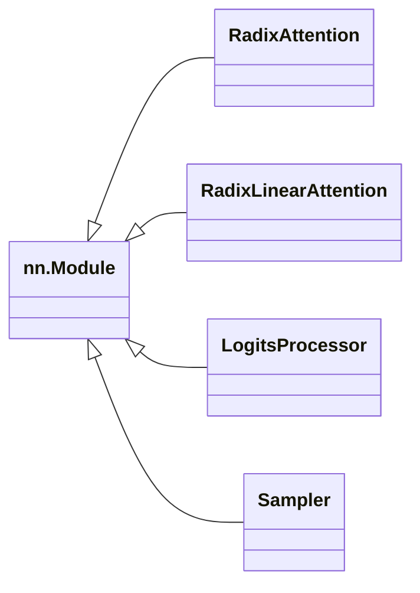
```mermaid
classDiagram
direction LR
class Module["nn.Module"]
class RadixAttention["RadixAttention"]
class RadixLinearAttention["RadixLinearAttention"]
class LogitsProcessor["LogitsProcessor"]
class Sampler["Sampler"]
Module <|-- RadixAttention
Module <|-- RadixLinearAttention
Module <|-- LogitsProcessor
Module <|-- Sampler
```

## 2. 线性投影与词表权重

<!-- mermaid:id=inherit_2 -->
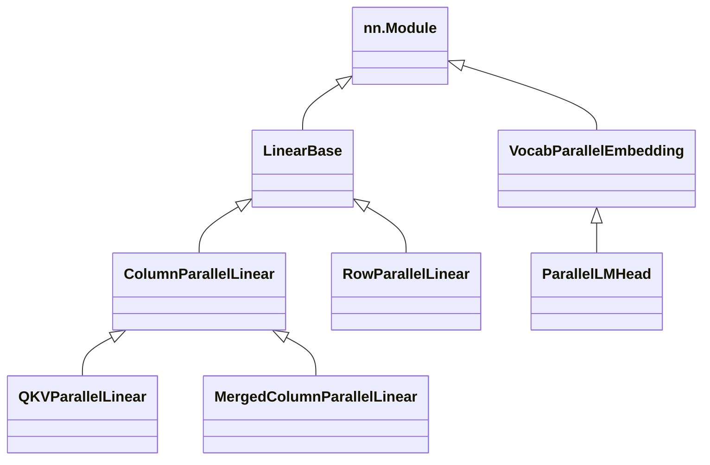
```mermaid
classDiagram
direction TB
class Module["nn.Module"]
class LinearBase["LinearBase"]
class ColumnParallelLinear["ColumnParallelLinear"]
class QKVParallelLinear["QKVParallelLinear"]
class MergedColumnParallelLinear["MergedColumnParallelLinear"]
class RowParallelLinear["RowParallelLinear"]
class VocabParallelEmbedding["VocabParallelEmbedding"]
class ParallelLMHead["ParallelLMHead"]
Module <|-- LinearBase
LinearBase <|-- ColumnParallelLinear
ColumnParallelLinear <|-- QKVParallelLinear
ColumnParallelLinear <|-- MergedColumnParallelLinear
LinearBase <|-- RowParallelLinear
Module <|-- VocabParallelEmbedding
VocabParallelEmbedding <|-- ParallelLMHead
```

## 3. 普通与量化计算的方法接口

<!-- mermaid:id=inherit_3 -->
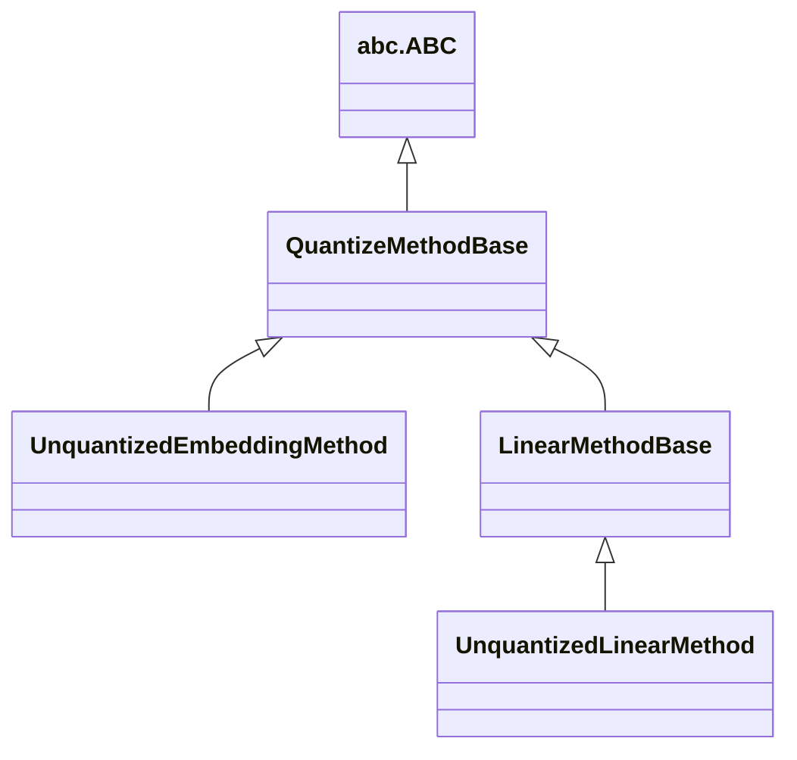
```mermaid
classDiagram
direction TB
class ABC["abc.ABC"]
class QuantizeMethodBase["QuantizeMethodBase"]
class UnquantizedEmbeddingMethod["UnquantizedEmbeddingMethod"]
class LinearMethodBase["LinearMethodBase"]
class UnquantizedLinearMethod["UnquantizedLinearMethod"]
ABC <|-- QuantizeMethodBase
QuantizeMethodBase <|-- UnquantizedEmbeddingMethod
QuantizeMethodBase <|-- LinearMethodBase
LinearMethodBase <|-- UnquantizedLinearMethod
```

## 4. 归一化、激活与位置编码

<!-- mermaid:id=inherit_4 -->
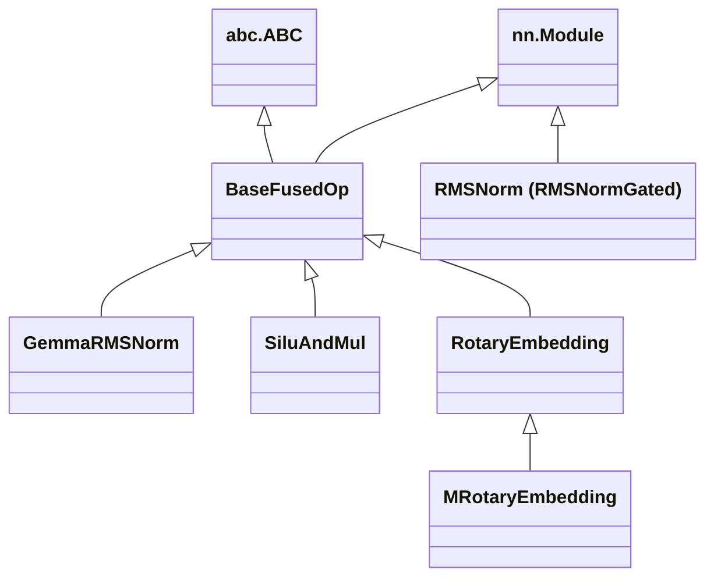
```mermaid
classDiagram
direction TB
class Module["nn.Module"]
class ABC["abc.ABC"]
class BaseFusedOp["BaseFusedOp"]
class GemmaRMSNorm["GemmaRMSNorm"]
class SiluAndMul["SiluAndMul"]
class RotaryEmbedding["RotaryEmbedding"]
class MRotaryEmbedding["MRotaryEmbedding"]
class RMSNormGated["RMSNorm (RMSNormGated)"]
Module <|-- BaseFusedOp
ABC <|-- BaseFusedOp
BaseFusedOp <|-- GemmaRMSNorm
BaseFusedOp <|-- SiluAndMul
BaseFusedOp <|-- RotaryEmbedding
RotaryEmbedding <|-- MRotaryEmbedding
Module <|-- RMSNormGated
```

## 5. 推理执行器

<!-- mermaid:id=inherit_5 -->
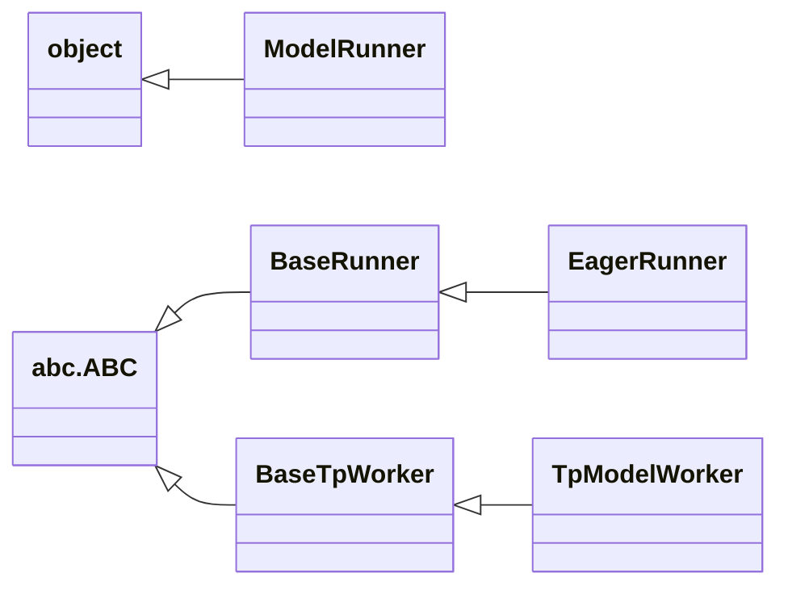
```mermaid
classDiagram
direction LR
class object["object"]
class ModelRunner["ModelRunner"]
class ABC["abc.ABC"]
class BaseRunner["BaseRunner"]
class EagerRunner["EagerRunner"]
class BaseTpWorker["BaseTpWorker"]
class TpModelWorker["TpModelWorker"]
object <|-- ModelRunner
ABC <|-- BaseRunner
BaseRunner <|-- EagerRunner
ABC <|-- BaseTpWorker
BaseTpWorker <|-- TpModelWorker
```

## 6. 注意力后端与 GDN 内核

<!-- mermaid:id=inherit_6 -->
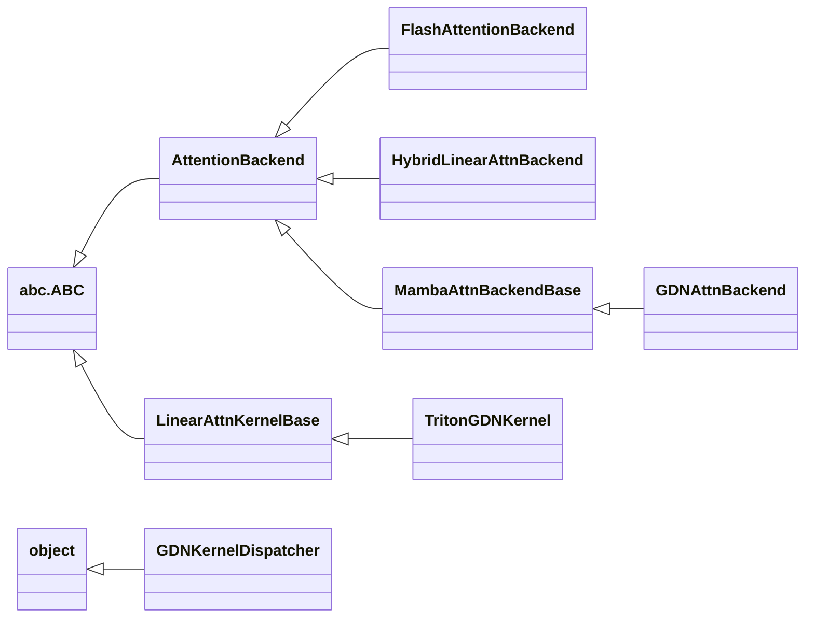
```mermaid
classDiagram
direction LR
class ABC["abc.ABC"]
class AttentionBackend["AttentionBackend"]
class FlashAttentionBackend["FlashAttentionBackend"]
class HybridLinearAttnBackend["HybridLinearAttnBackend"]
class MambaAttnBackendBase["MambaAttnBackendBase"]
class GDNAttnBackend["GDNAttnBackend"]
class LinearAttnKernelBase["LinearAttnKernelBase"]
class TritonGDNKernel["TritonGDNKernel"]
class object["object"]
class GDNKernelDispatcher["GDNKernelDispatcher"]
ABC <|-- AttentionBackend
AttentionBackend <|-- FlashAttentionBackend
AttentionBackend <|-- HybridLinearAttnBackend
AttentionBackend <|-- MambaAttnBackendBase
MambaAttnBackendBase <|-- GDNAttnBackend
ABC <|-- LinearAttnKernelBase
LinearAttnKernelBase <|-- TritonGDNKernel
object <|-- GDNKernelDispatcher
```

## 7. 请求映射、KV 缓存与线性注意力状态

<!-- mermaid:id=inherit_7 -->
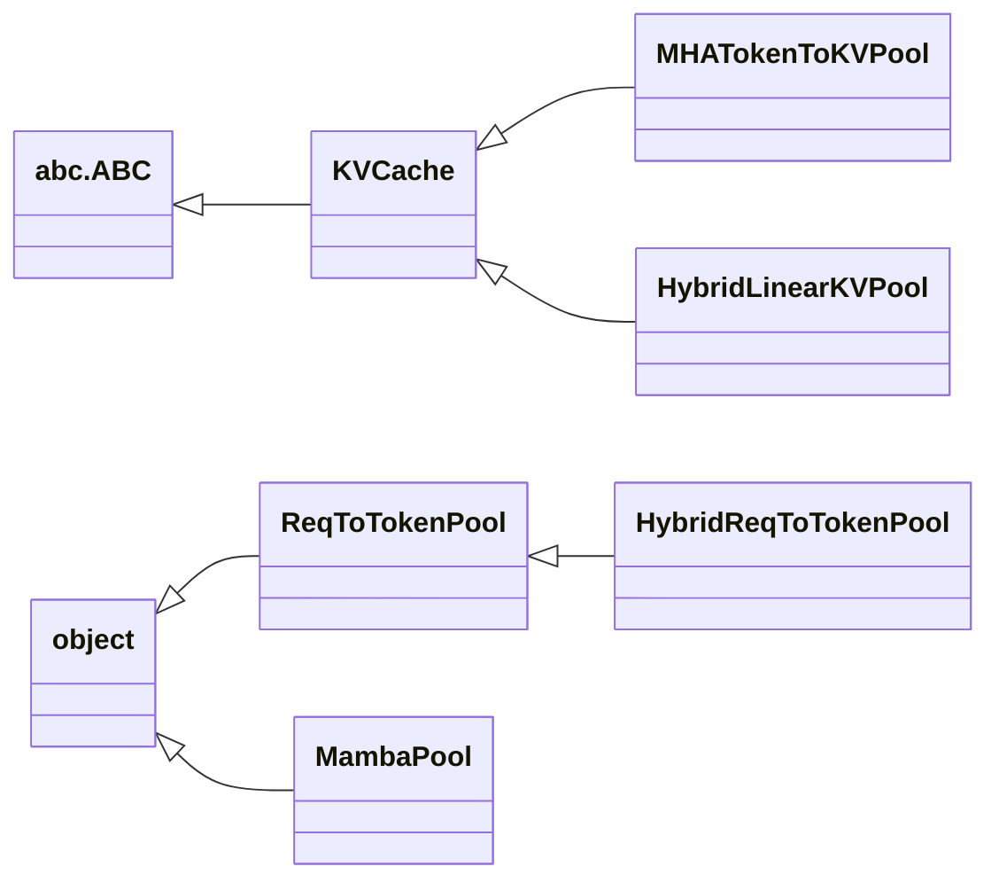
```mermaid
classDiagram
direction LR
class ABC["abc.ABC"]
class KVCache["KVCache"]
class MHATokenToKVPool["MHATokenToKVPool"]
class HybridLinearKVPool["HybridLinearKVPool"]
class object["object"]
class ReqToTokenPool["ReqToTokenPool"]
class HybridReqToTokenPool["HybridReqToTokenPool"]
class MambaPool["MambaPool"]
ABC <|-- KVCache
KVCache <|-- MHATokenToKVPool
KVCache <|-- HybridLinearKVPool
object <|-- ReqToTokenPool
ReqToTokenPool <|-- HybridReqToTokenPool
object <|-- MambaPool
```

## 8. 本轮批次、残差与结果对象

<!-- mermaid:id=inherit_8 -->
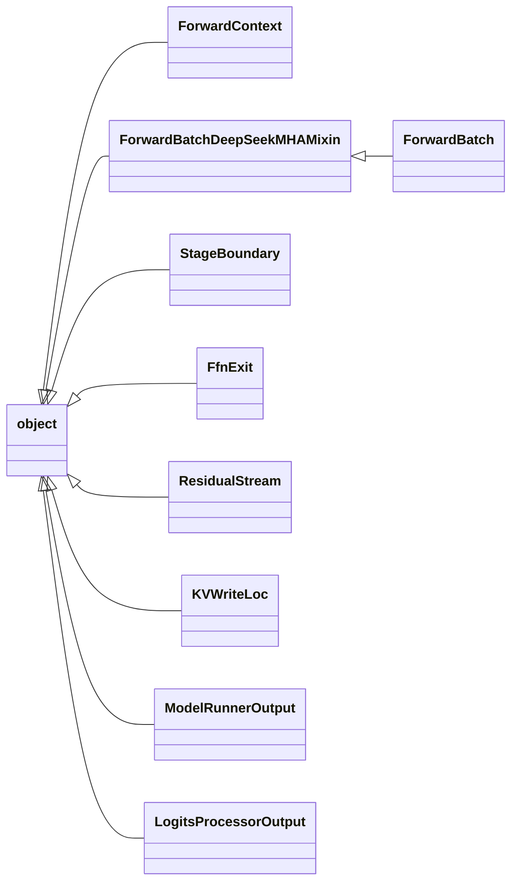
```mermaid
classDiagram
direction LR
class object["object"]
class ForwardContext["ForwardContext"]
class ForwardBatchDeepSeekMHAMixin["ForwardBatchDeepSeekMHAMixin"]
class ForwardBatch["ForwardBatch"]
class StageBoundary["StageBoundary"]
class FfnExit["FfnExit"]
class ResidualStream["ResidualStream"]
class KVWriteLoc["KVWriteLoc"]
class ModelRunnerOutput["ModelRunnerOutput"]
class LogitsProcessorOutput["LogitsProcessorOutput"]
object <|-- ForwardContext
object <|-- ForwardBatchDeepSeekMHAMixin
ForwardBatchDeepSeekMHAMixin <|-- ForwardBatch
object <|-- StageBoundary
object <|-- FfnExit
object <|-- ResidualStream
object <|-- KVWriteLoc
object <|-- ModelRunnerOutput
object <|-- LogitsProcessorOutput
```

## 9.1 模型工作进程与 ModelRunner

TpModelWorker 通过 model_runner 属性访问 _model_runner。

<!-- mermaid:id=worker -->
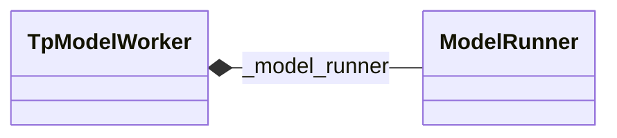
```mermaid
classDiagram
direction LR
class TpModelWorker["TpModelWorker"]
class ModelRunner["ModelRunner"]
TpModelWorker *-- ModelRunner : _model_runner
```

## 9.2 ModelRunner 持有的对象

EagerRunner.model_runner 引回同一个 ModelRunner。空心菱形表示它持有的共享对象。

<!-- mermaid:id=runner -->
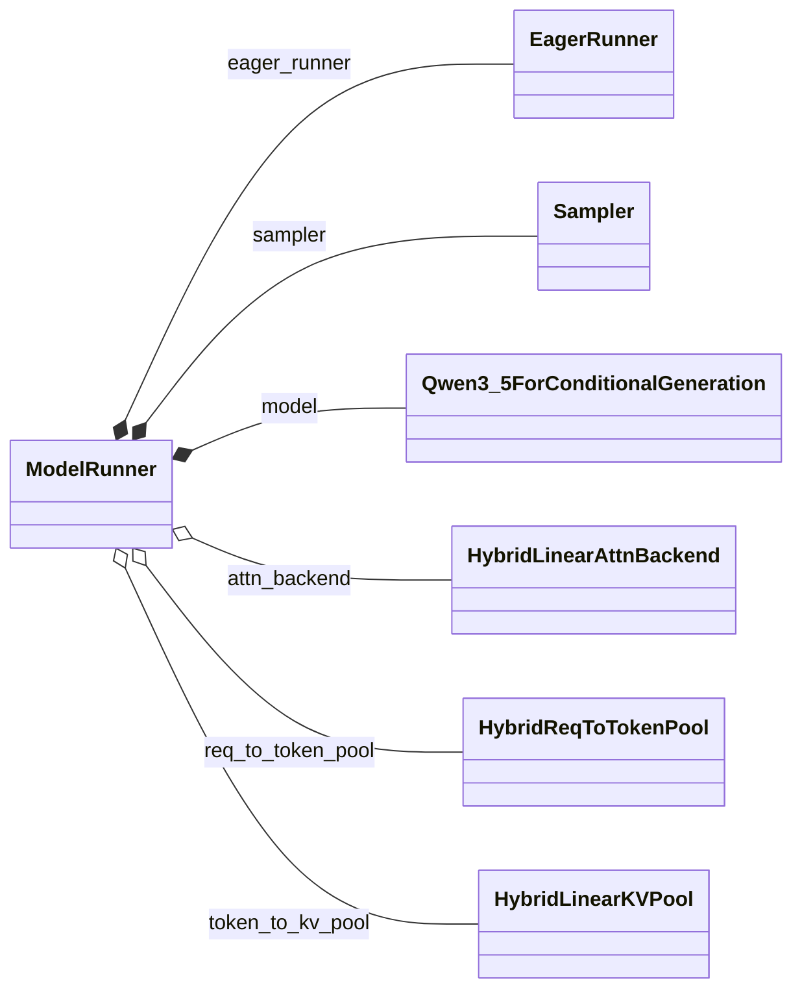
```mermaid
classDiagram
direction LR
class ModelRunner["ModelRunner"]
class EagerRunner["EagerRunner"]
class Sampler["Sampler"]
class Qwen3_5ForConditionalGeneration["Qwen3_5ForConditionalGeneration"]
class HybridLinearAttnBackend["HybridLinearAttnBackend"]
class HybridReqToTokenPool["HybridReqToTokenPool"]
class HybridLinearKVPool["HybridLinearKVPool"]
ModelRunner *-- EagerRunner : eager_runner
ModelRunner *-- Sampler : sampler
ModelRunner *-- Qwen3_5ForConditionalGeneration : model
ModelRunner o-- HybridLinearAttnBackend : attn_backend
ModelRunner o-- HybridReqToTokenPool : req_to_token_pool
ModelRunner o-- HybridLinearKVPool : token_to_kv_pool
```

## 10. Qwen3.5 模型内部的组合

ModuleList 按层配置保存全注意力层或线性注意力层；这里列出纯文本生成使用的成员。lm_head 使用独立的词表输出权重。

<!-- mermaid:id=model -->
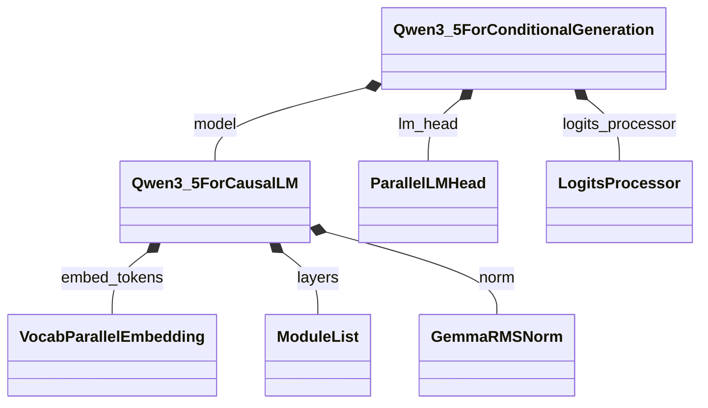
```mermaid
classDiagram
direction TB
class Qwen3_5ForConditionalGeneration["Qwen3_5ForConditionalGeneration"]
class Qwen3_5ForCausalLM["Qwen3_5ForCausalLM"]
class ParallelLMHead["ParallelLMHead"]
class LogitsProcessor["LogitsProcessor"]
class VocabParallelEmbedding["VocabParallelEmbedding"]
class ModuleList["ModuleList"]
class GemmaRMSNorm["GemmaRMSNorm"]
Qwen3_5ForConditionalGeneration *-- Qwen3_5ForCausalLM : model
Qwen3_5ForConditionalGeneration *-- ParallelLMHead : lm_head
Qwen3_5ForConditionalGeneration *-- LogitsProcessor : logits_processor
Qwen3_5ForCausalLM *-- VocabParallelEmbedding : embed_tokens
Qwen3_5ForCausalLM *-- ModuleList : layers
Qwen3_5ForCausalLM *-- GemmaRMSNorm : norm
```

## 11. 全注意力层的组合

归一化成员：q_norm、k_norm、input_layernorm、post_attention_layernorm。阶段边界：attn_boundary、ffn_boundary。rotary_emb 由 get_rope 按配置选择，也可以是 MRotaryEmbedding。

<!-- mermaid:id=attention -->
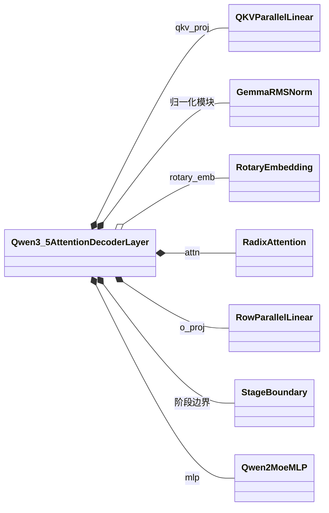
```mermaid
classDiagram
direction LR
class Qwen3_5AttentionDecoderLayer["Qwen3_5AttentionDecoderLayer"]
class QKVParallelLinear["QKVParallelLinear"]
class GemmaRMSNorm["GemmaRMSNorm"]
class RotaryEmbedding["RotaryEmbedding"]
class RadixAttention["RadixAttention"]
class RowParallelLinear["RowParallelLinear"]
class StageBoundary["StageBoundary"]
class Qwen2MoeMLP["Qwen2MoeMLP"]
Qwen3_5AttentionDecoderLayer *-- QKVParallelLinear : qkv_proj
Qwen3_5AttentionDecoderLayer *-- GemmaRMSNorm : 归一化模块
Qwen3_5AttentionDecoderLayer o-- RotaryEmbedding : rotary_emb
Qwen3_5AttentionDecoderLayer *-- RadixAttention : attn
Qwen3_5AttentionDecoderLayer *-- RowParallelLinear : o_proj
Qwen3_5AttentionDecoderLayer *-- StageBoundary : 阶段边界
Qwen3_5AttentionDecoderLayer *-- Qwen2MoeMLP : mlp
```

## 12. 线性注意力层的组合

归一化成员：input_layernorm、post_attention_layernorm。阶段边界：attn_boundary、ffn_boundary。

<!-- mermaid:id=linear_layer -->
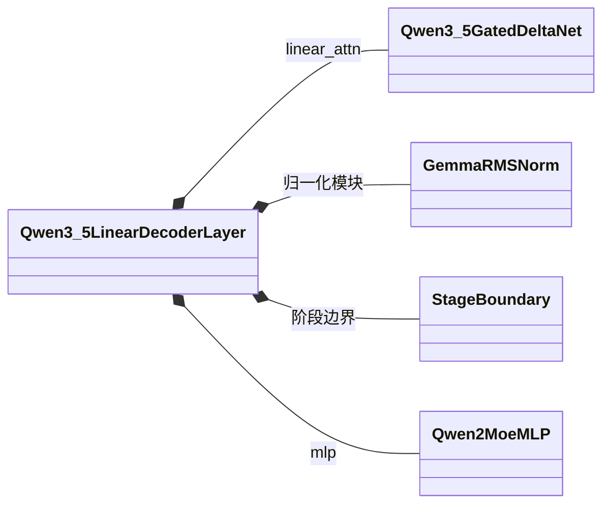
```mermaid
classDiagram
direction LR
class Qwen3_5LinearDecoderLayer["Qwen3_5LinearDecoderLayer"]
class Qwen3_5GatedDeltaNet["Qwen3_5GatedDeltaNet"]
class GemmaRMSNorm["GemmaRMSNorm"]
class StageBoundary["StageBoundary"]
class Qwen2MoeMLP["Qwen2MoeMLP"]
Qwen3_5LinearDecoderLayer *-- Qwen3_5GatedDeltaNet : linear_attn
Qwen3_5LinearDecoderLayer *-- GemmaRMSNorm : 归一化模块
Qwen3_5LinearDecoderLayer *-- StageBoundary : 阶段边界
Qwen3_5LinearDecoderLayer *-- Qwen2MoeMLP : mlp
```

## 13. Gated DeltaNet 内部的组合

输入投影成员：in_proj_qkvz、in_proj_ba。conv1d 提供短卷积权重；RadixLinearAttention 引用该权重及 A_log、dt_bias 门控参数。

<!-- mermaid:id=gdn -->
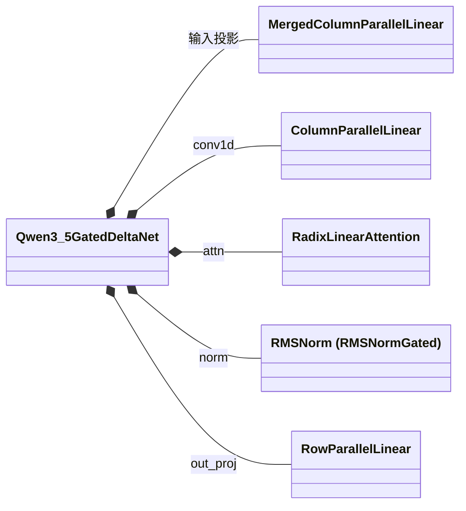
```mermaid
classDiagram
direction LR
class Qwen3_5GatedDeltaNet["Qwen3_5GatedDeltaNet"]
class MergedColumnParallelLinear["MergedColumnParallelLinear"]
class ColumnParallelLinear["ColumnParallelLinear"]
class RadixLinearAttention["RadixLinearAttention"]
class RMSNormGated["RMSNorm (RMSNormGated)"]
class RowParallelLinear["RowParallelLinear"]
Qwen3_5GatedDeltaNet *-- MergedColumnParallelLinear : 输入投影
Qwen3_5GatedDeltaNet *-- ColumnParallelLinear : conv1d
Qwen3_5GatedDeltaNet *-- RadixLinearAttention : attn
Qwen3_5GatedDeltaNet *-- RMSNormGated : norm
Qwen3_5GatedDeltaNet *-- RowParallelLinear : out_proj
```

## 14. FFN 与普通线性计算策略

未量化配置下，线性层通过 quant_method.apply(layer, x, bias) 使用层上的 weight；Embedding 通过 embedding() 查权重表。

<!-- mermaid:id=mlp -->
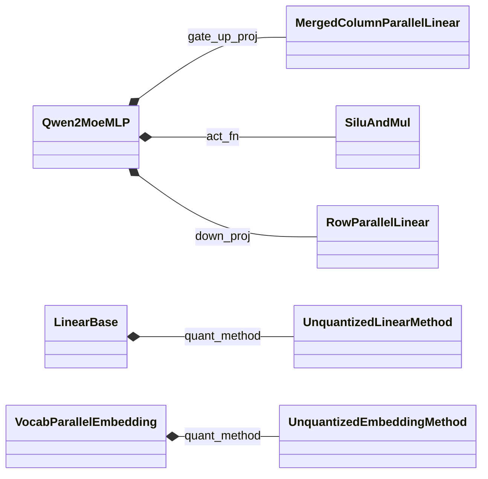
```mermaid
classDiagram
direction LR
class Qwen2MoeMLP["Qwen2MoeMLP"]
class MergedColumnParallelLinear["MergedColumnParallelLinear"]
class SiluAndMul["SiluAndMul"]
class RowParallelLinear["RowParallelLinear"]
class LinearBase["LinearBase"]
class UnquantizedLinearMethod["UnquantizedLinearMethod"]
class VocabParallelEmbedding["VocabParallelEmbedding"]
class UnquantizedEmbeddingMethod["UnquantizedEmbeddingMethod"]
Qwen2MoeMLP *-- MergedColumnParallelLinear : gate_up_proj
Qwen2MoeMLP *-- SiluAndMul : act_fn
Qwen2MoeMLP *-- RowParallelLinear : down_proj
LinearBase *-- UnquantizedLinearMethod : quant_method
VocabParallelEmbedding *-- UnquantizedEmbeddingMethod : quant_method
```

## 15. 混合注意力后端与内核对象

本例的 Prefill 和 Decode 都使用 Triton，两个成员引用同一个 TritonGDNKernel。

<!-- mermaid:id=backend -->
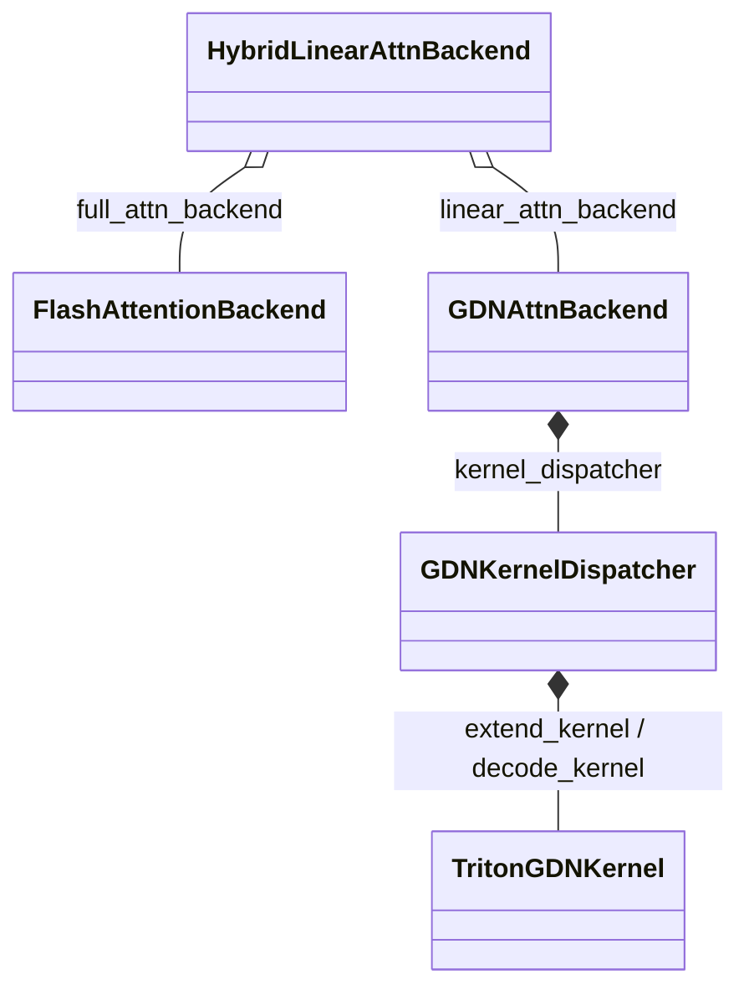
```mermaid
classDiagram
direction TB
class HybridLinearAttnBackend["HybridLinearAttnBackend"]
class FlashAttentionBackend["FlashAttentionBackend"]
class GDNAttnBackend["GDNAttnBackend"]
class GDNKernelDispatcher["GDNKernelDispatcher"]
class TritonGDNKernel["TritonGDNKernel"]
HybridLinearAttnBackend o-- FlashAttentionBackend : full_attn_backend
HybridLinearAttnBackend o-- GDNAttnBackend : linear_attn_backend
GDNAttnBackend *-- GDNKernelDispatcher : kernel_dispatcher
GDNKernelDispatcher *-- TritonGDNKernel : extend_kernel / decode_kernel
```

## 16. 当前注意力后端的引用

ModelRunner._forward_raw() 为本轮设置 ForwardContext。Radix 层读取上下文中的后端，再调用其 forward；后端是共享对象。

<!-- mermaid:id=context -->
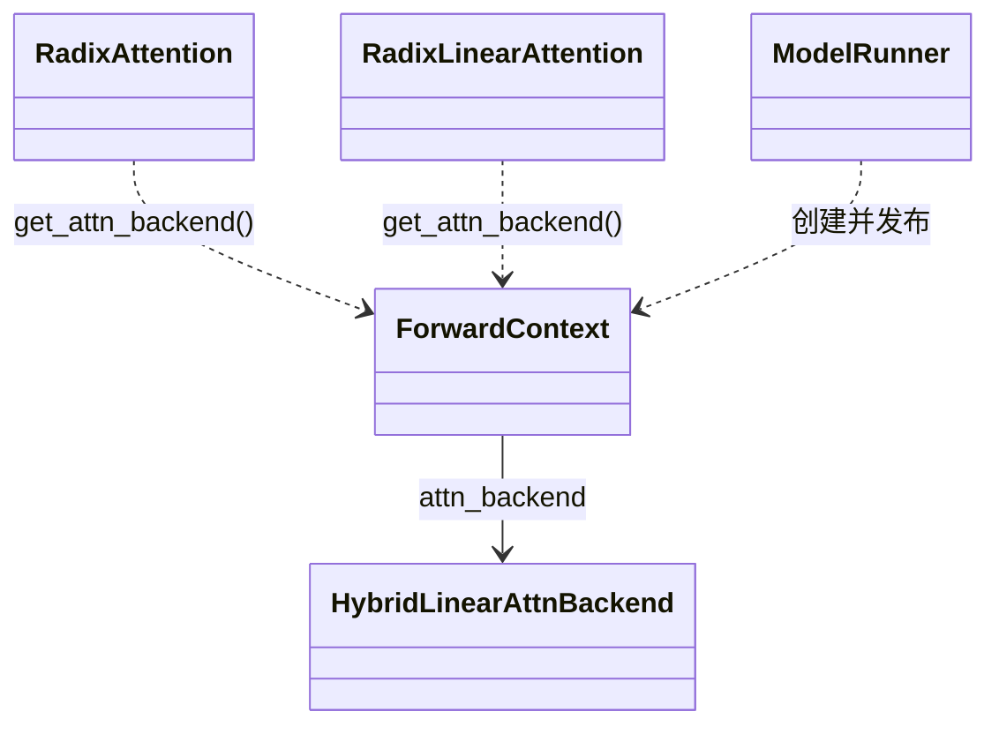
```mermaid
classDiagram
direction TB
class ForwardContext["ForwardContext"]
class HybridLinearAttnBackend["HybridLinearAttnBackend"]
class RadixAttention["RadixAttention"]
class RadixLinearAttention["RadixLinearAttention"]
class ModelRunner["ModelRunner"]
ForwardContext --> HybridLinearAttnBackend : attn_backend
RadixAttention ..> ForwardContext : get_attn_backend()
RadixLinearAttention ..> ForwardContext : get_attn_backend()
ModelRunner ..> ForwardContext : 创建并发布
```

## 17.1 缓存池与共享状态池

两个混合缓存池引用同一 MambaPool。MHATokenToKVPool.k_buffer/v_buffer 保存全注意力 K/V；MambaPool.mamba_cache.conv/temporal 保存卷积和递推状态，均位于 GPU 显存(GPU memory)。

<!-- mermaid:id=pool -->
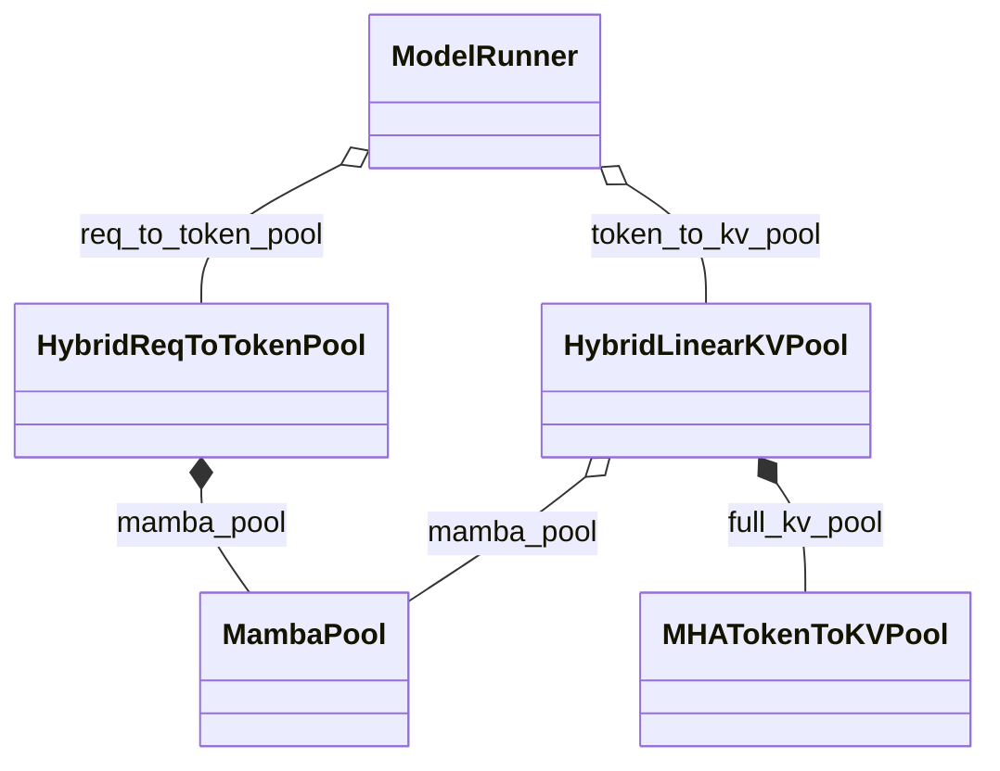
```mermaid
classDiagram
direction TB
class ModelRunner["ModelRunner"]
class HybridReqToTokenPool["HybridReqToTokenPool"]
class HybridLinearKVPool["HybridLinearKVPool"]
class MambaPool["MambaPool"]
class MHATokenToKVPool["MHATokenToKVPool"]
ModelRunner o-- HybridReqToTokenPool : req_to_token_pool
ModelRunner o-- HybridLinearKVPool : token_to_kv_pool
HybridReqToTokenPool *-- MambaPool : mamba_pool
HybridLinearKVPool o-- MambaPool : mamba_pool
HybridLinearKVPool *-- MHATokenToKVPool : full_kv_pool
```

## 17.2 注意力后端共享缓存池

对应成员是 req_to_token_pool 和 token_to_kv_pool；两个后端引用 ModelRunner 持有的同一组缓存池。

<!-- mermaid:id=pool_refs -->
```mermaid
classDiagram
direction LR
class FlashAttentionBackend["FlashAttentionBackend"]
class HybridReqToTokenPool["HybridReqToTokenPool"]
class HybridLinearKVPool["HybridLinearKVPool"]
class GDNAttnBackend["GDNAttnBackend"]
FlashAttentionBackend --> HybridReqToTokenPool : 共享引用
FlashAttentionBackend --> HybridLinearKVPool : 共享引用
GDNAttnBackend --> HybridReqToTokenPool : 共享引用
GDNAttnBackend --> HybridLinearKVPool : 共享引用
```

## 18.1 批次与残差流

ForwardBatch 保存 input_ids、positions、req_pool_indices、seq_lens、out_cache_loc。ResidualStream 保存 residual 和 pending。

<!-- mermaid:id=batch -->
```mermaid
classDiagram
direction TB
class ForwardBatch["ForwardBatch"]
class ResidualStream["ResidualStream"]
class StageBoundary["StageBoundary"]
class FfnExit["FfnExit"]
ForwardBatch *-- ResidualStream : residual_stream
StageBoundary ..> ResidualStream : prepare / finish
StageBoundary ..> FfnExit : exit() 创建
FfnExit --> ResidualStream : _stream
```

## 18.2 结果对象与采样器

LogitsProcessorOutput.next_token_logits 是词表分数；Sampler 从分数或概率中选择下一个 token。

<!-- mermaid:id=output -->
```mermaid
classDiagram
direction TB
class ModelRunnerOutput["ModelRunnerOutput"]
class LogitsProcessorOutput["LogitsProcessorOutput"]
class ModelRunner["ModelRunner"]
class Sampler["Sampler"]
ModelRunnerOutput *-- LogitsProcessorOutput : logits_output
ModelRunner ..> Sampler : sample() 调用
Sampler ..> LogitsProcessorOutput : 读取 logits
```
