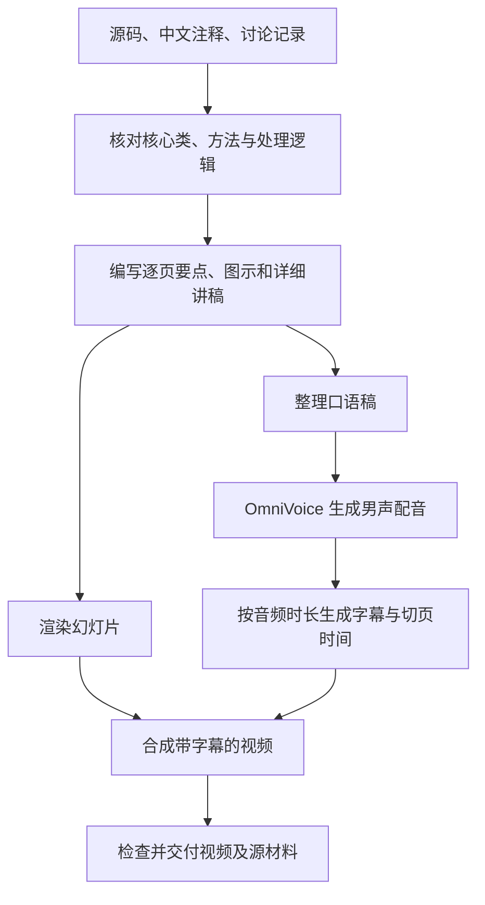

# 学习总结视频制作流程

## 从学过的源码到讲解视频

<!-- mermaid:id=summary_workflow -->

```mermaid
flowchart TB
  input["源码、中文注释、讨论记录"]
  core["核对核心类、方法与处理逻辑"]
  lesson["编写逐页要点、图示和详细讲稿"]
  slides["渲染幻灯片"]
  spoken["整理口语稿"]
  voice["OmniVoice 生成男声配音"]
  timing["按音频时长生成字幕与切页时间"]
  video["合成带字幕的视频"]
  review["检查并交付视频及源材料"]
  input --> core
  core --> lesson
  lesson --> slides
  lesson --> spoken
  spoken --> voice
  voice --> timing
  slides --> video
  timing --> video
  video --> review
%% portable-canonical-v2:eyJhY2Nlc3NpYmlsaXR5IjpudWxsLCJkYXRhIjp7ImRpcmVjdGlvbiI6IlRCIiwiZWRnZXMiOlt7ImZyb20iOiJpbnB1dCIsInRvIjoiY29yZSJ9LHsiZnJvbSI6ImNvcmUiLCJ0byI6Imxlc3NvbiJ9LHsiZnJvbSI6Imxlc3NvbiIsInRvIjoic2xpZGVzIn0seyJmcm9tIjoibGVzc29uIiwidG8iOiJzcG9rZW4ifSx7ImZyb20iOiJzcG9rZW4iLCJ0byI6InZvaWNlIn0seyJmcm9tIjoidm9pY2UiLCJ0byI6InRpbWluZyJ9LHsiZnJvbSI6InNsaWRlcyIsInRvIjoidmlkZW8ifSx7ImZyb20iOiJ0aW1pbmciLCJ0byI6InZpZGVvIn0seyJmcm9tIjoidmlkZW8iLCJ0byI6InJldmlldyJ9XSwibm9kZXMiOlt7ImlkIjoiaW5wdXQiLCJsYWJlbCI6Iua6kOeggeOAgeS4reaWh-azqOmHiuOAgeiuqOiuuuiusOW9lSJ9LHsiaWQiOiJjb3JlIiwibGFiZWwiOiLmoLjlr7nmoLjlv4PnsbvjgIHmlrnms5XkuI7lpITnkIbpgLvovpEifSx7ImlkIjoibGVzc29uIiwibGFiZWwiOiLnvJblhpnpgJDpobXopoHngrnjgIHlm77npLrlkozor6bnu4borrLnqL8ifSx7ImlkIjoic2xpZGVzIiwibGFiZWwiOiLmuLLmn5Plubvnga_niYcifSx7ImlkIjoic3Bva2VuIiwibGFiZWwiOiLmlbTnkIblj6Por63nqL8ifSx7ImlkIjoidm9pY2UiLCJsYWJlbCI6Ik9tbmlWb2ljZSDnlJ_miJDnlLflo7DphY3pn7MifSx7ImlkIjoidGltaW5nIiwibGFiZWwiOiLmjInpn7PpopHml7bplb_nlJ_miJDlrZfluZXkuI7liIfpobXml7bpl7QifSx7ImlkIjoidmlkZW8iLCJsYWJlbCI6IuWQiOaIkOW4puWtl-W5leeahOinhumikSJ9LHsiaWQiOiJyZXZpZXciLCJsYWJlbCI6IuajgOafpeW5tuS6pOS7mOinhumikeWPiua6kOadkOaWmSJ9XX0sImRlc2NyaXB0aW9uIjpudWxsLCJpZCI6InN1bW1hcnlfd29ya2Zsb3ciLCJraW5kIjoiZmxvd2NoYXJ0Iiwic291cmNlU2hhMjU2IjoiNTAzNDhjYmIwOGVmMjQzNDkxODg2MGFiOTVkZDRhY2U5MTdlYjVkZjAwOTAxMWI5MDMzZWNmZWIzNmU3NTY3MyIsInN0eWxlcyI6W10sInRpdGxlIjoi5LuO5a2m6L-H55qE5rqQ56CB5Yiw6K6y6Kej6KeG6aKRIiwidmVyc2lvbiI6MX0
```
