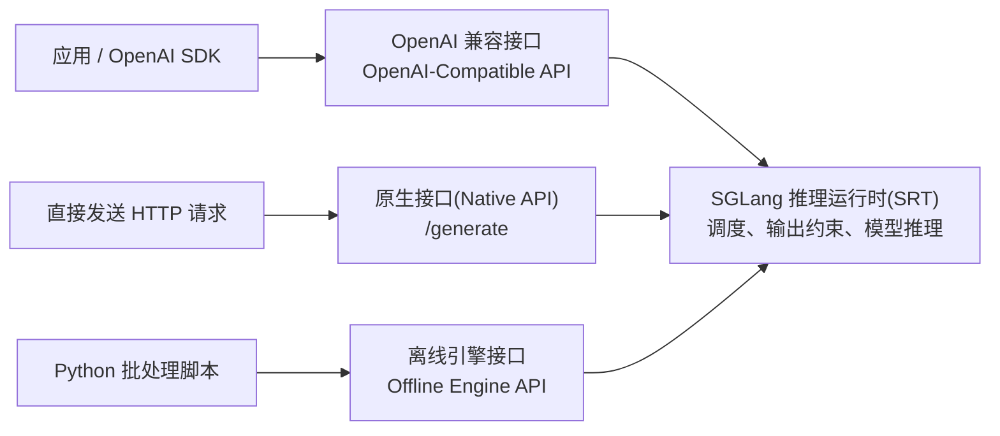

# 1.1 大模型服务功能与配置(LLM Serving Features)

本文汇总 SGLang 的结构化输出(Structured Outputs)、推理内容解析(Reasoning Parsing)与工具调用(Tool Calling)配置，并说明大语言模型(Large Language Model，LLM)常用接口的使用场景。

## 支持哪些输出约束？

| 约束方式 | 控制什么 | 适用场景 |
|---|---|---|
| JSON 结构定义(JSON Schema) | JSON 的字段、类型、必填项与枚举值等 | 信息提取、分类结果、业务接口响应 |
| 正则表达式(Regular Expression) | 输出符合指定的文本模式 | 固定选项、编号、简单格式文本 |
| 扩展巴科斯范式(Extended Backus–Naur Form，EBNF) | 输出符合自定义语法规则 | 固定句式、领域语言、较复杂的文本结构 |
| 结构标签(Structural Tag) | 指定起止标签，并约束标签内部的内容 | 函数调用格式、自然语言与结构化片段混合输出 |

同一请求只能从 `json_schema`、`regex`、`ebnf` 中选择一种约束。结构标签可以定义不同标签及其内部的 JSON Schema。
SGLang 默认使用 XGrammar 语法后端(Grammar Backend)，也支持 Outlines 和 llguidance；后端支持的约束类型有所不同。
提示词(Prompt)中同时说明期望格式，有助于模型生成合适的内容。

## 三种接口怎么选？

| 接入方式 | 怎么调用 | 适用场景 |
|---|---|---|
| OpenAI 兼容接口(OpenAI-Compatible API) | 通过 OpenAI SDK 或 HTTP 调用 `/v1/chat/completions`；JSON 与结构标签放在 `response_format` 中 | 已使用 OpenAI 接口的应用、聊天服务、希望复用现有客户端的系统 |
| 原生接口(Native API) | 通过 HTTP 调用 `/generate`，在 `sampling_params` 中设置输出约束 | 直接使用 SGLang 原生参数、精确控制输入与生成过程的服务集成 |
| 离线引擎接口(Offline Engine API) | 在 Python 程序中创建 `sglang.Engine`，调用 `generate()` | 批量生成、模型评测、数据处理、在脚本中直接控制模型生命周期 |

OpenAI 兼容接口也可通过 `extra_body` 传入 `regex` 或 `ebnf`；原生接口与离线引擎都通过 `sampling_params` 传入约束。

## SGLang 推理运行时(SGLang Runtime，SRT)是什么？

SGLang 推理运行时(SGLang Runtime，SRT)负责请求调度、缓存管理和模型执行；上面的三种接入方式最终使用这些推理能力。
量化(Quantization)是降低权重或计算精度的一类优化，与接口的选择是两个维度。

## 推理内容解析与结构化输出

推理区间自由生成文本，遇到推理结束标记（如 `</think>`）后，再对最终答案施加格式约束。

- 服务启动：指定匹配模型的推理解析器(Reasoning Parser)，例如 DeepSeek R1 使用 `--reasoning-parser deepseek-r1 --grammar-backend xgrammar`。
- OpenAI 接口：沿用原有格式约束；`reasoning_content` 返回推理内容，`content` 返回最终答案。
- 原生 `/generate`：按原文示例，在请求顶层增加 `"require_reasoning": true`，输出约束仍放在 `sampling_params` 中。
- 离线引擎：创建 `sglang.Engine` 时设置 `reasoning_parser="deepseek-r1"`、`grammar_backend="xgrammar"`，随后调用 `generate()`。
- 扩展新格式：继承 [reasoning_parser.py](../python/sglang/srt/parser/reasoning_parser.py) 中的 `BaseReasoningFormatDetector`，定义推理标记及非流式(Non-streaming)、流式(Streaming)解析行为。
- 注册新解析器：将名称与检测器类加入 `ReasoningParser.DetectorMap`，随后通过 `--reasoning-parser` 指定该名称；当前代码路径为 `python/sglang/srt/parser/reasoning_parser.py`。

## 常用启动参数与工具调用

| 服务启动参数 | 作用 |
|---|---|
| `--grammar-backend` | 选择语法后端，例如 `xgrammar`，执行结构化输出约束 |
| `--reasoning-parser` | 选择匹配模型的推理解析器，识别推理内容与最终答案 |
| `--tool-call-parser` | 选择匹配模型输出格式的工具调用解析器(Tool Call Parser)，提取函数名和参数 |

请求参数中，`tools` 声明可用工具及参数结构，`tool_choice` 控制是否必须调用工具或指定某个工具。
OpenAI 接口将解析结果放在 `tool_calls` 中；应用程序执行工具，再以 `role="tool"` 回传结果供模型继续回答。

完整参数与调用示例见[结构化输出](../docs/docs/advanced_features/structured_outputs.mdx)、[推理模型结构化输出](../docs/docs/advanced_features/structured_outputs_for_reasoning_models.mdx)、[推理内容解析](../docs/docs/advanced_features/separate_reasoning.mdx)与[工具调用解析](../docs/docs/advanced_features/tool_parser.mdx)。
