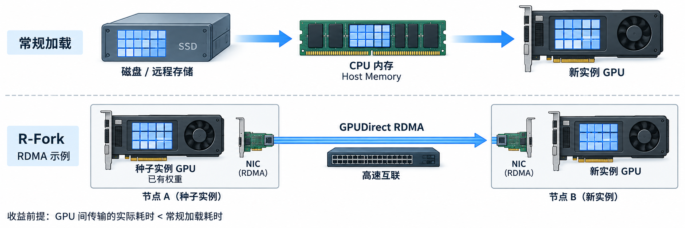

# 1.11 远程权重加载(R-Fork)

## 先理解它解决什么问题（学习补充）

**R-Fork 用来加快新 SGLang 实例的模型加载，帮助服务更快启动和扩容。** 大模型的权重(Model Weights)体积很大，从存储读取并搬入 GPU 会增加启动等待时间；R-Fork 利用已运行实例 GPU 中的权重，通过 GPU 间传输将它们加载到新实例。

提供权重的已有实例叫种子实例(Seed Instance)，接收权重的新实例叫客户端实例(Client Instance)。这里的“种子”表示权重来源，与随机种子(Random Seed)无关。


例如，已有一个模型实例，流量上涨时需要再启动一个相同模型的实例，新实例就可以从已有实例获取权重。它优化的是启动阶段的权重加载耗时，实际收益取决于模型、硬件互联及部署环境，需要实测。

新实例仍持有自己的权重副本；零拷贝(Zero-copy)描述传输路径中的中间拷贝优化，不表示两个实例共享同一份 GPU 显存。

下面以 GPU 直接远程内存访问(GPUDirect RDMA)为例：提速的前提是 GPU 间传输的实际耗时低于常规加载路径；如果节点间网络较慢，本地加载可能更快。比较时需区分首次下载模型与权重已缓存在本地两种情况。

<a href="assets/rfork-loading-paths-wide.png"></a>

---

> **文档索引(Documentation Index)**
>
> 完整文档索引：[llms.txt](https://docs.sglang.io/llms.txt)。通过此文件查找所有可用页面，再进一步阅读。

R-Fork（张量远程克隆，Tensor Remote Fork）是一种新的权重加载方法(Weight Loading Methodology)，利用高效的跨节点 GPU 到 GPU 数据传输路径，以零拷贝方式将张量(Tensor)从正在运行的 SGLang 实例加载到新实例。它可以将模型权重加载时间从数分钟缩短至数秒，显著优化 SGLang 实例的启动时间(Boot-up Time)。

更多详情请参阅 **[R-Fork 博客](https://lmsys.org/blog/2025-12-10-rfork/)**。

## 使用方法(Usage)

| 参数(Argument) | 用途(Usage) |
|---|---|
| `load-format` | 设置为 `remote_instance`，启用 R-Fork。 |
| `remote-instance-weight-loader-backend` | 可选 `nccl`、`transfer_engine` 或 `modelexpress`；默认值为 `nccl`。 |
| `remote-instance-weight-loader-seed-instance-ip` | 提供模型权重的种子实例的 IP 地址，供 `nccl` 和 `transfer_engine` 后端(Backend)使用。 |
| `remote-instance-weight-loader-seed-instance-service-port` | 种子实例 HTTP 服务器监听的端口，供 `nccl` 和 `transfer_engine` 后端使用。 |
| `remote-instance-weight-loader-send-weights-group-ports` | 种子实例上可用的端口列表，用于在种子实例与客户端实例之间建立 NCCL 通信组(Communication Group)；仅 `nccl` 后端需要。 |
| `remote-instance-weight-loader-start-seed-via-transfer-engine` | 启动支持 TransferEngine 后端的种子服务(Seed Service)；使用 `transfer_engine` 后端时，种子实例需要设置此参数。 |
| `modelexpress-config` | `modelexpress` 后端的 JSON 配置。配置键包括：`"url"`，可选，用于覆盖 gRPC 服务的 `host:port`；`"transport"`，可选 `"nixl"` 或 `"transfer_engine"`，默认值为 `"nixl"`。 |

### 使用 NCCL 后端(NCCL as Backend)

种子实例：

```bash
python -m sglang.launch_server [args]
```

客户端实例：

```bash
python -m sglang.launch_server [args] \
  --load-format remote_instance \
  --remote-instance-weight-loader-seed-instance-ip [seed_instance_ip] \
  --remote-instance-weight-loader-seed-instance-service-port [seed_instance_service_port] \
  --remote-instance-weight-loader-send-weights-group-ports [send_weights_nccl_group_ports_list] \
  --remote-instance-weight-loader-backend nccl
```

### 使用传输引擎后端(TransferEngine as Backend)

种子实例：

```bash
python -m sglang.launch_server [args] \
  --remote-instance-weight-loader-start-seed-via-transfer-engine
```

客户端实例：

```bash
python -m sglang.launch_server [args] \
  --load-format remote_instance \
  --remote-instance-weight-loader-seed-instance-ip [seed_instance_ip] \
  --remote-instance-weight-loader-seed-instance-service-port [seed_instance_service_port] \
  --remote-instance-weight-loader-backend transfer_engine
```

### 使用 ModelExpress 后端(ModelExpress as Backend)

[ModelExpress](https://github.com/ai-dynamo/modelexpress) 是一个协调服务(Coordination Service)，负责管理点对点(Peer-to-Peer，P2P)权重传输的元信息(Metadata)。它提供集中式注册中心(Centralized Registry)，供实例发布和发现信息，因此无需直接配置种子实例的 IP 地址和端口。SGLang 镜像中必须安装 ModelExpress Python 包。

使用前需要有一个正在运行的 ModelExpress 服务器。部署说明参见 [ModelExpress 文档](https://github.com/ai-dynamo/modelexpress)。

服务实例：

```bash
python -m sglang.launch_server [args] \
  --load-format remote_instance \
  --remote-instance-weight-loader-backend modelexpress \
  --modelexpress-config '{"url": "[modelexpress_grpc_host:port]", "transport": "nixl"}'
```

所有 SGLang 实例使用相同的命令形式。如果没有就绪的来源实例，当前实例会通过原生方式加载权重，并向 ModelExpress 发布元信息；如果存在兼容的来源实例，则通过 ModelExpress P2P 传输加载权重。将 `"transport"` 设置为 `"transfer_engine"`，即可使用 Mooncake TransferEngine 代替默认的 NIXL 传输方式。

## 术语与生词（学习补充）

| 术语或单词 | 中文释义 | 简明英文释义 |
|---|---|---|
| Seed Instance；Seed /siːd/ | 种子实例：向其他实例提供模型权重的已有实例 | A running instance that supplies model weights to another instance. |
| Client Instance | 客户端实例：从来源实例接收权重的新实例 | An instance that receives weights from a source instance. |
| Zero-copy | 零拷贝：在数据传输路径中避免不必要的中间拷贝 | Transferring data without unnecessary intermediate copies. |
| P2P — Peer-to-Peer | 点对点：实例之间直接传输数据 | Direct data transfer between peers. |
| NCCL — NVIDIA Collective Communications Library | NVIDIA 集合通信库：提供 GPU 间通信能力 | A library for communication between GPUs. |
| Metadata /ˈmetədeɪtə/ | 元信息：描述数据及其位置等属性的信息 | Information describing data and its properties. |
| Registry /ˈredʒɪstri/ | 注册中心：保存并提供可查询的注册信息 | A service that stores registrations for discovery. |
