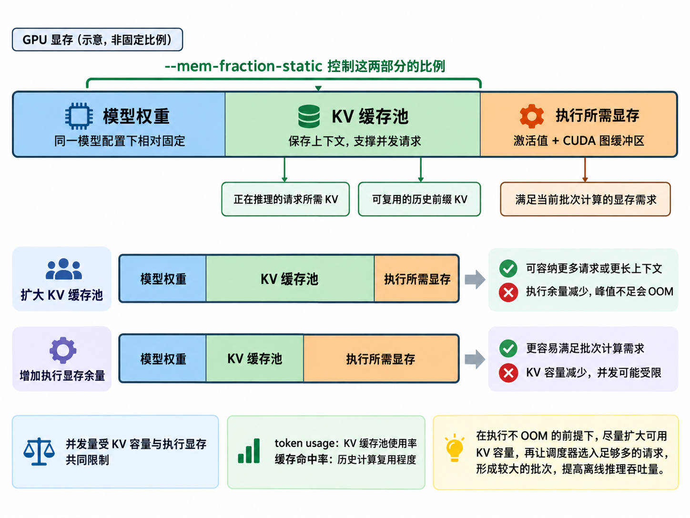

# 1.2 超参数调优(Hyperparameter Tuning)

**在避免显存不足(Out of Memory，OOM)的前提下，扩大可用键值缓存(Key/Value Cache，KV Cache)容量，让调度器(Scheduler)选入足够多的请求，形成较大的批次(Batch)，提高离线推理吞吐量(Throughput)。**

本文根据 SGLang 超参数调优文档翻译，说明显存、请求并发与调度参数的关系；[仓库中的原文](../docs/docs/advanced_features/hyperparameter_tuning.mdx)。



## 提高离线批量推理的吞吐量

对于离线批量推理(Offline Batch Inference)，增大批大小(Batch Size)是提高吞吐量(Throughput)最重要的因素。当服务处于稳定满负载状态时，观察以下日志：

```text
Decode batch. #running-req: 233, #token: 370959, token usage: 0.82, cuda graph: True, gen throughput (token/s): 4594.01, #queue-req: 317
```

### 调整请求提交速度，控制 `#queue-req`

`#queue-req` 表示队列中等待处理的请求数量。如果经常出现 `#queue-req: 0`，说明客户端提交请求的速度可能太慢。

比较合理的范围是 100～2000。但也应避免队列过大，否则会增加服务端的调度开销(Scheduling Overhead)。

### 提高 `token usage`

`token usage` 表示服务端的键值缓存(KV Cache)内存利用率。`token usage > 0.9` 通常表示利用率较好。

如果经常同时出现 `token usage < 0.9` 和 `#queue-req > 0`，说明服务端在接纳新请求时过于保守，可以将 `--schedule-conservativeness` 降低到例如 `0.3`。

一种常见原因是：请求设置了较大的 `max_new_tokens`，但实际生成过程很早就遇到序列结束标记(End of Sequence，EOS)或停止字符串(Stop String)，提前结束。

反过来，如果 `token usage` 很高，而且频繁出现以下警告，可以将 `--schedule-conservativeness` 提高到例如 `1.3`：

```text
KV cache pool is full. Retract requests. #retracted_reqs: 1, #new_token_ratio: 0.9998 -> 1.0000
```

如果只是偶尔出现“KV 缓存池已满，回撤请求(Retract Requests)”的警告，例如每分钟约一次，通常可以接受。

### 调整 `--mem-fraction-static`，增加 KV 缓存池容量

SGLang 的显存由模型权重(Model Weights)、KV 缓存池(KV Cache Pool)、CUDA 计算图缓冲区(CUDA Graph Buffers)和激活值(Activations)等组成：

```text
总显存使用量 = 模型权重 + KV 缓存池 + CUDA 图缓冲区 + 激活值
mem_fraction_static =（模型权重 + KV 缓存池）/ GPU 显存容量
```

`--mem-fraction-static` 决定模型权重与 KV 缓存池占用的显存比例。为了支持更高的并发量(Concurrency)，应在为激活值(Activations)和 CUDA 图缓冲区(CUDA Graph Buffers)预留足够显存的前提下，尽量提高该值，扩大 KV 缓存池。

SGLang 使用简单的启发式规则(Heuristics)设置默认值，但你可以根据实际场景进一步优化。

经验上，为激活值预留 5～8 GB 显存通常足够。可以查看服务启动完成前的日志：

```text
[2025-08-11 17:17:03] max_total_num_tokens=665690, chunked_prefill_size=8192, max_prefill_tokens=16384, max_running_requests=4096, context_len=65536, available_gpu_mem=13.50 GB
```

重点观察 `available_gpu_mem`：

- 5～8 GB：通常比较合适。
- 过高，例如 10～20 GB：提高 `--mem-fraction-static`，将更多显存分配给 KV 缓存。
- 过低：后续可能发生显存不足(Out of Memory，OOM)，应降低 `--mem-fraction-static`。

另一种直接的方法是：每次将 `--mem-fraction-static` 增加 `0.01`，逐步测试，直到当前工作负载出现 OOM，从而找到可用范围的边界。

### 调整三个参数，避免显存不足

发生显存不足(OOM)时，可以调整以下参数：

- 预填充(Prefill)阶段发生 OOM：尝试将 `--chunked-prefill-size` 降至 `4096` 或 `2048`。这样可以节省显存，但会降低长提示词的预填充速度。
- 解码(Decode)阶段发生 OOM：尝试降低 `--max-running-requests`，减少同时运行的请求数量。
- 两个阶段都可以考虑：将 `--mem-fraction-static` 降至例如 `0.8` 或 `0.7`，减少 KV 缓存池的显存占用。但这会限制最大并发量，并降低峰值吞吐量。

### 调整 `--cuda-graph-max-bs-decode`

默认情况下，CUDA 图(CUDA Graph)仅对较小批大小启用，例如小于 `160` 或 `256`。

但对于某些模型，尤其是张量并行(Tensor Parallelism，TP)规模较大时，批大小达到 `512` 或 `768`，CUDA 图仍可能有效。因此，提高 `--cuda-graph-max-bs-decode` 可能有助于改善性能。

CUDA 图会消耗额外显存，因此你可能需要同时降低 `--mem-fraction-static`。

### 调整 `--dp-size` 和 `--tp-size`

数据并行(Data Parallelism，DP)更有利于提高吞吐量。在显存充足时，应优先考虑使用数据并行来提高吞吐量。

可以参考 [SGLang 模型网关(SGLang Model Gateway，原 Router)](../docs/docs/advanced_features/sgl_model_gateway.mdx)，使用比直接配置 `dp_size` 更合适的数据并行方案。

### 尝试其他优化选项

- 编译优化(Compilation)：`torch.compile` 可以加速小批大小下的小模型，通过 `--enable-torch-compile` 启用。
- 量化(Quantization)：尝试其他量化方式，例如通过 `--quantization fp8` 使用 FP8 量化。
- 其他并行策略：例如[专家并行(Expert Parallelism)](https://lmsys.org/blog/2025-05-05-large-scale-ep/)，或者为 DeepSeek 模型启用注意力数据并行(DP Attention)：`--enable-dp-attention --dp-size 8`。
- 优化前缀缓存(Prefix Cache)命中：如果工作负载(Workload)包含大量共享前缀，可以尝试 `--schedule-policy lpm`。`lpm` 表示最长前缀匹配(Longest Prefix Match)，通过调整请求顺序提高缓存命中率(Cache Hit Rate)，但会增加调度开销。

> 文档索引(Documentation Index)：[完整文档索引](https://docs.sglang.io/llms.txt)。进一步阅读前，可通过此文件查找所有可用页面。
