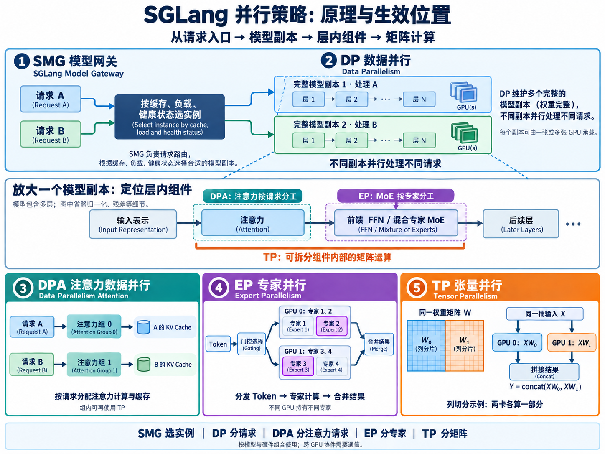

# 1.3 并行策略与模型网关(Parallelism and Model Gateway)

## 前置总结：从请求入口看到模型内部(学习补充)

按 **SMG → DP → 模型组件(DPA、EP) → TP** 的观察层次由外向内阅读。DPA 与 EP 分别作用于注意力和专家组件，TP 可进一步应用于组件内部。并行策略(Parallelism Strategy)可组合使用，提高吞吐量(Throughput)或分摊权重与计算；单请求延迟(Latency)还取决于计算和通信开销。

| 阅读层次 | 策略或组件 | 分工对象 | 简单例子 |
|---|---|---|---|
| 1. 请求路由 | SGLang 模型网关(SGLang Model Gateway，SMG) | 将请求送到合适的模型实例 | 根据缓存、负载和健康状态选择副本 |
| 2. 模型副本 | 数据并行(Data Parallelism，DP) | 完整模型副本分别处理不同请求 | 副本 1 处理 A，副本 2 处理 B |
| 3. 模型组件：注意力 | 注意力数据并行(Data Parallelism Attention，DPA) | 注意力部分按不同请求分工 | GPU 0 计算 A 的注意力并保存其 KV Cache，GPU 1 负责 B |
| 3. 模型组件：专家 | 专家并行(Expert Parallelism，EP) | 跨设备分配不同专家 | GPU 0 保存专家 1、2，GPU 1 保存专家 3、4 |
| 4. 张量计算 | 张量并行(Tensor Parallelism，TP) | 拆分同一层的矩阵运算 | 同一矩阵分成两部分，两卡协同计算 |

### 基本原理与生效位置

1. **SMG：在请求进入模型实例之前选择目的地。** 网关根据缓存、负载和健康状态，将请求 A、B 分配给合适的模型实例；模型计算由这些实例执行。
2. **DP：在完整模型副本之间分配不同请求。** 副本 1 处理 A，副本 2 同时处理 B，提高整体吞吐量。每个副本可以使用一张 GPU，也可以由多张 GPU 协同承载完整模型。
3. **DPA：在注意力组件中，按不同请求分配计算和缓存。** 注意力组 0 处理 A，并保存 A 的键值缓存(KV Cache)；组 1 处理 B，并保存 B 的缓存。一个注意力组可包含多张 GPU，组内仍可使用 TP；模型的其他组件可以采用其他并行策略。
4. **EP：在混合专家(MoE)层中，将不同专家放到不同 GPU。** 模型的门控网络(Gating Network)为 token 选择专家，将 token 分发给持有对应专家的 GPU，完成计算后收集并合并结果。例如，专家 1、2 放在 GPU 0，专家 3、4 放在 GPU 1。
5. **TP：在同一层的张量运算内部，把一个大矩阵拆给多张 GPU。** 多张 GPU 对同一批输入各算一部分，再通过通信合并结果；注意力中的投影矩阵、前馈网络(Feed-Forward Network，FFN)或专家内部的矩阵都可以采用这种分工。

观察模型实例内部时，可以沿着“输入表示 → 注意力(Attention) → 前馈网络(FFN)或混合专家(MoE) → 后续层”定位：DPA 作用于注意力组件，EP 作用于 MoE 的专家组件，TP 可进一步作用于这些组件中的矩阵运算。完整模型通常堆叠多个这样的层。

因此，组合部署时可以先由 SMG 选择 DP 副本，再在副本内部为注意力、专家和矩阵运算配置合适的并行方式；具体组合取决于模型结构、GPU 数量和通信开销。

同一请求的 MLA KV Cache 如何跨 GPU 分片，并行计算局部注意力后再合并结果，见 [2.4 解码上下文并行(Decode Context Parallelism)](<2.4 解码上下文并行(Decode Context Parallelism).md>)。

### 用两张 GPU 对比 TP 与 EP

上表的 DPA 示例每组只有一张 GPU；组内还可以组合 TP。TP 拆分同一层的矩阵计算，EP 按专家分配权重。例如，四个专家使用两张 GPU：

| 方式 | GPU 0 | GPU 1 | 选中专家 3 时 |
|---|---|---|---|
| 纯 TP | 专家 1～4 的矩阵各一半 | 专家 1～4 的矩阵各另一半 | 两卡协同计算专家 3 |
| 纯 EP | 完整的专家 1、2 | 完整的专家 3、4 | 路由到 GPU 1 计算 |

[](assets/parallelism-strategies-overview-4x3.png)

图中上部展示请求路由与完整模型副本，中部定位模型层内组件，下部展开 DPA、EP、TP 的分工。点击图片可查看大图。

## DP、DPA 与 SGLang DP 路由器

> **文档索引(Documentation Index)**：完整索引见 [llms.txt](https://docs.sglang.io/llms.txt)。通过该文件查找所有可用页面，再进一步阅读。

本指南介绍数据并行(Data Parallelism，DP)与注意力数据并行(Data Parallelism Attention，DPA)的区别、正确启用两种模式的方法，以及如何使用 SGLang 模型网关(SGLang Model Gateway，SMG)进行生产级 DP 部署。

## 数据并行(Data Parallelism，DP)

**数据并行(DP)** 是最常见的并行策略：将整个模型复制到多组 GPU 上，并行处理不同批次的请求。每组 GPU 处理独立请求。配合后面介绍的 SGLang 模型网关中的专用路由策略，推理服务系统的吞吐量(Throughput)可以实现接近线性的增长。

### 主要特点

- 每个副本(Replica)拥有完整的模型。
- 请求被分配、分散到不同副本。
- 对于简单 DP，单个请求的推理过程不需要副本之间通信。

## 注意力数据并行(Data Parallelism Attention，DPA)

**注意力数据并行(DPA)**，也称 DP Attention，是一种更高级的并行策略。它对多头潜在注意力(Multi-Head Latent Attention，MLA)模型的收益最明显，例如 DeepSeek、MiniMax 和 Kimi-K2，同时也支持 Qwen 等**标准注意力模型(Standard Attention Models)**。

### MLA 模型采用张量并行时的问题

张量并行(Tensor Parallelism，TP)是推理中最常见的并行策略，但对某些模型未必最高效。例如，DeepSeek 模型采用 MLA，只有**一个键值头(KV Head)**。如果在 8 张 GPU 上使用 TP，会导致：

- **键值缓存(KV Cache)重复**：所有 GPU 都保存重复的 KV Cache。
- **额外的显存占用**：限制可用的批大小(Batch Size)。
- **吞吐量下降**：显存约束进一步限制系统吞吐量。

### DPA 的工作方式

DPA 通过**专门对注意力组件(Attention Component)应用数据并行**来解决这些限制。

<table>
<tr>
<td width="36%" valign="top"><a href="https://mintcdn.com/lmsysorg/lCXzAEQmak7oHiXq/images/dpa.png?fit=max&amp;auto=format&amp;n=lCXzAEQmak7oHiXq&amp;q=85&amp;s=8a553be0ceb61b8d20241372e3b00370"></a></td>
<td width="64%" valign="top">
<strong>每个 DP 副本：</strong>
<ul>
<li>独立处理不同批次，可以处于不同的前向执行模式(Forward Mode)：预填充(Prefill)、解码(Decode)或空闲(Idle)。</li>
<li>维护自己的 KV Cache，避免重复存储。</li>
<li>利用节省的显存，支持显著增大的批大小。</li>
</ul>
<strong>DPA + EP 的通信模式：</strong>
<ul>
<li><strong>全互连分发(All2All Dispatch)：</strong>根据门控决策(Gating Decisions)，将词元(Token)路由到专家子组。</li>
<li><strong>全互连合并(All2All Combine)：</strong>将专家的计算结果收集回对应 token 的原始位置。</li>
</ul>
</td>
</tr>
</table>

### DPA 的主要收益

1. **显著减少 KV Cache 显存占用**：每个 DP 副本只保存自己所处理批次的 KV Cache。
2. **支持更大的批大小**：节省的显存可以容纳更大的批次。
3. **提高解码吞吐量**：对采用 MLA 的模型，吞吐量收益尤其明显。
4. **支持独立的前向执行模式**：各 DP 副本可以分别处于 Prefill、Decode 或 Idle 状态，在注意力计算期间独立处理分配给自己的批次。

### 在 MoE 模型中结合 DPA 与专家并行

对于 DeepSeek 等混合专家模型(Mixture of Experts，MoE)，DPA **通常**与专家并行(Expert Parallelism，EP)搭配，以获得大规模部署下的最佳吞吐量。**DPA 不要求必须启用 EP**：如果部署不需要专家分片(Expert Sharding)，可以单独启用 DPA。

- 将单张 GPU 无法容纳的 256 个以上专家的权重分散到多张 GPU。
- 通过 DeepEP 实现高效的全互连(All-to-All)词元路由。
- 扩展到大型集群，吞吐量相较普通 TP 最高可达 5 倍。

### DeepSeek 推荐配置

```bash
python -m sglang.launch_server \
    --model-path deepseek-ai/DeepSeek-V3 \
    --tp 8 \
    --dp-size 8 \
    --ep 8 \
    --enable-dp-attention \
    --moe-a2a-backend deepep \
    --moe-runner-backend deep_gemm
```

> **注意：**使用 `--enable-dp-attention` 时，必须显式设置 `--dp-size`。如果 `dp_size` 为默认值 1，DPA 将被关闭。

有关 DeepEP、双批次重叠(Two-Batch Overlap，TBO)和专家并行负载均衡(Expert Parallelism Load Balancer，EPLB)的详细配置，参见[专家并行](../docs/docs/advanced_features/expert_parallelism.mdx)。

### 支持的模型

DPA 支持以下模型架构：

- **MLA 模型**，DPA 在这类模型上收益最明显：
  - DeepSeek 系列(DeepSeek-V2、DeepSeek-V3、DeepSeek-R1)。
  - MiniMax 模型。
  - Kimi-K2。
  - 其他使用 MLA 架构的模型。
- **标准注意力模型**也受支持：
  - Qwen 模型，参见 [PR #6121](https://github.com/sgl-project/sglang/pull/6121)。

对于 Llama 等采用标准分组查询注意力(Grouped-Query Attention，GQA)的模型，通常推荐标准 DP 或 TP。

要启用 DPA，在服务启动命令中添加 `--enable-dp-attention`。

### 启用逻辑

DPA 通过服务端参数显式启用，可以使用命令行或配置文件。必须同时设置 `--dp-size` 和 `--enable-dp-attention`：

```bash
python -m sglang.launch_server \
    --model-path deepseek-ai/DeepSeek-V3 \
    --tp 8 \
    --dp-size 8 \
    --enable-dp-attention
```

**重要：**`--dp-size` 必须大于 1，DPA 才能生效。当 `dp_size == 1`，即默认值时，`--enable-dp-attention` 会自动关闭。同时必须满足 `tp_size % dp_size == 0`。

### 使用 All-to-All 的 TP 语言模型输出头

`dp-lm-head` 保留完整权重，只计算本地批次。当每个进程(Rank)的批大小较小时，通用矩阵乘法(General Matrix Multiplication，GEMM)效率较低。现有的 `tp-lm-head` 可以提高 GEMM 效率，但会引入针对完整词表(Vocabulary)的大量全收集通信(All-Gather)。

因此，可以使用 All-to-All 消除高开销的 All-Gather，同时保持每个 Rank 小批次下的 GEMM 效率。各 Rank 只发送、接收本地数据行对应的词表分片，通信更轻量。

该优化在**解码节点采用纯 DPA 时默认启用**。可以使用 `--no-enable-tp-lm-head-all-to-all` 关闭，或使用 `--enable-tp-lm-head-all-to-all` 强制启用。

```bash
python -m sglang.launch_server \
    --model-path MODEL_PATH \
    --disaggregation-mode decode \
    --tp 8 \
    --dp-size 8 \
    --enable-dp-attention
```

预填充工作进程、预填充与解码混合部署的工作进程，以及其他并行策略，会回退到使用 All-Gather 的 TP 语言模型输出头(LM Head)。详情见 [PR #32313](https://github.com/sgl-project/sglang/pull/32313)。

### MLA 模型使用标准 DP

MLA 模型也支持标准 DP。要为 MLA 模型启用标准 DP，首先分别启动各个独立的模型副本；每个副本内部可以启用 DPA。随后启动 SMG，将所有副本连接到 SMG。下面详细介绍 SMG。

## 使用 SGLang 模型网关(SMG)实现现代数据并行

### 原生 DP 模式

SGLang 的原生数据并行(Native DP)通过启动参数 `--dp-size`，在单个 SGLang 实例中创建多个工作进程(Worker Process)，由 `DataParallelController` 管理。

```bash
# 原生 DP 模式
python -m sglang.launch_server \
    --model-path meta-llama/Meta-Llama-3.1-8B-Instruct \
    --dp-size 4
```

**限制：**

- 仅提供进程内置的负载均衡(Load Balancing)，例如 `round_robin`、`total_requests` 和 `total_tokens`。
- 不支持缓存感知路由(Cache-Aware Routing)。
- 可观测性(Observability)和指标有限。
- 不具备容错(Fault Tolerance)或熔断器(Circuit Breaker)。
- 不适合生产负载。

⚠️ **目前强烈不建议使用原生 DP。** 它主要存在于一些较旧、过时的强化学习(Reinforcement Learning，RL)框架中。各种需要数据并行的场景都可以使用 SMG。

### 基于 SMG 的 DP，推荐

SMG 从 2024 年 9 月开始开发，原名 SGLang DP Router，是专门使用 Rust 构建的生产级 DP 路由系统。它最初用于 DP 路由，后来扩展到 RL、预填充与解码分离(Prefill–Decode Disaggregation，PD 分离)等场景。本指南仅讨论 SMG 在 DP 路由中的用法；其他用途参见 [SGLang 模型网关文档](../docs/docs/advanced_features/sgl_model_gateway.mdx)。

> 为了获得最佳的生产级路由性能，并将开销降至极低水平，我们使用 Rust 构建 SMG，而非 Python，因为 Python 的速度始终不够快。

**强烈推荐生产环境使用 SGLang 模型网关(SMG)实现数据并行。** 与原生 DP 相比，SMG 具有显著优势。

```bash
# 基于 SMG 的 DP 模式，推荐
python -m sglang_router.launch_server \
    --model-path meta-llama/Meta-Llama-3.1-8B-Instruct \
    --dp-size 4
```

⚠️ **SMG 与原生／朴素 DP(Naive DP)都使用 `--dp-size` 参数，但启动入口不同：**原生 DP 使用 `python -m sglang.launch_server`，SMG 使用 `python -m sglang_router.launch_server`。

**基于 SMG 的 DP 的优势：**

| 功能 | 原生 DP | 基于 SMG 的 DP |
|---|---|---|
| 负载均衡(Load Balancing) | 进程内置策略 | 缓存感知、二选一(Power of Two)等高级策略 |
| 缓存感知(Cache Awareness) | 不支持 | 支持，显著提高缓存命中率 |
| 吞吐量(Throughput) | 基准水平 | 显著提升 |
| 多节点支持(Multi-Node Support) | 有限 | 完整支持 |
| 工作进程健康监控(Worker Health Monitoring) | 基础能力 | 熔断器、健康检查 |
| 可靠性(Reliability) | 基础能力 | 重试、限流、排队 |
| 可观测性(Observability) | 基础指标 | 40 多项 Prometheus 指标、OpenTelemetry |
| 动态增删工作进程(Hot Worker Add/Remove) | 不支持 | 支持 |

### SMG 的性能

对于具有共享前缀(Shared Prefix)的负载，SMG 的缓存感知路由策略可以显著提高性能：

| 指标 | 未使用缓存感知路由 | 使用缓存感知 SMG |
|---|---:|---:|
| 吞吐量(Token/s) | 82,665 | 158,596，提升 92% |
| 缓存命中率(Cache Hit Rate) | 20% | 75%，相对提升 275% |

基准测试来自 [SGLang v0.4 博客](https://lmsys.org/blog/2024-12-04-sglang-v0-4/)，采用包含多个长前缀分组的负载、8 张 A100 80GB GPU，`dp-size=8`。

### 何时使用哪种模式

**使用原生 DP 的场景：**

- ~~永远不要使用原生／朴素 DP。~~
- 作为 DP 路由的学习材料。

**使用基于 SMG 的 DP 的场景：**

- 任何需要 DP 的场景。
- 生产部署。
- 多节点分布式部署。
- 具有共享前缀的负载，即缓存复用潜力较高的负载。
- 需要高可用性(High Availability)与可靠性。
- 需要详细的可观测性和指标。
- 希望构建高效的 RL 轨迹生成(Rollout)系统。

对于 RL 轨迹生成系统，SMG 明显优于朴素 DP 路由有**四个关键原因**，详情见 [RL 中的负载均衡路由器](../docs/docs/advanced_features/sglang_for_rl.mdx#load-balancing-router)。

### SMG 快速开始

**安装：**

```bash
pip install sglang-router
# 或者
pip install "sglang[all]"
```

**方案 A：同时启动工作进程与 SMG，最简单。**

这是最容易开始的方式：SMG 与工作进程一起启动。

```bash
python -m sglang_router.launch_server \
    --model-path meta-llama/Meta-Llama-3.1-8B-Instruct \
    --dp-size 4 \
    --host 0.0.0.0 \
    --port 30000
```

**方案 B：分别启动，适合多节点。**

在多台机器上进行分布式部署时，先在各节点启动工作进程：

```bash
# 节点 1
python -m sglang.launch_server \
    --model-path meta-llama/Meta-Llama-3.1-8B-Instruct \
    --port 8000

# 节点 2
python -m sglang.launch_server \
    --model-path meta-llama/Meta-Llama-3.1-8B-Instruct \
    --port 8000
```

然后启动 SMG，指定这些工作进程的地址：

```bash
python -m sglang_router.launch_router \
    --worker-urls http://node1:8000 http://node2:8000 \
    --policy cache_aware \
    --host 0.0.0.0 \
    --port 30000
```

**方案 C：动态注册工作进程。**

适用于需要动态增加或移除工作进程的弹性部署(Elastic Deployment)：

```bash
# 先启动 SMG
python -m sglang_router.launch_router \
    --policy cache_aware \
    --host 0.0.0.0 \
    --port 30000

# 动态注册工作进程
curl -X POST http://localhost:30000/workers \
    -H "Content-Type: application/json" \
    -d '{"url": "http://worker1:8000"}'

curl -X POST http://localhost:30000/workers \
    -H "Content-Type: application/json" \
    -d '{"url": "http://worker2:8000"}'
```

### 负载均衡策略

SMG 支持多种负载均衡策略：

| 策略 | 说明 | 最适合的场景 |
|---|---|---|
| `cache_aware` | 结合缓存局部性(Cache Locality)与负载均衡 | 推荐用于大多数负载 |
| `round_robin` | 按顺序轮流选择工作进程 | 简单、可预测的请求分配 |
| `random` | 随机选择工作进程 | 基线对照、测试 |
| `power_of_two` | 随机选取两个工作进程，选择负载较轻者 | 低延迟要求 |

**缓存感知策略，默认且推荐。**

缓存感知策略可以为大多数负载提供最佳性能：

```bash
python -m sglang_router.launch_router \
    --worker-urls http://worker1:8000 http://worker2:8000 \
    --policy cache_aware \
    --cache-threshold 0.5 \
    --balance-abs-threshold 32 \
    --balance-rel-threshold 1.5 \
    --eviction-interval-secs 120 \
    --max-tree-size 67108864
```

**工作方式：**

1. 根据请求历史，为每个工作进程维护一棵近似的基数树(Radix Tree)。
2. 将请求路由到前缀匹配程度最高，即最可能命中缓存的工作进程。
3. 负载不均衡时，回退到最短队列路由。
4. 自动淘汰旧条目，防止内存溢出。

### 最佳实践

1. **首先使用 `cache_aware` 策略**：对大多数负载，它在缓存局部性与负载分布之间提供最佳平衡。
2. **生产环境使用 SMG**：优先使用 `sglang_router.launch_server`，获得比 `sglang.launch_server` 更好的可靠性与可观测性。
3. **启用健康检查(Health Check)**：配置 `--router-health-check-interval-secs`，自动发现并移除不健康的工作进程。

**采用上述最佳实践的推荐命令：**

```bash
python -m sglang_router.launch_server \
    --model-path meta-llama/Meta-Llama-3.1-8B-Instruct \
    --dp-size 4 \
    --router-policy cache_aware \
    --router-health-check-interval-secs 30 \
    --router-prometheus-port 10001 \
    --host 0.0.0.0 \
    --port 30000
```

熔断、重试、Prometheus 指标和 Kubernetes 集成等高级配置，参见 [SGLang 模型网关文档](../docs/docs/advanced_features/sgl_model_gateway.mdx)。

### 验证流量分布

启动 SMG 后，确认流量被正确分发。

**1. 检查工作进程状态：**

```bash
curl http://localhost:30000/workers
```

**2. 检查负载分布：**

```bash
curl http://localhost:30000/get_loads
```

**3. 监控指标，需启用 Prometheus：**

```text
# 需要关注的关键指标
smg_router_requests_total{model="..."}
smg_worker_requests_active{worker="..."}
sglang_cache_hit_rate{source="..."}
```

详细指标和监控配置，参见 [SGLang 模型网关文档](../docs/docs/advanced_features/sgl_model_gateway.mdx)。

## 参考

| 策略 | 使用场景 | 主要收益或特点 |
|---|---|---|
| 原生 DP：`--dp-size` | 不使用 | 容易理解，非 Rust 实现 |
| 基于 SMG 的 DP | 生产环境，推荐 | 缓存感知路由、高可用 |
| DPA：`--dp-size N --enable-dp-attention` | DeepSeek／MLA 模型 | 消除 KV Cache 重复存储，提高吞吐量 |
| DPA + EP | DeepSeek MoE 模型 | 相较普通 TP，显著提高吞吐量 |

**DeepSeek 推荐的生产配置：**

1. 注意力层启用 **DPA**：`--dp-size 8 --enable-dp-attention`。
2. MoE 层启用 **EP**：`--ep 8 --moe-a2a-backend deepep`。
3. 使用 **SMG**，并选择 **`cache_aware`** 策略。

**相关文档：**

- [专家并行](../docs/docs/advanced_features/expert_parallelism.mdx)：DeepEP、双批次重叠和 EPLB。
- [SGLang 模型网关](../docs/docs/advanced_features/sgl_model_gateway.mdx)：SMG 配置与故障排查。
- [大规模 EP 博客](https://lmsys.org/blog/2025-05-05-large-scale-ep/)：96 张 GPU 的部署指南。

## 术语与生词表(Terms and Vocabulary，学习补充)

缩写列出英文全称与含义；需要解释的英文单词附英式音标。

| 术语或单词 | 中文释义 | 简明英文释义 |
|---|---|---|
| SMG — SGLang Model Gateway | 模型网关：按缓存、负载和健康状态分发请求。 | A gateway that routes requests using cache, load, and health information. |
| DP — Data Parallelism | 数据并行：完整模型副本处理不同请求。 | Processing different requests with separate copies of a model. |
| DPA — Data Parallelism Attention | 注意力数据并行：按不同请求分配注意力计算和 KV Cache。 | Assigning different requests and their attention caches to separate device groups. |
| EP — Expert Parallelism | 专家并行：跨设备分配不同专家，并路由 token。 | Distributing experts across devices and routing tokens to them. |
| TP — Tensor Parallelism | 张量并行：跨设备拆分同一层的张量运算。 | Splitting a layer's tensor operations across devices. |
| MLA — Multi-Head Latent Attention | 多头潜在注意力：利用压缩的潜在表示保存注意力所需信息。 | Attention that uses a compact latent representation to reduce cache storage. |
| MoE — Mixture of Experts | 混合专家：按 token 选择部分专家参与计算。 | A model design that selects a subset of experts for each token. |
| GQA — Grouped-Query Attention | 分组查询注意力：多个查询头共享一组键值头。 | Attention in which groups of query heads share key and value heads. |
| KV Cache — Key-Value Cache | 键值缓存：保存历史 token 的注意力键值信息，供后续计算复用。 | Stored attention keys and values reused during later generation steps. |
| Parallelism /ˈpærəlelɪzəm/ | 并行：同时执行多个计算任务。 | Doing several computing tasks at the same time. |
| Replica /ˈreplɪkə/ | 副本：用于处理请求的模型复制实例。 | A copy of a model used to process requests. |
| Latent /ˈleɪtənt/ | 潜在的：在 MLA 中用于描述潜在表示。 | Existing in a hidden or indirect form. |
| Throughput /ˈθruːpʊt/ | 吞吐量：单位时间内完成的处理量。 | The amount of work a system completes in a given time. |
| Sharding /ˈʃɑːdɪŋ/ | 分片：将数据或权重拆分到不同设备。 | Dividing data or model weights into parts stored on different devices. |
| Eviction /ɪˈvɪkʃən/ | 淘汰：移除旧缓存条目以释放空间。 | Removing stored items to make room for new ones. |
