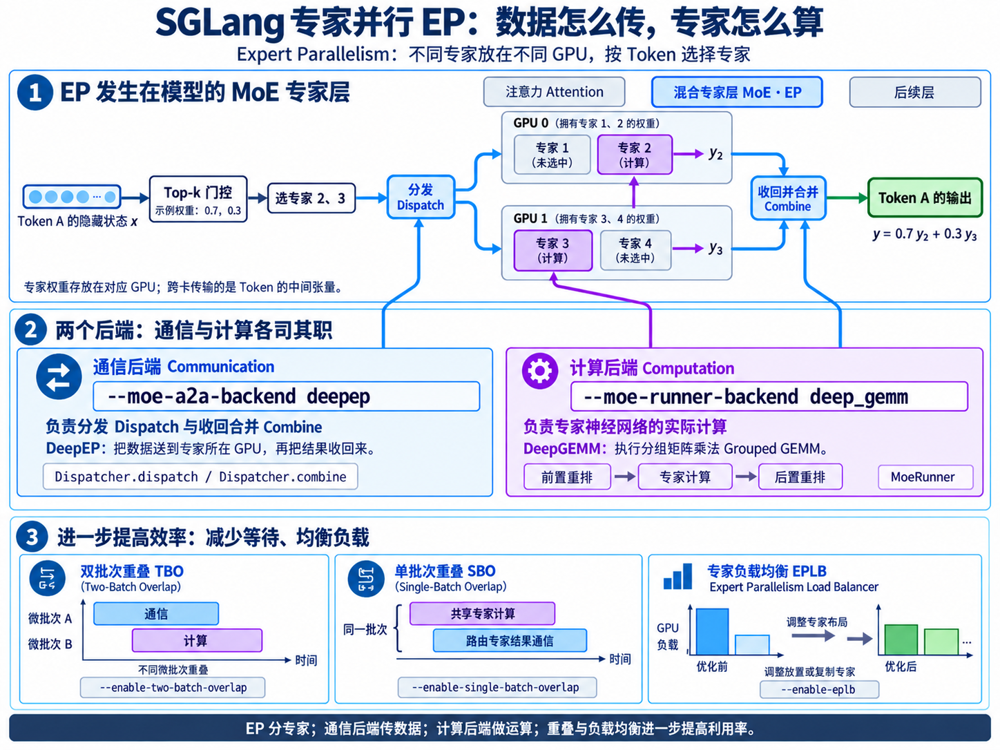
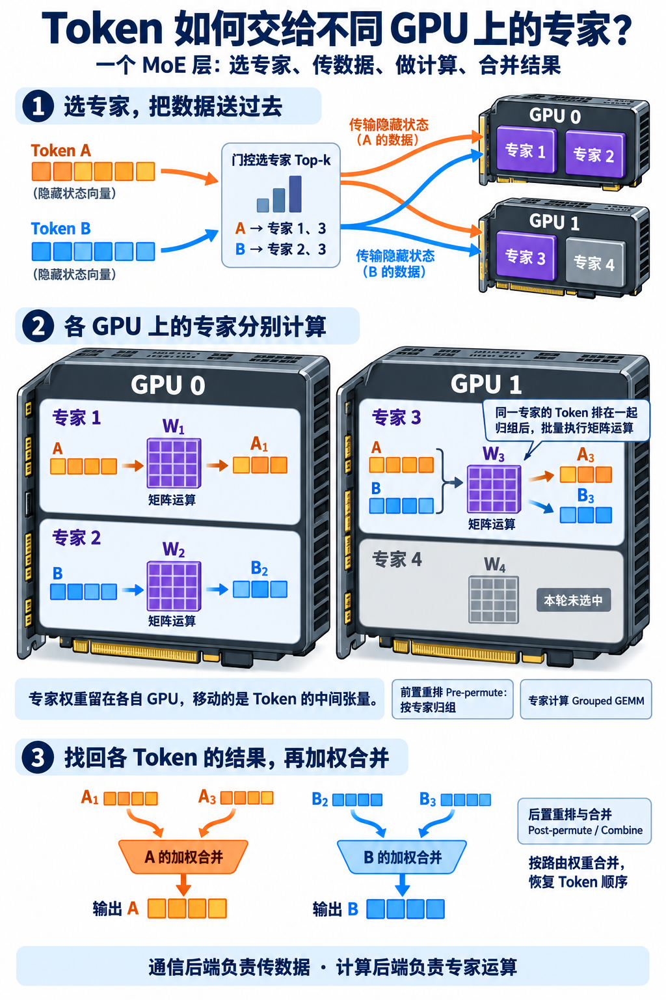

# 1.4 专家并行(Expert Parallelism)

> 专家并行(Expert Parallelism，EP)的核心，就是把 MoE 的不同专家分布到多张 GPU 上，让被选中的专家并行计算。

> **文档索引(Documentation Index)**
>
> 完整文档索引：[llms.txt](https://docs.sglang.io/llms.txt)。通过此文件查找所有可用页面，再进一步阅读。

SGLang 的专家并行(Expert Parallelism，EP)将混合专家模型(Mixture of Experts，MoE)的专家权重分布到多个设备上，解决显存瓶颈，并支持高性能推理的高效扩展。对于大规模 MoE 模型的推理服务，这一点尤其重要：词元(Token)会被动态路由到不同 GPU 上的专门化专家。

通过优化的全互连通信(All-to-All Communication)和分组通用矩阵乘法(Grouped GEMMs)，EP 可以降低延迟、提高吞吐量，并减少 GPU 空闲时间。

SGLang 的 EP 采用模块化框架，具有良好的可扩展性：无需重构核心逻辑，即可集成自定义计算内核(Kernel)、后端(Backend)和优化方案，支持不同硬件与量化方案(Quantization Scheme)。

**专家并行科普图（学习补充）**

<a href="assets/expert-parallelism-overview-4x3.png"></a>

图中以一个 Token 选择两位专家为例，展示跨 GPU 分发、专家计算和加权合并；下方说明通信与计算后端的分工，以及重叠执行、专家负载均衡的作用。点击图片可查看大图。

## 支持的后端与选择指南

SGLang 的 EP 集成了多种高效后端，适用于不同场景，允许用户精细控制性能取舍。通过以下命令行参数选择后端：

- `--moe-a2a-backend`：选择全互连通信(All-to-All)后端。
- `--moe-runner-backend`：选择 MoE 计算后端。

### 全互连通信后端

| 后端 | 说明 | 使用场景 |
|---|---|---|
| **`none`，默认值** | 禁用 EP 的 All-to-All 通信，使用全规约(All-Reduce)或全收集(All-Gather)进行 token 分发。 | EP 与张量并行(Tensor Parallelism，TP)混合部署。 |
| `deepep` | DeepEP 是用于 MoE 模型高效 token 重分布(Token Shuffling)的通信库。 | 大规模 EP 部署。 |
| `mooncake` | 面向弹性推理(Elastic Inference)的 DeepEP 扩展，利用远程直接内存访问(Remote Direct Memory Access，RDMA)实现高性能数据传输。 | 弹性 EP 推理服务。 |
| `nixl` | [NIXL-EP](https://github.com/ai-dynamo/nixl/tree/main/examples/device/ep) 是基于 NVIDIA [NIXL](https://github.com/ai-dynamo/nixl) 框架构建的弹性 EP 通信库，原生支持 RDMA 和 NVLink。 | 支持容错(Fault Tolerance)和动态扩缩容(Dynamic Scaling)的弹性 EP 服务。 |
| `mori` | MORI-EP 是 AMD 原生的 All-to-All 通信实现，针对 ROCm 优化。 | AMD GPU 部署。 |
| `flashinfer` | FlashInfer 的 All-to-All 实现。 | 大规模 EP 部署。 |
| `ascend_fuseep` | 昇腾神经网络处理器(Ascend NPU)原生的融合式 All-to-All 通信。 | 昇腾 NPU 部署。 |
| `pplx` | [pplx-kernels](https://github.com/perplexityai/pplx-kernels) 是 Perplexity 基于 NVSHMEM 实现的 All-to-All 分发(Dispatch)与合并(Combine)内核。仅支持低延迟掩码模式(Low-Latency Masked Mode)，面向 Hopper 上采用 FP8 和 DeepGEMM 的 MoE 模型。需要 NVSHMEM 3.2.5、`nvshmem4py`、`cuda-python`，以及预编译的 `libpplx_kernels.so`，目标架构为 `sm_90a`。 | Hopper 上低延迟解码(Decode)阶段的 EP。 |

DeepEP 和 Mooncake 后端支持两种 token 分发模式：

- `normal`：针对高吞吐量的预填充(Prefill)负载优化。
- `low_latency`：针对低延迟的解码(Decode)负载优化，并兼容 CUDA 计算图(CUDA Graph)。

MORI 后端目前仅支持 `normal` 模式。

NIXL-EP 和 PPLX 目前使用低延迟模式，并支持 CUDA Graph。其中，PPLX 复用 DeepEP 的低延迟掩码专家计算路径。

建议设置 `--deepep-mode auto`，在运行时自动切换分发模式。调试或开发时，可以使用 `--deepep-mode normal` 或 `--deepep-mode low_latency` 固定模式。

目前，DeepEP、Mooncake、NIXL-EP、`ascend_fuseep`、`pplx` 和 MORI **仅支持 `ep_size = tp_size`** 的情况。

对于 EP 与 TP 混合部署，即 `ep_size < tp_size`，仅支持 `none` 后端，使用基于 All-Reduce 或 All-Gather 的分发方式。

此外，`pplx` 还要求开启 `--enable-dp-attention`，并且至少具有两个数据并行(Data Parallelism，DP)组，即满足：

```text
tp_size / attention_tp_size > 1
```

否则无法构建 pplx-kernels 的 `AllToAll`。

### MoE 计算后端

| 后端 | 说明 | 使用场景 |
|---|---|---|
| **`auto`，默认值** | 根据模型结构、硬件架构，例如 NVIDIA Ampere、Hopper、Blackwell，量化方案，例如 FP8、FP4，以及运行时条件，自动选择最佳后端。 | 通用部署，无需用户干预即可兼顾兼容性与性能。 |
| `triton` | 基于 Triton 实现分组通用矩阵乘法(Grouped GEMMs)。为了获得更高性能，强烈建议创建[调优配置](https://github.com/sgl-project/sglang/blob/main/benchmark/kernels/fused_moe_triton/README.md)。 | 自定义内核开发，或需要高可扩展性及 Torch 编译支持的场景。 |
| `deep_gemm` | 针对 MoE 矩阵乘法优化的 DeepGEMM 后端。Prefill 使用连续布局(Contiguous Layout)，Decode 使用掩码布局(Masked Layout)，通常通过即时编译(Just-in-Time Compilation，JIT)提高性能。 | 使用 FP8 分块量化(Block-Wise Quantization)的大规模 EP 部署。 |
| `cutlass` | 基于 CUTLASS 的高效通用矩阵乘法(GEMM)后端。 | 支持 CUTLASS 的 NVIDIA 架构。 |
| `flashinfer_trtllm` | FlashInfer 与 TensorRT-LLM 集成，加速 MoE 计算，支持 FP4 通信算子和高性能 GEMM。 | 使用 TRT-LLM 的 Blackwell。 |
| `flashinfer_trtllm_routed` | FlashInfer 与 TensorRT-LLM 集成，加速路由式 MoE 计算，使用 SGLang 计算的 Top-k 专家分配结果和权重。兼容 FlashInfer All-to-All。 | 使用 TRT-LLM 的 Blackwell。 |
| `flashinfer_cutlass` | FlashInfer 与 CUTLASS 结合，为 MoE 层提供高性能分组 GEMM，高效处理 FP4/FP8 量化。兼容 FlashInfer All-to-All。 | Blackwell 上的 FP4/FP8 模型。 |
| `flashinfer_mxfp4` | 针对 MoE 执行器(MoE Runner)中的 MXFP4，即混合 FP4 量化优化的 FlashInfer 变体，侧重于节省显存的低精度推理。 | 使用 MXFP4 的低精度模型。 |
| `flashinfer_cutedsl` | FlashInfer 使用自定义领域专用语言(Domain-Specific Language，DSL)，灵活、高效地生成 MoE 内核，并集成 ModelOpt FP4 量化。兼容 FlashInfer All-to-All。 | 使用 NVFP4 的低精度模型。 |

### 示例

使用 DeepEP 和 DeepGEMM 启动 DeepSeek-V3：

```bash
python -m sglang.launch_server --model-path deepseek-ai/DeepSeek-V3 --moe-a2a-backend deepep --moe-runner-backend deep_gemm --tp 8 --ep 8
```

## 可扩展的 EP 框架

SGLang 的 EP 框架提供模块化抽象，方便集成自定义内核、后端和优化方案。它将 MoE 前向计算(Forward Pass)拆分为以下阶段：

**分发(Dispatch) → 前置重排(Pre-Permute) → 核心执行器(Core Runner) → 后置重排(Post-Permute) → 合并(Combine)**

因此，无需重构核心逻辑即可进行扩展。

### 框架概览

该框架以 `FusedMoE` 为统一入口，形成统一、可扩展的结构。主要组件包括：

- **分发器(Dispatcher)**：管理 DeepEP 等后端的分发与合并操作，通过实现 `BaseDispatcher` 子类进行扩展。
- **MoE 执行器(MoeRunner)**：通过 `MoeRunnerCore` 的具体实现，例如 `TritonRunnerCore`，组织分组 GEMM 的执行。
- **重排方法池(PermuteMethodPool)**：自动注册布局转换。动态模式通过 `register_pre_permute` 和 `register_post_permute` 注册前置、后置重排；静态模式通过 `register_fused_func` 注册兼容 `torch.compile` 的融合操作(Fused Operation)。
- **TopK 路由器(TopK Router)**：提供与后端无关的专家选择。

该设计通过 `--moe-a2a-backend` 和 `--moe-runner-backend` 支持多种后端，并通过标准化的 `apply()` 方法集成量化功能。计算流程如下：

<table width="100%" style="width:100%; table-layout:fixed;">
<thead>
<tr>
<th width="50%">文本调用链</th>
<th width="50%">GPU 与专家协作示意（学习补充，点击放大）</th>
</tr>
</thead>
<tbody>
<tr>
<td width="50%" valign="top" style="width:50%; overflow:hidden;">
<pre style="margin:0; padding:16px; box-sizing:border-box; height:572px; font-size:12px; line-height:18px; overflow:auto;"><code style="font-size:inherit; line-height:inherit;">[input_hidden_states]
          |
          v
     TopK.forward -&gt; select_experts / triton_kernels.routing / bypass
          |
          v
     [TopKOutput]
          |
          v
   FusedMoE.forward -&gt; Dispatcher.dispatch -&gt; DeepEP / bypass
          |                     |
          |                     v
          |              [DispatchOutput]
          |                     |
          |                     v
          |             quant_method.apply -&gt; MoeRunner.forward
          |                     |              |
          |                     |              v
          |                     | pre-permute + grouped_gemm + post-permute
          |                     |              |
          |                     |--------------
          |                     v
          |               [CombineInput]
          |                     |
          |                     v
          |            Dispatcher.combine -&gt; DeepEP / bypass
          |                     |
          |---------------------
          v
[final_hidden_states]</code></pre>
</td>
<td width="50%" valign="top" style="width:50%;">
<a href="assets/expert-parallelism-token-gpu-2x3.png"></a>
</td>
</tr>
</tbody>
</table>

详情参见 [MoE 重构路线图](https://github.com/sgl-project/sglang/issues/8715)。

### 实现新后端

添加新后端的步骤如下：

1. 对于新的 All-to-All 分发器，实现 `BaseDispatcher` 子类，并提供 `dispatch` 和 `combine` 方法。
2. 对于新的 MoE 计算后端，定义 `MoeRunnerCore` 子类，实现分组 GEMM 等核心操作。
3. 为分发器或模型执行器定义新的输入、输出格式，例如 `RunnerInput`、`RunnerOutput`。
4. 注册重排与还原重排(Permute/Unpermute)方法，确保兼容性：
   - **融合模式(Fused Mode)**：静态、兼容 `torch.compile`，使用 `register_fused_func` 注册端到端操作。
   - **重排模式(Permute Mode)**：动态模式，通过 `register_pre_permute` 和 `register_post_permute` 支持灵活布局。

完整修改，包括类型提示(Type Hints)和配置扩展，参见 [MoE 重构实现 PR](https://github.com/sgl-project/sglang/pull/9269)。

### 示例

实现示例参见 [moe_runner/triton.py](https://github.com/sgl-project/sglang/blob/main/python/sglang/srt/layers/moe/moe_runner/triton.py)。该文件展示了基于 Triton 的分组 GEMM，以及融合函数和重排函数的注册方式。

## 计算与通信重叠(Computation and Communication Overlap)

SGLang 的 EP 使用计算与通信重叠技术，将通信延迟隐藏在计算过程中，尽可能提高 MoE 层的 GPU 利用率。

### 双批次重叠(Two-Batch Overlap，TBO)

TBO 将请求拆分为微批次(Micro-Batch)，交错执行注意力计算和分发、合并操作。

执行图中的让出执行点(Yield Point)允许暂停当前执行，以便与其他操作重叠，在避免显存峰值突增的同时提高整体吞吐量：

```python
operations = [
    self._forward_attn,
    YieldOperation(),  # 与前一个微批次的分发操作重叠
    self._forward_dispatch,
    self._forward_mlp,
    YieldOperation(),  # 与合并操作重叠
    self._forward_combine,
]
```

用户需要指定 `--enable-two-batch-overlap`，吞吐量最高可提升至 2 倍。详情参见[大规模 EP 博客中的双批次重叠部分](https://lmsys.org/blog/2025-05-05-large-scale-ep/#two-batch-overlap)。

### 单批次重叠(Single-Batch Overlap，SBO)

SGLang 引入分发器钩子系统(Dispatcher-Hook System)，支持单批次内部的操作重叠，例如将共享专家(Shared Experts)的计算与通信重叠，同时将相关逻辑分散到各个模块中，提高模块化程度。

这些钩子(Hook)在 `dispatch` 和 `combine` 操作前后执行，无需修改核心 MoE 模块。这种设计简化了接口、降低了耦合度，并提高了可扩展性。

实现细节，以及共享专家计算与 DeepEP 的合并操作重叠的示例，参见 [PR #13327](https://github.com/sgl-project/sglang/pull/13327)。

使用 `--enable-single-batch-overlap` 可以启用此功能。

## 工作负载均衡器(Workload Balancer)

SGLang 集成了 DeepSeek 的[专家并行负载均衡器(Expert Parallelism Load Balancer，EPLB)](https://github.com/deepseek-ai/EPLB)，用于解决 MoE 模型中的路由不均衡问题。

EPLB 分析专家激活统计(Expert Activation Statistics)，计算最佳专家布局，通过有针对性地放置或复制专家，尽量减小不同 GPU 的利用率差异，减少空闲周期，并提高可扩展性。

通过 `--enable-eplb` 启用 EPLB。

为了获得最佳性能，应增大批大小(Batch Size)，使专家激活统计更加稳定，并配置周期性再均衡(Periodic Rebalancing)，例如每处理 1000 个请求进行一次，以适应不断变化的工作负载。

模拟实验表明，EPLB 可以显著改善负载均衡程度，即**平均计算时间与最大计算时间之比**；这一指标与吞吐量提升高度相关。

更多信息参见：

- [大规模 EP 博客中的 EPLB 部分](https://lmsys.org/blog/2025-05-05-large-scale-ep/#expert-parallelism-load-balancer)。
- [EPLB 仓库](https://github.com/deepseek-ai/eplb)。

---

## 术语与生词表(Terms and Vocabulary，学习补充)

| 术语或单词 | 中文释义 | 简明英文释义 |
|---|---|---|
| EP — Expert Parallelism | 专家并行：将不同专家的权重分布到不同设备。 | Distributing experts across devices for parallel computation. |
| MoE — Mixture of Experts | 混合专家：为每个 token 选择部分专家参与计算。 | A model that selects a subset of experts for each token. |
| TP — Tensor Parallelism | 张量并行：跨设备拆分同一层的张量运算。 | Splitting a layer’s tensor operations across devices. |
| GEMM — General Matrix Multiplication | 通用矩阵乘法：模型计算中的基础矩阵运算。 | An operation that multiplies matrices. |
| RDMA — Remote Direct Memory Access | 远程直接内存访问：设备间直接访问、传输内存数据的机制。 | Accessing another machine’s memory directly over a network. |
| TBO — Two-Batch Overlap | 双批次重叠：交错执行两个微批次的计算与通信。 | Overlapping computation and communication across two micro-batches. |
| SBO — Single-Batch Overlap | 单批次重叠：让同一批次中的计算与通信重叠。 | Overlapping operations within a single batch. |
| EPLB — Expert Parallelism Load Balancer | 专家并行负载均衡器：调整专家布局以均衡设备负载。 | A component that balances device workloads by arranging experts. |
| Expert /ˈekspɜːt/ | 专家；在 MoE 中指参与特定 token 计算的子网络。 | A specialized subnetwork selected to process a token. |
| Dispatch /dɪˈspætʃ/ | 分发：将 token 发送到对应专家所在的设备。 | To send work to the device that will process it. |
| Kernel /ˈkɜːnəl/ | 计算内核：在设备上执行特定计算的程序。 | A program that performs a specific computation on a device. |
| Overlap /ˈəʊvəlæp/ | 重叠：不同操作在时间上部分同时进行。 | A period when two operations run at the same time. |
| Buffer /ˈbʌfə/ | 缓冲区：临时存储待传输或待处理数据的内存区域。 | A memory area used to hold data temporarily. |
| Latency /ˈleɪtənsi/ | 延迟：操作开始后，到结果就绪所经历的时间。 | The time between starting an operation and receiving its result. |
