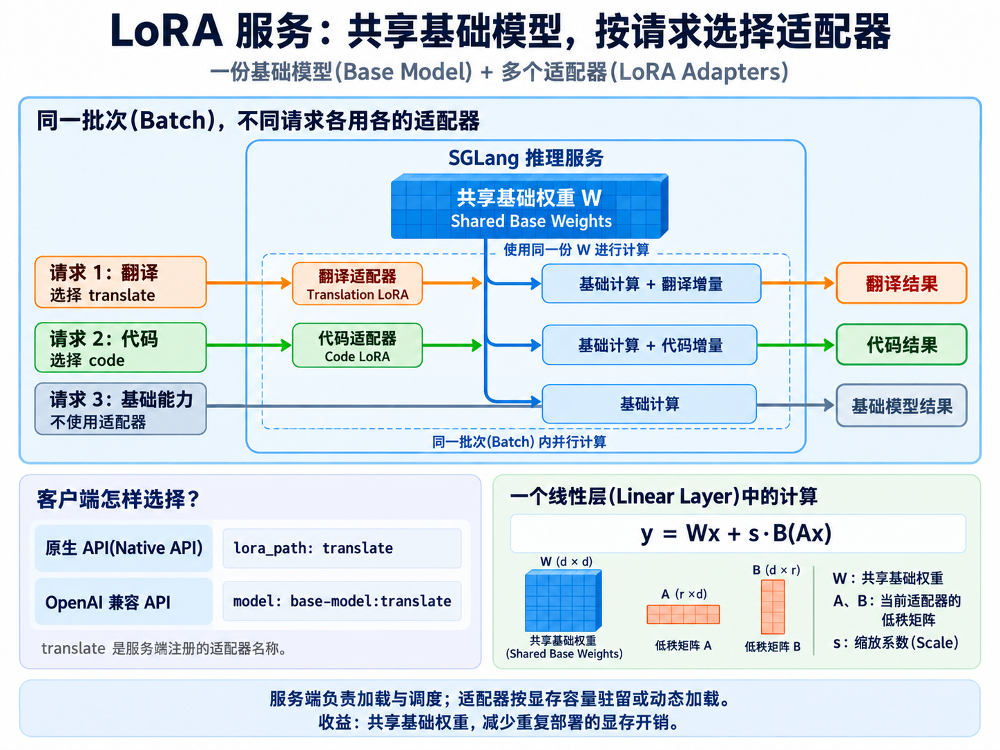

# 1.5 LoRA 服务(LoRA Serving)

> **核心概念（补充）：**LoRA 服务(LoRA Serving)让多个请求共享一份基础模型(Base Model)，客户端(Client)在每个请求中指定所使用的 LoRA 适配器(LoRA Adapter)。同一批次(Batch)中的不同请求也可以使用不同适配器，适配器的加载、显存驻留和调度由服务端管理。

<a href="assets/lora-serving-overview-4x3.png"></a>

图：多个请求共享基础权重，各自使用选中的适配器；右下角以方形权重矩阵演示一个线性层的计算。点击图片可查看大图。

> ## 文档索引(Documentation Index)
> 完整文档索引：[llms.txt](https://docs.sglang.io/llms.txt)。
> 进一步阅读前，可通过此文件查找所有可用页面。

SGLang 支持将 [LoRA 适配器(LoRA Adapter)](https://arxiv.org/abs/2106.09685)与基础模型(Base Model)配合使用。通过结合 [S-LoRA](https://arxiv.org/pdf/2311.03285) 和 [Punica](https://arxiv.org/pdf/2310.18547) 的技术，SGLang 可以高效支持同一个输入批次(Batch)中的不同序列使用不同的 LoRA 适配器。

## LoRA 服务参数(Arguments for LoRA Serving)

以下服务端参数与多 LoRA 服务(Multi-LoRA Serving)有关：

- `enable_lora`：为模型启用 LoRA 支持。为了向后兼容(Backward Compatibility)，如果提供了 `--lora-paths`，此参数会自动设为 `True`。

- `enable_lora_overlap_loading`：启用异步 LoRA 权重加载(Asynchronous LoRA Weight Loading)，使主机到设备传输(Host-to-Device Transfer，H2D)与 GPU 计算重叠。如果 LoRA 工作负载(Workload)的瓶颈在于适配器权重加载，例如频繁加载较大的 LoRA 适配器，可以启用此功能。

- `lora_paths`：要加载的 LoRA 适配器列表。每个适配器必须使用以下格式之一：`<PATH>`、`<NAME>=<PATH>`，或符合 `{"lora_name": str, "lora_path": str, "pinned": bool}` 结构的 JSON。

- `max_loras_per_batch`：每个批次最多使用的适配器数量。此参数会影响为多 LoRA 服务预留的显存(GPU Memory)，显存不足时应设置较小值。默认值为 `8`。

- `max_loaded_loras`：如果指定，则限制同时加载到 CPU 内存中的 LoRA 适配器最大数量。其值必须大于或等于 `max-loras-per-batch`。

- `lora_eviction_policy`：GPU 内存池(GPU Memory Pool)满时的 LoRA 适配器淘汰策略(Eviction Policy)。`lru` 表示最近最少使用(Least Recently Used)，是默认策略，缓存效率更高；`fifo` 表示先进先出(First-In-First-Out)。

- `lora_backend`：执行 LoRA 模块通用矩阵乘法(General Matrix Multiplication，GEMM)内核(Kernel)的后端(Backend)。目前支持 Triton LoRA 后端 `triton` 和分块 SGMV 后端(Chunked SGMV Backend) `csgmv`。后续将增加基于 CUTLASS 或 CUDA 内核的更快后端。

- `max_lora_rank`：需要支持的最大 LoRA 秩(Rank)。如果未指定，会根据 `--lora-paths` 提供的适配器自动推断。如果计划在服务启动后动态加载更高秩的适配器，就需要设置此参数。

- `lora_target_modules`：所有需要应用 LoRA 的目标模块(Target Module)的并集，例如 `q_proj`、`k_proj`、`gate_proj`。如果未指定，会根据 `--lora-paths` 中的适配器自动推断。如果计划在服务启动后动态加载目标模块不同的适配器，就需要设置此参数。也可以设为 `all`，为全部支持的模块启用 LoRA。不过，为额外模块启用 LoRA 会带来少量性能开销；对性能敏感的应用，建议只指定计划加载适配器的模块。

- `max_lora_chunk_size`：ChunkedSGMV LoRA 后端的最大分块大小(Chunk Size)，仅在 `--lora-backend csgmv` 时使用。较大的值可能改善性能，请根据硬件与工作负载调优。默认值为 `16`。

- `lora_drain_wait_threshold`：当任意 LoRA 适配器请求的等待时间超过此阈值（单位：秒）时，调度器(Scheduler)会选择性地排空(Drain)一个正在运行的适配器，以腾出空间。这可以防止少数适配器长期占用批次槽位(Batch Slot)，缓解高负载或负载不均时的极端尾延迟(Tail Latency)。设为 `0` 可禁用排空，也是默认值。

- `tp_size`：SGLang 支持将 LoRA 服务与张量并行(Tensor Parallelism，TP)结合使用。`tp_size` 控制参与张量并行的 GPU 数量。张量分片(Tensor Sharding)策略的更多细节见 [S-LoRA 论文](https://arxiv.org/pdf/2311.03285)。

客户端(Client)需要提供一个字符串列表作为输入批次，并提供一个与各输入序列对应的适配器名称列表。

## 使用方法(Usage)

### 使用单个适配器(Serving Single Adapter)

**注意：**SGLang 通过两类 API 支持 LoRA 适配器：

1. **OpenAI 兼容 API(OpenAI-Compatible API)**：`/v1/chat/completions`、`/v1/completions` 使用 `model:adapter-name` 语法。示例见 [OpenAI API 中使用 LoRA](https://docs.sglang.io/docs/basic_usage/openai_api_completions#using-lora-adapters)。

2. **原生 API(Native API)**：调用 `/generate` 时，在请求体(Request Body)中传入 `lora_path`，如下所示。

```python
import json
import requests

from sglang.test.doc_patch import launch_server_cmd
from sglang.utils import wait_for_server, terminate_process
```

```python
server_process, port = launch_server_cmd(
    # 将 max-loras-per-batch 设为 2：一个槽位用于适配器，另一个用于基础模型。
    """
python3 -m sglang.launch_server --model-path meta-llama/Meta-Llama-3.1-8B-Instruct \
    --enable-lora \
    --lora-paths lora0=algoprog/fact-generation-llama-3.1-8b-instruct-lora \
    --max-loras-per-batch 2 \
    --log-level warning \
"""
)

wait_for_server(f"http://localhost:{port}")
```

```python
url = f"http://127.0.0.1:{port}"
json_data = {
    "text": [
        "List 3 countries and their capitals.",
        "List 3 countries and their capitals.",
    ],
    "sampling_params": {"max_new_tokens": 32, "temperature": 0},
    # 第一个输入使用 lora0，第二个输入使用基础模型。
    "lora_path": ["lora0", None],
}
response = requests.post(
    url + "/generate",
    json=json_data,
)
print(f"Output 0: {response.json()[0]['text']}")
print(f"Output 1: {response.json()[1]['text']}")
```

```python
terminate_process(server_process)
```

### 使用多个适配器(Serving Multiple Adapters)

```python
server_process, port = launch_server_cmd(
    """
python3 -m sglang.launch_server --model-path meta-llama/Meta-Llama-3.1-8B-Instruct \
    --enable-lora \
    --lora-paths lora0=algoprog/fact-generation-llama-3.1-8b-instruct-lora \
    lora1=Nutanix/Meta-Llama-3.1-8B-Instruct_SFT_lora_4_alpha_16_humaneval_raw_json \
    --max-loras-per-batch 2 \
    --log-level warning \
"""
)

wait_for_server(f"http://localhost:{port}")
```

```python
url = f"http://127.0.0.1:{port}"
json_data = {
    "text": [
        "List 3 countries and their capitals.",
        "List 3 countries and their capitals.",
    ],
    "sampling_params": {"max_new_tokens": 32, "temperature": 0},
    # 第一个输入使用 lora0，第二个输入使用 lora1。
    "lora_path": ["lora0", "lora1"],
}
response = requests.post(
    url + "/generate",
    json=json_data,
)
print(f"Output 0: {response.json()[0]['text']}")
print(f"Output 1: {response.json()[1]['text']}")
```

```python
terminate_process(server_process)
```

### 动态加载 LoRA(Dynamic LoRA Loading)

除了在服务启动时通过 `--lora-paths` 指定全部适配器，也可以通过 `/load_lora_adapter` 和 `/unload_lora_adapter` API 动态加载与卸载 LoRA 适配器。

使用动态 LoRA 加载时，建议在启动阶段显式指定 `--max-lora-rank` 和 `--lora-target-modules`。为了向后兼容，如果未显式提供，SGLang 会根据 `--lora-paths` 推断这些值。但在这种情况下，必须确保动态加载的适配器与初始 `--lora-paths` 中适配器的形状(Shape，即秩和目标模块)一致，或者严格“小于”初始适配器所需的范围。

```python
lora0 = "Nutanix/Meta-Llama-3.1-8B-Instruct_SFT_lora_4_alpha_16_humaneval_raw_json"  # 秩(Rank)为 4，目标模块(Target Modules)为 q_proj, k_proj, v_proj, o_proj, gate_proj
lora1 = "algoprog/fact-generation-llama-3.1-8b-instruct-lora"  # 秩(Rank)为 64，目标模块(Target Modules)为 q_proj, k_proj, v_proj, o_proj, gate_proj, up_proj, down_proj
lora0_new = "philschmid/code-llama-3-1-8b-text-to-sql-lora"  # 秩(Rank)为 256，目标模块(Target Modules)为 q_proj, k_proj, v_proj, o_proj, gate_proj, up_proj, down_proj


# 下方的 `--target-lora-modules` 参数在技术上并非必需，因为服务会从已指定全部目标模块的 lora0 中推断。
# 这里添加此参数只是为了演示用法。
server_process, port = launch_server_cmd(
    """
    python3 -m sglang.launch_server --model-path meta-llama/Meta-Llama-3.1-8B-Instruct \
    --enable-lora \
    --cuda-graph-max-bs-decode 2 \
    --max-loras-per-batch 2 \
    --max-lora-rank 256
    --lora-target-modules all
    --log-level warning
    """
)

url = f"http://127.0.0.1:{port}"
wait_for_server(url)
```

加载适配器 `lora0`：

```python
response = requests.post(
    url + "/load_lora_adapter",
    json={
        "lora_name": "lora0",
        "lora_path": lora0,
    },
)

if response.status_code == 200:
    print("LoRA adapter loaded successfully.", response.json())
else:
    print("Failed to load LoRA adapter.", response.json())
```

加载适配器 `lora1`：

```python
response = requests.post(
    url + "/load_lora_adapter",
    json={
        "lora_name": "lora1",
        "lora_path": lora1,
    },
)

if response.status_code == 200:
    print("LoRA adapter loaded successfully.", response.json())
else:
    print("Failed to load LoRA adapter.", response.json())
```

检查推理输出(Inference Output)：

```python
url = f"http://127.0.0.1:{port}"
json_data = {
    "text": [
        "List 3 countries and their capitals.",
        "List 3 countries and their capitals.",
    ],
    "sampling_params": {"max_new_tokens": 32, "temperature": 0},
    # 第一个输入使用 lora0，第二个输入使用 lora1。
    "lora_path": ["lora0", "lora1"],
}
response = requests.post(
    url + "/generate",
    json=json_data,
)
print(f"Output from lora0: \n{response.json()[0]['text']}\n")
print(f"Output from lora1 (updated): \n{response.json()[1]['text']}\n")
```

卸载 `lora0`，并将其替换为另一个适配器：

```python
response = requests.post(
    url + "/unload_lora_adapter",
    json={
        "lora_name": "lora0",
    },
)

response = requests.post(
    url + "/load_lora_adapter",
    json={
        "lora_name": "lora0",
        "lora_path": lora0_new,
    },
)

if response.status_code == 200:
    print("LoRA adapter loaded successfully.", response.json())
else:
    print("Failed to load LoRA adapter.", response.json())
```

再次检查输出：

```python
url = f"http://127.0.0.1:{port}"
json_data = {
    "text": [
        "List 3 countries and their capitals.",
        "List 3 countries and their capitals.",
    ],
    "sampling_params": {"max_new_tokens": 32, "temperature": 0},
    # 第一个输入使用 lora0，第二个输入使用 lora1。
    "lora_path": ["lora0", "lora1"],
}
response = requests.post(
    url + "/generate",
    json=json_data,
)
print(f"Output from lora0: \n{response.json()[0]['text']}\n")
print(f"Output from lora1 (updated): \n{response.json()[1]['text']}\n")
```

```python
terminate_process(server_process)
```

### 使用 OpenAI 兼容 API(OpenAI-Compatible API Usage)

可以在 OpenAI 兼容 API 的 `model` 字段中，使用 `base-model:adapter-name` 语法指定 LoRA 适配器，例如 `qwen/qwen2.5-0.5b-instruct:adapter_a`。更多细节与示例见 [OpenAI API 文档](https://docs.sglang.io/docs/basic_usage/openai_api_completions)中的“使用 LoRA 适配器(Using LoRA Adapters)”部分。

### LoRA GPU 常驻(LoRA GPU Pinning)

另一项高级选项是在加载适配器时设置 `pinned`。适配器被设为常驻后，会固定占用一个可用的 GPU 内存池槽位(GPU Pool Slot)，槽位数量由 `--max-loras-per-batch` 配置；运行过程中不会被从显存中淘汰，而是一直驻留，直到被显式卸载。

当多个请求频繁使用同一个适配器时，这可以避免反复进行内存传输(Memory Transfer)和重新初始化(Reinitialization)，从而改善性能。但 GPU 内存池槽位有限，固定适配器会降低系统按需动态加载其他适配器的灵活性。常驻适配器过多可能导致性能下降；在极端情况下，即“常驻适配器数量等于 `max-loras-per-batch`”时，所有使用非常驻适配器的请求都可能停滞。因此，SGLang 目前将常驻适配器的最大数量限制为 `max-loras-per-batch - 1`，以避免意外的饥饿(Starvation)。

下面的示例启动一个服务，将 `lora1` 作为常驻适配器加载，将 `lora2` 和 `lora3` 作为普通（非常驻）适配器加载。这里有意用两种不同格式指定 `lora2` 和 `lora3`，展示两种格式都受支持。

```python
server_process, port = launch_server_cmd(
    """
    python3 -m sglang.launch_server --model-path meta-llama/Meta-Llama-3.1-8B-Instruct \
    --enable-lora \
    --cuda-graph-max-bs-decode 8 \
    --max-loras-per-batch 3 \
    --max-lora-rank 256 \
    --lora-target-modules all \
    --lora-paths \
        {"lora_name":"lora0","lora_path":"Nutanix/Meta-Llama-3.1-8B-Instruct_SFT_lora_4_alpha_16_humaneval_raw_json","pinned":true} \
        {"lora_name":"lora1","lora_path":"algoprog/fact-generation-llama-3.1-8b-instruct-lora"} \
        lora2=philschmid/code-llama-3-1-8b-text-to-sql-lora
    --log-level warning
    """
)


url = f"http://127.0.0.1:{port}"
wait_for_server(url)
```

也可以在动态加载适配器时将其设为常驻。下面的示例把 `lora2` 重新加载为常驻适配器：

```python
response = requests.post(
    url + "/unload_lora_adapter",
    json={
        "lora_name": "lora1",
    },
)

response = requests.post(
    url + "/load_lora_adapter",
    json={
        "lora_name": "lora1",
        "lora_path": "algoprog/fact-generation-llama-3.1-8b-instruct-lora",
        "pinned": True,  # 将适配器设为 GPU 常驻。
    },
)
```

验证结果是否符合预期：

```python
url = f"http://127.0.0.1:{port}"
json_data = {
    "text": [
        "List 3 countries and their capitals.",
        "List 3 countries and their capitals.",
        "List 3 countries and their capitals.",
    ],
    "sampling_params": {"max_new_tokens": 32, "temperature": 0},
    # 第一个输入使用 lora0，第二个输入使用 lora1。
    "lora_path": ["lora0", "lora1", "lora2"],
}
response = requests.post(
    url + "/generate",
    json=json_data,
)
print(f"Output from lora0 (pinned): \n{response.json()[0]['text']}\n")
print(f"Output from lora1 (pinned): \n{response.json()[1]['text']}\n")
print(f"Output from lora2 (not pinned): \n{response.json()[2]['text']}\n")
```

```python
terminate_process(server_process)
```

## 选择 LoRA 后端(Choosing LoRA Backend)

SGLang 支持两种 LoRA 后端，可以通过 `--lora-backend` 参数选择：

- `triton`：基于 Triton 的基础后端。
- `csgmv`：默认的分块 SGMV 后端，针对高并发(High Concurrency)场景优化。

`csgmv` 是近期引入的后端，主要用于改善高并发场景的性能。我们的基准测试(Benchmark)表明，与基础 Triton 后端相比，它可带来 20%～80% 的延迟改善。

```python
server_process, port = launch_server_cmd(
    """
    python3 -m sglang.launch_server \
    --model-path meta-llama/Meta-Llama-3.1-8B-Instruct \
    --enable-lora \
    --lora-backend csgmv \
    --max-loras-per-batch 16 \
    --lora-paths lora1=path/to/lora1 lora2=path/to/lora2
    """
)
```

```python
terminate_process(server_process)
```

## LoRA 与注意力数据并行(LoRA with DP Attention)

SGLang 支持将 LoRA 服务与[注意力数据并行(Data Parallel Attention，DPA)](https://docs.sglang.io/docs/advanced_features/dp_dpa_smg_guide)结合使用。模型架构(Model Architecture)必须支持 DPA，目前还必须选择 Triton LoRA 后端；其他内置 LoRA 后端会在启动时拒绝这一配置。

下面的 NVIDIA CUDA 示例使用四个注意力数据并行进程(Attention-DP Rank)：

```bash
python3 -m sglang.launch_server \
    --model-path MODEL_PATH \
    --tp 4 \
    --dp-size 4 \
    --enable-dp-attention \
    --enable-lora \
    --lora-backend triton \
    --lora-paths '{"lora_name":"ADAPTER_NAME","lora_path":"ADAPTER_PATH","pinned":true}'
```

需要遵守以下限制：

- `--dp-size` 必须等于 `--tp-size`，使每个注意力 DP 进程拥有其完整的词元批次(Token Batch)。其他布局会在服务启动时被拒绝。
- 所有适配器都必须设为 GPU 常驻，即 `pinned: true`，动态加载的适配器也一样。最多可以常驻 `--max-loras-per-batch - 1` 个适配器，剩余槽位为基础模型保留。
- 支持解码 CUDA 图(Decode CUDA Graph)。启用 DPA 时，LoRA 的预填充(Prefill)使用即时执行(Eager Execution)。
- `--max-loras-per-batch` 限制的是一次同步前向计算(Synchronized Forward)中所有 DP 进程上活跃适配器的并集，而不只是单个进程上的适配器数量。
- 动态加载和卸载请求会发送到每个 DP 进程。只有全部进程都报告成功，整个操作才算成功。如果加载操作只有部分进程成功，应先针对同一个适配器名称重试卸载，再重新加载。
- 内置 LoRA 内存池不支持将 `--enable-lora-overlap-loading` 与 DPA 同时启用。服务会拒绝这种组合，避免不同 DP 进程分配不同的 GPU 槽位。

## LoRA 重叠加载(LoRA Overlap Loading)

通过服务参数 `--enable-lora-overlap-loading`，SGLang 引擎可以让 LoRA 权重加载与预填充(Prefill)、解码(Decode)计算重叠，使 GPU 计算覆盖 LoRA 权重的数据搬运时间。我们的基准测试表明，在不利条件(Adversarial Conditions)下，启用该功能可以将首词元延迟(Time to First Token，TTFT)的中位数降低约 35%；详细数据见 [LoRA 重叠加载 PR](https://github.com/sgl-project/sglang/pull/15512)。

```python
lora0 = "Nutanix/Meta-Llama-3.1-8B-Instruct_SFT_lora_4_alpha_16_humaneval_raw_json"
lora1 = "algoprog/fact-generation-llama-3.1-8b-instruct-lora"
lora2 = "philschmid/code-llama-3-1-8b-text-to-sql-lora"


server_process, port = launch_server_cmd(
    """
    python3 -m sglang.launch_server \
    --model-path meta-llama/Meta-Llama-3.1-8B-Instruct \
    --enable-lora \
    --enable-lora-overlap-loading \
    --lora-paths lora0=Nutanix/Meta-Llama-3.1-8B-Instruct_SFT_lora_4_alpha_16_humaneval_raw_json \
    lora1=algoprog/fact-generation-llama-3.1-8b-instruct-lora \
    lora2=philschmid/code-llama-3-1-8b-text-to-sql-lora \
    --max-lora-rank 256 \
    --max-loras-per-batch 2 \
    --max-loaded-loras 4
    """
)

url = f"http://127.0.0.1:{port}"
wait_for_server(url)
```

```python
json_data = {
    "text": [
        "Write a very long fairy-tale.",
        "List 3 countries and their capitals.",
        "List 3 countries and their capitals.",
    ],
    "sampling_params": [
        {"max_new_tokens": 1024, "temperature": 0},
        {"max_new_tokens": 64, "temperature": 0},
        {"max_new_tokens": 64, "temperature": 0},
    ],
    "lora_path": ["lora0", "lora1", "lora2"],
}

# lora0 和 lora1 先加载到内存池；由于 max_loras_per_batch = 2，lora2 的请求会继续排队。
# lora1 的请求很可能先完成，随后开始加载 lora2。启用 --enable-lora-overlap-loading 后，
# 加载异步进行，因此不会阻塞 lora0 请求的解码。
response = requests.post(
    url + "/generate",
    json=json_data,
)

for i in range(3):
    print(f"Output from lora{i}: \n{response.json()[i]['text']}\n")
```

```python
terminate_process(server_process)
```

#### LoRA 重叠加载的限制(Limitations of LoRA Overlap Loading)

LoRA 重叠加载也有成本，需要注意以下两点：

1. **CPU 锁页内存(Pinned CPU Memory)要求**：
   异步 H2D 内存复制要求 LoRA 权重位于 CPU 锁页内存中，而锁页内存是有限的系统资源。为了避免过量占用，启用 LoRA 重叠加载时，SGLang 目前要求 `max_loaded_loras` 不超过 `max_loras_per_batch` 的两倍。

2. **多适配器预填充批处理(Multi-Adapter Prefill Batching)减少**：
   重叠加载时，各适配器异步加载，因此在 GPU 上就绪的时间不同。只有适配器已加载的请求才能组合到一起，这会削弱调度器构建多适配器预填充批次的能力。因此，使用不同适配器的请求可能被安排到不同的、或者更小的预填充批次中。当适配器加载耗时相对预填充计算耗时较小时，这可能增加 TTFT。这也是重叠加载默认关闭的原因：只有确认 LoRA 权重加载是瓶颈(Bottleneck)时，才应启用，例如适配器切换频繁、适配器权重较大，或工作负载受 PCIe 带宽限制。

#### 重叠加载反而增加延迟的示例(Example When Overlap Loading Results in Higher Latency)

假设有四个 LoRA 适配器：`lora0`、`lora1`、`lora2` 和 `lora3`。加载任意一个适配器耗时 `2 ms`，处理对应请求的预填充步骤耗时 `20 ms`。

1. **基线(Baseline)**：
   引擎同步加载全部四个适配器，然后执行一次合并后的预填充批次，总耗时约为 `2 × 4 + 20 = 28 ms`。

2. **启用 LoRA 重叠加载**：
   引擎开始加载 `lora0`，就绪后调度一个仅包含 `lora0` 的预填充批次，同时在后台加载 `lora1`。接着执行 `lora1` 的预填充，同时加载 `lora2`，依此类推。在预填充无法跨适配器合批的最坏情况下，总耗时约为 `2 + 4 × 20 = 82 ms`。

在这个场景中，重叠加载降低了适配器加载的额外耗时，但多适配器预填充批处理能力的损失占据主导，最终导致 TTFT 更高。

## 后续工作(Future Works)

LoRA 相关功能的开发路线图(Development Roadmap)见此 [Issue](https://github.com/sgl-project/sglang/issues/2929)。嵌入层(Embedding Layer)、统一分页(Unified Paging)、CUTLASS 后端等功能仍在开发中。

## 术语与生词（补充）

| 术语、音标或英文全称 | 中文释义 | 简明英文释义 |
|---|---|---|
| LoRA — Low-Rank Adaptation | 低秩适配：使用低秩增量矩阵调整模型行为。 | Adapting a model with low-rank weight updates. |
| Adapter /əˈdæptər/ | 适配器：与基础模型配合使用的一组附加参数。 | A set of additional parameters used with a base model. |
| Rank /ræŋk/ | 秩：决定 LoRA 增量矩阵分解规模的参数。 | The dimension used to factor a LoRA weight update. |
| Eviction /ɪˈvɪkʃən/ | 淘汰：移出已加载的适配器，为其他适配器腾出空间。 | Removing a loaded adapter to make room for another. |
| Overlap /ˈoʊvərlæp/ | 重叠：让数据传输与计算在时间上同时进行。 | Performing data transfer and computation at the same time. |
| Bottleneck /ˈbɑːtlnek/ | 瓶颈：限制整体处理速度的环节。 | A stage that limits the speed of the whole process. |
| GPU Pinning | GPU 常驻：将适配器固定在 GPU 内存池槽位中，直到显式卸载。 | Keeping an adapter in a GPU pool slot until it is unloaded. |
| Pinned /pɪnd/ Memory | 锁页内存：固定在物理内存中的主机内存，用于异步传输等操作。 | Host memory kept in physical RAM for operations such as asynchronous transfers. |
| H2D — Host-to-Device | 主机到设备传输：此处指从 CPU 内存向 GPU 显存搬运权重。 | Transferring data from host memory to a device. |
| TTFT — Time to First Token | 首词元延迟：从发出请求到收到第一个输出词元的时间。 | The time from sending a request to receiving its first output token. |
| TP — Tensor Parallelism | 张量并行：由多张 GPU 协作完成拆分后的张量运算。 | Splitting tensor operations across multiple GPUs. |
| DPA — Data Parallel Attention | 注意力数据并行：不同进程处理各自请求的注意力计算和缓存。 | Distributing requests and their attention computation across ranks. |
