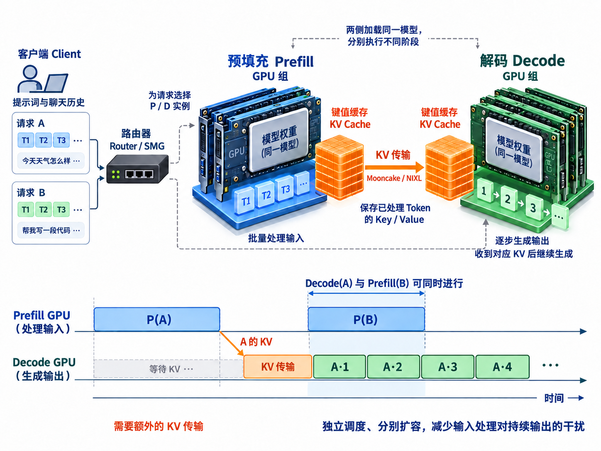

# 1.5 预填充与解码分离(PD Disaggregation)

> **文档索引(Documentation Index)**
>
> 完整文档索引：[llms.txt](https://docs.sglang.io/llms.txt)。通过此文件查找所有可用页面，再进一步阅读。

## 为什么需要 PD 分离，它是什么？

大语言模型(Large Language Model，LLM)推理包含两个不同阶段：**预填充(Prefill)**和**解码(Decode)**。Prefill 是计算密集型(Computation-Intensive)阶段，需要处理整个输入序列；Decode 是内存密集型(Memory-Intensive)阶段，需要管理键值缓存(Key-Value Cache，KV Cache)，以生成词元(Token)。传统方式将这两个阶段放在统一引擎(Unified Engine)中处理，对 Prefill 批次与 Decode 批次进行联合调度会带来效率问题。为解决这些问题，SGLang 引入了**预填充与解码分离(Prefill and Decoding Disaggregation，PD Disaggregation)**。

### 统一调度存在的问题

传统统一引擎将 Prefill 批次与 Decode 批次放在一起处理，会产生两个主要问题：

1. **预填充打断(Prefill Interruption)**：新到达的 Prefill 批次经常打断正在执行的 Decode 批次，导致 Token 生成明显延迟。
2. **数据并行注意力负载不均衡(DP Attention Imbalance)**：在数据并行(Data Parallelism，DP)注意力中，一个 DP 工作进程(Worker)可能正在处理 Prefill 批次，另一个则同时处理 Decode 批次，从而增加 Decode 延迟。

PD 分离通过拆开这两个阶段解决上述问题，使每个阶段都能采用针对性的优化。

<a href="assets/pd-disaggregation-overview-4x3.png"></a>

设计细节参见[设计文档](https://docs.google.com/document/d/1rQXJwKd5b9b1aOzLh98mnyMhBMhlxXA5ATZTHoQrwvc/edit?tab=t.0)。

目前支持 Mooncake 和 NIXL 作为传输引擎(Transfer Engine)。

## PD 分离模式下的性能分析(Profiling)

需要对 PD 分离模式下的 Prefill 或 Decode Worker 进行性能分析时，请参考《基准测试与性能分析》中的 [PD 分离模式下的性能分析](../docs/docs/developer_guide/benchmark_and_profiling.mdx#profile-in-pd-disaggregation-mode)章节。由于 PyTorch 性能分析器(Torch Profiler)的限制，必须使用专用命令行选项，分别分析 Prefill 和 Decode Worker。

## 路由器集成(Router Integration)

为了在大规模 PD 分离部署中实现负载均衡(Load Balancing)和容错(Fault Tolerance)，SGLang 提供了路由器(Router)。路由器可以采用不同的路由策略，在 Prefill 与 Decode 实例之间分配请求。有关 PD 分离路由设置的详细信息，包括配置选项与部署模式，请参见 [SGLang 模型网关(SGLang Model Gateway，原 Router)](../docs/docs/advanced_features/sgl_model_gateway.mdx#prefill-decode-disaggregation)。

### HTTP PD 下的 Responses API

HTTP PD 支持通过 `POST /v1/responses` 进行前台生成(Foreground Generation)，也支持经由 HTTP PD 路由器、设置 `stream=true` 的流式生成(Streaming Generation)。这要求路由器支持 Responses 请求分发，同时服务端 Worker 能够接收 Responses 的 PD 路由元数据(Routing Metadata)。

PD 模式**不支持**依赖存储(Store-Backed)或有状态(Stateful)的 Responses 功能：

- 响应持久化(Response Persistence)，即 `store`，以及响应历史。
- 通过 `previous_response_id` 串联对话。
- 后台 Responses 请求，即 `background=true`，包括后台流式响应。
- 按响应 ID 获取响应，即 `GET /v1/responses/{id}`。
- 按 ID 取消响应，即 `POST /v1/responses/{id}/cancel`。
- 其他需要共享进程本地 Responses 历史的工作流。

Prefill 与 Decode 运行在不同的服务进程中。各自的进程本地 Responses 存储(Process-Local Responses Store)无法提供一致的共享状态：两个阶段都需要相同的对话历史来重建提示词(Prompt)，而 Prefill 存储的响应对 Decode 不可用。前台请求应显式发送对话历史，而不是依赖已存储的响应 ID。

PD 模式也不支持内置工具(Built-in Tools)，例如 `web_search` 和 `code_interpreter`：每次工具调用都需要再次生成，而路由器对每个 HTTP 请求只分发一组 Prefill/Decode 配对。

服务端的能力限制检查见 [#39122](https://github.com/sgl-project/sglang/pull/39122)。这项修改引入了独立部署模式下可通过 `--enable-response-store` 显式启用的存储功能，禁止在 PD 模式下使用该功能，并在开始生成前以 HTTP 400 拒绝有状态请求。这些检查要求使用包含该修改的服务端版本；不能假定较早版本会在请求接入时拒绝所有不支持的工作流。HTTP PD 路由器也会拒绝脱离当前请求独立运行的后台请求(Detached Background Requests)，因为它没有实现这类请求的获取与取消生命周期。

## Mooncake

### 安装要求

```bash
uv pip install mooncake-transfer-engine
```

### AWS EFA

在 x86_64 架构的 AWS 弹性网卡(Elastic Fabric Adapter，EFA)实例上，应将标准 CUDA 13 Mooncake 软件包替换为 EFA 构建版本。两个软件包会安装同一个 `mooncake` Python 模块，因此不要同时安装。

以下命令会替换 SGLang CUDA 13 环境中的相关软件包，同时保留现有 Python 依赖：

```bash
python3 -m pip uninstall -y \
  mooncake-transfer-engine-cuda13 \
  mooncake-transfer-engine-efa-cuda13
python3 -m pip install --no-deps \
  mooncake-transfer-engine-efa-cuda13==0.3.13.post1

export LD_LIBRARY_PATH="/opt/amazon/efa/lib:/opt/amazon/efa/lib64:${LD_LIBRARY_PATH:-}"
export MOONCAKE_PROTOCOL=efa

python3 -c 'from mooncake import engine; assert engine.SUPPORT_EFA'
fi_info -p efa -t FI_EP_RDM
```

EFA Wheel 安装包要求宿主机已安装兼容的 AWS EFA 用户态软件(Userspace Software)，它不包含 `libfabric` 或 `libefa`。当前 Wheel 仅支持 x86_64，构建时未包含 Mooncake EP/PG 以及 NVLink/MNNVL 组件；需要这些功能时，应使用标准 Mooncake CUDA 软件包。

当前 libfabric 的 EFA 提供程序(Provider)无法传输基于 CUDA 虚拟内存管理(Virtual Memory Management，VMM)分配的缓冲区(Buffer)。在 [libfabric 问题 #12853](https://github.com/ofiwg/libfabric/issues/12853)解决之前，需要在 Prefill 和 Decode Worker 两侧同时应用以下设置：

- 不要将 `SGLANG_MOONCAKE_CUSTOM_MEM_POOL` 设置为 `NVLINK` 或 `BAREX`。`INTRA_NODE_NVLINK` 使用默认 CUDA 分配器(Allocator)，因此受支持。
- 不要在 `PYTORCH_CUDA_ALLOC_CONF` 或 `PYTORCH_ALLOC_CONF` 中启用 `expandable_segments:True`。
- EFA 协议会自动禁用计算图捕获后的 KV 缓存容量确定机制(Post-Capture KV Sizing)，因为该机制的 KV Cache 使用 CUDA VMM 分配。
- 不要设置 `MC_FORCE_MNNVL` 或 `NCCL_MNNVL_ENABLE`；EFA 不是 MNNVL 传输方式。

SGLang 会在启动时验证前两项限制，避免之后发生 libfabric 的 `fi_read` 或 `fi_write` 失败。

### IB 设备配置(IB Device Configuration)

使用 Mooncake 后端时，`--disaggregation-ib-device` 支持以下格式：

1. 所有 GPU 共用的设备列表，例如 `mlx5_0` 或 `mlx5_0,mlx5_1`。
2. 按 GPU 分别指定的 JSON 映射，例如 `{"0": "mlx5_0,mlx5_1", "1": "mlx5_2,mlx5_3"}`。
3. 包含上述逐 GPU 映射的 JSON 文件路径。

每个 JSON 值都采用与共享配置相同的逗号分隔设备列表格式。

### 使用方法

### Llama 单节点(Single Node)

```bash
python -m sglang.launch_server \
  --model-path meta-llama/Llama-3.1-8B-Instruct \
  --disaggregation-mode prefill \
  --port 30000 \
  --disaggregation-ib-device mlx5_roce0
python -m sglang.launch_server \
  --model-path meta-llama/Llama-3.1-8B-Instruct \
  --disaggregation-mode decode \
  --port 30001 \
  --base-gpu-id 1 \
  --disaggregation-ib-device mlx5_roce0
python -m sglang_router.launch_router --pd-disaggregation --prefill http://127.0.0.1:30000 --decode http://127.0.0.1:30001 --host 0.0.0.0 --port 8000
```

### DeepSeek 多节点(Multi-Node)

```bash
# 预填充节点 0
python -m sglang.launch_server \
  --model-path deepseek-ai/DeepSeek-V3-0324 \
  --disaggregation-ib-device ${device_name} \
  --disaggregation-mode prefill \
  --host ${local_ip} \
  --port 30000 \
  --trust-remote-code \
  --dist-init-addr ${prefill_master_ip}:5000 \
  --nnodes 2 \
  --node-rank 0 \
  --tp-size 16 \
  --dp-size 8 \
  --enable-dp-attention \
  --moe-a2a-backend deepep \
  --mem-fraction-static 0.8
# 预填充节点 1
python -m sglang.launch_server \
  --model-path deepseek-ai/DeepSeek-V3-0324 \
  --disaggregation-ib-device ${device_name} \
  --disaggregation-mode prefill \
  --host ${local_ip} \
  --port 30000 \
  --trust-remote-code \
  --dist-init-addr ${prefill_master_ip}:5000 \
  --nnodes 2 \
  --node-rank 1 \
  --tp-size 16 \
  --dp-size 8 \
  --enable-dp-attention \
  --moe-a2a-backend deepep \
  --mem-fraction-static 0.8
# 解码节点 0
python -m sglang.launch_server \
  --model-path deepseek-ai/DeepSeek-V3-0324 \
  --disaggregation-ib-device ${device_name} \
  --disaggregation-mode decode \
  --host ${local_ip} \
  --port 30001 \
  --trust-remote-code \
  --dist-init-addr ${decode_master_ip}:5000 \
  --nnodes 2 \
  --node-rank 0 \
  --tp-size 16 \
  --dp-size 8 \
  --enable-dp-attention \
  --moe-a2a-backend deepep \
  --mem-fraction-static 0.8 \
  --max-running-requests 128
# 解码节点 1
python -m sglang.launch_server \
  --model-path deepseek-ai/DeepSeek-V3-0324 \
  --disaggregation-ib-device ${device_name} \
  --disaggregation-mode decode \
  --host ${local_ip} \
  --port 30001 \
  --trust-remote-code \
  --dist-init-addr ${decode_master_ip}:5000 \
  --nnodes 2 \
  --node-rank 1 \
  --tp-size 16 \
  --dp-size 8 \
  --enable-dp-attention \
  --moe-a2a-backend deepep \
  --mem-fraction-static 0.8 \
  --max-running-requests 128
```

### 高级配置(Advanced Configuration)

使用 Mooncake 的 PD 分离支持以下环境变量(Environment Variables)，可精细控制系统行为。

#### NVLink 传输配置(NVLink Transport Configuration)

要通过 Mooncake 后端启用 NVLink 传输来搬运 KV Cache，设置以下环境变量，推荐用于 NVL72 部署。辅助数据传输仍暂时使用 TCP。

```bash
export SGLANG_MOONCAKE_CUSTOM_MEM_POOL=NVLINK
export MC_FORCE_MNNVL=True
```

要通过 Mooncake 后端使用节点内 NVLink(Intra-Node NVLink)传输 KV Cache，设置以下环境变量，推荐用于 A100、H20、H100 等设备。辅助数据仍需通过 TCP 传输。

```bash
export SGLANG_MOONCAKE_CUSTOM_MEM_POOL=INTRA_NODE_NVLINK
export MC_INTRANODE_NVLINK=true
```

`SGLANG_MOONCAKE_CUSTOM_MEM_POOL` 用于启用自定义内存池(Custom Memory Pool)，支持的值包括 `NVLINK`，或 `True`，以及 `BAREX`、`INTRA_NODE_NVLINK`。

#### Prefill 服务端配置

| 变量 | 说明 | 默认值 |
|---|---|---|
| `SGLANG_DISAGGREGATION_THREAD_POOL_SIZE` | 控制每个张量并行(Tensor Parallelism，TP)进程(Rank)用于 KV Cache 传输操作的工作线程总数。 | 由 `int(0.75 * os.cpu_count()) // 8` 动态计算，并限制为大于 4、小于 12，以保证效率并避免线程竞争。 |
| `SGLANG_DISAGGREGATION_QUEUE_SIZE` | 设置并行传输队列数。来自多个 Decode 实例的 KV Cache 传输请求会分散到这些队列，以共享线程和传输带宽。设置为 `1` 时，按先来先服务(First-Come, First-Served，FCFS)策略逐个传输请求。 | `4` |
| `SGLANG_MOONCAKE_MAX_TRANSFER_BATCH_INDICES` | 可选限制：单个同步全层 Mooncake 传输批次所包含的 KV Cache 索引数量。设置为正数时，会先将较大的索引数组切成有序子批次，再形成连续地址区间。自定义内存池的逐层传输路径不受影响。 | `0`，禁用。 |
| `SGLANG_DISAGGREGATION_BOOTSTRAP_TIMEOUT` | 请求初始化期间，接收目标端 KV 索引的超时时间，单位为秒。 | `300` |
| `SGLANG_DISAGGREGATION_BOOTSTRAP_ENTRY_CLEANUP_INTERVAL` | 清理初始化条目(Bootstrap Entries)的时间间隔，单位为秒。 | `120` |

如果可以接受更高的平均首词元延迟(Time to First Token，TTFT)，可设置 `export SGLANG_DISAGGREGATION_BOOTSTRAP_TIMEOUT=600`，即 10 分钟，放宽超时限制。

需要注意：运行中的 Decode 节点断开连接时，这项设置会让 Prefill 实例花更长时间才能清理受影响的内存资源。

#### Decode 服务端配置

| 变量 | 说明 | 默认值 |
|---|---|---|
| `SGLANG_DISAGGREGATION_HEARTBEAT_INTERVAL` | 对 Prefill 初始化服务(Bootstrap Server)执行健康检查(Health Check)的时间间隔，单位为秒。 | `5.0` |
| `SGLANG_DISAGGREGATION_HEARTBEAT_MAX_FAILURE` | 将 Prefill 服务端标记为离线之前，允许的连续心跳失败(Heartbeat Failure)次数。 | `2` |
| `SGLANG_DISAGGREGATION_WAITING_TIMEOUT` | 请求初始化后，等待接收 KV Cache 的超时时间，单位为秒。 | `300` |

如果可以接受更高的平均 TTFT，可设置 `export SGLANG_DISAGGREGATION_WAITING_TIMEOUT=600`，即 10 分钟，放宽超时限制。

## 使用 GPU 暂存缓冲区的异构 TP(Heterogeneous TP with GPU Staging Buffer)

当 Prefill 与 Decode 使用不同的 TP 规模时，例如 Prefill 使用 TP=4，Decode 使用注意力 TP=1 的 DP 注意力，两侧的 KV Cache 内存布局(Memory Layout)就会不同。**GPU 暂存缓冲区(GPU Staging Buffer)**通过以下方式解决这一问题：在 Prefill 侧将 KV 头切片(KV Head Slices)收集到连续缓冲区(Contiguous Buffer)，执行批量远程直接内存访问(Remote Direct Memory Access，RDMA)传输，再在 Decode 侧分散写入正确的 KV Cache 页。高并发下，其吞吐量可达到默认逐 Token 切片方式的 **2～5 倍**，与同构 TP(Homogeneous TP)基线的差距约在 **5% 以内**。

当 Prefill 与 Decode 使用**不同的 TP 规模**，并采用 **Mooncake** 传输后端时，可启用暂存缓冲区。两侧 TP 规模相同时，即使已启用，也会自动跳过暂存路径。

> **注意：**暂存缓冲区面向非多头潜在注意力(Multi-Head Latent Attention，MLA)模型，例如采用分组查询注意力(Grouped-Query Attention，GQA)或多头注意力(Multi-Head Attention，MHA)的模型。DeepSeek-V2/V3 等 MLA 模型不应启用此选项。

### 环境变量

| 变量 | 说明 | 默认值 |
|---|---|---|
| `SGLANG_DISAGG_STAGING_BUFFER` | 启用 GPU 暂存缓冲区，用于异构 TP 的 KV 传输。 | `False` |
| `SGLANG_DISAGG_STAGING_POOL_SIZE_MB` | Decode 侧环形缓冲池(Ring Buffer Pool)的总大小，单位为 MB。 | `4096` |

### 使用示例

```bash
# 在预填充和解码两侧都设置暂存缓冲区环境变量
export SGLANG_DISAGG_STAGING_BUFFER=1
export SGLANG_DISAGG_STAGING_POOL_SIZE_MB=4096

# 预填充侧使用 TP=4
python -m sglang.launch_server \
  --model-path $MODEL_PATH \
  --disaggregation-mode prefill \
  --port 30000 \
  --tp 4 \
  --trust-remote-code \
  --disaggregation-ib-device mlx5_1,mlx5_2

# 解码侧使用 TP=1，或使用实际注意力 TP=1 的 DP 注意力
python -m sglang.launch_server \
  --model-path $MODEL_PATH \
  --disaggregation-mode decode \
  --port 30001 \
  --tp 4 \
  --dp 4 \
  --enable-dp-attention \
  --trust-remote-code \
  --disaggregation-ib-device mlx5_3,mlx5_4

# 路由器
python -m sglang_router.launch_router \
  --pd-disaggregation \
  --prefill http://127.0.0.1:30000 \
  --decode http://127.0.0.1:30001 \
  --host 0.0.0.0 --port 8000
```

## NIXL

### 安装要求

通过 pip 安装：

```bash
pip install nixl
```

或者从源码构建；如果已经安装了 UCX，可能需要采用这种方式：

```bash
git clone https://github.com/ai-dynamo/nixl.git
cd nixl
pip install . --config-settings=setup-args="-Ducx_path=/path/to/ucx"
```

### 使用方法

### Llama 单节点(Single Node)

```bash
python -m sglang.launch_server \
  --model-path meta-llama/Llama-3.1-8B-Instruct \
  --disaggregation-mode prefill \
  --port 30000 \
  --disaggregation-transfer-backend nixl
python -m sglang.launch_server \
  --model-path meta-llama/Llama-3.1-8B-Instruct \
  --disaggregation-mode decode \
  --port 30001 \
  --base-gpu-id 1 \
  --disaggregation-transfer-backend nixl
python -m sglang_router.launch_router --pd-disaggregation --prefill http://127.0.0.1:30000 --decode http://127.0.0.1:30001 --host 0.0.0.0 --port 8000
```

### DeepSeek 多节点(Multi-Node)

```bash
# 预填充节点 0
python -m sglang.launch_server \
  --model-path deepseek-ai/DeepSeek-V3-0324 \
  --disaggregation-transfer-backend nixl \
  --disaggregation-mode prefill \
  --host ${local_ip} \
  --port 30000 \
  --trust-remote-code \
  --dist-init-addr ${prefill_master_ip}:5000 \
  --nnodes 2 \
  --node-rank 0 \
  --tp-size 16 \
  --dp-size 8 \
  --enable-dp-attention \
  --moe-a2a-backend deepep \
  --mem-fraction-static 0.8
# 预填充节点 1
python -m sglang.launch_server \
  --model-path deepseek-ai/DeepSeek-V3-0324 \
  --disaggregation-transfer-backend nixl \
  --disaggregation-mode prefill \
  --host ${local_ip} \
  --port 30000 \
  --trust-remote-code \
  --dist-init-addr ${prefill_master_ip}:5000 \
  --nnodes 2 \
  --node-rank 1 \
  --tp-size 16 \
  --dp-size 8 \
  --enable-dp-attention \
  --moe-a2a-backend deepep \
  --mem-fraction-static 0.8
# 解码节点 0
python -m sglang.launch_server \
  --model-path deepseek-ai/DeepSeek-V3-0324 \
  --disaggregation-transfer-backend nixl \
  --disaggregation-mode decode \
  --host ${local_ip} \
  --port 30001 \
  --trust-remote-code \
  --dist-init-addr ${decode_master_ip}:5000 \
  --nnodes 2 \
  --node-rank 0 \
  --tp-size 16 \
  --dp-size 8 \
  --enable-dp-attention \
  --moe-a2a-backend deepep \
  --mem-fraction-static 0.8 \
  --max-running-requests 128
# 解码节点 1
python -m sglang.launch_server \
  --model-path deepseek-ai/DeepSeek-V3-0324 \
  --disaggregation-transfer-backend nixl \
  --disaggregation-mode decode \
  --host ${local_ip} \
  --port 30001 \
  --trust-remote-code \
  --dist-init-addr ${decode_master_ip}:5000 \
  --nnodes 2 \
  --node-rank 1 \
  --tp-size 16 \
  --dp-size 8 \
  --enable-dp-attention \
  --moe-a2a-backend deepep \
  --mem-fraction-static 0.8 \
  --max-running-requests 128
```

### 高级配置(Advanced Configuration)

#### NIXL 后端选择(NIXL Backend Selection)

默认情况下，NIXL 使用 **UCX** 后端传输 KV Cache。可以根据基础设施，通过环境变量 `SGLANG_DISAGGREGATION_NIXL_BACKEND` 选择其他 NIXL 插件后端(Plugin Backend)。

例如：`export SGLANG_DISAGGREGATION_NIXL_BACKEND=LIBFABRIC`。

**可用后端：**UCX，默认值；LIBFABRIC；或者任意已安装的 NIXL 插件。

使用示例：

```bash
export SGLANG_DISAGGREGATION_NIXL_BACKEND=LIBFABRIC
python -m sglang.launch_server \
  --model-path meta-llama/Llama-3.1-8B-Instruct \
  --disaggregation-mode prefill \
  --disaggregation-transfer-backend nixl \
  --port 30000
```

---

## 术语与生词表(Terms and Vocabulary，学习补充)

| 术语或单词 | 中文释义 | 简明英文释义 |
|---|---|---|
| PD — Prefill and Decode | 预填充与解码：推理中处理输入和逐步生成输出的两个阶段。 | The phases that process a prompt and generate subsequent tokens. |
| Prefill /ˌpriːˈfɪl/ | 预填充：处理输入序列，建立供后续生成使用的 KV Cache。 | Processing the input sequence and preparing its attention cache. |
| Decode /diːˈkəʊd/ | 解码：基于已有上下文，逐步生成后续 Token。 | Generating further tokens using the existing context. |
| Disaggregation /dɪsˌæɡrɪˈɡeɪʃən/ | 分离：将原本一起运行的阶段拆到独立的执行资源上。 | Separating stages so that they run on independent resources. |
| KV Cache — Key-Value Cache | 键值缓存：保存注意力计算中的键值信息，以供后续生成复用。 | Stored attention keys and values reused during generation. |
| DP — Data Parallelism | 数据并行：使用不同副本或工作组处理不同请求。 | Processing different requests with separate replicas or worker groups. |
| DPA — Data Parallelism Attention | 注意力数据并行：在注意力部分按请求分工，各组维护相应的 KV Cache。 | Distributing attention work and its caches by request. |
| TP — Tensor Parallelism | 张量并行：跨设备拆分同一层的张量运算。 | Splitting a layer's tensor operations across devices. |
| TTFT — Time to First Token | 首词元延迟：从请求发出到收到第一个输出 Token 的时间。 | The time from sending a request to receiving its first output token. |
| RDMA — Remote Direct Memory Access | 远程直接内存访问：直接在不同机器的内存之间传输数据。 | Transferring data directly between the memory of different machines. |
| EFA — Elastic Fabric Adapter | AWS 弹性网卡：面向高性能计算等负载的网络接口。 | An AWS network interface designed for high-performance workloads. |
| VMM — Virtual Memory Management | 虚拟内存管理：管理虚拟地址与实际内存分配之间的映射。 | Managing mappings between virtual addresses and physical memory. |
| MLA — Multi-Head Latent Attention | 多头潜在注意力：以压缩的潜在表示保存注意力所需信息。 | Attention that stores a compact latent representation of its context. |
| GQA — Grouped-Query Attention | 分组查询注意力：多个查询头共享一组键值头。 | Attention in which groups of query heads share key and value heads. |
| MHA — Multi-Head Attention | 多头注意力：使用多组查询、键和值执行注意力计算。 | Attention computed using multiple sets of queries, keys, and values. |
| FCFS — First-Come, First-Served | 先来先服务：按请求到达顺序处理。 | Processing requests in the order in which they arrive. |
| Profiling /ˈprəʊfaɪlɪŋ/ | 性能分析：测量程序的时间与资源消耗，定位瓶颈。 | Measuring execution time and resource use to find bottlenecks. |
| Bootstrap /ˈbuːtstræp/ | 初始化：为后续传输建立必要的连接或元数据。 | Setting up the information and connections needed for later work. |
| Staging /ˈsteɪdʒɪŋ/ | 暂存：正式传输或处理前，先将数据放入中间缓冲区。 | Placing data in an intermediate buffer before transfer or processing. |
| Heterogeneous /ˌhetərəˈdʒiːniəs/ | 异构：参与协作的组件采用不同的类型或配置。 | Consisting of components with different types or configurations. |
| Heartbeat /ˈhɑːtbiːt/ | 心跳：定期检查另一组件是否仍可用的信号。 | A periodic signal used to check whether another component is available. |
