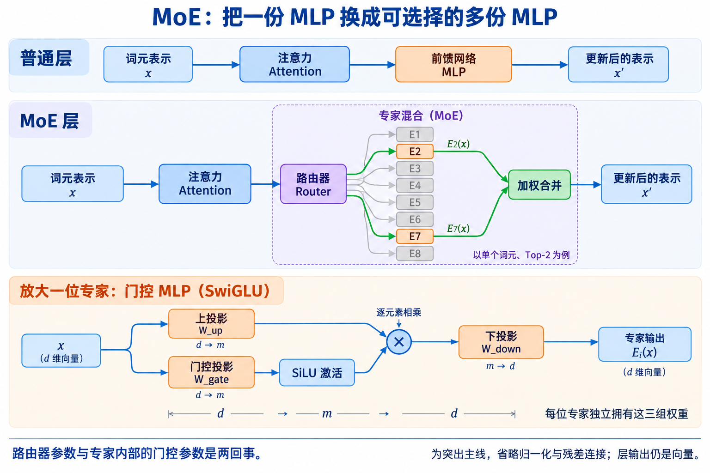
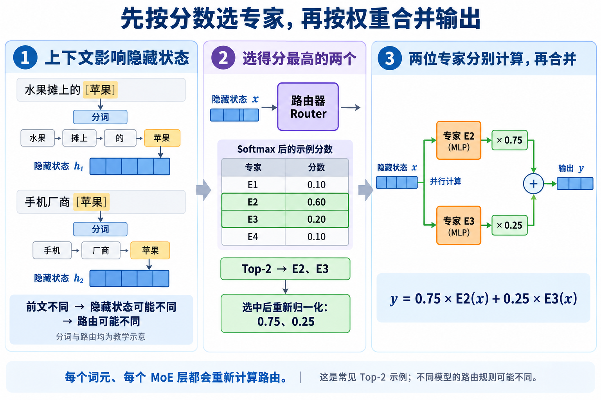
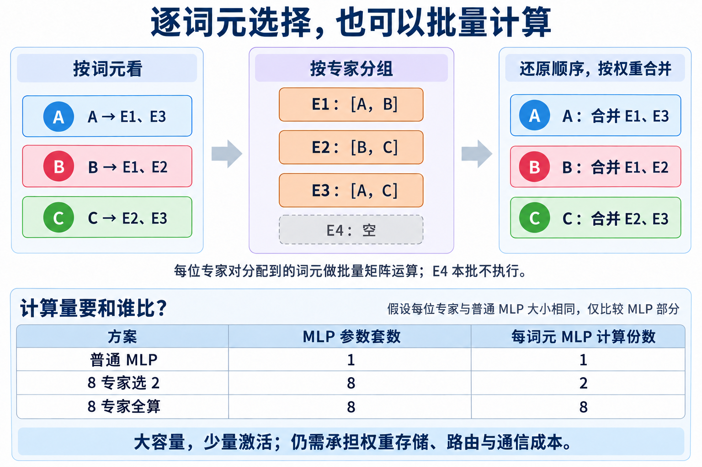

# 1.6 混合专家模型入门(Mixture of Experts)

混合专家模型(Mixture of Experts，MoE)可以想成一家有多位厨师的餐厅：每道菜只请其中几位协作。对应到模型，就是准备多组参数，让每个词元(Token)只使用其中一部分，从而扩大模型容量，同时控制实际计算量。

本文以常见的稀疏混合专家(Sparse MoE)、Top-2 路由为例。图中的词元、专家编号和分数均为教学示意，不代表某个真实模型的分工；不同模型的专家数、选择数和权重规则可能不同。

## 一、MoE 在 Transformer 层的哪里？

典型 Transformer 层包含注意力(Attention)和前馈网络(Feed-Forward Network，FFN)。注意力让词元从上下文获取信息，FFN 则对各位置的向量分别做变换，通常由多层感知机(Multilayer Perceptron，MLP)实现。

常见 MoE 将 FFN 换成“路由器(Router) + 多个专家(Expert) + 加权合并”。注意力部分仍使用共享的一套参数。每个专家通常是一套 MLP，并非一个完整的大语言模型；模型可以只在部分层使用 MoE。[Mixtral 架构说明](https://arxiv.org/html/2401.04088v1#S2)

图 1：专家接收的是词元的隐藏状态(Hidden State)，输出也是向量，之后还要经过后续层。图中省略归一化与残差连接，点击可查看大图。

## 二、“一套独立的 MLP 参数”包括什么？

以常见的 Swish 门控线性单元(Swish Gated Linear Unit，SwiGLU)为例，每位专家都有以下三组权重。令输入为行向量，模型隐藏维度为 `d`，专家中间维度为 `m`：

| 参数 | 形状 | 作用 |
|---|---|---|
| 上投影(Up Projection) `W_up` | `d × m` | 把输入映射到中间特征空间 |
| 门控投影(Gate Projection) `W_gate` | `d × m` | 经过激活函数，调节中间特征 |
| 下投影(Down Projection) `W_down` | `m × d` | 把结果映射回模型隐藏维度 |

其计算可写成 `E_i(x) = [SiLU(x W_gate_i) ⊙ (x W_up_i)] W_down_i`，其中 `⊙` 表示逐元素相乘，SiLU 是非线性激活函数。两条投影支路接收同一个完整向量；各专家形状可以相同，参数值各自独立。这个例子省略偏置，普通非门控 MLP 也可能只用两组权重。[GLU 原始论文](https://arxiv.org/html/2002.05202v1#S2)

**专家内部的门控与路由器是两件事。** 前者调节一个专家里的特征；后者通常另有 `d × 专家数` 的权重矩阵，用来给专家打分。

## 三、怎样从上下文选出专家，再合并结果？

路由器看到的是词元在当前层的隐藏状态。这个向量已经融合注意力等计算带来的上下文信息，因此同样的词元，放进不同前文，可能得到不同路由。例如“水果摊上的 [苹果]”与“手机厂商 [苹果]”；这里仅用词语代指词元，实际分词由分词器决定。

自回归模型的因果注意力(Causal Attention)只允许当前位置访问自身及前文。因此，出现在“苹果”之后的“发布新手机”，不能反过来影响当前位置这一次的路由。

以 4 个专家选 2 个为例，假设路由器经过 Softmax 归一化后得到下面的分数：

| 专家 | E1 | E2 | E3 | E4 |
|---|---|---|---|---|
| 分数 | 0.10 | **0.60** | **0.20** | 0.10 |

1. **选择：**按分数排序，Top-2 选中 E2、E3；这个示例不是按概率随机抽两位。
2. **计算：**E2 和 E3 分别处理同一个输入向量 `x`，得到 `E2(x)`、`E3(x)`；不必执行 E1、E4 的 MLP。
3. **确定合并权重：**在选中专家间重新归一化，得到 `0.60 / 0.80 = 0.75` 与 `0.20 / 0.80 = 0.25`。
4. **合并：**逐元素加权相加，`y = 0.75 × E2(x) + 0.25 × E3(x)`，结果的维度与单个专家输出相同。

图 2：**“选择谁”和“各占多少权重”是两个步骤。** 上面的“全体 Softmax → Top-2 → 重新归一化”，与直接对 Top-2 原始分数做 Softmax 等价。这个例子可在 [SGLang 的路由实现](../python/sglang/srt/layers/moe/topk.py)中对照；其他模型可能采用不同打分、缩放或归一化规则。

还要区分两种“权重”：`W_up` 等是训练得到、推理时通常固定的模型参数；这里的 `0.75、0.25` 是随当前词元隐藏状态计算出来的路由权重。

## 四、是整次推理选一次，还是每个词元都选？

通常是**每个词元在每个 MoE 层分别计算路由**。“猫”在第 5 层可以选 E2、E7，“跑”在同一层可以选 E1、E4；“猫”进入第 10 层时又重新选。不同层通常各有自己的专家参数，即使编号相同，也不是同一套权重。

| 推理阶段 | 哪些词元经过 MoE？ |
|---|---|
| 预填充(Prefill) | 批量处理提示词中需要计算的词元，各自路由；最后一个位置的输出用于预测首个新词元 |
| 解码(Decode) | 在常见的逐词生成中，把刚生成的词元作为下一步输入，为它重新路由，再预测下一个词元 |

借助键值缓存(Key-Value Cache，KV Cache)，历史词元的注意力键值可以复用，通常无需在每个 Decode 步骤重新计算全部历史词元的 MLP；多个请求的新词元也能一起组成批次。[缓存机制说明](https://huggingface.co/docs/transformers/en/cache_explanation)

路由也会有“难分高下”的情况。例如 Top-2 中，第二、第三名的分数很接近，仍然只选前两名，小幅分数变化可能改变选择。分数接近不保证两个专家的输出相同，也不等于“答对的概率差不多”；是否可以互换，需要实际测量。

## 五、逐词元选择，为什么还能高效计算？

普通 MLP 本来就用同一套权重对各词元分别计算。把 `N` 个词元排成 `N × d` 的矩阵，就能一次执行批量矩阵乘法；MLP 本身不会把不同词元互相混合。MoE 保留这种批量能力，只是先把分配给同一专家的词元归到一起。

例如 A 选 E1/E3，B 选 E1/E2，C 选 E2/E3：E1 批量处理 A、B，E2 处理 B、C，E3 处理 A、C；最后把结果放回各词元的位置，并按各自的路由权重合并。分组矩阵乘法(Grouped GEMM)、块稀疏计算(Block-Sparse Computation)等可实现高效执行。[MegaBlocks 论文](https://arxiv.org/abs/2211.15841)

图 3：上半部分用 4 个专家说明批量分组，下半部分另用 8 个专家比较成本，两个示例的专家数不同。

**MoE 不保证比一个小的普通 MLP 更省计算。** 假设每位专家都与普通 MLP 一样大，普通层的 `N` 个词元需要 `N` 份 MLP 计算，Top-2 需要 `2N` 份；优势是拥有 8 套专家参数，却不必为每个词元计算全部 8 套。

若每位专家有 `P` 个参数，该层共享部分有 `S` 个参数，8 选 2 的总参数量是 `S + 8P`，单词元激活参数量(Active Parameters)约为 `S + 2P`。因此“只用 2/8 专家”不能直接解释成整个模型快 4 倍；实际专家宽度也可能与普通 MLP 不同。

## 六、专家怎样形成？实际代价有哪些？

路由器和专家都通过训练学习分工。名字叫“专家”，不代表人为指定一个负责数学、另一个负责写作；分工可能与词法、句法及隐藏特征相关，也可能重叠。[稀疏 MoE 原始论文](https://arxiv.org/abs/1701.06538)

训练时常需要负载均衡(Load Balancing)机制，例如辅助损失，避免大多数词元挤向少数专家。Top-2 只是示例，[Switch Transformer](https://arxiv.org/html/2101.03961v3)采用单专家路由；一次选几位通常属于架构配置，不是遇到简单问题就必然自动少选。

所有专家的权重仍需存储，实际显存还包括缓存和中间结果；分组、数据搬运和负载不均也有成本。专家分布到不同 GPU 时，还需要发送词元表示并收回结果，这就是[专家并行(Expert Parallelism，EP)](<1.4 专家并行(Expert Parallelism).md>)涉及的通信。单个词元只激活少数专家，一个大批次却可能用到全部专家。

## 七、在 SGLang 里对应哪些代码？

[Mixtral 模型实现](../python/sglang/srt/models/mixtral.py)提供了清晰的入口：`MixtralDecoderLayer.forward` 先执行注意力，再调用 `block_sparse_moe`；`MixtralMoE.forward` 依次调用 `gate → topk → experts`，配置中有 `renormalize=True`。

这里对应“生成路由分数 → 选专家与确定权重 → 执行专家并合并”的概念。具体批量计算、融合与通信由后端实现；本文是概念与源码对照，没有运行推理性能实验。

## 术语与生词

| 术语 | 中文与简明英文释义 |
|---|---|
| MoE — Mixture of Experts | 混合专家；A model that combines selected expert networks. |
| MLP — Multilayer Perceptron / FFN — Feed-Forward Network | 多层感知机 / 前馈网络；A network that transforms each token's features. |
| Expert /ˈekspɜːrt/ | 专家子网络；A trainable subnetwork with its own parameters. |
| Router /ˈraʊtər/ | 路由器；A component that assigns tokens to experts. |
| Hidden State | 隐藏状态；A token's vector representation at a model layer. |
| Sparse /spɑːrs/ | 稀疏的；Using only part of the available components. |
| Top-k | 选择得分最高的 k 项；Selecting the k highest-scoring items. |
| Active Parameters | 激活参数；Parameters used when processing a particular token. |

配图由内置 imagegen 生成；三张图的最终提示词保存在同目录的 [图 1 提示词](assets/moe-01-structure.prompt.txt)、[图 2 提示词](assets/moe-02-routing.prompt.txt)、[图 3 提示词](assets/moe-03-batching.prompt.txt)。
