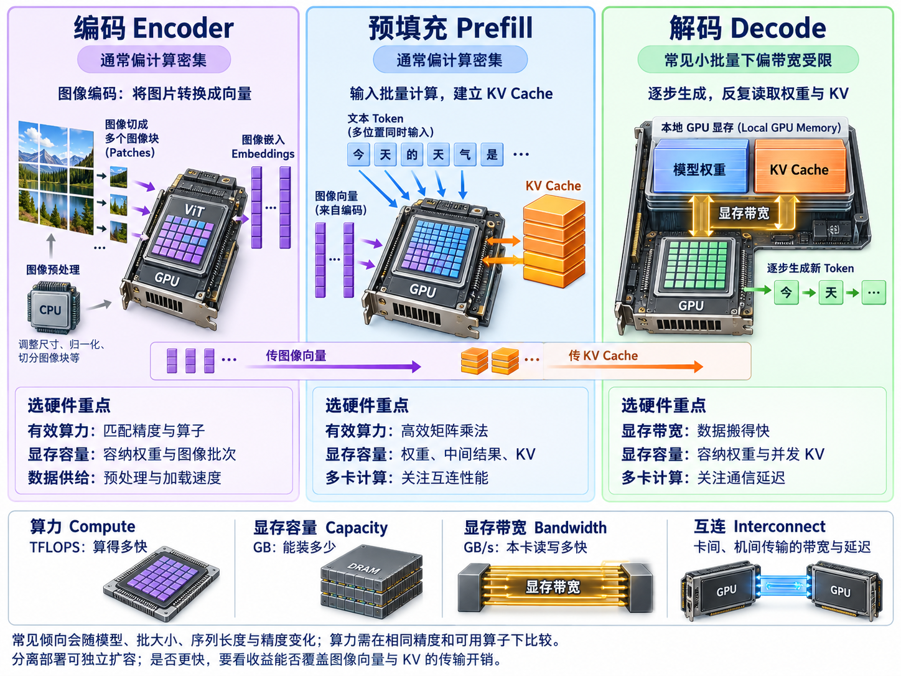

# 1.6 编码、预填充与解码分离(EPD Disaggregation)

> **文档索引(Documentation Index)**
>
> 完整文档索引：[llms.txt](https://docs.sglang.io/llms.txt)。通过此文件查找所有可用页面，再进一步阅读。

## 为什么需要 EPD 分离，它是什么？

在现代视觉语言模型(Vision-Language Model，VLM)推理中，请求执行可以自然地分成三个不同阶段：编码(Encoder)、预填充(Prefill)和解码(Decode)。编码阶段执行视觉预处理(Vision Preprocessing)和基于视觉 Transformer(Vision Transformer，ViT)的图像编码(Image Encoding)，计算开销很大，但只在请求初始化期间需要执行。Prefill 阶段处理完整的多模态输入序列(Multimodal Input Sequence)，初始化语言模型的键值缓存(Key-Value Cache，KV Cache)；Decode 阶段执行自回归词元生成(Autoregressive Token Generation)，主要受内存带宽(Memory Bandwidth)和 KV Cache 访问影响。

现有部署通常将这些阶段放在同一个执行引擎(Execution Engine)中，或者至多采用预填充与解码分离(Prefill–Decode Disaggregation，PD 分离)。然而，这些设计仍然将视觉编码与语言模型的 Prefill 紧密耦合，导致资源利用率不高、图像密集型负载(Image-Heavy Workloads)的扩展能力有限，以及高负载下的调度效果不理想。

为解决这些问题，SGLang 引入了编码、预填充与解码分离(Encoder–Prefill–Decode Disaggregation，EPD 分离)。EPD 将视觉编码进一步从语言处理流程中拆开，使编码服务能够独立水平扩展(Horizontal Scaling)，改善多模态请求的负载均衡(Load Balancing)，并与现有 PD 分离无缝结合，形成完全解耦的三层推理架构(Three-Tier Inference Architecture)。

<a href="assets/epd-stage-hardware-overview-4x3.png"></a>

**学习补充：** 图中展示三个阶段常见的计算特点与硬件关注点，点击可放大。显存带宽(Memory Bandwidth)指 GPU 访问本地显存的速度，互连(Interconnect)则承担卡间、机间的数据传输；实际瓶颈会随模型、批大小(Batch Size)、序列长度和精度变化。参考 [SGLang EPD 设计说明](https://www.lmsys.org/blog/2026-01-12-epd/)与 [NVIDIA 推理优化说明](https://developer.nvidia.com/blog/mastering-llm-techniques-inference-optimization/)。

### 使用方法

使用 `--language-only` 可以启动仅运行语言部分的模型，使用 `--encoder-only` 可以启动仅运行编码器的模型。启动仅运行语言部分的模型时，还必须通过 `--encoder-urls` 指定编码服务的端点(Service Endpoints)。

支持多种编码器传输后端(Encoder Transfer Backend)，包括 `zmq_to_scheduler`、`zmq_to_tokenizer` 和 `mooncake`，默认值为 `zmq_to_scheduler`。可以通过 `--encoder-transfer-backend` 选择后端。

### 使用 Mooncake 传输编码结果

`--encoder-transfer-backend mooncake` 控制编码服务与语言服务或 Prefill 服务之间**如何传输编码器输出**。这是编码器传输选项，可以独立于全局多模态嵌入缓存(Global Multimodal Embedding Cache)使用。

示例：

```bash
# 编码服务
python -m sglang.launch_server \
  --model-path Qwen/Qwen3-VL-8B-Instruct \
  --encoder-only \
  --encoder-transfer-backend mooncake \
  --port 30000

# 仅运行语言部分的服务
python -m sglang.launch_server \
  --model-path Qwen/Qwen3-VL-8B-Instruct \
  --language-only \
  --encoder-urls http://127.0.0.1:30000 \
  --encoder-transfer-backend mooncake \
  --port 30002
```

### 使用 Mooncake 的全局多模态嵌入缓存

SGLang 还为 EPD 负载提供基于 Mooncake 的**全局多模态嵌入缓存(Global Multimodal Embedding Cache)**。在编码服务上启用后，重复输入的图像可以跨实例复用之前计算得到的 ViT 嵌入向量(Embedding)，无需再次运行视觉编码器(Vision Encoder)。

该功能适用于以下情况：

- 服务需要处理重复或部分重合的图像输入；
- 编码器计算是性能瓶颈(Bottleneck)；
- 集群中已经有可用的 Mooncake。

整体流程是：编码器先检查 Mooncake 中是否已存在对应的图像嵌入(Image Embedding)。缓存命中(Cache Hit)时，从全局存储中预取(Prefetch)这些向量；缓存未命中(Cache Miss)时，正常执行编码，并在后台将结果写入缓存。

启用方法：

- 按照 SGLang 其他 Mooncake 集成功能相同的方式，安装并配置 Mooncake；
- 在编码服务的启动参数中添加 `--enable-mm-global-cache`。

`--enable-mm-global-cache` 控制**是否在全局 Mooncake 缓存中查询和存储多模态嵌入向量**。它与 `--encoder-transfer-backend` 是两个独立选项，后者只控制编码器输出的传输方式。

Mooncake 的部署和配置细节参见 [HiCache 最佳实践(HiCache Best Practices)](../docs/docs/advanced_features/hicache_best_practices.mdx#deployment-with-mooncake)和 [Mooncake 后端 README](https://github.com/sgl-project/sglang/blob/main/python/sglang/srt/mem_cache/storage/mooncake_store/README.md)。

示例：

```bash
# 共享的 Mooncake 配置
export MOONCAKE_TE_META_DATA_SERVER="http://127.0.0.1:8080/metadata"
export MOONCAKE_MASTER="127.0.0.1:50051"
export MOONCAKE_PROTOCOL="rdma"
export MOONCAKE_GLOBAL_SEGMENT_SIZE="4gb"

# 启用全局多模态缓存的编码服务
python -m sglang.launch_server \
  --model-path Qwen/Qwen3-VL-8B-Instruct \
  --encoder-only \
  --enable-mm-global-cache \
  --port 30000

# 仅运行语言部分的服务
python -m sglang.launch_server \
  --model-path Qwen/Qwen3-VL-8B-Instruct \
  --language-only \
  --encoder-urls http://127.0.0.1:30000 \
  --port 30002
```

注意：

- 该缓存保存的是**多模态编码器的嵌入向量(Multimodal Encoder Embeddings)**，不是语言模型的 KV Cache。
- 当前使用 Mooncake 作为共享存储(Shared Backing Store)。
- 无论使用哪种 `--encoder-transfer-backend`，都可以启用该功能。
- 该功能尤其适合 EPD 或编码器分离(Encoder Disaggregation)的 VLM 部署场景，在这些场景中，相同图像可能出现在不同请求或实例中。

#### Qwen VL

- EP 分离(EP Disaggregation)

```bash
# 编码服务 0
python -m sglang.launch_server \
  --model-path Qwen/Qwen3-VL-8B-Instruct \
  --encoder-only \
  --encoder-transfer-backend zmq_to_scheduler \
  --port 30000
# 编码服务 1
python -m sglang.launch_server \
  --model-path Qwen/Qwen3-VL-8B-Instruct \
  --encoder-only \
  --encoder-transfer-backend zmq_to_scheduler \
  --port 30001
# 仅运行语言部分的服务
python -m sglang.launch_server \
  --model-path Qwen/Qwen3-VL-8B-Instruct \
  --language-only \
  --encoder-urls http://127.0.0.1:30000 http://127.0.0.1:30001 \
  --encoder-transfer-backend zmq_to_scheduler \
  --port 30002
```

- EPD 分离(EPD Disaggregation)

```bash
# 编码服务 0
python -m sglang.launch_server \
  --model-path Qwen/Qwen3-VL-8B-Instruct \
  --encoder-only \
  --encoder-transfer-backend zmq_to_scheduler \
  --port 30000
# 编码服务 1
python -m sglang.launch_server \
  --model-path Qwen/Qwen3-VL-8B-Instruct \
  --encoder-only \
  --encoder-transfer-backend zmq_to_scheduler \
  --port 30001
# 预填充服务 0
python -m sglang.launch_server \
  --model-path Qwen/Qwen3-VL-8B-Instruct \
  --disaggregation-mode prefill \
  --language-only \
  --encoder-urls http://127.0.0.1:30000 http://127.0.0.1:30001 \
  --encoder-transfer-backend zmq_to_scheduler \
  --port 30002
# 解码服务 0
python -m sglang.launch_server \
  --model-path Qwen/Qwen3-VL-8B-Instruct \
  --disaggregation-mode decode \
  --port 30003
# 路由器
python -m sglang_router.launch_router \
  --pd-disaggregation \
  --prefill http://$PREFILL_HOST:30002 \
  --decode http://$DECODE_HOST:30003 \
  --port 8000

```

#### gRPC 编码器(gRPC Encoder，EPD)

可以将编码器作为 gRPC 服务运行，同时让 Prefill 和 Decode 继续使用 HTTP。使用 gRPC 编码器时，需要为 Prefill 进程设置 `SGLANG_ENCODER_MM_RECEIVER_MODE=grpc`，使其使用 gRPC 接收器(Receiver)。

```bash
# gRPC 编码服务
python -m sglang.launch_server \
  --model-path Qwen/Qwen3-VL-8B-Instruct \
  --encoder-only \
  --grpc-mode \
  --encoder-transfer-backend zmq_to_scheduler \
  --port 30000

# 预填充服务使用 HTTP，并配置为使用 gRPC 接收器
SGLANG_ENCODER_MM_RECEIVER_MODE=grpc \
python -m sglang.launch_server \
  --model-path Qwen/Qwen3-VL-8B-Instruct \
  --disaggregation-mode prefill \
  --language-only \
  --encoder-urls grpc://127.0.0.1:30000 \
  --encoder-transfer-backend zmq_to_scheduler \
  --port 30002

# 解码服务使用 HTTP
python -m sglang.launch_server \
  --model-path Qwen/Qwen3-VL-8B-Instruct \
  --disaggregation-mode decode \
  --port 30003

# 路由器
python -m sglang_router.launch_router \
  --pd-disaggregation \
  --prefill http://$PREFILL_HOST:30002 \
  --decode http://$DECODE_HOST:30003 \
  --port 8000
```

---

## 术语与生词表(Terms and Vocabulary，学习补充)

| 术语或单词 | 中文释义 | 简明英文释义 |
|---|---|---|
| VLM — Vision-Language Model | 视觉语言模型：能够共同处理图像与语言输入的模型。 | A model that processes visual and language inputs together. |
| ViT — Vision Transformer | 视觉 Transformer：使用 Transformer 结构处理图像并提取视觉特征。 | A Transformer model that extracts features from images. |
| PD — Prefill–Decode | 预填充与解码：处理完整输入和逐步生成输出的两个阶段。 | The stages that process the input and generate subsequent tokens. |
| EPD — Encoder–Prefill–Decode | 编码、预填充与解码：分别处理视觉编码、语言模型输入与后续生成。 | The stages for visual encoding, language-model prefill, and token generation. |
| EP Disaggregation | 编码与语言处理分离：编码器独立部署，语言侧仍可同时承担 Prefill 和 Decode。 | Separating the encoder from the service that performs language-model prefill and decode. |
| KV Cache — Key-Value Cache | 键值缓存：保存语言模型注意力计算的键值信息，供后续生成复用。 | Stored attention keys and values reused during generation. |
| Encoder /ɪnˈkəʊdə/ | 编码器：将图像等输入转换为模型可使用的特征。 | A component that converts input into features a model can use. |
| Embedding /ɪmˈbedɪŋ/ | 嵌入向量：用数值向量表示输入内容或特征。 | A numerical vector representation of content or features. |
| Prefill /ˌpriːˈfɪl/ | 预填充：处理完整输入序列，并建立 KV Cache。 | Processing the input sequence and preparing its attention cache. |
| Decode /diːˈkəʊd/ | 解码：基于已有上下文逐步生成后续 Token。 | Generating further tokens using the existing context. |
| Transport /ˈtrænspɔːt/ | 传输：将数据从一个服务或设备送到另一个。 | Moving data from one service or device to another. |
| Prefetch /ˌpriːˈfetʃ/ | 预取：在后续使用数据之前，提前将其取回。 | Retrieving data in advance of its later use. |
| Bottleneck /ˈbɒtlnek/ | 瓶颈：限制整体处理速度或容量的环节。 | A part of a system that limits its overall speed or capacity. |
| Cache Hit | 缓存命中：需要的数据已在缓存中，可以直接复用。 | Finding the requested data in a cache. |
| Cache Miss | 缓存未命中：缓存中没有需要的数据，需要重新获取或计算。 | Failing to find requested data in a cache. |
| Horizontal Scaling | 水平扩展：增加服务实例数量，提升整体处理能力。 | Increasing capacity by adding more service instances. |
| Global Multimodal Embedding Cache | 全局多模态嵌入缓存：在多个实例之间共享、复用多模态编码结果。 | A shared cache of multimodal encoder outputs used across instances. |
