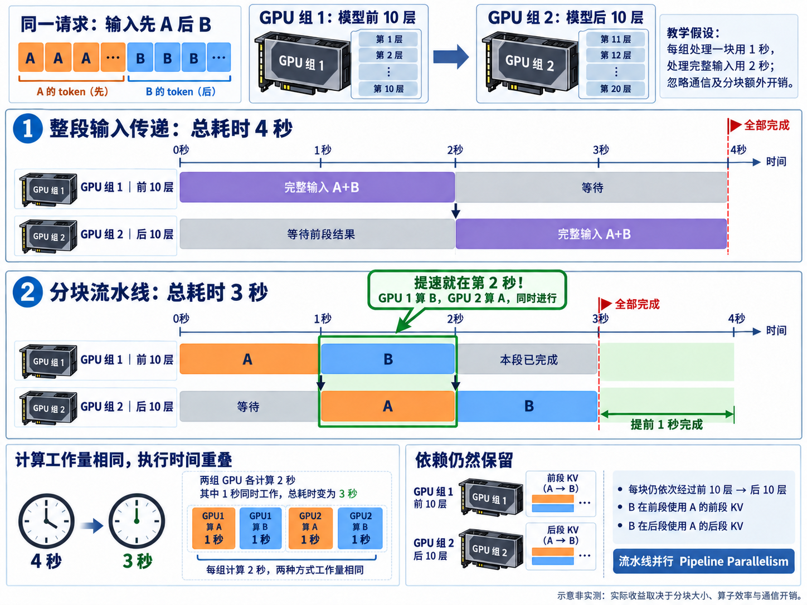

# 1.7 长上下文流水线并行(Pipeline Parallelism for Long Context)

> **文档索引(Documentation Index)**
>
> 完整文档索引：[llms.txt](https://docs.sglang.io/llms.txt)。通过此文件查找所有可用页面，再进一步阅读。

## 为什么需要流水线并行？

随着大语言模型(Large Language Models，LLMs)向万亿参数架构和“无限”上下文窗口(Context Window)发展，底层推理服务基础设施(Serving Infrastructure)必须采用更细粒度的跨节点并行策略(Cross-Node Parallelization)。虽然键值缓存(Key-Value Cache，KV Cache)技术可以有效减少重复计算，但对于初始输入词元长度(Input Token Length，ITL)极大的超长序列，它无法消除高昂的首词元延迟(Time to First Token，TTFT)。张量并行(Tensor Parallelism，TP)仍然是节点内扩展(Intra-Node Scaling)的常用方式，但在多节点部署中经常遇到通信瓶颈(Communication Bottleneck)。相比之下，流水线并行(Pipeline Parallelism，PP)只需要在各流水线阶段(Pipeline Stage)的边界进行跨节点通信，与大规模 TP 相比，可以更好地实现计算与通信重叠(Computation-Communication Overlap)。因此，它也是一种有望提高吞吐量(Throughput)的并行策略。

详细分析见这篇[博客](https://lmsys.org/blog/2026-01-15-chunked-pipeline/)。

<a href="assets/pipeline-parallelism-speedup-4x3.png"></a>

**学习补充：**

> - 图中以两组 GPU、两个输入块作教学示例，假设每组处理一块用 1 秒、处理完整输入用 2 秒，并忽略通信与分块额外开销。第 2 秒两组 GPU 同时计算，让相同工作提前完成；因果注意力(Causal Attention)所需的对应层 KV 依赖仍然保留。点击图片可放大。
> - 因果注意力(Causal Attention)规定每个词元(Token)只能关注自己和前面的词元，不能关注后面的词元。因果掩码(Causal Mask)是实现这一约束的屏蔽规则：将注意力计算中指向未来词元的位置屏蔽，使这些位置的注意力权重为 0。
> - 对于先 A 后 B 的输入，A 不依赖 B，因此 A 完成前 10 层后，就可以进入后 10 层；同时，前 10 层开始处理 B，并复用 A 在对应层的 KV。这是同一请求按输入分块进行流水执行的重要基础。流水线并行也可以让独立请求或微批(Micro-batch)流水执行，这类方式不以因果注意力为前提。

**学习补充：PP 纵向切，TP 横向切**

> 多张 GPU 跑同一份模型时，PP 是**纵向**切：按层切成几段，每段放在一组 GPU 上；TP 是**横向**切：每张卡都有全部层，但把每层内部的权重矩阵切开，每张卡只存 1/N。

| 方式 | 怎么切 | 每张卡上有什么 | 通信 |
|---|---|---|---|
| PP 流水线并行 | 按层纵向切 | 连续的一段层，比如 64 层分两张卡，一张 0–31 层，一张 32–63 层 | 只在两段交接的地方传一次中间结果，通信量小，适合跨机器 |
| TP 张量并行 | 在每层内部横向切 | 全部 64 层，但每层只有 1/N 的权重 | 每一层算完都要把各卡结果合并一次，通信频繁，需要 NVLink 这类高速互联，一般在同一台机器里用 |

> - 两者可以组合，一份完整模型占 `tp × pp` 张卡。下文 DeepSeek-V3.1 示例 `--nnodes 4 --tp 8 --pp-size 4` 共 32 张卡：每台机器内 8 张卡做 TP（横向），4 台机器各是流水线的一段（纵向）。这样通信频繁的 TP 留在机器内，只有 PP 的阶段交接跨机器，对应上文“TP 在多节点部署中经常遇到通信瓶颈”。
> - 下文调优指南中的 `SGLANG_PP_LAYER_PARTITION=15,15,15,16`，就是在指定纵向切分时每段放几层（DeepSeek-V3.1 共 61 层）。
> - SGLang 中每张卡负责哪几层，由 [`resolve_layer_indices`](../python/sglang/srt/model_executor/model_runner_components/layer_setup.py#L117) 按 PP 编号算出；不开 PP 时，每张卡都有全部层。

## 基于异步通信的实现重构

结合动态分块预填充(Dynamic Chunked Prefill)，流水线并行有望降低长上下文输入的 TTFT。每个请求的输入词元(Token)可以划分为多个分块(Chunk)，每个分块的长度不超过分块预填充大小(Chunked Prefill Size)。同一请求的不同分块可以由不同节点同时处理，从而实现并行处理并降低 TTFT。SGLang 已经支持流水线并行一段时间了（#5724），并使其兼容预填充与解码分离(Prefill–Decode Disaggregation，PD 分离)功能（#8846），但此前的实现仍不完善，性能还有很大提升空间。

为消除这一性能隐患，SGLang 实现了微批事件循环(Micro-batching Event Loop)，使用非阻塞异步点对点通信(Non-blocking Asynchronous Peer-to-Peer Communication，P2P)，让 GPU 计算与 CPU 元数据处理(Metadata Processing)、PP 通信相互重叠。这样，当一个微批(Micro-batch)在 GPU 上执行计算时，下一个微批就已经在准备并传输到位，使流水线尽可能保持饱和。这一方案最早在 #7979 中提出，随后经过重新设计，合入 #11852。

实现中的关键机制包括：

- **事件循环中的同步与异步逻辑解耦(Decoupled Sync/Async Logic)：** 调度器(Scheduler)在 `_pp_send_pyobj_to_next_stage` 中使用 `async_send`，不等待传输完成，而是返回一个 `P2PWork` 句柄(Handle)。实际同步操作 `P2PWork.work.wait()` 延迟到调用 `_pp_commit_comm_work` 时才执行，使 CPU 能在数据传输期间处理其他工作，例如调度下一个批次(Batch)或处理元数据。
- **多流执行(Multi-Stream Execution)：** 除了作为同步流(Synchronization Stream)的主流 `default_stream`，SGLang 还使用专门的 `forward_stream` 和 `copy_stream`，分别执行 GPU 前向计算(Forward Pass)和数据到主机(Data-to-Host，D2H)的内存传输，以更好地实现重叠。当 `_pp_launch_batch` 在 GPU 上执行当前阶段的当前微批时，CPU 使用 `_pp_process_batch_result` 处理上一个微批的结果。

## 动态分块使用指南

### 为什么需要动态分块

固定大小的分块预填充(Chunked Prefill)可能在流水线中产生气泡(Pipeline Bubble)，尤其是在 PP 规模较大时。主要原因在于 Transformer 结构会导致不同分块的运行时间不一致，即使它们的分块大小相同。前缀序列长度(Prefix Sequence Length)越大，当前分块的运行时间就越长。这些气泡会传播到下一个阶段，显著降低较大 PP 规模下的扩展效率(Scaling Efficiency)。

为解决这一问题，SGLang 引入动态分块(Dynamic Chunking)机制，预测下一个分块的最优大小，使其满足以下条件：

```text
Runtime(L + Next Chunk Size) - Runtime(L) = Runtime(Initial Chunk Size)
```

其中，**L** 表示前缀序列长度，`Runtime` 表示累计运行时间，`Next Chunk Size` 表示下一个分块的大小，`Initial Chunk Size` 表示初始分块大小。通过对一系列 ITL 不同的请求进行性能剖析(Profiling)，将累计运行时间建模为序列长度的二次函数(Quadratic Function)。利用这个模型，可以为任意给定的前缀长度 **L** 求出下一个分块的最优大小。由于注意力机制(Attention Mechanism)的计算复杂度随 **L** 增长，下一个分块的大小会随着 **L** 增大而逐渐减小，使各流水线阶段的分块执行时间保持一致。

基于这一方法，调度器可以在运行期间预测并动态减小分块大小，尽量减少阶段不对齐(Stage Misalignment)造成的气泡。需要注意，调度器不会直接使用预测值。为了便于高效管理 KV Cache 内存，并适配硬件执行效率，预测值会向下对齐到最接近的 `max(--page-size, 64)` 的整数倍。

### 分块预填充大小与平滑因子

启用 `--enable-dynamic-chunking` 后，序列中每个分块的大小都由二次模型动态确定：模型根据初始分块长度的预计运行时间，预测下一个分块的大小。此时，使用 `--chunked-prefill-size` 设置初始分块大小。切换到动态分块模式时，应以原来的固定分块预填充大小为参照，设置更大的初始分块大小（`--chunked-prefill-size`），避免产生过多分块。

环境变量 **`SGLANG_DYNAMIC_CHUNKING_SMOOTH_FACTOR`** 控制动态分块算法的平滑因子(Smoothing Factor)，默认值为 0.75。它决定预填充(Prefill)阶段的分块大小可以调整多大幅度。值越大，分块大小调整越激进，可能带来更好的性能，但也会导致更大的大小变化和更多分块；末尾的分块可能变得很小，从而造成性能下降。设置为 1 时，分块大小严格按照前述二次模型的预测进行调整。值越小，调整越保守，分块大小的变化可能更小，分块总数也更少。设置为 0 时，不再动态调整分块大小，与传统的固定大小分块预填充方式相同。

由于硬件、模型和目标工作负载(Workload)各不相同，一套静态配置很难在所有场景中都达到最优。因此，切换到动态分块模式时，需要进行一定的超参数调优(Hyperparameter Tuning)，才能取得最佳性能。

**动态分块预填充调优指南**

- **步骤 1：通过迭代找到目标 PP 规模下最优的固定分块预填充大小。** 对于目标 ITL，不同 PP 规模可能对应不同的最优分块大小。因此，应根据可用于扩展的资源，反复实验以获得基线(Baseline)。
- **步骤 2：选择动态分块的初始分块大小。** 将初始大小设为最优固定分块大小的 2 倍或 3 倍，以减少分块总数，并避免“尾部分块(Tail Chunks)”无法充分利用硬件。为保持极大 ITL 下的效率，动态预测器会自动保证后续分块的大小至少为初始大小的 1/4。对于这类情况，也建议使用更大的初始分块，例如最优固定分块大小的 4 倍。
- **步骤 3：调整平滑因子。** 该因子控制分块大小多大程度上遵循二次性能拟合模型(Quadratic Performance Fitting Model)给出的预测。
  - 1.0：严格遵循模型。
  - **0.6–0.85（推荐）：** 通常能较好地平衡动态调整与硬件运行稳定性。实验发现，这一区间通常能够获得最佳的动态分块性能。
  - 0：禁用动态调整，恢复传统的固定大小分块。
- **另一个小优化建议：** 当模型层数无法在各并行进程(Rank)之间均匀划分时，把层数较多的分区(Partition)放到编号较大的 PP Rank 上。这样可以提高较大 PP Rank 在等待前一阶段结果这一场景下的 GPU 利用率，从而减少这些阶段的气泡。例如，对 DeepSeek-V3.1，`SGLANG_PP_LAYER_PARTITION=15,15,15,16` 通常比 `16,15,15,15` 表现更好。

## 长上下文最佳实践

### 调整分块预填充大小

优化分块预填充大小，对于平衡流水线效率与资源利用率(Resource Utilization)至关重要。理想大小取决于模型架构、硬件配置和典型输入长度等因素。建议从较小的分块开始，例如 4K，再逐步增大，直到找到适合具体场景的最优值。不同目标 ITL 和 PP 规模可能对应不同的最优分块大小，因此，应根据可用于扩展的资源，通过反复实验获得基线。也可以分析硬件能力，基于屋顶线模型(Roofline Model)确定最优分块大小。

### 针对超长 ITL 启用动态分块并调整平滑因子

SGLang 还提供可能进一步改善性能的动态分块方案。目前，这仍是一项实验性功能(Experimental Feature)，需要进行一定的调参实验，可能不适合所有工作负载。此外，微调平滑因子有助于根据特定工作负载和模型特点优化性能。

### NVIDIA H20 案例

在使用 2K 到 16K 的固定分块预填充大小评估流水线并行时，实验结果显示：DeepSeek-V3.1 在分块大小为 4K 时获得最佳的预填充 TTFT 表现，Qwen3-235B-A22B-FP8 则在分块大小为 6K 时表现最佳。

启用动态分块时，首先将最优固定分块大小的 3 倍作为初始分块大小。实验发现，2–3 倍通常能够取得适当平衡：既避免初始流水线气泡过多，也确保后续分块不会随着上下文长度增长而变得过小。从默认平滑因子 0.75 出发进行调参后，确定 DeepSeek-V3.1 在初始分块为 12K、平滑因子为 0.65 时表现最佳；Qwen3-235B-A22B-FP8 则在初始分块为 18K、平滑因子为 0.8 时表现最佳。

#### DeepSeek-V3.1：128K 输入词元长度

```bash
# 预填充节点 0（固定分块预填充大小）
python3 -m sglang.launch_server \
  --model-path deepseek-ai/DeepSeek-V3.1 --trust-remote-code \
  --nnodes 4 --node-rank 0 --tp 8 --pp-size 4 \
  --port 30000 --dist-init-addr <MASTER_NODE_IP> \
  --disable-radix-cache --mem-fraction-static 0.8  \
  --attention-backend fa3 --host 0.0.0.0 --watchdog-timeout 3600 \
  --max-running-requests 128 --chunked-prefill-size 4096
```

```bash
# 预填充节点 0（启用动态分块）
export SGLANG_DYNAMIC_CHUNKING_SMOOTH_FACTOR=0.65
python3 -m sglang.launch_server \
  --model-path deepseek-ai/DeepSeek-V3.1 --trust-remote-code \
  --nnodes 4 --node-rank 0 --tp 8 --pp-size 4 \
  --port 30000 --dist-init-addr <MASTER_NODE_IP> \
  --disable-radix-cache --mem-fraction-static 0.8  \
  --attention-backend fa3 --host 0.0.0.0 --watchdog-timeout 3600 \
  --max-running-requests 128 --chunked-prefill-size 12288 --enable-dynamic-chunking
```

#### Qwen3-235B-A22B-FP8：128K 输入词元长度

```bash
# 预填充节点 0（固定分块预填充大小）
python3 -m sglang.launch_server \
  --model-path Qwen/Qwen3-235B-A22B-FP8 --trust-remote-code \
  --nnodes 4 --node-rank 0 --tp 4 --pp-size 8 \
  --port 30000 --dist-init-addr <MASTER_NODE_IP> \
  --disable-radix-cache --mem-fraction-static 0.8  \
  --attention-backend fa3 --host 0.0.0.0 --watchdog-timeout 3600 \
  --max-running-requests 128 --chunked-prefill-size 6144
```

```bash
# 预填充节点 0（启用动态分块）
export SGLANG_DYNAMIC_CHUNKING_SMOOTH_FACTOR=0.8
python3 -m sglang.launch_server \
  --model-path Qwen/Qwen3-235B-A22B-FP8 --trust-remote-code \
  --nnodes 4 --node-rank 0 --tp 4 --pp-size 8 \
  --port 30000 --dist-init-addr <MASTER_NODE_IP> \
  --disable-radix-cache --mem-fraction-static 0.8  \
  --attention-backend fa3 --host 0.0.0.0 --watchdog-timeout 3600 \
  --max-running-requests 128 --chunked-prefill-size 18432 --enable-dynamic-chunking
```

注意：启用 `--disable-radix-cache` 仅用于可复现的基准测试(Reproducible Benchmarking)，不建议在生产环境中使用。

## 流水线并行与 PD 分离结合的最佳实践

待补充。敬请关注流水线并行与 PD 分离结合使用的后续更新。

---

## 术语与生词表(Terms and Vocabulary，学习补充)

| 术语或单词 | 中文释义 | 简明英文释义 |
|---|---|---|
| PP — Pipeline Parallelism | 流水线并行：按层纵向切分，将模型层划分为多个阶段，使不同微批或输入分块在各阶段流水执行。 | Splitting model layers into stages that process different micro-batches or input chunks concurrently. |
| TP — Tensor Parallelism | 张量并行：在层内横向切分，将同一层的张量运算拆分到多个设备上协同执行。 | Splitting a layer's tensor operations across multiple devices. |
| TTFT — Time to First Token | 首词元延迟：从提交请求到收到第一个输出词元的时间。 | The time from submitting a request to receiving its first output token. |
| ITL — Input Token Length | 输入词元长度：本文中指输入序列包含的词元数量。 | The number of tokens in the input sequence. |
| P2P — Peer-to-Peer | 点对点：两个通信端之间直接传输数据。 | Direct data transfer between two communicating peers. |
| D2H — Data-to-Host | 数据传回主机：在这里指将 GPU 上的数据传回主机内存。 | Transferring data from a GPU to host memory. |
| PD — Prefill–Decode | 预填充与解码：处理输入并建立缓存，以及逐步生成后续词元的两个阶段。 | The stages that process the input and generate subsequent tokens. |
| KV Cache — Key-Value Cache | 键值缓存：保存历史词元的注意力键和值，供后续计算复用。 | Stored attention keys and values reused in later computations. |
| Micro-batch | 微批：为流水线等执行方式划分出的较小处理批次。 | A smaller batch used as a unit of pipeline execution. |
| Chunk /tʃʌŋk/ | 分块：从较长输入序列中划分出的一段词元。 | A segment of tokens taken from a longer input sequence. |
| Bubble /ˈbʌbl/ | 气泡：流水线阶段等待其他阶段或输入数据而出现的空闲时段。 | An idle period when a pipeline stage waits for work or data. |
| Asynchronous /eɪˈsɪŋkrənəs/ | 异步的：发起操作后，无需立即等待其完成即可继续其他工作。 | Allowing other work to continue without immediately waiting for an operation to finish. |
| Throughput /ˈθruːpʊt/ | 吞吐量：系统在单位时间内完成的处理量。 | The amount of work a system completes per unit of time. |
| Smoothing Factor | 平滑因子：控制动态分块调整幅度的参数。 | A parameter that controls the extent of dynamic chunk-size adjustments. |
| Rank /ræŋk/ | 并行进程编号：标识分布式执行中的参与进程；PP Rank 对应流水线中的阶段位置。 | An identifier for a participant in distributed execution. |
| Roofline Model | 屋顶线模型：结合计算吞吐、内存带宽和计算强度分析性能上限的模型。 | A model of performance limits based on compute throughput, memory bandwidth, and arithmetic intensity. |
