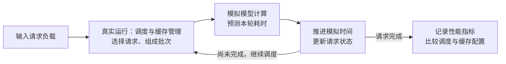
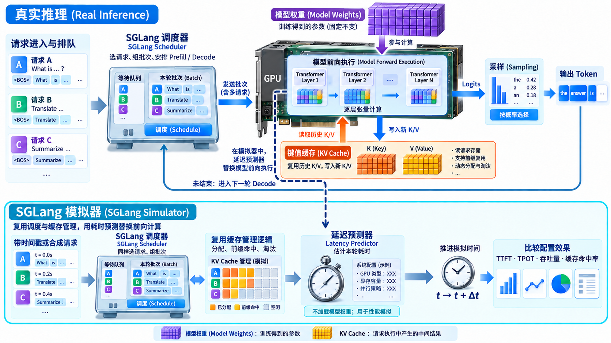

# 1.8 SGLang 模拟器(SGLang Simulator)

> **文档索引(Documentation Index)**
>
> 完整文档索引：[llms.txt](https://docs.sglang.io/llms.txt)。通过此文件查找所有可用页面，再进一步阅读。

> **SGLang 模拟器(SGLang Simulator)用预测耗时替代模型前向计算，让真实的调度与缓存管理逻辑继续运行，用来评估不同调度与缓存配置下的延迟(Latency)、吞吐量(Throughput)和缓存命中率(Cache Hit Rate)。**
>
> - **主要评估对象**：由于模型前向计算(Model Forward Execution)被模拟替代(Mock)，模拟器主要用于评估前向计算之外的请求排队、批次调度和缓存管理等系统逻辑。模型计算的预测耗时仍会影响后续请求的等待时间；模型算子(Kernel)本身是否更快，则需要真实执行来验证。
> - **调度配置(Scheduling Configuration)**：例如同时运行的请求数上限、每轮处理的词元(Token)预算、分块预填充(Chunked Prefill)的分块大小。
> - **缓存配置(Cache Configuration)**：例如是否启用前缀缓存(Prefix Cache)、缓存容量，以及是否使用分层缓存(HiCache)。
> - **对比示例**：保持请求负载和延迟预测器不变，比较开启与关闭前缀缓存后的延迟、吞吐量和缓存命中率。



SGLang 模拟器(SGLang Simulator)复用 SGLang 的调度器(Scheduler)、请求生命周期(Request Lifecycle)和键值缓存(Key-Value Cache，KV Cache)实现，同时使用延迟预测器(Latency Predictor)替代模型前向执行(Model Forward Execution)。它可以在不加载模型权重(Model Weights)的情况下，使用带时间戳的工作负载(Timestamped Workload)或合成工作负载(Synthetic Workload)，比较不同调度与缓存配置的效果。

> - **SGLang 模拟器(SGLang Simulator)**：复用请求调度和缓存管理逻辑，用预测耗时代替模型前向计算，以比较不同推理配置的效果。
> - **SGLang 调度器(SGLang Scheduler)**：挑选请求、组成批次(Batch)，决定每轮执行哪些预填充(Prefill)或解码(Decode)任务。
> - **延迟预测器(Latency Predictor)**：估计本轮模型计算等操作的耗时，供模拟器推进时间和统计性能指标。
> - **模型前向执行(Model Forward Execution)**：结合当前输入、模型权重和 KV Cache 执行本轮张量计算，产生供后续采样(Sampling)使用的输出分数(Logits)。
> - **模型权重(Model Weights)**：训练得到的参数张量，在前向执行时参与计算，决定模型如何处理输入。
> - **键值缓存(Key-Value Cache，KV Cache)**：保存已处理词元(Token)在注意力层中的键(Key)和值(Value)，供后续计算复用，减少重复计算。

<a href="assets/sglang-simulator-inference-components-16x9.png"></a>

**学习补充：** 上半图展示真实推理，下半图展示模拟器；虚线表示用延迟预测器替换模型前向执行，模拟器复用缓存分配、前缀命中与淘汰等管理逻辑，用于比较性能配置的效果。

## 支持范围

SGLang Simulator 跟随当前 `main` 分支和近期的 SGLang 发布版本更新。当前集成已在 `v0.5.16`、`v0.5.17`、`v0.5.18` 和 `main` 上完成验证。

初始上游集成范围使用一个模拟工作进程(Simulated Worker)，其配置为 `tp_size=1`、`ep_size=1`、`dp_size=1` 和 `pp_size=1`。模拟器配置可以描述一个更大的目标系统，用于延迟预测，但 SGLang 运行时的进程拓扑(Process Topology)仍然保持单 Worker。

模拟器支持：

- 合成请求到达率(Synthetic Request Rates)、ShareGPT 工作负载，以及带时间戳的 Autobench 请求轨迹(Trace)；
- `OFFLINE` 逻辑时间模拟(Logical-Time Simulation)和 `BLOCKING` 实际时间回放(Wall-Clock Replay)；
- AIConfigurator、机器学习(Machine Learning，ML)和回放(Replay)延迟预测器；
- SGLang 前缀缓存(Prefix Caching)和 [HiCache](https://docs.sglang.io/docs/advanced_features/hicache)；
- 与推理服务兼容的首词元延迟(Time to First Token，TTFT)、每输出词元耗时(Time per Output Token，TPOT)、词元间延迟(Inter-Token Latency，ITL)、吞吐量(Throughput)和缓存命中(Cache Hit)指标。

## 从 SGLang 仓库安装

使用同一份单体仓库检出目录(Monorepo Checkout)中的模拟器和 SGLang 源码：

```bash
python3 -m pip install -e tools/sglang-simulator
export PYTHONPATH="$PWD/tools/sglang-simulator/src:$PWD/python"
```

AIConfigurator 是可选依赖。仅在使用 AIConfigurator 预测器时，安装已验证的可选依赖组(Extra)：

```bash
python3 -m pip install -e "tools/sglang-simulator[aic]"
```

## 启动模拟器服务

每次运行都应选择一个新的输出目录(Output Directory)。模拟模式由服务端控制，指标也由服务端写入这个目录。

```bash
export SGLANG_USE_CPU_ENGINE=1
export CUDA_VISIBLE_DEVICES=""
export SGLANG_SIMULATOR_OUTPUT_MODE=OFFLINE
export SGLANG_SIMULATOR_OUTPUT_DIR=/tmp/sglang-simulator-quickstart

python3 -m sglang_simulator.simulation.sglang.launch_server \
  --model-path tools/sglang-simulator/test/assets/qwen3-8b \
  --tokenizer-path tools/sglang-simulator/examples/assets/tokenizer \
  --sim-config-path tools/sglang-simulator/examples/sim_configs/replay.json \
  --port 30000
```

`OFFLINE` 直接推进模拟器的逻辑时钟(Logical Clock)，不进行休眠等待。`BLOCKING` 还会按照预测的前向执行延迟和缓存加载延迟(Cache-Load Latency)进行休眠，适用于客户端需要观察模拟实际时间节奏的情况。

## 发送工作负载

在另一个终端中，导出相同的输出目录环境变量，并从仓库根目录运行支持模拟器的服务基准测试(Serving Benchmark)：

```bash
export PYTHONPATH="$PWD/tools/sglang-simulator/src:$PWD/python"
export SGLANG_SIMULATOR_OUTPUT_DIR=/tmp/sglang-simulator-quickstart

python3 benchmark/simulator/bench_serving.py \
  --simulator-mode offline \
  --backend sglang \
  --base-url http://127.0.0.1:30000 \
  --model tools/sglang-simulator/test/assets/qwen3-8b \
  --tokenizer tools/sglang-simulator/examples/assets/tokenizer \
  --dataset-name sharegpt \
  --dataset-path tools/sglang-simulator/examples/workloads/sharegpt-example.json \
  --sharegpt-output-len 4 \
  --num-prompts 3 \
  --output-file /tmp/sglang-simulator-quickstart/benchmark.json
```

基准测试会向每个请求注入逻辑到达时间元数据(Logical Arrival Metadata)，并显示服务端的模拟器指标。对于带时间戳的流量，使用模拟器定义的 Autobench JSONL 格式，并添加 `--use-trace-timestamps`。

## 查看结果

输出目录包含：

- `metrics.json`：汇总的延迟、吞吐量和缓存指标；
- `request.jsonl`：每个请求的时间和缓存信息；
- `iteration.jsonl`：调度器的批次组成(Batch Composition)和预测的迭代延迟(Iteration Latency)。

每次运行都应使用独立的输出目录，避免混合不同实验的指标。模拟器配置字段、预测器示例和持续维护的测试，参见 [SGLang Simulator 源码 README](https://github.com/sgl-project/sglang/tree/main/tools/sglang-simulator)。

---

## 术语与生词表(Terms and Vocabulary，学习补充)

| 术语或单词 | 中文释义 | 简明英文释义 |
|---|---|---|
| Simulator /ˈsɪmjəleɪtə/ | 模拟器：通过模型或规则模拟系统行为的程序。 | A program that imitates the behavior of a system. |
| Scheduler /ˈʃedjuːlə/ | 调度器：决定哪些请求进入批次、何时执行的组件。 | A component that selects requests for batches and determines when they run. |
| Latency /ˈleɪtənsi/ | 延迟：从某个操作开始到产生预期结果之间的时间。 | The time between starting an operation and obtaining its expected result. |
| Predictor /prɪˈdɪktə/ | 预测器：根据输入信息估计尚未实际发生的结果。 | A component that estimates an outcome from available information. |
| Workload /ˈwɜːkləʊd/ | 工作负载：交给系统处理的一组请求及其到达模式。 | A set of requests and their arrival patterns presented to a system. |
| Synthetic /sɪnˈθetɪk/ | 合成的：为测试或模拟而人为生成的。 | Artificially generated for testing or simulation. |
| Trace /treɪs/ | 轨迹：记录请求或事件及其顺序、时间等信息的数据。 | A record of requests or events, including their order and timing. |
| Logical Clock | 逻辑时钟：模拟器内部推进的时间，可以不等待现实时间经过。 | A simulation clock that can advance without waiting for real time to pass. |
| Wall-Clock Time | 实际时间：现实中真实经过的时间。 | The actual elapsed time measured by a real clock. |
| TTFT — Time to First Token | 首词元延迟：从请求到达到收到第一个输出词元的时间。 | The time from request arrival to receiving its first output token. |
| TPOT — Time per Output Token | 每输出词元耗时：首词元之后，平均生成一个输出词元所需的时间。 | The average time per generated token after the first output token. |
| ITL — Inter-Token Latency | 词元间延迟：相邻输出词元之间的时间间隔；与上一篇中的输入词元长度(Input Token Length)含义不同。 | The time interval between consecutive output tokens. |
| ML — Machine Learning | 机器学习：通过数据学习规律并进行预测的方法。 | Methods that learn patterns from data to make predictions. |
| KV Cache — Key-Value Cache | 键值缓存：保存注意力计算中的键和值，供后续计算复用。 | Stored attention keys and values reused in later computations. |
| Prefix Caching | 前缀缓存：复用相同输入前缀对应的缓存结果。 | Reusing cached results for a shared input prefix. |
| Throughput /ˈθruːpʊt/ | 吞吐量：系统在单位时间内完成的处理量。 | The amount of work a system completes per unit of time. |
| Replay /ˌriːˈpleɪ/ | 回放：按已有记录或设定的节奏重新执行工作负载。 | Running a workload again using recorded information or a defined timing pattern. |
| Worker /ˈwɜːkə/ | 工作进程：承担具体处理工作的执行单元；本文的运行时拓扑使用一个 Worker。 | An execution unit that performs assigned processing work. |
| TP — Tensor Parallelism | 张量并行：将同一层的张量运算拆分到多个设备上执行。 | Splitting a layer's tensor operations across devices. |
| EP — Expert Parallelism | 专家并行：将不同专家分布到多个设备上，按路由结果处理词元。 | Distributing experts across devices and routing tokens to them. |
| DP — Data Parallelism | 数据并行：使用模型副本处理不同请求。 | Processing different requests with separate model replicas. |
| PP — Pipeline Parallelism | 流水线并行：将模型层划分为不同阶段，让不同处理单元流水执行。 | Dividing model layers into stages for pipelined execution. |
