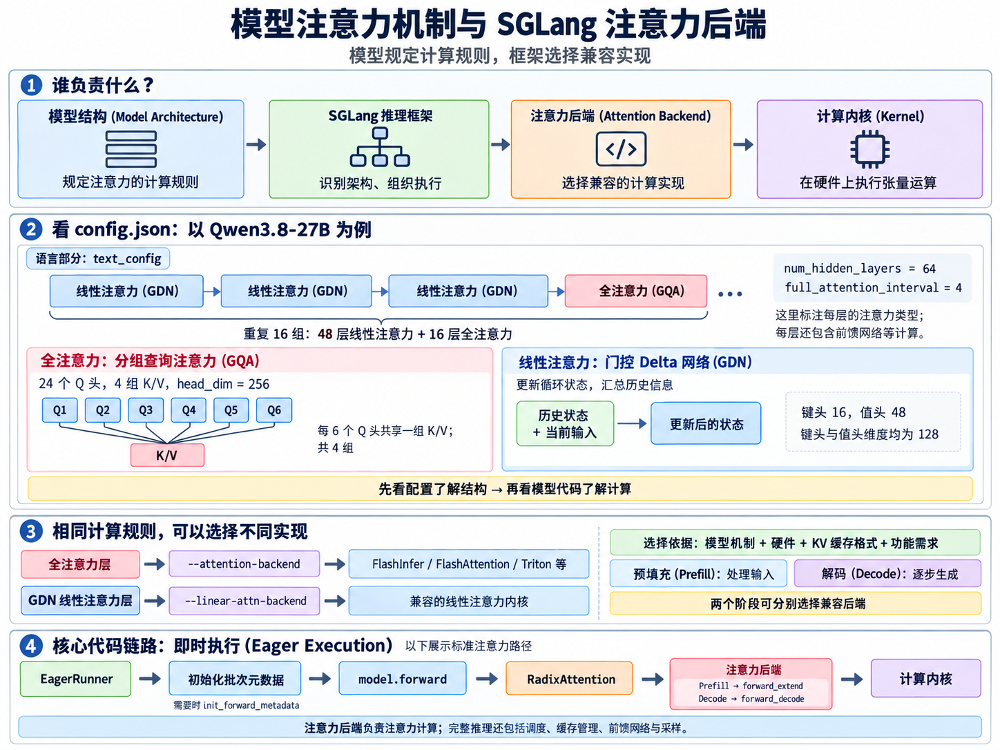
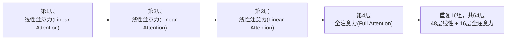
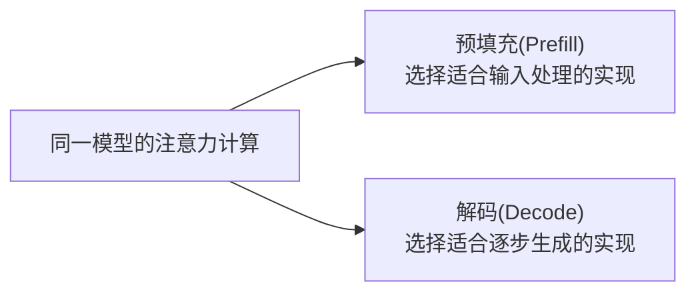
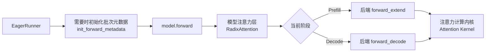

# 2.1 注意力机制与注意力后端(Attention Mechanisms and Backends)

本文围绕三个问题：模型使用什么注意力机制(Attention Mechanism)、推理框架如何实现它、对应代码从哪里看。

## 一、模型结构、推理框架与注意力后端是什么关系？

| 概念 | 负责什么 |
|---|---|
| 模型结构(Model Architecture) | 规定注意力的数学形式、层的排列、注意力头的数量和维度 |
| 推理框架(Inference Framework) | 组织请求调度、缓存管理、模型计算、采样与结果返回 |
| 注意力后端(Attention Backend) | 用兼容且高效的程序实现模型要求的注意力计算 |
| 计算内核(Kernel) | 在具体硬件上执行底层张量运算 |

模型训练时已经确定注意力结构，权重与该结构配套；推理时由框架选择兼容的计算实现。

例如，同一种受支持的注意力计算，可以由 FlashInfer、FlashAttention 或 Triton 实现；它们在并行方式、显存访问、算子融合(Operator Fusion)等方面有不同优化。
注意力后端负责推理中的注意力部分；完整推理还包含前馈网络(Feed-Forward Network，FFN)、连续批处理(Continuous Batching)、量化(Quantization)、张量并行(Tensor Parallelism，TP)、推测解码(Speculative Decoding)等。

## 二、模型的注意力机制在哪里看？相关参数怎么读？

先看模型的 `config.json` 了解结构，再看模型代码了解计算过程，论文用于理解设计原理。
以 [Qwen3.8-27B 的配置](https://huggingface.co/Qwen/Qwen3.8-27B/blob/main/config.json)为例，以下数值对应文中查阅的版本；语言部分看 `text_config`，视觉编码器(Vision Encoder)看 `vision_config`。
该检查点的 `architectures` 为 `Qwen3_5ForConditionalGeneration`，`model_type` 为 `qwen3_5`，这是它声明使用的模型架构标识。

### 1. 层的排列：线性注意力与全注意力混合

| 配置 | 当前值 | 含义 |
|---|---|---|
| `num_hidden_layers` | `64` | 文本模型的解码器层(Decoder Layer)数量 |
| `layer_types` | 重复的 3 个 `linear_attention` + 1 个 `full_attention` | 逐层声明注意力类型 |
| `full_attention_interval` | `4` | 每 4 层安排一层全注意力 |
| `hidden_size` | `5120` | 模型主干中每个词元(Token)的隐藏维度(Hidden Dimension) |

图中标的是每层的注意力类型，每层还包含前馈网络等计算。全注意力(Full Attention)可关注全部已有上下文；这里的线性注意力(Linear Attention)采用门控 Delta 网络(Gated DeltaNet，GDN)，通过更新状态来汇总历史信息。

### 2. 全注意力层：查询头与键值头

| 配置 | 当前值 | 含义 |
|---|---|---|
| `num_attention_heads` | `24` | 查询头(Query Head)的数量 |
| `num_key_value_heads` | `4` | 键值头(Key/Value Head)的组数 |
| `head_dim` | `256` | 每个注意力头的向量维度 |
| `attn_output_gate` | `true` | 对全注意力输出施加门控(Gating)，控制信息通过 |
| `attention_bias` / `attention_dropout` | `false` / `0.0` | 注意力投影不带偏置(Bias)，注意力丢弃率(Dropout Rate)为零 |

查询(Query，Q)用来检索历史信息，键(Key，K)用于匹配相关性，值(Value，V)提供待汇总的信息。这里 `24 ÷ 4 = 6`：每 6 个 Q 头共享一组 K/V，属于分组查询注意力(Grouped Query Attention，GQA)，能减少键值缓存(Key/Value Cache，KV Cache)占用。
“全注意力”描述关注的上下文范围，“GQA”描述头之间如何共享 K/V；两者可以同时成立。`head_dim` 已显式配置，读取时使用这个值。

### 3. 线性注意力层：另一组头与状态参数

| 配置 | 当前值 | 含义 |
|---|---|---|
| `linear_num_key_heads` / `linear_num_value_heads` | `16` / `48` | 线性注意力的键头、值头数量 |
| `linear_key_head_dim` / `linear_value_head_dim` | `128` / `128` | 对应头的向量维度 |
| `linear_conv_kernel_dim` | `4` | 内部局部卷积(Local Convolution)的核大小，用于混合相邻位置的信息 |
| `mamba_ssm_dtype` | `float32` | 循环状态(Recurrent State)的精度配置 |
| `output_gate_type` | `swish` | GDN 输出门控使用的激活函数(Activation Function) |

### 4. 位置与缓存相关配置

| 配置 | 当前值 | 含义 |
|---|---|---|
| `rope_parameters` | 一组参数 | 配置旋转位置编码(Rotary Position Embedding，RoPE)，让注意力感知位置 |
| `partial_rotary_factor` | `0.25` | 每个头有 25% 的维度应用旋转位置编码，即 `256 × 0.25 = 64` 维 |
| `rope_parameters.rope_theta` | `10000000` | 旋转位置编码的频率基数 |
| `max_position_embeddings` | `262144` | 模型配置声明的最大位置范围；实际服务上下文还受启动配置与资源限制 |
| `use_cache` | `true` | 启用生成过程的缓存复用；前缀缓存(Prefix Cache)是否启用由框架另外配置 |

对应实现可查看 [Qwen 模型代码](../python/sglang/srt/models/qwen3_5.py)：`Qwen3_5AttentionDecoderLayer` 实现全注意力层，`Qwen3_5GatedDeltaNet` 实现 GDN。

## 三、SGLang 如何选择注意力后端？

先确认模型机制，再检查硬件、KV 缓存格式与页面大小(Page Size)、推测解码及多模态(Multimodal)等功能支持，最后用实际负载比较性能。
常见机制包括多头注意力(Multi-Head Attention，MHA)及 GQA 变体、多头潜在注意力(Multi-Head Latent Attention，MLA)、GDN 和 DeepSeek 稀疏注意力(DeepSeek Sparse Attention，DSA)。
未指定 `--attention-backend` 时，SGLang 会根据模型和硬件等条件自动选择；也可以显式指定兼容实现，例如 `--attention-backend fa3`。

对于上面的混合模型，全注意力层使用兼容的 `--attention-backend`；GDN 路径由模型架构启用，其内核实现通过 `--linear-attn-backend` 等参数选择。
支持矩阵说明兼容性，实际速度还取决于模型、硬件、批大小(Batch Size)和输入输出长度。

## 四、预填充与解码可以选择不同实现

预填充(Prefill)处理较多输入词元；解码(Decode)通常每轮为每个请求生成一个新词元，两者的计算形态不同。
SGLang 支持分别设置 `--prefill-attention-backend` 和 `--decode-attention-backend`，未单独设置的阶段继承 `--attention-backend`；组合需满足模型及硬件兼容条件。
GDN 也有对应的 `--linear-attn-prefill-backend` 和 `--linear-attn-decode-backend`。

## 五、注意力后端在核心代码链路中的位置

下面展示即时执行(Eager Execution)路径中的标准注意力调用；混合模型里的 GDN 层走对应的线性注意力实现。

`init_forward_metadata` 准备序列长度、KV 缓存索引等批次元数据(Batch Metadata)；进入模型各层后，再调用后端进行该层的注意力计算。
阅读顺序：[EagerRunner](../python/sglang/srt/model_executor/runner/eager_runner.py) → [模型层调用入口](../python/sglang/srt/layers/radix_attention.py) → [AttentionBackend 接口](../python/sglang/srt/layers/attention/base_attn_backend.py) → 具体后端。
完整兼容性与参数说明见仓库内的 [SGLang 注意力后端文档](../docs/docs/advanced_features/attention_backend.mdx)。
