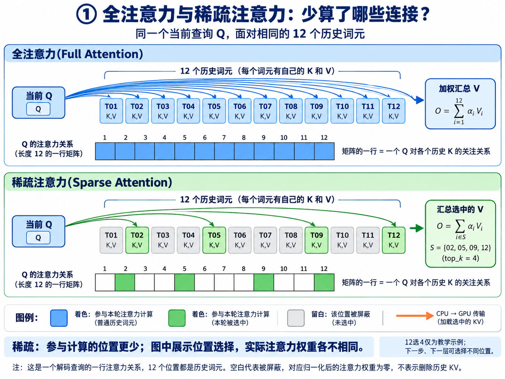
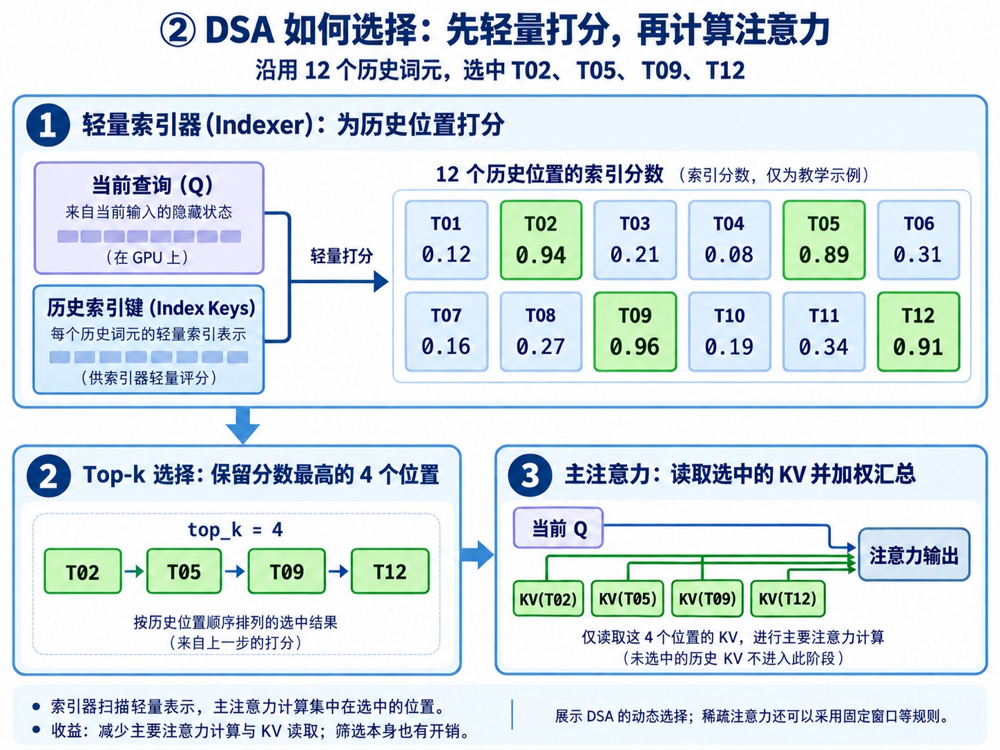
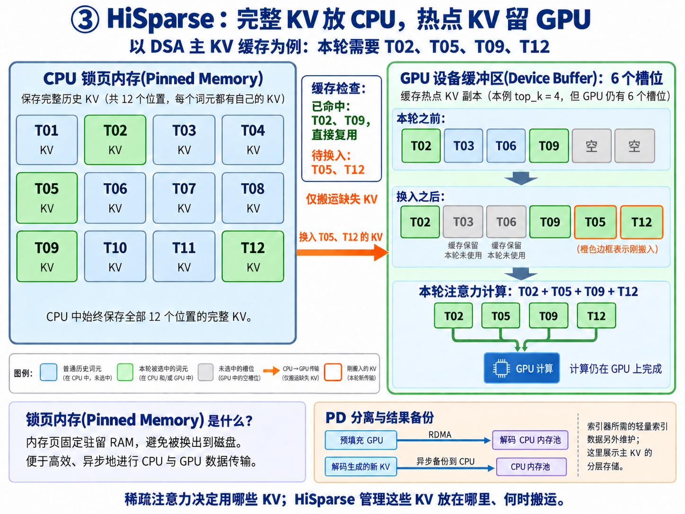

# 2.2 分层稀疏注意力(Hierarchical Sparse Attention)

本文介绍分层稀疏注意力(Hierarchical Sparse Attention，HiSparse)，并解释稀疏矩阵(Sparse Matrix)与锁页内存(Pinned Memory)。三张图共用“12 个历史词元(Token)，本轮选中 T02、T05、T09、T12”的教学示例。
使用方式根据 SGLang 文档翻译；参阅 [SGLang 文档索引](https://docs.sglang.io/llms.txt)与仓库中的 [HiSparse 指南](../docs/docs/advanced_features/hisparse_guide.mdx)，兼容范围以部署版本为准。

## 一、补充科普：稀疏注意力与稀疏矩阵

**稀疏注意力(Sparse Attention)** 让每个查询(Query，Q)只对部分上下文位置进行主要注意力计算。全注意力(Full Attention)对全部可见位置计算权重；稀疏注意力按规则选择部分位置，再加权汇总对应的值(Value，V)。
**矩阵为什么叫“稀疏”？** 注意力矩阵(Attention Matrix)的行对应查询位置，列对应历史键(Key，K)的位置；一行表示“当前 Q 关注哪些 K”。被屏蔽的位置在归一化(Normalization)后的注意力权重中为零，因此这行仅部分位置有非零权重。实际稀疏内核可以只处理选中的位置，无需先构造完整矩阵。
下图只画一个解码查询对应的一行；颜色表示是否参与计算，实际权重各不相同。本轮未选中的历史 KV 仍可供以后使用；不同层、不同解码步骤可以选择不同位置。



**怎么选择？** 可以按固定窗口等规则，也可以像 DeepSeek 稀疏注意力(DeepSeek Sparse Attention，DSA)一样，用轻量索引器(Indexer)为历史位置打分，选出分数最高的 k 个位置(Top-k Selection)，再读取对应 KV 进行主要注意力计算。这是选择上下文位置；生成输出词元的采样(Sampling)在后续进行。[DSA 实现说明](https://huggingface.co/docs/transformers/model_doc/deepseek_v32)
**为什么更快？** 主要注意力计算和 KV 读取集中到较少位置，但索引筛选、数据搬运仍有开销；“12 选 4”不等于端到端速度提高 3 倍。模型需要通过相应设计或训练保留重要信息，HiSparse 利用的是模型原有的稀疏选择。



## 二、补充科普：KV Cache 可以放 CPU 吗？Pinned Memory 是什么？

**可以。** 键值缓存(Key/Value Cache，KV Cache)是模型计算产生的数据，可以存放在 GPU 显存(GPU Memory)或 CPU 主机内存(Host Memory)中。HiSparse 在 CPU 保存完整主 KV，在 GPU 保存热点副本；本轮需要的数据在 GPU 命中就复用，缺失时再从 CPU 搬入，主要注意力计算仍在 GPU 上执行。
**锁页内存(Pinned Memory)** 是页被固定驻留在物理内存(Physical Memory)、不会被操作系统换出到磁盘的 CPU 内存，便于 GPU 通过直接内存访问(Direct Memory Access，DMA)进行高效、异步传输。它仍占用主机内存；传输与计算能否重叠，还取决于硬件和流(Stream)安排。[PyTorch 说明](https://docs.pytorch.org/tutorials/intermediate/pinmem_nonblock.html)
**两者分工：** 稀疏注意力决定“本轮用哪些 KV”；HiSparse 管理“KV 放哪里、何时搬运”。示例中 GPU 有 6 个槽位，本轮只用其中 4 个，T02、T09 命中，只需换入 T05、T12；缓存中还可保留其他位置供后续复用。



## 三、原文译文：作用与使用前提

HiSparse 在解码(Decode)阶段，仅在 GPU 维护较小的热点 KV 缓冲区，完整 KV 保存在 CPU 锁页内存中，从而降低每个请求的显存占用。结合预填充与解码分离(PD Disaggregation)，可以显著提高解码并发量。
**前提：** 原文支持 DSA 模型，例如 DeepSeek-V3.2、GLM-5.1，以及 DeepSeek V4、MiniMax M3。这些模型原生选择部分词元(Token)参与注意力计算，HiSparse 保留原有选择，在不损失模型精度的前提下调整 KV 存储位置。目前要求 PD 分离，只在解码实例启用；具体缓存划分见后文的模型说明。
长上下文下，每个请求将完整 KV 常驻显存会限制并发。HiSparse 让请求只占用固定大小的设备缓冲区(Device Buffer)，按注意力相关性选择所需条目，由 CUDA 内核按需换入(Swap-in)；预填充(Prefill)实例无需为此修改。
> 译注：原文示例写作“4KB tokens”和“buffer (4KB)”，但 `device_buffer_size` 的单位是词元槽位数量，应按约 4K 个词元理解；实际字节数还与模型结构及数据类型有关。

## 四、设计：解码流程与 PD 集成

1. **前向解码(Forward Decode)**：开始生成下一个词元的前向计算流程。
2. **Top-k 选择(Top-k Selection)**：根据相关性评分选择历史词元位置。
3. **换入(Swap-in)**：短序列满足 `seq_len ≤ device_buffer_size` 时全部 KV 已在缓冲区，走快速路径；长序列执行“命中检测 → 最近最少使用(Least Recently Used，LRU)重排 → 缺失处理”，将缺失条目从主机复制到设备。
4. **解码注意力(Decode Attention)**：使用选中的设备槽位进行注意力计算。
5. **及时备份(Eager Backup)**：将前一个词元的 KV 从设备异步复制到主机。

**直接写入主机(Direct-to-Host)：** 预填充 GPU → 远程直接内存访问(Remote Direct Memory Access，RDMA) → 解码 CPU 锁页内存池 → 分配设备缓冲区 → 按需换入 Top-k KV。初始 KV 传输绕过解码 GPU，消除传输期间的瞬时显存峰值，并省去中转阶段的 DMA 操作。
**DeepSeek V4：** 这条路径只把 C4 KV 写入解码主机池；`c4_indexer` 和 C128 KV 仍使用设备到设备(Device-to-Device)传输。

## 五、服务端参数与配置

| 参数或配置项 | 类型／默认值 | 说明 |
|---|---|---|
| `--enable-hisparse` | 开关／默认关闭 | 在解码实例启用 HiSparse |
| `--hisparse-config` | JSON 字符串 | 传入下列配置项 |
| `top_k` | 整数 | Top-k 条目数量 |
| `device_buffer_size` | 整数 | 每请求 GPU 缓冲区的词元槽位数 |
| `host_to_device_ratio` | 整数 | 逻辑池与设备池容量之比，用于确定主机内存容量 |
| `swap_in_block_size` | 整数／`960` | 换入内核的 CUDA 线程块(Thread Block)大小 |

示例：`--hisparse-config='{"top_k": 2048, "device_buffer_size": 6144, "host_to_device_ratio": 10, "swap_in_block_size": 960}'`。

## 六、共享索引预取(Shared-index Prefetch)

当后续“跳过层”(Skip Layer)复用锚点层(Anchor Layer)的 Top-k 选择时，锚点索引算出后，后续层所需的数据集合也随之确定。例如 DSA 的 `index_topk_freq`／`index_topk_pattern`，以及 GLM-5.2 原生的 IndexShare。
HiSparse 让锚点换入内核记录缺失条目的搬运计划，即“哪些主机槽位复制到哪些设备槽位”；后续层通过辅助流(Side Stream)提前执行只负责复制的内核，重放这份计划，使数据传输与中间层计算重叠，减少解码关键路径(Critical Path)上的等待。重放内核使用较小的固定网格(Grid)，降低流式多处理器(Streaming Multiprocessor，SM)资源占用。
符合条件的模型会自动启用预取，要求未使用流水线并行(Pipeline Parallelism，PP)和推测解码(Speculative Decoding)；设置 `SGLANG_DISABLE_HISPARSE_PREFETCH=1` 可关闭它，进行 A/B 对比。

## 七、部署与性能测试

以下保留原文参数；预填充和解码分别部署，示例路径、端口与网络设备按环境配置。
**预填充实例：**

```bash
python3 -m sglang.launch_server \
    --model-path /path/to/model --trust-remote-code --port 8000 --host 0.0.0.0 \
    --context-length 81920 --chunked-prefill-size 65536 --tp-size 8 --dp-size 8 --enable-dp-attention \
    --mem-fraction-static 0.85 --disaggregation-mode prefill \
    --disaggregation-ib-device mlx5_0,mlx5_1,mlx5_2,mlx5_3 --nnodes 1 --node-rank 0
```

**启用 HiSparse 的解码实例：**

```bash
python3 -m sglang.launch_server \
    --model-path /path/to/model --trust-remote-code --port 8000 --host 0.0.0.0 --context-length 81920 \
    --tp-size 8 --dp-size 8 --enable-dp-attention --mem-fraction-static 0.85 --disable-radix-cache \
    --disaggregation-mode decode --disaggregation-ib-device mlx5_0,mlx5_1,mlx5_2,mlx5_3 \
    --dist-init-addr 127.0.0.1:5757 --nnodes 1 --node-rank 0 --enable-hisparse \
    --hisparse-config='{"top_k": 2048, "device_buffer_size": 6144, "host_to_device_ratio": 10, "swap_in_block_size": 960}'
```

**性能测试(Benchmark)：**

```bash
python3 -m sglang.bench_serving --backend sglang \
    --dataset-path /path/to/ShareGPT_V3_unfiltered_cleaned_split.json --dataset-name random \
    --random-input 40000 --random-output 20000 --num-prompts 200 --max-concurrency 200 \
    --request-rate 40 --random-range-ratio 1.0 --host 127.0.0.1 --port 20000 \
    --model /path/to/model --flush-cache
```

## 八、模型差异与关键说明

- 预填充实例无需 `--enable-hisparse`；解码实例需要同时设置 `--enable-hisparse` 和 `--hisparse-config`。
- DSA 的 `--kv-cache-dtype` 默认 `auto`：SM100+（Blackwell）解析为 `fp8_e4m3`，更早架构解析为 `bfloat16`；通常 `bfloat16` 使用 `flashmla_sparse`，`fp8_e4m3` 使用 `flashmla_kv`。
- SM120／SM121（如 RTX PRO 6000、RTX 5090）上的 GLM DSA 模型使用 `fp8_e4m3` 时，上述两个后端均解析为 `flashinfer_sparse_mla`，这是该架构可用的 DSA 内核，HiSparse 支持它，无需额外开关。
- DeepSeek V4 使用自身的 `dsv4` 注意力后端，KV 默认 `fp8_e4m3`；DSA 后端参数不适用。
- MiniMax M3 的稠密层(Dense Layer)K/V 与索引 K 保留在 GPU，稀疏层(Sparse Layer)K/V 使用主机内存与 GPU 工作集(Working Set)。
- MiniMax M3 要求两个 PD 实例使用相同且至少为 4 的张量并行度(Tensor Parallel Size，TP)，流水线并行度(Pipeline Parallel Size，PP)为 1；设置 `--attention-backend triton`、`--mm-attention-backend triton_attn`、`--disable-prefill-cuda-graph`、`--disable-radix-cache`。
- MiniMax M3 的 `device_buffer_size` 至少为 `2048`，`top_k` 不覆盖模型自身的选择宽度；不支持 PD 请求回退备份(Retraction Backup)，通过 `--num-reserved-decode-tokens` 为预期输出长度预留容量。
- `host_to_device_ratio` 按主机可用内存配置；原文示例：约 1 TB 内存取 5，约 2 TB 取 10。

## 九、致谢与插图记录

原文感谢 SGLang 团队和社区，特别是 Zhiqiang Xie、Zhangheng Huang、Tingwei Huang、Shangming Cai、Teng Ma，以及阿里云 TairKVCache 团队和蚂蚁集团 SCT Inference 团队。
插图由 imagegen 生成；[三张图的提示词](assets/hisparse-images.prompt.txt)记录统一示例与绘制要求。概念背景见 [2.1 注意力机制与注意力后端(Attention Mechanisms and Backends)](<2.1 注意力机制与注意力后端(Attention Mechanisms and Backends).md>)。
