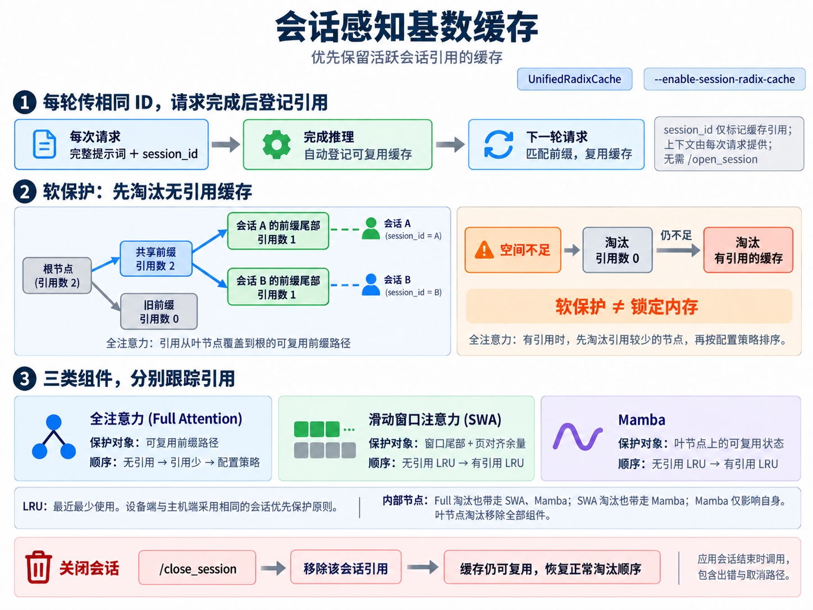

# 2.3 会话感知基数缓存(Session-Aware Radix Cache)

本文根据 SGLang 会话感知基数缓存文档翻译；[仓库中的原文](../docs/docs/advanced_features/session_radix_cache.mdx)。



会话感知基数缓存能够在内存紧张时，提高长期运行、多轮交互任务的缓存命中率(Cache Hit Rate)。它将可复用的键值缓存(Key/Value Cache，KV Cache)登记到会话(Session)中，并优先淘汰没有会话引用的 KV，再淘汰仍被活跃会话引用的 KV。

会话引用(Session Reference)提供的是软保护(Soft Protection)，不会将缓存锁定在内存中。如果回收未被引用的 KV 后空间仍然不足，被引用的 KV 也可能被淘汰。

## 启用缓存

目前只有统一基数缓存(Unified Radix Cache)的 `UnifiedRadixCache` 实现了此功能。

```bash
python3 -m sglang.launch_server \
  --model-path MODEL_PATH \
  --enable-session-radix-cache
```

## 传递会话标识并关闭会话

应用程序必须在同一会话的每次请求中，传入相同的顶层字段 `session_id`。

这个标识仅用于标记缓存引用，不会自动追加或重建对话上下文。因此，每次请求仍需包含本轮所需的完整提示词(Prompt)。

```bash
curl http://localhost:30000/generate \
  -H "Content-Type: application/json" \
  -d '{
    "text": "FULL_PROMPT_FOR_THIS_TURN",
    "sampling_params": {"max_new_tokens": 128},
    "session_id": "agent-42"
  }'
```

请求完成后，SGLang 会自动将该请求可复用的缓存叶节点(Cache Leaf)登记到对应的 `session_id` 下。这种仅维护缓存引用的流程，无需调用 `/open_session`。

应用会话结束时，应调用 `/close_session`，包括发生错误或取消操作的情况：

```bash
curl -X POST http://localhost:30000/close_session \
  -H "Content-Type: application/json" \
  -d '{"session_id": "agent-42"}'
```

关闭会话会移除该会话的引用，但不会立即释放对应的 KV。这些 KV 仍可复用，并恢复正常的淘汰顺序。

## 淘汰行为(Eviction Behavior)

缓存会分别跟踪 `UnifiedRadixCache` 各组件的引用情况。设备端(Device)和主机端(Host)的缓存淘汰都采用相同的会话优先保护原则。

| 组件 | 被引用的数据 | 淘汰顺序 |
|---|---|---|
| 全注意力(Full Attention) | 从已登记叶节点到根节点的可复用前缀路径 | 优先淘汰无引用节点，再优先淘汰会话引用数量较少的节点；引用数量相同时，按已配置策略排序，例如最近最少使用(Least Recently Used，LRU)策略 |
| 滑动窗口注意力(Sliding-Window Attention，SWA) | 覆盖滑动窗口、并包含页对齐余量的可复用尾部数据 | 分两轮执行 LRU 淘汰：先淘汰无引用节点；如果仍需空间，再淘汰有引用节点 |
| Mamba | 已登记叶节点上的可复用状态(State) | 分两轮执行 LRU 淘汰：先淘汰无引用节点；如果仍需空间，再淘汰有引用节点 |

`UnifiedRadixCache` 仍遵循组件级联规则(Component Cascade Rules)：

- 淘汰内部节点的全注意力数据时，也会淘汰该节点的 SWA 和 Mamba 数据。
- 淘汰 SWA 数据时，也会淘汰 Mamba 数据。
- 淘汰 Mamba 数据时，仅影响 Mamba 数据。
- 淘汰叶节点时，会移除该叶节点上的全部组件数据。

> 文档索引(Documentation Index)：[完整文档索引](https://docs.sglang.io/llms.txt)。进一步阅读前，可通过此文件查找所有可用页面。
