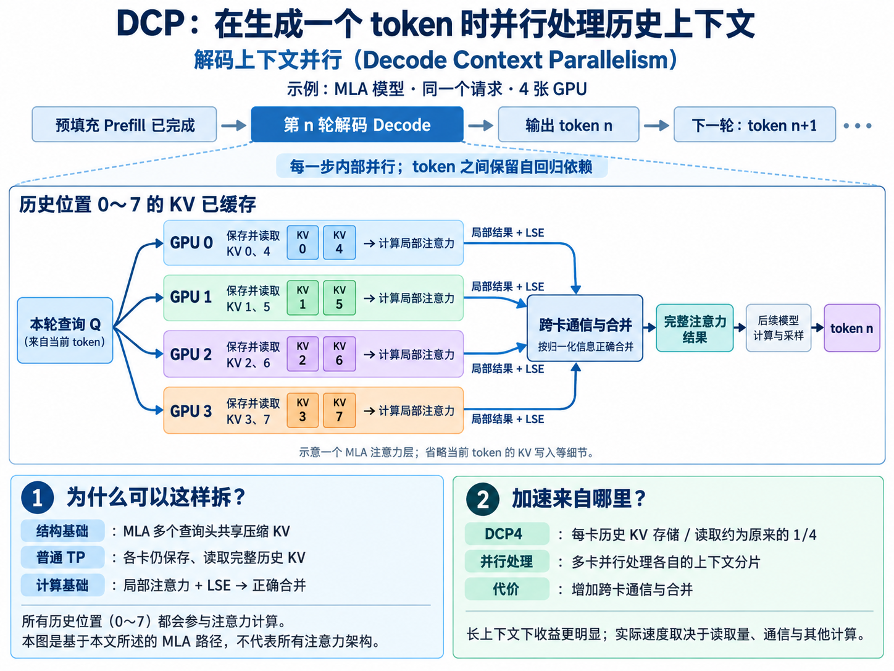
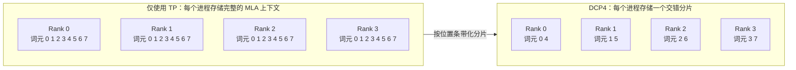
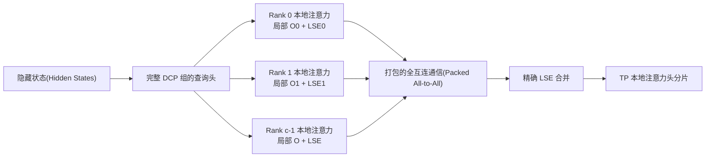
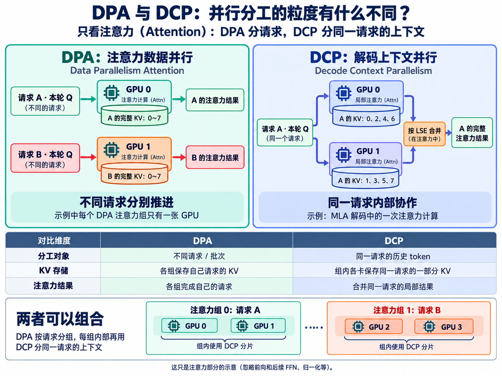

> ## 文档索引(Documentation Index)
> 获取完整文档索引：https://docs.sglang.io/llms.txt
> 在进一步浏览之前，使用该文件查找所有可用页面。

# 2.4 解码上下文并行(Decode Context Parallelism)

## 学习补充：DCP 加速的是哪一步？

按普通自回归(Auto-Regressive)生成理解：预填充(Prefill)完成后，模型在解码(Decode)阶段逐个产生新词元(Token)。DCP 在每一步的 MLA 注意力计算中，结合**历史键值缓存(KV Cache)分片存储与读取**和**多卡局部注意力并行计算、归一化合并**，减少每卡要保存和读取的历史数据。各卡共同完成同一 token 的注意力计算，token 之间仍保留自回归依赖。

<a href="assets/dcp-decode-overview-4x3.png"></a><br>
图中展示的是预填充(Prefill)完成后，在解码(Decode)生成单个词元(Token)的过程中，一个 MLA 注意力层内部的 KV 分片读取与多卡并行计算。

## 概述(Overview)

解码上下文并行(Decode Context Parallelism，DCP)在已有的张量并行(Tensor Parallelism)组内，将一个请求的 MLA 键值缓存(KV Cache)按条带化(Striping)方式分布到各进程(Rank)。设 DCP 并行度为 `c`，当 `p mod c = r` 时，位置 `p` 由进程 `r` 持有，因此每个进程大约只存储和读取缓存的 `1/c`。本地注意力(Local Attention)只能看到部分上下文。MLA 路径返回局部输出和指数和的对数(Log-Sum-Exp，LSE)，将两者打包，通过一次全互连通信(All-to-All)交换，再精确合并。DCP 与 TP、[注意力数据并行(Attention Data Parallelism，DPA)](https://docs.sglang.io/docs/advanced_features/dp_dpa_smg_guide)互为补充，而非替代。主要路径是吸收式 MLA 解码(Absorbed MLA Decode)和静态目标模型校验(Static Target Verification)。`dcp_size=1` 保持现有的非 DCP 行为。

在 Kimi K3 中，DCP 仅作用于 MLA 层。按请求索引的 KDA 状态保持不变，因此 DCP 扩大了长上下文 KV 容量，但不会提高 KDA 的并发上限。
## 启用 DCP

| 配置 | 行为 |
|---|---|
| `--dcp-size N` | 启用 DCP，将虚拟容量和页大小扩大到原来的 `N` 倍。别名：`--decode-context-parallel-size`。 |
| `--dcp-comm-backend` | 选择 MLA 局部输出合并方式：`ag_rs`、`a2a` 或 `fi_a2a`。未设置时，若 Blackwell 上的 DCP 组共享一个 MNNVL 域，则选择 `fi_a2a`；否则在 CUDA/ROCm 上选择 `a2a`。 |
| `--dcp-replicate-q-proj` | 对支持的 MLA 权重，消除查询全收集(Query All-Gather)。使用 `--no-dcp-replicate-q-proj` 可关闭模型专用的默认设置。 |
| `--enable-dp-attention` | 仅当 DCP 组嵌套在注意力 TP 内部时，才能组合使用。 |

一个 DCP 组必须完整位于同一个注意力 TP 组和同一个注意力 DP 副本内：`attn_tp_size = tp_size / attn_dp_size`，并满足 `attn_tp_size % dcp_size == 0`。
例如，`TP=64, DP=4, DCP=16` 会创建四个有效的注意力副本，每个包含 16 个进程。`DCP=32` 会跨越副本边界，属于无效配置。
> **警告：**当前启动时仅检查 `tp_size % dcp_size == 0`，并未检查上述更严格的条件。在该检查修复之前，DPA+DCP 部署必须在选择拓扑(Topology)时确保组内包含关系。

在 DeepSeek-V3.1 上进行 MLA 解码，在 TP 8 内启用 DCP 8：
```bash
sglang serve --model-path deepseek-ai/DeepSeek-V3.1 --trust-remote-code --tp-size 8 --dcp-size 8 --host 0.0.0.0 --port 30000
```
在 32 张 GPU 上运行 Kimi K3，启用 DPA 和 DCP 8。模型专用覆盖配置默认启用查询复制(Replicated Q)；通信后端按通用规则在 MNNVL 系统上选择 `fi_a2a`，否则选择 `a2a`：
```bash
sglang serve --trust-remote-code --model-path moonshotai/Kimi-K3 --tp-size 32 --ep-size 32 --enable-dp-attention --dp-size 4 --dcp-size 8 --host 0.0.0.0 --port 30000
```
结合 DCP、DPA 和专家并行(Expert Parallelism)的大规模预设配置，参见 [Kimi K3 部署指南](https://docs.sglang.io/cookbook/autoregressive/Moonshotai/Kimi-K3)。
## 为什么需要解码上下文并行？

吸收式 MLA 在所有查询头(Query Head)之间共享一份潜在 KV 表示(Latent KV Representation)。TP 可以拆分注意力头和权重，但无法拆分这份缓存，因此每个注意力 TP 进程都会存储和读取相同的上下文。

DCP 按逻辑词元位置，以轮询(Round-Robin)方式对缓存进行条带化分片，在每个进程上保留共享的虚拟索引(Virtual Index)，针对所属的本地分片执行注意力计算，再通过 LSE 将局部输出合并为通常的 TP 本地注意力头布局。
## 架构(Architecture)

### 虚拟 KV 布局(Virtual KV Layout)

设每个进程的物理词元容量为 `C`，物理页大小为 `P`。DCP 提供共享的虚拟分配器(Virtual Allocator)：
```text
virtual capacity  = C * c
virtual page size = P * c
owner(v)          = v mod c
physical(v)       = floor(v / c)
```
每个进程看到相同的请求到词元映射(Request-to-Token Map)。写入时，只保留属于自己的位置，并将其紧凑地写入本地物理内存池。一个扩大后的虚拟页映射到每个进程上的一个物理页，因此随着序列增长，各进程之间的存储数量差异最多为一个词元。
### MLA 解码数据流(MLA Decode Dataflow)


对于上下文分区 `r`，计算内核(Kernel)返回本地归一化输出 `o_r` 和 `lse_r`。全局结果为 `lse = logsumexp_r(lse_r)` 和 `o = sum_r(exp(lse_r - lse) * o_r)`。除浮点归约顺序(Floating-Point Reduction Order)带来的差异外，结果是精确的。合并使用注意力后端(Attention Backend)对应的 LSE 底数，可以是 `e`，也可以是 `2`。
### 查询投影复制(Query-Projection Replication)

通常，每层都会对吸收后的查询分量和旋转查询分量(Rotary Query Component)执行全收集(All-Gather)。`--dcp-replicate-q-proj` 在启动时一次性收集查询投影(Query Projection)和 `w_kc` 权重，并在本地计算完整 DCP 组的查询。代价是增加权重内存占用和通用矩阵乘法(GEMM)工作量，换取每层减少一次集合通信(Collective)。仅未量化的 BF16/FP16 权重使用此路径；其他层回退到查询全收集。
### 通信后端(Communication Backends)

| 后端 | 每个 MLA 层的 DCP 集合通信 | 说明 |
|---|---|---|
| `ag_rs` | 查询 AG + LSE AG + FP32 输出 RS | 不支持 A2A 路径的平台的回退方案；通过 `--dcp-comm-backend ag_rs` 显式选择。 |
| `a2a`，收集 Q | 查询 AG + 打包的 NCCL A2A | 两次集合通信。 |
| `a2a`，复制 Q | 一次打包的 NCCL A2A | 标准低延迟路径。 |
| `fi_a2a`，复制 Q | 一次 FlashInfer MNNVL A2A | 要求 Blackwell，且 DCP 组位于同一个 MNNVL 域内，例如 GB200/GB300 互联网络(Fabric)或单节点。 |

未设置 `--dcp-comm-backend` 时，每次 DCP 启动都按相同规则选择：Blackwell 上的 DCP 组共享一个 MNNVL 域时使用 `fi_a2a`；否则在 CUDA/ROCm 上使用 `a2a`；只有不支持 A2A 路径的平台才使用 `ag_rs`。查询复制仍由模型配置决定：Kimi K3 在 A2A 系列后端上默认启用查询复制，其解码后端为 `cutedsl_mla`。

DCP 增加了一次与上下文长度无关的解码集合通信，同时将随上下文长度变化的 KV 存储量和读取量降低到大约原来的 `1/c`。扩展阶段(Extend)不包含在这一解码成本模型中：它可能需要收集已缓存的前缀分片、恢复词元顺序并追加新词元，这部分工作量随前缀长度增长。
## 组合使用(Compositions)

### DCP × 推测解码(Speculative Decoding)

草稿 KV Cache 采用复制方式：每个 DCP 进程都保存完整的草稿上下文。DCP 只对目标模型的 MLA KV Cache 进行条带化分片，因此节省的是目标模型缓存，而非草稿缓存。

目标模型校验(Target Verification)和解码使用支持 DCP 的 MLA 内核 `cutedsl_mla`，它会：

1. 根据循环词元映射 `owner(p) = p mod c`，构建进程本地页表(Page Table)。
2. 对该分片执行注意力计算，传入 `cp_world`、`cp_rank` 和全局 KV 长度，使因果性(Causality)判定仍能看到完整序列。
3. 返回进程本地的 `(output, LSE)`，由常规 DCP 全互连合并流程整合。

草稿步骤使用同一后端访问完整复制的草稿缓存，因此跳过 DCP 元数据(Metadata)。Kimi K3 的 DCP 会自动选择 `cutedsl_mla`。
### DCP × 预填充与解码分离(PD Disaggregation)

稠密的预填充页无法直接复制到条带化的解码存储中。PD 发送端使用解码进程的 DCP 元数据选择并打包正确的数据行。传输引擎参见 [PD 分离](https://docs.sglang.io/docs/advanced_features/pd_disaggregation)。

- DCP 并行度相同时，要求 DCP 进程编号匹配，并使用现有的页传输路径。
- 从 DCP1 预填充端传输到 DCP 解码端时，对 MLA 和混合 MLA 内存池使用词元布局重排(Token Relayout)。
- 拒绝其他所有 DCP 并行度之间的转换。

传输计划包含精确的词元数量，因此最后一个未填满的页面不会传出残留的旧数据行。Mooncake 和 NIXL 使用同一传输计划。KDA 状态保持其注意力 TP 映射，并绕过 DCP 筛选。

这一组合要求使用 Mooncake 或 NIXL，两端物理页大小和 KV 数据类型(KV Dtype)匹配，预填充端注意力 CP 为 `1`，解码端使用分块缓存(Chunk Cache)。这里不支持解码端基数缓存(Radix Cache)和 HiCache。
### DCP × HiCache L2

HiCache 在 L1 和 L2 之间维护统一的、扩大后的逻辑页空间。控制器看到 `P * c` 个槽位，而每个 GPU 和主机缓冲区(Host Buffer)只保存属于自己的 `P` 行。缓存层次参见 [HiCache](https://docs.sglang.io/docs/advanced_features/hicache)。

在主机到设备(H2D)或设备到主机(D2H)传输之前，两个索引列表都只保留属于当前进程的位置，并将 `i` 映射为 `floor(i / c)`。传输覆盖完整的扩大后页面，每个进程独立传输自己的分片，无需 DCP 集合通信。对于 Kimi K3，这适用于 MLA KV；KDA/Mamba 状态使用独立的、按请求索引的主机内存池。

当前范围为 MLA L1/L2。这一组合不支持 L3、LMCache、HiSparse、非 MLA KV 主机内存池、推测解码和 PD 解码。
## 参考资料(References)

- [DCP 与 Helix 并行路线图](https://github.com/sgl-project/sglang/issues/29736)
- [SGLang 与 Miles 在 Kimi K3 发布首日提供支持](https://www.lmsys.org/blog/2026-07-27-kimi-k3-day0-support#decode-context-parallelism)
- [SGLang DCP 初始设计](https://docs.google.com/document/d/1pjBSID0palpuI7rx8Ck7Z0BcyzBXAgnkDrf9uQg0uqU/edit?tab=t.0)

## DPA 与 DCP 的区别（学习补充）

**注意力数据并行(Data Parallelism Attention，DPA)按不同请求或批次分工**：各注意力组保存自己请求的 KV，完成各自的注意力计算。**解码上下文并行(Decode Context Parallelism，DCP)按同一请求的历史 token 位置分工**：组内各卡保存部分 KV，计算局部注意力，再合并为该请求的结果。下图假设每个 DPA 注意力组仅含一张 GPU，并以两卡说明两种分工。

<a href="assets/dpa-vs-dcp-4x3.png"></a>

两者可以组合：DPA 将不同请求分给不同注意力组，每组内部再使用 DCP 分担同一请求的历史 KV 存储和注意力计算；具体组合需满足本文的组内拓扑约束。更多并行方式见 [1.3 并行策略与模型网关(Parallelism and Model Gateway)](<1.3 并行策略与模型网关(Parallelism and Model Gateway).md>)。
