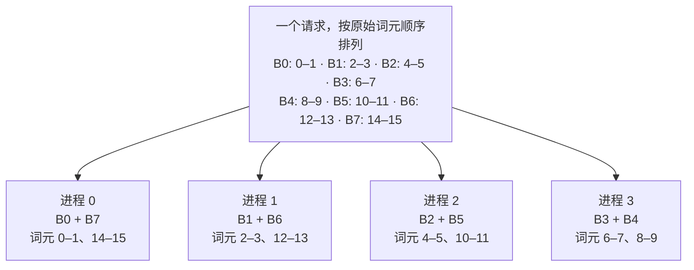
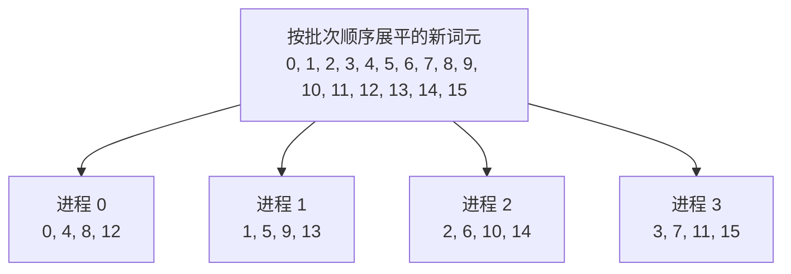

> ## 文档索引(Documentation Index)
> 获取完整文档索引：https://docs.sglang.io/llms.txt
> 在进一步浏览之前，使用该文件查找所有可用页面。

# 2.5 预填充上下文并行(Prefill Context Parallelism)

> 使用之字形(Zigzag)和交错(Interleave)策略，将预填充词元分配到多张 GPU，并了解这些策略如何与模型执行流程及注意力后端集成。

预填充上下文并行(Prefill Context Parallelism，CP)将提示词(Prompt)中的词元(Token)分配到一个注意力 CP 组中。每个进程(Rank)为其本地查询(Query)执行注意力计算；对于带有索引器(Indexer)的模型，还会执行索引器运算。同时，通过对键值缓存(Key/Value Cache，KV Cache)进行全收集(All-Gather)，获取所需的键(Key)和值(Value)。这样，多张 GPU 就能共同分担长提示词的处理工作。

张量并行(Tensor Parallelism，TP)划分的是注意力头和权重，而预填充 CP 划分的是词元维度。与[解码上下文并行(Decode Context Parallelism，DCP)](https://docs.sglang.io/docs/advanced_features/dcp)不同，预填充 CP 面向预填充计算，而不是拆分解码阶段的 KV Cache 扫描并合并局部注意力结果。两者各有独立的配置方式与支持限制。

## 为什么需要预填充上下文并行？

预填充 CP 有三方面收益：

- 将原本会在各进程上重复执行的工作拆分到不同进程，例如深度求索稀疏注意力(DeepSeek Sparse Attention，DSA)模型和 DeepSeek V4 系列中的索引器计算。
- 能自然地与 KV Cache 分片结合，减少每个进程的缓存显存占用。DSA 缓存的 LayerSplit 已提供按层分片能力，其他分片技术仍在开发中。
- 与专家并行(Expert Parallelism，EP)结合时，可以使用全互连通信(All-to-All)完成词元分发与结果合并，替代 TP 的全归约(All-Reduce)，从而减少通信时间。实际收益取决于工作负载和互联条件。

## 架构(Architecture)

### 策略接口(Strategy Interface)

`ContextParallelStrategy` 将词元布局策略与模型执行流程、注意力计算内核分离。服务端解析参数时，会为每个进程初始化一个策略。每次前向计算的状态保存在 `ForwardBatch.attn_cp_metadata` 中，而不是保存在模型的词元布局逻辑中。

### 之字形策略(Zigzag Strategy)

对于大小为 `C` 的 CP 组，将每个请求本次新扩展的词元切分为 `2C` 个连续块。进程 `r` 获得第 `r` 块和第 `2C - 1 - r` 块。批次中的每个请求都独立重新开始切分。

例如，CP=4 且有 16 个新词元时，每块包含两个词元：



将靠前、计算开销较小的块与靠后、计算开销较大的块配对，既能平衡因果注意力(Causal Attention)的计算量，又能保持查询块内部连续。长度不必能被整除：余数分配给靠前的块，通信缓冲区则按需填充。

元数据(Metadata)分别记录前段块和后段块的查询长度、KV 长度，其中包含已缓存前缀的影响。因此，每个块都能关注正确的因果历史，而不只是分配给同一进程的其他词元。

### 交错策略(Interleave Strategy)

当 CP 大小为 `C` 时，进程 `r` 获得展平后的词元索引 `r, r+C, r+2C, ...`。索引连续覆盖整个批次中新扩展的词元，不会在请求边界处重新开始。位置编号(Position ID)保留原始值。

CP=4 且有 16 个新词元时：



这样，每个进程获得的查询就分散在上下文的不同位置。若一个批次包含长度分别为 5 和 3 的两个请求，进程 0 持有展平索引 0 和 4，进程 1 持有索引 1 和 5；其中索引 5 是第二个请求的第一个新词元。按请求记录的分片元数据会保留这些边界，以及每个查询在因果约束下可关注的范围。

### 注意力后端集成(Attention Backend Integration)

| 路径 | 集成方式 |
|---|---|
| Zigzag 与 FlashAttention | 收集并重排新 KV；分别使用前段、后段查询块对应的序列长度执行注意力计算。 |
| Zigzag 与 `trtllm_mha` | 将所需 KV 实际准备就绪，构建之字形页表，并通过一次合并的变长注意力调用完成计算。 |
| Interleave 与 DSA | 按请求对查询和索引器元数据进行分片，按需收集索引器的键与多头潜在注意力(Multi-head Latent Attention，MLA)的 KV，并在后端执行稀疏注意力。 |
| DeepSeek V4 的 Interleave | 使用模型专用的稀疏注意力集成方式；CP 回归测试集包含在 B200 上运行的 DeepSeek-V4-Flash。不要根据稠密 Zigzag 路径推断其后端要求。 |

CP 与注意力后端的兼容组合正在扩展，后续计划支持更多组合。

## 组合使用(Compositions)

### 预填充 CP × TP、DP 和 EP

注意力 TP 在每个 CP 分区内部划分注意力头；注意力数据并行(Data Parallelism，DP)则将不同请求批次分开处理。稠密前馈网络(Feed-Forward Network，FFN)和混合专家(Mixture of Experts，MoE)层可以使用不同的布局，并通过各阶段之间的层边界衔接，参见[层边界(Layer Boundaries)](https://docs.sglang.io/docs/developer_guide/layer_boundary)。[使用与示例](#使用与示例usage-and-examples)中的 Qwen3 示例将 CP=2、注意力 TP=2 和 EP=4 结合使用。对于 DeepSeek V3.2 和 GLM-5 系列上的 Interleave DSA，应保持 DP=1，并使用参数解析后确定的注意力 CP=TP 拓扑。

### 预填充 CP × 流水线并行

即时执行器(Eager Runner)会在流水线并行(Pipeline Parallelism，PP)的各阶段之间保留 CP 本地隐藏状态，并在最后一个阶段执行收集。PP 可以将不同阶段放到不同节点上，同时让每个 DSA 注意力 CP 组仍位于单个节点内；它并不会解除 DSA CP 的单机限制。

### 预填充 CP × 推测解码

预填充 CP 可以与受支持的推测解码(Speculative Decoding)配置共存。CP 执行器会处理已对齐的推测解码隐藏状态输入，并收集受支持的辅助输出。这并不意味着预填充策略也会对解码或目标模型校验执行上下文并行。

### 预填充 CP × CUDA 图（实验性）

通用的 CP 可中断预填充图(Breakable Prefill Graph)路径目前要求使用 `zigzag` 策略、`trtllm_mha` 预填充后端、PP=1，并且注意力 CP 大小等于 TP 大小。该路径使用 CP 本地静态输入缓冲区，并选择足够大的捕获桶(Capture Bucket)，以容纳各进程填充后的输入。其他注意力后端与预填充 CP、可中断 CUDA 图(Breakable CUDA Graph)的组合支持仍在开发中。

### 预填充 CP × PD 分离与 DSA 缓存 LayerSplit

在受支持的 DSA 部署中，`--enable-dsa-cache-layer-split` 将 GPU 上的 KV 缓存层和索引器缓存层分配到不同 CP 进程，以减少每个进程的缓存显存占用。每个进程持有一个层范围，并使用临时存储区保存远端层的数据。这是按层划分缓存归属，与计算时采用的交错词元分配相互独立，而且不应用于草稿模型工作进程。

LayerSplit 要求使用预填充与解码分离(Prefill/Decode Disaggregation，PD Disaggregation)中的预填充工作进程（`--disaggregation-mode prefill`），启用 `--enable-prefill-cp --cp-strategy interleave`，并满足 PP=1。目前支持 `mooncake` 和 `mooncake_tcp` 传输后端。不要在解码工作进程或非 PD 工作进程上启用 LayerSplit；解码端通过 PD 传输接收完整的缓存分片。请参考 [PD 分离指南](https://docs.sglang.io/docs/advanced_features/pd_disaggregation)和模型专用启动方案来配置传输两端；仅启用预填充 CP 并不能完成 PD 部署配置。

## 使用与示例(Usage and Examples)

使用 NVIDIA CUDA GPU，并选择模型和注意力后端所支持的策略。以下示例面向配备 Hopper GPU 的单台 Linux 主机，并要求所用 SGLang 版本包含选定的后端。

| 参数 | 默认值 | 说明 |
|---|---|---|
| `--enable-prefill-cp` | `False` | 启用上下文并行预填充。 |
| `--cp-strategy` | 未设置 | 启用预填充 CP 时必填，可选 `zigzag` 或 `interleave`。 |
| `--attn-cp-size` | `1` | 一个注意力 CP 组中的进程数。设为大于 1 的值才能分担工作；模型专用的参数解析逻辑可能调整该值。 |

CP 在已有 TP 全局进程组内部进一步划分，并不会额外成倍增加 GPU 数量。启用注意力 DP 时，注意力拓扑为：

```text
TP 全局进程数 = 注意力 DP 大小 × 注意力 CP 大小 × 注意力 TP 大小

示例：--tp 4 --dp 1 --attn-cp-size 2
      → 一个注意力 DP 组，CP=2，注意力 TP=2
```

服务端要求 `--tp` 能被 `--dp × --attn-cp-size` 整除。注意力布局本身并不决定稠密 FFN 或 MoE 的布局；它们使用各自的并行配置。

> **警告：**对于 GLM-5 系列、DeepSeek V3.2 等 DSA 模型，请使用 `interleave`；目前不支持 `zigzag`。不要通过设置更小的 `--attn-cp-size` 来请求 DSA 模型上的注意力 TP/CP 混合并行。未来计划扩展兼容范围。

### Zigzag 示例：结合注意力 TP 与 CP 的 GQA

以下 Qwen3 配置使用四张 Hopper GPU，注意力 TP=2、CP=2，MoE 层使用 EP=4。通过 `--model-path` 传入 Hugging Face 模型仓库 ID。GQA 指分组查询注意力(Grouped-Query Attention)。

```bash
python -m sglang.launch_server \
  --model-path Qwen/Qwen3-30B-A3B-FP8 \
  --tp 4 \
  --ep 4 \
  --attn-cp-size 2 \
  --enable-prefill-cp \
  --cp-strategy zigzag \
  --attention-backend fa3
```

### Interleave 示例：DSA

以下 GLM-5.2 配置使用八张 H200 GPU，注意力 CP=8、注意力 TP=1。该模型会自动选择 DSA 后端，下面的命令显式指定了这一选择。

```bash
python -m sglang.launch_server \
  --model-path zai-org/GLM-5.2-FP8 \
  --tp 8 \
  --attn-cp-size 8 \
  --enable-prefill-cp \
  --cp-strategy interleave \
  --attention-backend dsa \
  --trust-remote-code \
  --mem-fraction-static 0.85
```

有关模型专用的部署组合，请参阅 [GLM-5.3 部署手册中的上下文并行](https://docs.sglang.io/cookbook/autoregressive/GLM/GLM-5.3#3-5-context-parallelism)。

## 参考资料(References)

- [CP 策略与元数据](https://github.com/sgl-project/sglang/tree/main/python/sglang/srt/layers/cp)：策略接口、之字形与交错布局、填充及计算图辅助工具。
- [预填充上下文并行路线图](https://github.com/sgl-project/sglang/issues/21788)。
- [预填充上下文并行重构设计](https://github.com/sgl-project/sglang/issues/27252)。

## 术语与生词（学习补充）

| 术语或单词 | 中文释义 | 简明英文释义 |
|---|---|---|
| CP — Context Parallelism | 上下文并行：沿词元或上下文维度划分工作 | Parallelism that partitions work along the token or context dimension. |
| DCP — Decode Context Parallelism | 解码上下文并行：分担解码阶段的 KV 扫描和注意力计算 | Parallelism that distributes decode KV scanning and attention computation. |
| TP — Tensor Parallelism | 张量并行：在多个进程间划分权重及相关计算 | Parallelism that splits weight tensors and their computation across ranks. |
| DP — Data Parallelism | 数据并行：不同组处理不同的数据批次 | Parallelism that assigns different data batches to different groups. |
| EP — Expert Parallelism | 专家并行：将专家分配到不同进程 | Parallelism that distributes experts across ranks. |
| PP — Pipeline Parallelism | 流水线并行：将模型划分为多个执行阶段 | Parallelism that divides a model into execution stages. |
| KV — Key/Value | 键／值：注意力使用的键和值及其缓存 | Keys and values used by attention and stored in its cache. |
| DSA — DeepSeek Sparse Attention | 深度求索稀疏注意力：通过索引器选择参与注意力计算的位置 | Sparse attention that uses an indexer to select positions. |
| MLA — Multi-head Latent Attention | 多头潜在注意力：使用压缩的潜在 KV 表示 | Attention that uses a compressed latent KV representation. |
| GQA — Grouped-Query Attention | 分组查询注意力：一组查询头共享键值头 | Attention in which a group of query heads shares key/value heads. |
| FFN — Feed-Forward Network | 前馈网络：Transformer 层中的前馈计算模块 | A feed-forward computation block in a Transformer layer. |
| MoE — Mixture of Experts | 混合专家：由路由机制选择专家处理输入 | A model structure that routes inputs to selected experts. |
| PD — Prefill/Decode | 预填充／解码；PD 分离将这两个阶段分开部署 | The prefill and decode stages, deployed separately in PD disaggregation. |
| All-Gather | 全收集：每个进程收集所有参与进程的数据 | A collective that gathers all participants' data on every rank. |
| All-to-All | 全互连通信：各进程相互交换各自指定的数据 | A collective in which every rank exchanges designated data with every other rank. |
| All-Reduce | 全归约：归约各进程的数据，并向所有进程返回结果 | A collective that reduces data and returns the result to every rank. |
| Prefill /ˈpriːfɪl/ | 预填充：处理提示词并建立相应缓存的阶段 | The stage that processes a prompt and builds its cache. |
| Zigzag /ˈzɪɡzæɡ/ | 之字形：本文指将前后位置的词元块配对分配 | A layout that pairs early and late token blocks. |
| Interleave /ˌɪntərˈliːv/ | 交错：按固定步长交替分配词元 | To distribute tokens alternately at a fixed stride. |
| Rank /ræŋk/ | 进程编号，也用于指代对应的分布式进程 | The identifier of a distributed process, or the process itself. |
| Indexer /ˈɪndeksər/ | 索引器：为稀疏注意力选择相关位置的组件 | A component that selects relevant positions for sparse attention. |
| Padding /ˈpædɪŋ/ | 填充：补齐输入或缓冲区，以满足形状要求 | Extra entries added to satisfy input or buffer shape requirements. |
| Sharding /ˈʃɑːrdɪŋ/ | 分片：将数据划分并分配到多个进程 | Partitioning data and assigning the parts to different ranks. |
| Causal /ˈkɔːzəl/ | 因果的：查询只可关注其允许的历史及当前位置 | Allowing a query to attend only to its permitted history and current position. |
