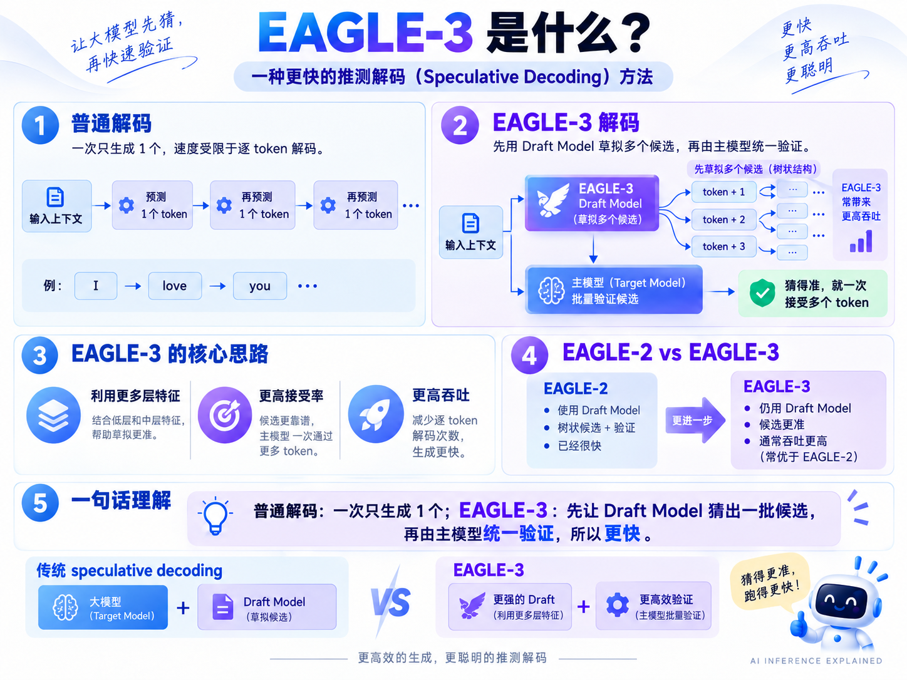

# 3.1 推测解码：MTP 与 EAGLE-3(Speculative Decoding)

推测解码(Speculative Decoding)用较便宜的草稿预测，换取更少的目标模型逐步解码次数。本文围绕 Qwen、SGLang 与 vLLM，说明两种草稿生成方式及其配置。

## 一、先预测多个，再批量校验

普通自回归解码(Autoregressive Decoding)每轮通常确定一个新词元(Token)；推测解码先生成多个候选，再让目标模型(Target Model)通过一次前向计算(Forward Pass)批量校验(Verification)。


例如 A、B 被接受，C 被拒绝，就保留 A、B，按校验算法补出 C′，随后重新预测。C 后面的候选依赖旧前缀，需要重新处理。
贪心解码(Greedy Decoding)以目标模型的选择为准；随机采样(Random Sampling)通过概率规则接受、拒绝和修正候选，采用保持分布的算法时可以保留目标模型的输出分布。
收益取决于草稿成本、校验成本和每轮接受的数量；接受的词元足够多，才有机会抵消额外开销。

## 二、MTP：使用模型配套的多词元预测能力

多词元预测(Multi-Token Prediction，MTP)在训练时增加对未来多个位置的预测目标。推理时，可以用训练好的预测头(Prediction Head)或模块生成草稿，再由目标模型校验；具体结构因模型而异。[MTP 论文](https://arxiv.org/abs/2404.19737)
本文重点讨论检查点(Checkpoint)自带 MTP 模块的部署方式：主模型权重与 MTP 权重配套发布，运行时加载对应模块。使用条件是检查点包含这些权重，而且推理框架支持该模型的 MTP 实现。


图中多个输出表示预测未来多个位置的能力；实际草稿生成可能包含多步计算。草稿和校验都有成本，图中的速度与吞吐收益需要通过实测确认。

### Qwen3.8-27B 的 SGLang 配置

[官方部署示例](https://docs.sglang.io/cookbook/autoregressive/Qwen/Qwen3.8-27B)使用检查点内置的 MTP 模块，对应的核心参数如下；硬件、精度和注意力后端按部署示例补充。

```bash
python3 -m sglang.launch_server \
  --model-path Qwen/Qwen3.8-27B \
  --speculative-algorithm EAGLE \
  --speculative-num-steps 3 \
  --speculative-eagle-topk 1 \
  --speculative-num-draft-tokens 4
```

这里 `EAGLE` 指 SGLang 复用的推测执行路径，草稿能力来自 Qwen3.8 的 MTP 模块。当前仓库中 `NEXTN` 是 `EAGLE` 的别名，此示例可以省略单独的草稿模型路径。

## 三、EAGLE-3：训练一个利用目标模型特征的轻量草稿模型

EAGLE-3 融合目标模型低、中、高层的隐藏状态(Hidden States)，由轻量草稿模型(Draft Model)预测候选词元，再交给目标模型批量校验。它采用直接预测词元及训练时模拟推测过程等设计，以改善草稿质量。[EAGLE-3 论文](https://arxiv.org/abs/2503.01840)
草稿模型可以逐步生成一条候选链，也可以按配置扩展候选树(Draft Tree)；部署时需要使用针对目标模型训练、且当前框架支持的草稿检查点。



图中的“更快、更高吞吐”描述优化目标，实际收益取决于模型组合、输入输出长度、并发与硬件。

### SGLang：目标模型与配套草稿分别指定

下面是 Qwen3-8B 的配置模板；将草稿路径替换为与该目标模型配套、支持 SGLang 加载的 EAGLE-3 检查点。

```bash
python3 -m sglang.launch_server \
  --model-path Qwen/Qwen3-8B \
  --speculative-algorithm EAGLE3 \
  --speculative-draft-model-path "/path/to/matched-eagle3-draft" \
  --speculative-num-steps 3 \
  --speculative-eagle-topk 1 \
  --speculative-num-draft-tokens 4
```

### vLLM：通过推测配置指定草稿

[vLLM 官方示例](https://docs.vllm.ai/projects/speculators/en/latest/user_guide/tutorials/serve_vllm/)提供了以下模型组合；使用时确认安装版本支持对应检查点格式。

```bash
vllm serve Qwen/Qwen3-8B -tp 1 \
  --speculative-config '{"model":"RedHatAI/Qwen3-8B-speculator.eagle3","num_speculative_tokens":3,"method":"eagle3"}'
```

## 四、MTP 与 EAGLE-3 怎么选？

| 对比项 | 本文的原生 MTP 方案 | EAGLE-3 方案 |
|---|---|---|
| 草稿来源 | 检查点配套的 MTP 预测头或模块 | 专门训练的轻量草稿模型 |
| 部署关注点 | 模型是否带 MTP 权重、框架是否支持 | 草稿与目标模型是否匹配、检查点格式是否受支持 |
| 目标模型的作用 | 校验候选并决定接受结果 | 提供多层特征、校验候选并决定接受结果 |
| 示例 | Qwen3.8-27B 内置 MTP | Qwen3-8B + 配套 EAGLE-3 草稿 |

同一个目标模型可能支持多种草稿方案。有原生 MTP 时可先建立基线(Baseline)；有兼容的 EAGLE-3 草稿时，再用同一批请求比较延迟(Latency)、吞吐量(Throughput)与显存占用(GPU Memory Usage)。

## 五、三个 SGLang 参数分别控制什么？

| 参数 | 含义 | 调大后的主要代价 |
|---|---|---|
| `--speculative-num-steps` | 草稿自回归预测的深度 | 草稿计算更多，远处候选可能被拒绝 |
| `--speculative-eagle-topk` | 每步保留的候选分支数；`1` 表示单链 | 候选树更宽，增加计算与显存需求 |
| `--speculative-num-draft-tokens` | 每个请求送入并行校验的词元预算 | 校验计算与缓冲区占用增加 |

当前实现中，`topk=1` 时第三个参数调整为 `num_steps + 1`。例如 `3 / 1 / 4` 对应三步草稿及一个已确定的起始词元组成的校验窗口；最终推进多少词元取决于校验结果。参数定义见[仓库推测解码文档](../docs/docs/advanced_features/speculative_decoding.mdx)。

## 六、怎么判断加速是否值得？

- **接受长度(Acceptance Length)与接受率(Acceptance Rate)**：每轮接受多少候选，能否减少目标模型执行轮数。
- **草稿与校验成本**：草稿生成过慢或校验窗口过大，可能抵消接受更多词元带来的收益。
- **实际延迟与吞吐**：固定模型、采样参数、输入输出长度和并发，对比开启与关闭推测解码；分别观察单请求生成速度和服务总吞吐。
- **显存占用**：草稿权重、键值缓存(Key/Value Cache，KV Cache)、候选树、CUDA 计算图(CUDA Graphs)与校验缓冲区都可能增加占用。

遇到显存不足(Out of Memory，OOM)，先看发生阶段，再调整：

| 发生位置 | 可以尝试的调整 |
|---|---|
| 加载模型权重时 | 使用受支持的量化或增加模型并行资源 |
| 捕获 CUDA 计算图时 | 减小 `--cuda-graph-max-bs-decode`，减少计算图内存需求 |
| 运行中候选与校验开销过大 | 缩小草稿深度、分支数与校验预算，降低运行请求并发 |
| 动态计算空间不足 | 适当降低 `--mem-fraction-static`，为激活值(Activations)和计算图留空间；可用 KV 缓存容量也会减少 |

调整后仍需测量实际性能。原生 MTP 和 EAGLE-3 都通过预测与校验加速生成，最终选择应以实际负载的测试结果为依据。

继续阅读：[3.2 自适应推测解码(Adaptive Speculative Decoding)](<3.2 自适应推测解码(Adaptive Speculative Decoding).md>)，了解如何动态调整草稿步数与校验预算。
