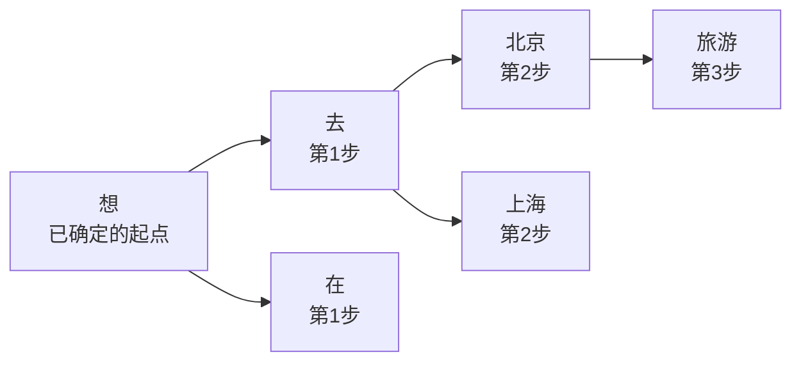
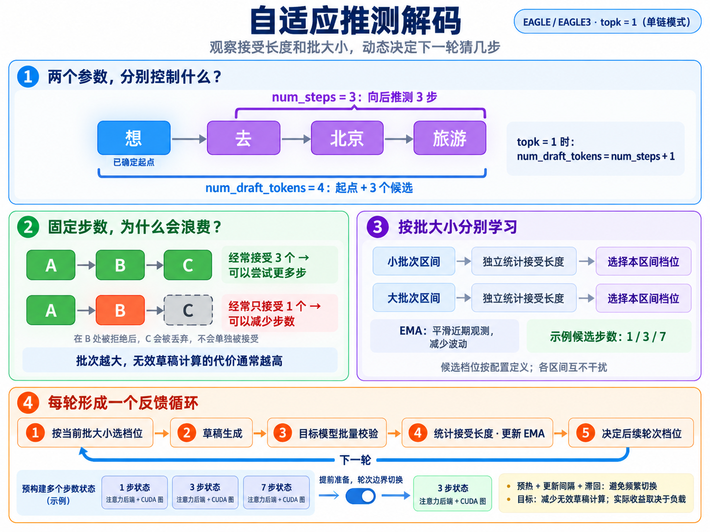
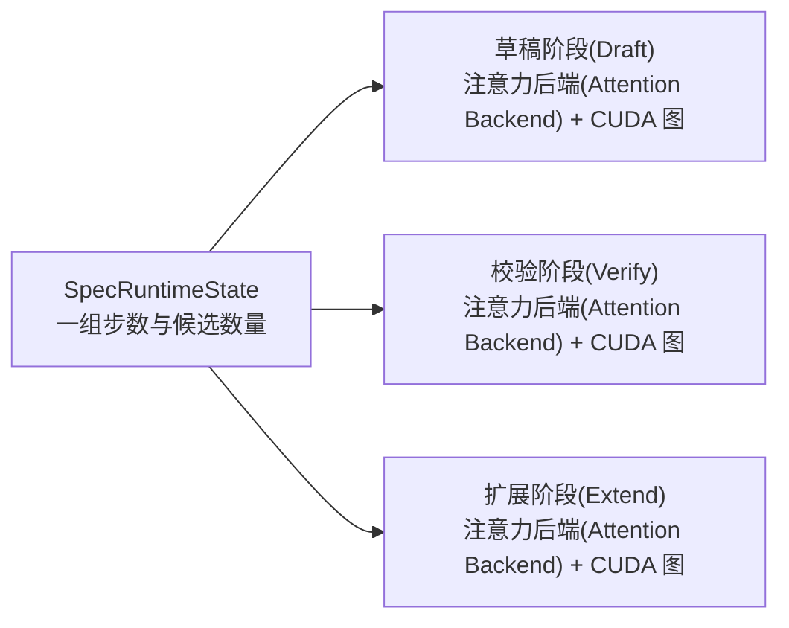
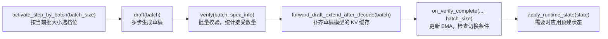

# 3.2 自适应推测解码(Adaptive Speculative Decoding)

## 一、先理解两个参数：树的深度与校验节点数

**`num_steps` 控制候选树深度(Tree Depth)，`num_draft_tokens` 控制校验词元预算(Verification Token Budget)。** 在 EAGLE 路径中，对应 `--speculative-num-steps` 和 `--speculative-num-draft-tokens`；`--speculative-eagle-topk` 控制每步的候选分支数。
例如配置 `num_steps = 3、topk = 2、num_draft_tokens = 6`，假设已经生成“我想”，从已确定的“想”继续。以下每个框代表一个示意词元(Token)，按分数筛选后的校验树可能如下：



- **`num_steps = 3`**：最深预测到“去 → 北京 → 旅游”，向后走了 3 步。
- **`num_draft_tokens = 6`**：校验树共 6 个节点，即起点“想”加上 5 个草稿候选；[候选整理与建树代码](../python/sglang/srt/speculative/eagle_utils.py)先选出 `num_draft_token - 1` 个草稿节点，再拼上已确定的起点。
- 假设目标模型最终选择“想 → 去 → 北京 → 旅游”，则接受的草稿为“去、北京、旅游”；“在、上海”属于其他分支。**校验节点分布在多条候选路径上，最终输出沿其中一条路径前进。**

**`topk = 1` 时为单链：`num_steps = 3 → 起点 + 3 个草稿 → num_draft_tokens = 4`。** 此时即使填 6，[参数处理代码](../python/sglang/srt/arg_groups/speculative_hook.py)也会调整为 4；下文自适应模式讨论的就是这种单链场景，上图的分叉仅用于解释参数。



## 二、自适应调整解决什么问题？

自适应模式在运行时调整 `speculative_num_steps/speculative_num_draft_tokens`，适合接受长度(Acceptance Length)随时间变化的工作负载(Workload)；单链模式下，候选数量随步数一起调整。
原文支持条件为 `--speculative-algorithm EAGLE` 或 `EAGLE3`，且 `--speculative-eagle-topk 1`；不满足条件时使用静态推测配置，当前代码的额外限制见末节。

- **步数太少**：草稿模型(Draft Model)本可以生成更多能被接受的词元，但本轮提前结束。
- **步数太多**：目标模型(Target Model)拒绝较早，后续草稿计算被浪费。
- **批大小较大**：无效草稿步骤作用于批次中的所有序列，最佳步数通常比小批次更低。

因此，控制器同时跟踪接受长度和批大小(Batch Size，BS)，动态选择档位(Tier)。

## 三、如何跟踪和切换？

| 组件 | 职责 |
|---|---|
| `AdaptiveSpeculativeParams` | 使用指数移动平均(Exponential Moving Average，EMA)制定调整策略 |
| `SpecRuntimeState` | 保存每个步数档位的运行时状态 |
| `AdaptiveController` | 根据批大小查询策略，激活匹配的状态 |

各批大小区间有独立的 EMA、候选步数、滞回阈值(Hysteresis Threshold)和上限系数(Ceiling Coefficient)，避免小批次观测干扰大批次；配置键 `"1"`、`"8"` 表示下界，对应 BS 1～7、BS ≥ 8。
相同步数的 `SpecRuntimeState` 可跨区间共享，保存该档位可达的填充批大小(Padded Batch Size)对应的 CUDA 计算图(CUDA Graphs)：



`CudaGraphRunner` 依赖张量形状(Tensor Shape)，所以提前准备各档位的后端和计算图；切换时替换状态引用，无须现场重新捕获计算图(Graph Capture)。扩展阶段补齐草稿模型的键值缓存(Key/Value Cache，KV Cache)，运行流程如下：



**生成草稿前选择当前批大小的档位，校验后更新该区间的统计；切换发生在轮次边界，后端和 CUDA 图在本轮执行期间保持一致。**

## 四、策略如何决定步数？

每轮校验后，计算批内各请求接受的草稿数量的平均值，再用 EMA 平滑；接受长度上升时倾向增加步数，更早拒绝时倾向降低步数。
概念公式为 `目标步数 ≈ clamp(round(EMA接受长度) + 1, 最小候选步数, 最大候选步数)`：尝试比近期接受长度多推测一步，再结合候选档位及切换条件决定。

| 参数 | 默认值 | 作用 |
|---|---|---|
| `candidate_steps` | 每个区间必填 | 非空的候选步数列表；原文要求正整数，当前代码也允许 0，见末节 |
| `down_hysteresis` / `up_hysteresis` | `-0.25` / `0.0` | 向下、向上切换的额外余量，减少反复振荡 |
| `ceiling_coeff` | `0`，禁用 | 大于 0 时，按 EMA 反映的草稿质量限制步数，减少大批次下过度推测 |
| `ema_alpha` | `0.2` | 接受长度的 EMA 平滑系数；越大响应越快，越小越稳定 |
| `warmup_batches` | `10` | 预热(Warmup)期仅观测，达到指定校验批次数后才开始切换 |
| `update_interval` | `5` | 预热后的重新计算间隔，以校验批次数计 |

## 五、如何启用和配置？

使用 `--speculative-adaptive` 启用；配置文件可选，启动参数仍须满足支持条件：
```bash
python3 -m sglang.launch_server \
    --model meta-llama/Llama-2-7b-chat-hf \
    --speculative-algorithm EAGLE \
    --speculative-draft-model-path lmsys/sglang-EAGLE-llama2-chat-7B \
    --speculative-eagle-topk 1 \
    --speculative-num-steps 3 \
    --speculative-num-draft-tokens 4 \
    --speculative-adaptive
```
如需覆盖默认值，添加 `--speculative-adaptive-config /path/to/adaptive_spec.json`。例如：
```json
{
  "ema_alpha": 0.2,
  "warmup_batches": 10,
  "update_interval": 5,
  "1": {"candidate_steps": [1, 3, 7], "up_hysteresis": 0.0, "down_hysteresis": -0.25, "ceiling_coeff": 0},
  "8": {"candidate_steps": [1],       "up_hysteresis": 0.0, "down_hysteresis": 0.0,   "ceiling_coeff": 0}
}
```
非整数键是应用于所有区间的全局配置；整数键定义各区间，其中必须提供 `candidate_steps`，其余未设置项使用默认值。

## 六、监控与调优

```bash
curl -s http://127.0.0.1:30000/server_info | jq '.internal_states[0] | {speculative_num_steps, avg_spec_accept_length}'
```
`speculative_num_steps` 表示当前档位；`avg_spec_accept_length` 可辅助观察近期接受情况，实际策略按批大小区间独立统计。

- 从保守配置开始；预测较准的草稿模型可以尝试带上限规则的激进配置；减少候选档位可降低启动时的额外显存开销。
- 档位切换频繁时，增大 `warmup_batches/update_interval` 或降低 `ema_alpha`；大批次可尝试较窄的候选范围，例如 `[1, 2]` 或 `[1]`。
- 若负载稳定且静态配置调优充分，自适应收益可能有限；按模型和批大小测试静态步数，再制定各区间配置，通常更有针对性。

## 七、原文的配置示例与版本差异

**保守配置(Conservative)**：原文称其为默认配置，推荐用于 MiniMax-M2.5、DSV4 等草稿接受表现较弱的模型；BS 8～31 允许 `[1, 3]`，BS ≥ 32 固定为 1 步。
```json
{
  "1":  {"candidate_steps": [1, 3, 7], "up_hysteresis": 0.0, "down_hysteresis": -0.25, "ceiling_coeff": 0},
  "8":  {"candidate_steps": [1, 3],    "up_hysteresis": 0.0, "down_hysteresis": 0.0,   "ceiling_coeff": 0},
  "32": {"candidate_steps": [1],       "up_hysteresis": 0.0, "down_hysteresis": 0.0,   "ceiling_coeff": 0}
}
```
**激进配置(Aggressive)**：使用更宽的候选范围，并限制大批次下的步数；原文推荐用于 GLM-4.7-FP8 等预测能力较强或接受表现波动较大的模型。
```json
{
  "1":   {"candidate_steps": [1, 3, 7], "up_hysteresis": 0.0, "down_hysteresis": -0.25, "ceiling_coeff": 0},
  "8":   {"candidate_steps": [1, 3, 7], "up_hysteresis": 0.0, "down_hysteresis": -0.25, "ceiling_coeff": 3.0},
  "64":  {"candidate_steps": [1, 3],    "up_hysteresis": 0.0, "down_hysteresis": -0.25, "ceiling_coeff": 1.67},
  "128": {"candidate_steps": [1, 3],    "up_hysteresis": 0.0, "down_hysteresis": -0.25, "ceiling_coeff": 1.2}
}
```
以上保留所贴文档的配置；2026-09-25 核对[当前策略代码](../python/sglang/srt/speculative/adaptive_spec_params.py)，已支持非负步数，`0` 表示跳过草稿生成；内置区间下界 1、8、32、64 分别使用 `[1,3,7]`、`[0,1,3]`、`[0,1]`、`[0]`。
当前 `adaptive_unsupported_reason()` 还排除了 `enable_dp_attention`、`enable_multi_layer_eagle`、`enable_two_batch_overlap`、`enable_pdmux`；部署时以所用版本为准。参阅[自适应推测解码原文](../docs/docs/advanced_features/adaptive_speculative_decoding.mdx)。

前置阅读：[3.1 推测解码：MTP 与 EAGLE-3(Speculative Decoding)](<3.1 推测解码：MTP 与 EAGLE-3(Speculative Decoding).md>)，先理解草稿生成与目标模型校验。
