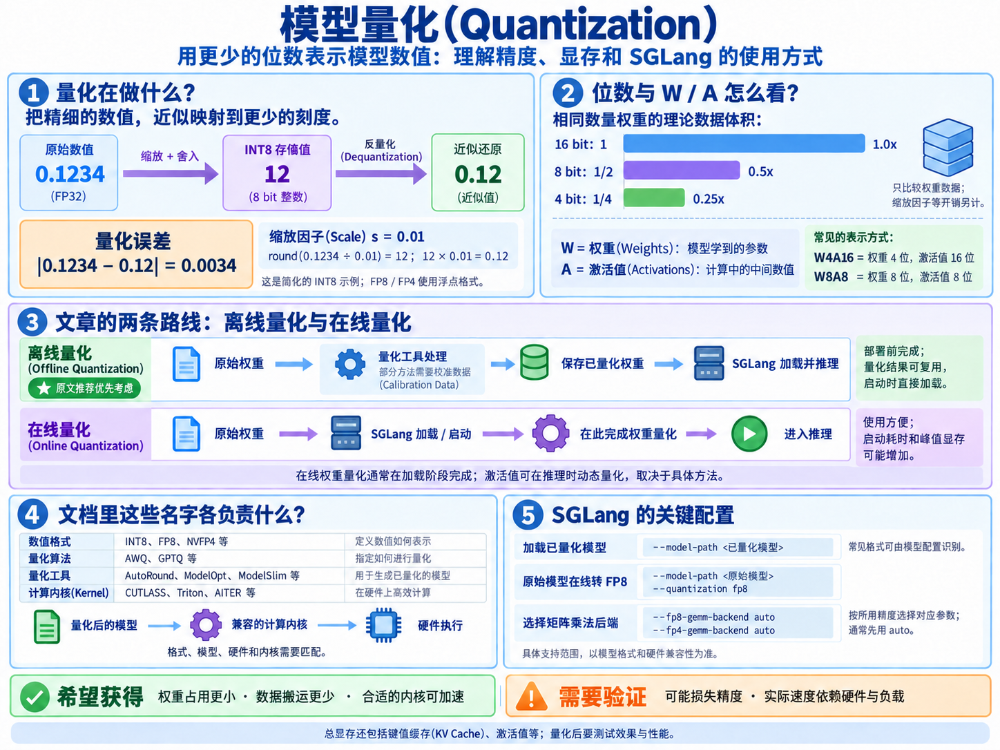
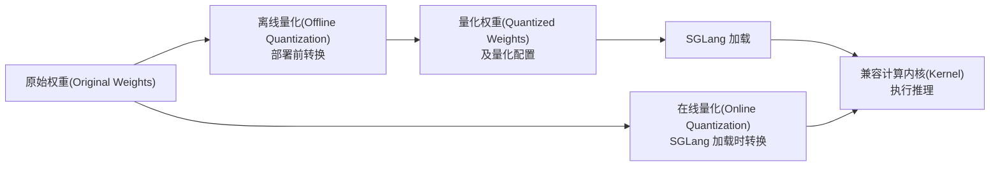

# 4.1 模型量化入门(Model Quantization)

大模型的权重包含大量数值。量化(Quantization)用较低精度表示权重或计算中的中间数值，以减少存储和数据搬运；配合适当的硬件与计算内核(Kernel)，还可以提升推理效率。理解量化，需要把数值表示、量化算法和实际执行方式联系起来。



## 一、量化改变的是权重张量中的什么？

权重(Weights)是模型训练得到的参数，通常以张量(Tensor)保存。矩阵是二维张量，例如 `W = [[0.1234, -0.5678], [0.9012, 0.3456]]`；其中 `0.1234` 就是一个权重元素，可以参与 `输出 = 输入 × 权重` 这样的计算。

量化改变这些元素的表示方式，通常保持模型层数、隐藏维度和逻辑参数数量不变。例如，一个约 270 亿参数的模型，量化为 4 位后仍具有相应的参数规模，每个参数的存储成本降低。

“8 位浮点(FP8)”表示每个数值使用 **8 个二进制位(bit)，即 1 个字节(Byte)**；`1 Byte = 8 bit`。

| 表示格式 | 每个元素的数据位数 | 每个元素的数据体积 |
|---|---|---|
| FP32 | 32 bit | 4 字节 |
| FP16 / BF16 | 16 bit | 2 字节 |
| FP8 / INT8 | 8 bit | 1 字节 |
| FP4 / INT4 | 4 bit | 打包后平均半个字节，辅助参数另计 |

FP 表示浮点数(Floating Point)，INT 表示整数(Integer)。以 FP8 的 E4M3 格式为例，8 位分为“1 位符号(Sign) + 4 位指数(Exponent) + 3 位显式尾数(Mantissa)”；指数影响表示范围，尾数影响精细程度。[数值格式说明](https://huggingface.co/docs/transformers/en/quantization/concept_guide)

部署中常见的 `W4A16` 表示权重 4 位、激活值(Activations)16 位；`W8A8` 表示两者均为 8 位。激活值是当前输入在模型内部产生的中间数值，W/A 后的数字本身不说明整数或浮点格式。

## 二、用一个数值理解量化

以简化的整数量化(Integer Quantization)为例，给权重 `0.1234` 选择缩放因子(Scale Factor) `s = 0.01`：

```text
量化值 q = round(0.1234 ÷ 0.01) = 12
近似权重 = q × s = 12 × 0.01 = 0.12
绝对误差 = |0.1234 − 0.12| = 0.0034
```

这里保存的是整数及其缩放信息，反量化(Dequantization)得到原数值的近似值。实际方案还需要处理超出表示范围的数值；缩放因子常由整张量、一个通道或一组元素共用。这个整数例子用于解释原理，FP8、FP4 按各自的浮点格式表示数值。

精度降低通常会引入误差，而这些误差可能影响后续层和最终输出。因此，量化方法需要同时考虑节省多少资源、模型效果变化多少。

## 三、量化算法还会做哪些工作？

就近舍入(Round-to-Nearest，RTN)先确定量化刻度，再把每个权重映射到最近的刻度。更精细的方法会调整缩放、优化舍入方向或补偿误差，让量化后的计算结果接近原模型。

一个简化例子：假设刻度间隔为 `0.1`，两个输入都为 `1`。

```text
原始计算：0.14 × 1 + 0.14 × 1 = 0.28
分别就近舍入：0.1 × 1 + 0.1 × 1 = 0.20，误差 0.08
一个向下、一个向上：0.1 × 1 + 0.2 × 1 = 0.30，误差 0.02
```

这说明，逐个权重的局部最优未必让整体输出最优。更换输入后，结果也可能变化。校准数据(Calibration Data)是一批有代表性的输入，用于观察激活分布或评估量化误差，帮助选择合适的量化结果。

| 方法 | 核心处理 |
|---|---|
| RTN | 选择刻度后就近舍入，处理简单，是常见基线。 |
| 激活感知权重量化(Activation-aware Weight Quantization，AWQ) | 根据激活统计识别重要通道，通过等价缩放减少这些通道的量化误差。[论文](https://arxiv.org/abs/2306.00978) |
| GPTQ | 逐步量化权重，并调整尚未量化的权重来补偿误差，尽量保持层输出。[论文](https://arxiv.org/html/2210.17323v2) |
| AutoRound 中的 SignRound 方法 | 利用校准数据优化舍入方向与裁剪范围，降低量化误差。[作者介绍](https://huggingface.co/blog/autoround) |

分组量化(Group-wise Quantization)可与这些算法配合：把权重分成若干组，每组设置自己的刻度。它提高了对局部数值分布的适应性，也需要保存更多辅助参数。对已训练模型进行处理，称为训练后量化(Post-Training Quantization，PTQ)；量化感知训练(Quantization-Aware Training，QAT)则在训练阶段模拟量化影响，让模型适应低精度表示。[概念说明](https://huggingface.co/docs/transformers/en/quantization/concept_guide)

## 四、量化模型的文件里还保存什么？

一个量化模型通常包括低精度权重、辅助张量和量化配置；具体内容由算法和存储格式决定。

| 内容 | 作用 |
|---|---|
| 量化权重，例如 `qweight` | 保存低精度数值，可将多个数值打包到一个存储单元中。 |
| 缩放因子，例如 `scales` | 说明每组量化值对应的数值刻度。 |
| 零点(Zero Point)，例如 `qzeros` | 部分整数方案用于表示偏移，近似还原公式为 `scale × (q − zero_point)`。 |
| 量化配置(Quantization Config) | 记录方法、位数、分组大小及哪些层保留高精度等信息。 |

权重打包(Weight Packing)会改变物理存储布局。例如，SGLang 的 [AWQ 权重实现](../python/sglang/srt/layers/quantization/awq/schemes/awq_linear.py)使用 `int32` 存储打包后的权重，每个 32 位整数容纳 8 个 4 位权重，并单独保存 `scales` 和 `qzeros`。模型的逻辑矩阵尺寸通常保持不变，检查点(Checkpoint)中张量的名称、数量和物理形状却可能变化；部分层也可能继续保留 FP16 或 BF16。

## 五、离线量化、在线量化与 SGLang 的关系

离线量化(Offline Quantization)在部署前完成转换，保存量化权重和配置，供后续服务反复加载。在线量化(Online Quantization)由框架在加载或启动阶段转换权重，使用方便，但可能增加启动时间和峰值显存。



上图描述权重的处理时机。激活值来自实际输入，可按具体方案在推理时进行动态量化(Dynamic Quantization)；在线权重量化通常只在加载阶段完成。

SGLang 加载量化模型时会读取相关配置，选择兼容的计算实现。客户端仍可使用相同的生成接口。具体内核可能直接执行低精度计算，也可能在计算过程中反量化后使用较高精度运算；权重存储精度与计算、累加精度需要分别看待。

| SGLang 配置示例 | 用途 |
|---|---|
| `--model-path <已量化模型>` | 加载已有量化版本；常见格式可自动识别，部分方案需要额外匹配配置。 |
| `--model-path <原始模型> --quantization fp8` | 对受支持的模型和硬件启用在线 FP8 量化。 |
| `--fp8-gemm-backend auto` / `--fp4-gemm-backend auto` | 分别控制适用的 FP8 / FP4 通用矩阵乘法(General Matrix Multiplication，GEMM)后端，按实际量化路径选择。 |

SGLang 文档推荐优先考虑离线量化。部署时应确认模型格式、硬件与计算内核的兼容性，具体参数以[量化文档](https://docs.sglang.io/docs/advanced_features/quantization)为准。

## 六、怎样读懂量化模型的名字？

模型名中的不同后缀描述不同层面的信息；精度和文件格式往往能直接辨认，完整转换过程需要结合模型卡(Model Card)、配置和具体权重文件。

| 名称标记 | 能读出的信息 |
|---|---|
| `AWQ` / `GPTQ` | 量化算法；具体位数、分组大小还要看配置。 |
| `FP8` / `NVFP4` | 分别表示 8 位浮点、NVIDIA 4 位浮点格式；进一步确认分块方式、激活精度和量化范围。 |
| `GGUF` | 文件格式；仓库可能同时提供 `Q4_K_M`、`Q5_K_M`、`Q8_0` 等方案，需选择具体文件。 |
| `MLX` / `4bit` | 前者指运行生态，后者指 4 位精度；都需要结合配置确认完整方案。 |
| `GSQ-RCO-GGUF` | GSQ 负责量化，RCO 在体积预算内为不同张量分配精度，再保存为 GGUF。[模型说明](https://huggingface.co/ISTA-DASLab/Qwen3.8-27B-GSQ-RCO-GGUF) |
| `Ternary` | 提示三值权重(Ternary Weights)方案，打包方式与执行要求见[模型说明](https://huggingface.co/prism-ml/Ternary-Bonsai-2-27B-gguf)。 |
| `Uncensored` / `Abliterated` | 模型行为修改标签；量化信息需从其他后缀和配置中确认。 |

例如，[Qwen3.8-27B-FP8 的配置](https://huggingface.co/Qwen/Qwen3.8-27B-FP8/blob/main/config.json)明确写出 `fp8`、`e4m3`、`128 × 128` 权重块和动态激活量化；[MLX 4bit 版本](https://huggingface.co/mlx-community/Qwen3.8-27B-4bit/blob/main/config.json)则写出 `bits: 4`、`group_size: 64`、`mode: affine`，即每 64 个元素为一组的 4 位仿射量化(Affine Quantization)。模型名称可用于初筛，配置用于确认细节。

## 七、量化收益怎样判断？

GPU 部署中，AWQ/GPTQ 的 4 位方案和 FP8 都有成熟的模型与框架支持；个人电脑上的 llama.cpp 生态常见 GGUF 量化版本；Blackwell 硬件还可关注 NVFP4。[NVIDIA 量化方案](https://github.com/NVIDIA/Model-Optimizer/blob/main/examples/hf_ptq/README.md)与 [llama.cpp 量化说明](https://github.com/ggml-org/llama.cpp/blob/master/tools/quantize/README.md)提供了对应实现参考。

只比较同样数量的权重数据，16 位降到 8 位，理论体积约为原来的一半；降到 4 位，约为四分之一。实际还要计入缩放参数、高精度层，以及服务运行时的键值缓存(Key/Value Cache，KV Cache)、激活值和工作区(Workspace)。
实际评估应同时比较模型质量、显存占用、首词元延迟(Time to First Token，TTFT)、输出速度和吞吐量(Throughput)，并固定硬件、输入输出长度与并发量。量化带来的压缩比例和推理加速比例需要分别测量。

继续阅读：[4.2 量化键值缓存(Quantized KV Cache)](<4.2 量化键值缓存(Quantized KV Cache).md>)，了解推理过程中 KV 数据的低精度存储与配置。
