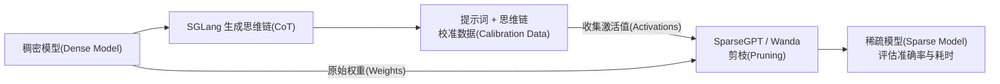

# 4.3 剪枝与推理感知压缩(Pruning and Reasoning-Aware Compression)

**剪枝让模型更精简；推理感知压缩(Reasoning-Aware Compression，RAC)让剪枝后的模型尽量保留解题能力。** 这是一套在部署前制作稀疏模型、再评估效果的进阶优化流程。

## 剪枝(Pruning)：哪些计算可以省掉？

模型的权重(Weights)决定输入如何在各层中变换。剪枝选择相对不重要的权重或结构，将其置零或移除，希望减少模型的存储与计算开销。本文关注把部分权重置零的非结构化剪枝(Unstructured Pruning)。

下面用一组权重示意置零后的变化，具体保留哪些权重由剪枝算法和数据决定：

```text
剪枝前：[0.80, 0.01, -0.60, 0.02]
剪枝后：[0.80, 0.00, -0.60, 0.00]
```

这组权重有一半变成零，稀疏率(Sparsity)为 50%。模型由原来的稠密模型(Dense Model)变成包含大量零权重的稀疏模型(Sparse Model)，但权重张量(Tensor)的形状可以保持不变。

实际节省多少资源，还取决于执行方式：压缩存储需要合适的稀疏格式(Sparse Format)，跳过零值计算需要兼容的稀疏计算内核(Sparse Kernel)。**50% 稀疏率并不直接等于显存减半或速度翻倍。**

量化(Quantization)降低数值的表示精度，剪枝减少非零权重或计算结构；两者都属于模型压缩(Model Compression)，也可以结合使用。

## 如何判断哪些权重可以剪？

一种常用方法是先准备校准数据(Calibration Data)，让模型处理这些输入，收集各层的激活值(Activations)，即模型计算过程中产生的中间数值。

SparseGPT、Wanda 等一次性剪枝(One-shot Pruning)方法利用这些信息选择要保留的权重，尽量让剪枝后的层输出接近剪枝前。这种输出差异称为重构误差(Reconstruction Error)。

因此，校准数据要能代表模型实际处理的内容。只用一类输入判断哪些权重重要，可能会剪掉其他场景需要的能力。

## 推理模型为什么更容易受影响？

推理模型(Reasoning Model)通常先生成较长的思维链(Chain of Thought，CoT)，再给出答案。一道题的提示词(Prompt)可能很短，后面的解题过程却包含数千个词元(Token)。

每生成一个新词元，模型都要继续处理已有的生成结果。因此，大量前向计算(Forward Pass)发生在解题过程中。

如果只拿题目校准，剪枝算法就难以充分覆盖“持续解题”时需要的计算。剪枝后的模型可能同时出现两种变化：**答案准确率下降，思维链反而变长。** 单次计算即使有机会变快，也可能被增加的生成步骤抵消。

## RAC：把完整解题过程也用于校准

RAC 先让待剪枝的稠密模型自己生成思维链，再把提示词和这些生成内容一起用于校准。模型依据自身策略生成的过程称为同策略生成轨迹(On-policy Rollout)。



剪枝求解器(Pruning Solver)联合使用提示词阶段和解码(Decode)阶段的激活值：`校准激活值 = [提示词激活值, 解码激活值]`。

**RAC 改善的是剪枝时使用的校准数据，SparseGPT、Wanda 等求解器本身保持不变。** 处理后会得到一个新的模型检查点(Checkpoint)，供后续加载和部署。

## 它究竟带来了什么收益？

以下实验使用 DeepSeek-R1-Distill-Qwen-7B，在 MATH-500 上评测；剪枝方法为 SparseGPT，稀疏率为 50%，校准预算为 100 万个词元。[实验来源](https://arxiv.org/abs/2509.12464)

| 模型与校准方式 | 准确率(Accuracy，acc@1) | 评测实际耗时(Wall-clock Time) |
|---|---:|---:|
| 稠密模型，不剪枝 | 93.6% | 23.3 分钟 |
| 使用 C4 校准后剪枝 | 74.4% | 135.0 分钟 |
| 仅使用任务提示词校准后剪枝 | 81.2% | 115.6 分钟 |
| 使用 RAC 校准后剪枝 | 90.0% | 35.3 分钟 |

RAC 更好地保留了准确率，并显著缩短了剪枝后恶化的生成过程。不过，这组实验中 RAC 的评测耗时仍高于稠密模型，实际加速收益需要另行验证。

评估时应同时记录准确率、平均输出长度(Mean Completion Length)和实际耗时。这样才能区分“每一步计算的效率”和“模型一共需要生成多少步”。

## 在 SGLang 中怎样使用？

SGLang 负责批量生成(Batched Generation)校准轨迹，以及加载处理后的模型进行评测或服务；剪枝由独立安装的 `llm-compressor` 完成。

| 阶段 | 脚本 | 操作与产物 |
|---|---|---|
| 收集轨迹 | `rac_collect_traces.py` | 原模型生成解题过程，保存为 `traces.jsonl` |
| 执行剪枝 | `rac_prune.py` | 使用轨迹校准并剪枝，保存新的模型检查点 |
| 评估效果 | `rac_serve_and_eval.py` | 加载检查点，报告准确率、平均输出长度和耗时 |

以下用 DeepSeek-R1-Distill-Qwen-1.5B 演示完整流程；生成 100 万个校准词元是其中开销较大的步骤：

```bash
cd examples/usage/reasoning_aware_compression
pip install "llmcompressor>=0.12.0"

# 收集模型自己生成的思维链，准备校准数据
python rac_collect_traces.py \
    --model-path deepseek-ai/DeepSeek-R1-Distill-Qwen-1.5B \
    --dataset open-r1/OpenR1-Math-220k --prompt-column problem \
    --target-tokens 1000000 --output-dir ./rac_traces_math

# 使用校准数据，将目标层权重剪枝到 50% 稀疏率
python rac_prune.py \
    --model-path deepseek-ai/DeepSeek-R1-Distill-Qwen-1.5B \
    --calibration ./rac_traces_math/traces.jsonl \
    --sparsity 0.5 --output-dir ./rac_pruned_50

# 评估剪枝后的模型
python rac_serve_and_eval.py --model-path ./rac_pruned_50 --num-problems 500
```

完成评估后，可以通过 `python -m sglang.launch_server --model-path ./rac_pruned_50` 启动模型服务。完整流程、对照实验与评测方式见[示例说明](../examples/usage/reasoning_aware_compression/README.md)。

配套阅读：[4.1 模型量化入门(Model Quantization)](<4.1 模型量化入门(Model Quantization).md>)；进一步研究见 [RAC 论文](https://arxiv.org/abs/2509.12464)与[参考实现](https://github.com/RyanLucas3/Reasoning-Aware-Compression)。
