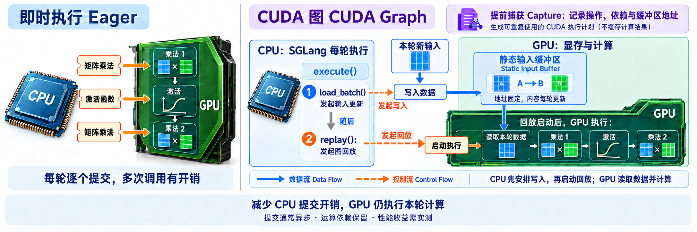

# 5.1 分段 CUDA 图(Piecewise CUDA Graph)

## CUDA 简介

### 问题背景
**CPU 与 GPU 的分工是：CPU 发起任务，GPU 执行计算。** 在即时执行(Eager Execution)路径中，SGLang 的 Python/PyTorch 控制逻辑运行在 CPU 上，遇到 GPU 运算时，通过 CUDA 接口提交对应的 GPU 内核(GPU Kernel)。
下面用三个运算示意这种分工：

```text
CPU：提交矩阵乘法 → 提交激活函数 → 提交矩阵乘法
GPU：执行矩阵乘法 → 执行激活函数 → 执行矩阵乘法
```
这些提交通常是异步的(Asynchronous)：CPU 可以连续提交任务，无须每次都等 GPU 算完。不过，每次提交仍然有框架调用、参数处理、内核启动等开销；当 GPU 内核执行很短时，这些开销可能占据较大比例。

### 解决方案
**CUDA 图(CUDA Graph)是把一组 GPU 操作及其依赖关系提前记录下来，供后续重复执行的机制。**
例如`1. 矩阵乘法 → 2. 激活函数 → 3. 矩阵乘法`就是一段计算流程：图中的节点代表操作，连线代表依赖关系，后一项运算需要使用前一项的结果。[CUDA 图机制说明](https://docs.nvidia.com/cuda/cuda-programming-guide/04-special-topics/cuda-graphs.html)

```text
提前捕获：记录「矩阵乘法 → 激活函数 → 矩阵乘法」

每轮执行：
CPU：更新静态输入缓冲区，发起一次计算图回放
GPU：从同一缓冲区读取本轮输入，按记录好的依赖关系执行运算
```

### 解决方案机制说明
**静态输入缓冲区(Static Input Buffer)是供计算图反复读取的一块 GPU 显存，地址和布局保持稳定，内容每轮更新。** 捕获时记录算子访问的缓冲区地址；每轮先将新输入复制到同一缓冲区，再回放计算图。例如，第 1 轮写入输入 A，第 2 轮原地覆盖为输入 B，图仍读取同一地址，却使用不同的数据。

**提效核心是减少 CPU 每轮逐个提交 GPU 操作的开销。** 计算图复用执行流程，每轮仍会进行实际的 GPU 计算；这里的“一次启动”针对一张已捕获的图，输入值可以改变，输入形状与缓冲区地址则需满足该图的要求。[PyTorch CUDA 图说明](https://docs.pytorch.org/docs/2.14/notes/cuda.html#cuda-graphs)

<a href="assets/cuda-graph-cpu-gpu-overview-wide-v4.png"></a>

*CUDA 图的执行顺序与缓冲区示意：蓝色实线表示数据流(Data Flow)，橙色虚线表示控制流(Control Flow)（学习补充，点击图片放大）。*

> ## 文档索引(Documentation Index)
> 获取完整文档索引：https://docs.sglang.io/llms.txt。
> 在进一步阅读前，通过此文件查找所有可用页面。

## 动机(Motivation)

标准 CUDA 图(CUDA Graph)将模型的整个前向传播(Forward Pass)捕获为一张图。这种方式很适合解码(Decode，批大小固定)，但不适合扩展/预填充(Extend/Prefill)，因为这些阶段每次迭代的词元(Token)数量会发生变化。

分段 CUDA 图(Piecewise CUDA Graph，PCG)通过在“分割点”(Split Point，例如混合专家模型(Mixture of Experts，MoE)的分发算子)处，将模型的计算图(Computation Graph)拆成多个片段来解决这个问题；每段大致对应一个模型层。针对一组预定义的词元长度，每个片段都会被单独捕获(Capture)为一张 CUDA 图。运行时，将输入填充(Padding)到最接近且足够容纳输入的已捕获尺寸，再回放(Replay)各个片段。这样既能消除预填充/扩展阶段的内核启动开销(Kernel Launch Overhead)，又能支持动态形状(Dynamic Shapes)。

PCG **默认启用**。传入 `--cuda-graph-backend-prefill=disabled` 可将其关闭。

## 用法(Usage)

对于受支持的配置，PCG 默认启用，无需额外参数：

```bash
python3 -m sglang.launch_server \
    --model-path meta-llama/Llama-3.1-8B-Instruct
```

### 禁用 PCG

```bash
python3 -m sglang.launch_server \
    --model-path meta-llama/Llama-3.1-8B-Instruct \
    --cuda-graph-backend-prefill=disabled
```

### 自定义捕获尺寸(Custom Capture Sizes)

```bash
python3 -m sglang.launch_server \
    --model-path meta-llama/Llama-3.1-8B-Instruct \
    --cuda-graph-max-bs-prefill 2048
```

### 服务参数(Server Args)

| 参数(Argument) | 默认值(Default) | 说明(Description) |
|---|---|---|
| `--cuda-graph-backend-prefill` | `None`（自动选择） | 预填充阶段的后端(Backend)。可选值：`full`、`breakable`、`tc_piecewise`、`disabled`。传入 `disabled` 可关闭扩展/预填充阶段的 PCG；传入 `tc_piecewise` 则会跳过所有自动禁用条件，强制启用 PCG（仅用于测试）。 |
| `--cuda-graph-max-bs-prefill` | `None`（自动选择） | 要捕获的最大词元数。非多头潜在注意力(Multi-Head Latent Attention，MLA)模型默认使用 `chunked_prefill_size`，MLA 模型默认使用 `2048`。 |
| `--cuda-graph-bs-prefill` | `None`（自动选择） | 显式指定要捕获的词元长度列表；未设置时自动生成。 |
| `--cuda-graph-tc-compiler` | `"eager"` | 已捕获子图(Subgraph)的编译器后端(Compiler Backend)。可选值：`eager`、`inductor`。 |

PCG 仍处于实验阶段，遇到相关错误时，可在启动命令中添加 `--cuda-graph-backend-prefill=disabled` 禁用。
如需反馈，请通过 [GitHub Issues](https://github.com/sgl-project/sglang/issues/new/choose) 提交，并附上完整错误堆栈(Error Traceback)、模型及量化方法(Quantization Method)、启动命令、GPU 类型和驱动版本。

## 工作原理(How It Works)

### Torch 编译后端(Torch Compile Backend)

PCG 使用 `torch.compile` 配合自定义后端 `SGLangBackend`，拆分并编译模型的前向传播，流程如下：

```text
model.forward 包装函数
→ torch.compile(..., backend=SGLangBackend)
→ FX 图(FX Graph)
→ split_graph() 在已注册的分割算子处拆分
→ split_gm（串联各个片段的顶层图）
→ 用 CUDAPiecewiseBackend 替换可捕获的子模块
→ 运行时分发：即时执行分割算子 + 逐段捕获/回放
```

- **安装(Install)**：`install_torch_compiled()` 用包装函数替换 `model.forward`。当 `is_in_piecewise_cuda_graph()` 返回 `True` 时，包装函数调用编译后的可调用对象(Compiled Callable)；否则回退到原始前向函数。首次通过这条路径调用时，会触发 Dynamo 追踪和图编译；只有捕获阶段完成后，才会进行 CUDA 图回放。
- **拆分(Split)**：`torch.compile` 追踪模型时，`SGLangBackend` 接收 FX 图并调用 `split_graph()`。`CompilationConfig.split_ops` 中列出的算子会被视为分割点，计算图在每个分割点处被切开。这些分割算子子模块在运行时保持即时执行(Eager Execution)，周围的子模块则被编译并由 `CUDAPiecewiseBackend` 包装。最终得到一个顶层“拼接图”(Stitching Graph)，即 `split_gm`；它包含 `submod_0`、`submod_1` 等子模块，可捕获子图与即时执行的分割算子子模块交替排列。
- **替换(Replace)**：`PiecewiseCompileInterpreter` 遍历 `split_gm` 中每个可捕获的子模块，为通用动态形状(General/Dynamic Shapes)编译该子模块，并在原位置将其替换为 `CUDAPiecewiseBackend` 实例。分割算子子模块，例如注意力(Attention)和全归约(All-Reduce)，保持原样，在运行时即时执行。
- **分发(Dispatch)**：运行时调用 `split_gm` 会执行拼接图，依次调用各个子模块。分割算子子模块即时执行；每个 `CUDAPiecewiseBackend` 子模块则经历三个阶段：
  1. **编译预热(Compile Warmup)**：执行支持通用形状的已编译路径。
  2. **捕获(Capture)**：针对每个捕获尺寸先预热一次，再记录一张 CUDA 图。
  3. **稳定态回放(Steady-State Replay)**：每次前向传播时回放已捕获的 CUDA 图。

### 分段 CUDA 图运行器(Piecewise CUDA Graph Runner)

`PiecewiseCudaGraphRunner` 通过三个阶段管理完整生命周期(Lifecycle)：

- **编译(Compile)**：使用一次虚拟前向传播(Dummy Forward Pass)预热 JIT 内核，然后用 `torch.compile` 包装模型，触发 Dynamo 追踪，拆分 FX 图，并为各个子图片段创建 `CUDAPiecewiseBackend` 实例。
- **捕获(Capture)**：按照从大到小的顺序遍历捕获尺寸。对于每个尺寸，执行两次前向传播，第一次用于预热，第二次用于 CUDA 图捕获。
- **回放(Replay)**：运行时通过二分查找(Binary Search)，找到不小于实际词元数的最小已捕获尺寸；将输入复制到静态缓冲区(Static Buffer)并进行零填充(Zero-Padding)，回放已捕获的 CUDA 图，再将输出截取到实际词元数。

### 内存优化(Memory Optimization)

PCG 的内存开销来自两部分：**Torch 内存分配器(Torch Memory Allocator)**和**非 Torch 内存(Non-Torch Memory)**。

得益于多项优化，Torch 内存分配器带来的额外开销很小：所有 CUDA 图运行器和捕获尺寸复用同一个全局共享内存池(Global Shared Memory Pool)；按照从大到小的顺序捕获，使较小的图可以复用较大图已分配的内存；最后一个子图的输出张量(Output Tensor)通过弱引用(Weak Reference)保存，以尽可能复用内存。

主要的内存开销来自非 Torch 内存：CUDA 图对象本身需要使用 GPU 内存，保存已记录的内核启动参数和内部状态。这部分开销随捕获尺寸数量的增加而增长，因此默认情况下会为 `piecewise_cuda_graph_max_tokens` 设置较保守的上限。

### 形状配置(Shape Configuration)

分段 CUDA 图会针对一组词元数量预先捕获计算图。运行时，通过二分查找将实际词元数向上对齐到最近的已捕获尺寸，再回放对应的图。如果词元数超过最大的已捕获尺寸，运行时就会回退到普通的非图前向路径(Non-Graph Forward Path)。

默认的捕获尺寸序列(Capture Schedule)会自动生成，步长逐渐增大：

| 词元数量范围(Token Range) | 步长(Step Size) |
|---|---|
| 4–32 | 4 |
| 48–256 | 16 |
| 288–512 | 32 |
| 576–1024 | 64 |
| 1280–4096 | 256 |
| 4096 以上 | 512 |

自动生成的尺寸序列以 `--cuda-graph-max-bs-prefill` 为上限。非 MLA 模型的默认上限为 `chunked_prefill_size`，使用 MLA 后端的模型为 `2048`。如果设置了 `--max-total-tokens`，上限还会进一步限制为不超过该值。此外，作为临时规避措施(Temporary Workaround)，Llama-2 模型会自动将上限设为 4096 个词元。

## 兼容性(Compatibility)

在以下场景中，PCG 会自动禁用。我们正在积极扩展兼容性，其中许多场景很快就会得到支持。

- 被禁用的模型架构，例如 `DeepseekV32ForCausalLM`。
- 推测解码(Speculative Decoding)。
- 注意力数据并行(Data Parallelism Attention，DP Attention)。
- 流水线并行(Pipeline Parallelism)，即 `pp_size > 1`。
- 非 CUDA 硬件，例如 AMD ROCm、昇腾 NPU(Ascend NPU)。
- MoE 全互连通信(All-to-All，A2A)后端。
- 低秩适配(Low-Rank Adaptation，LoRA)。
- 多模态模型(Multimodal Model)/视觉语言模型(Vision-Language Model，VLM)。
- 扩散大语言模型(Diffusion Large Language Model，DLLM)。
- 确定性推理(Deterministic Inference)。
- 预填充与解码分离(Prefill–Decode Disaggregation，PD Disaggregation)。
- 专家分布记录器(Expert Distribution Recorder)/专家并行负载均衡(Expert Parallelism Load Balancing，EPLB)。

使用 `--cuda-graph-backend-prefill=tc_piecewise` 可以跳过所有自动禁用检查，仅用于测试和调试。

## 代码参考(Code Reference)

| 文件(File) | 说明(Description) |
|---|---|
| `python/sglang/srt/model_executor/runner_backend/tc_piecewise_cuda_graph_backend.py` | 后端实现：编译、捕获和回放。 |
| `python/sglang/srt/compilation/compile.py` | `install_torch_compiled` 调用跳板(Trampoline)。 |
| `python/sglang/srt/compilation/backend.py` | `SGLangBackend`、图拆分和分段编译。 |
| `python/sglang/srt/compilation/cuda_piecewise_backend.py` | 各个子图的 CUDA 图捕获/回放。 |
| `python/sglang/srt/compilation/piecewise_context_manager.py` | 全局上下文标记(Context Flag)和 `ForwardContext`。 |
| `python/sglang/srt/compilation/compilation_config.py` | 捕获尺寸、分割算子和编译器配置。 |
| `python/sglang/srt/utils/custom_op.py` | 用于兼容 `torch.compile` 的 `register_custom_op`。 |
| `python/sglang/srt/server_args.py` | 服务参数和自动禁用逻辑。 |

## 术语与生词表(Terms and Vocabulary，学习补充)

| 术语或单词 | 中文释义 | 简明英文释义 |
|---|---|---|
| PCG — Piecewise CUDA Graph | 分段 CUDA 图：将可捕获的计算片段分别记录，并在运行时回放。 | CUDA graphs that record and replay separate pieces of a computation. |
| Piecewise /ˈpiːswaɪz/ | 分段的：由多个分别处理的部分组成。 | Done or defined in separate parts. |
| Capture /ˈkæptʃə/ | 捕获：记录 GPU 操作及其依赖关系，以便之后重复执行。 | Recording GPU operations and their dependencies for later execution. |
| Replay /ˌriːˈpleɪ/ | 回放：再次执行已经记录的计算图。 | Executing a previously recorded computation graph again. |
| Kernel /ˈkɜːnəl/ | 内核：在 GPU 等设备上执行具体计算的程序。 | A function that performs computation on a device such as a GPU. |
| Overhead /ˈəʊvəhed/ | 额外开销：执行主体计算之外所需的时间或资源。 | Extra time or resources needed in addition to the main computation. |
| Padding /ˈpædɪŋ/ | 填充：添加额外元素，使输入达到指定的尺寸。 | Adding extra elements to make an input reach a required size. |
| Trace /treɪs/ | 追踪：记录程序执行中的操作，以构建计算图。 | Recording program operations to build a computation graph. |
| Opaque /əʊˈpeɪk/ | 不透明的：内部实现不向外部追踪或分析过程展开。 | Having internal details that are not exposed for inspection. |
| Eager Execution | 即时执行：运行到某个操作时直接执行该操作。 | Executing an operation as the program reaches it. |
| Graph Break | 图中断：编译追踪无法继续形成同一张计算图的位置。 | A point where tracing cannot continue within the same computation graph. |
| JIT — Just-in-Time Compilation | 即时编译：在程序运行期间生成可执行代码。 | Compiling executable code while a program is running. |
| Weak Reference | 弱引用：引用对象，但不会仅凭该引用阻止对象被回收。 | A reference that does not by itself keep an object alive. |
