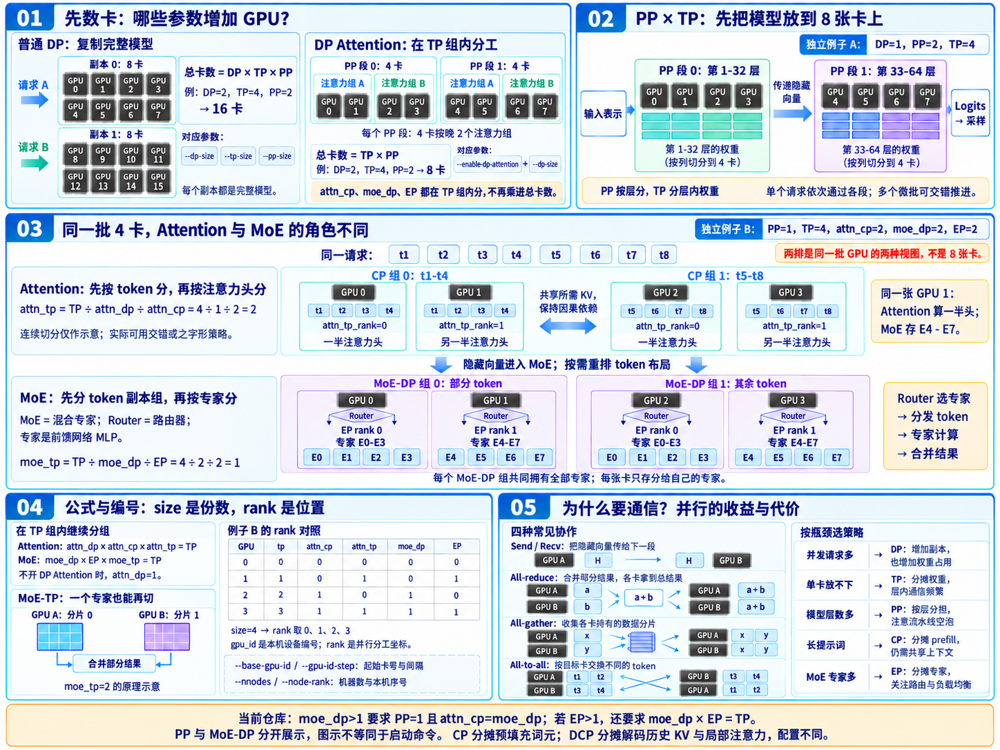
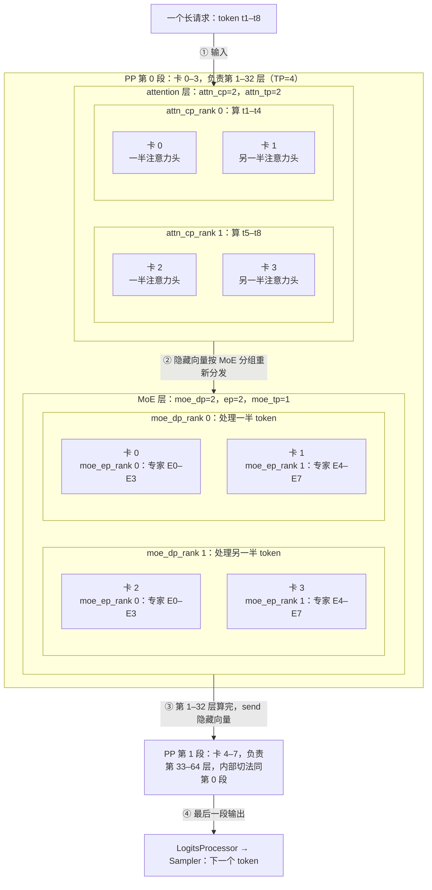
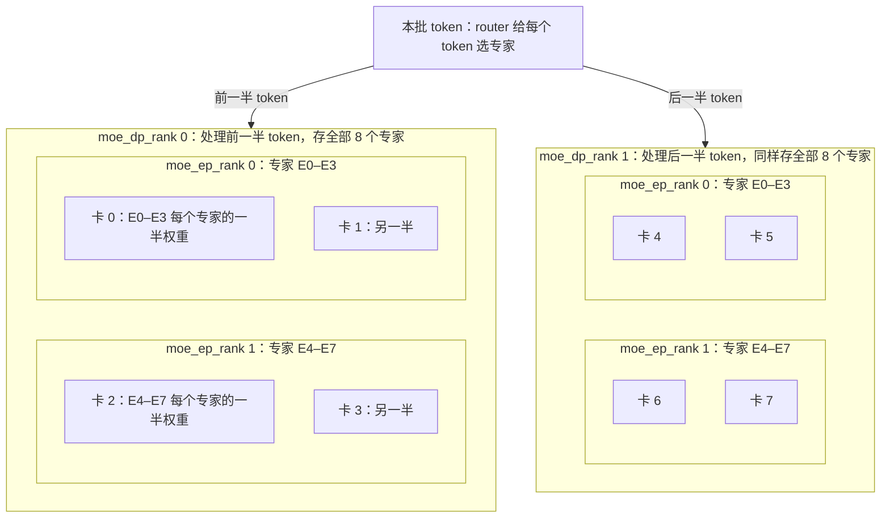

# 基础知识三：推理并行参数解释

> 总卡数由 `dp × tp × pp` 决定（开 DP attention 时 DP 不算在内）；`attn_cp`、`moe_dp`、`ep` 只是在每个 TP 组的卡里重新分组编号，不改变卡数。代码在 `python/sglang/srt/` 下，各策略的概念见核心概念一

## 推理并行科普图

<a href="assets/inference-parallelism-explained-zh-wide-4x3.png"></a>

点击图片查看大图。[横版生成提示词](assets/inference-parallelism-explained-zh-wide-4x3.prompt.txt) · [内容校对记录](assets/inference-parallelism-explained-zh.prompt.txt)

> **示例范围**：图中将 PP 与 MoE-DP 拆成独立示例。当前仓库在 `moe_dp_size > 1` 时要求 `pp_size = 1`、`attn_cp_size = moe_dp_size`；若同时 `ep_size > 1`，还要求 `ep_size × moe_dp_size = tp_size`。因此，下文第 1 节的 `PP=2、moe_dp=2` 以及第 5 节的 `TP=8、moe_dp=2、EP=2` 只能用于理解分组原理，不能直接作为当前版本的启动配置。约束见 [`server_args.py`](../python/sglang/srt/server_args.py#L7192)。

## 1. 一次前向里五种切法怎么配合

以 
- PP=2、TP=4（共 8 张卡）
- ``attn_cp_size`=2、moe_dp_size`=2、`ep_size`=2
- 8 个 expert、64 层 的模型

为例，一个长请求从输入到采样：



| 切法 | 切什么 | 在哪一层 | 本例 | 卡之间的通信 |
|---|---|---|---|---|
| PP | 按层纵切 | 所有层 | 卡 0–3 负责第 1–32 层，卡 4–7 负责第 33–64 层 | 两段之间 send 隐藏向量 |
| TP | 每层权重横切，是下面几种切法的基础分组 | 所有层 | 每段 4 张卡 | all-reduce 汇总结果 |
| attn_cp | 同一个请求的 token | attention 层 | 卡 0、1 算 t1–t4，卡 2、3 算 t5–t8 | 交换 K/V |
| attn_tp | 注意力头 | attention 层 | 每个 CP 组里 2 张卡各算一半头 | all-reduce |
| moe_dp | 不同 token，每组各存一份完整专家 | MoE 层 | 卡 0、1 处理一半 token，卡 2、3 处理另一半 | 层前后重新分发 token |
| moe_ep | 专家 | MoE 层 | 每组里一张卡放 E0–E3，另一张放 E4–E7 | all-to-all |
| moe_tp | 每个专家的权重 | MoE 层 | 4 ÷ 2 ÷ 2 = 1，不切 | all-reduce |

- 这个配置只是为了把各种切法放进一张图，实际部署通常只开其中几种。

## 2. 每张卡的编号：同一张卡在不同层扮演不同角色

同一个例子里 8 张卡的全部编号，每张卡就是一个 Scheduler 进程：

| pp_rank | tp_rank | gpu_id | attn_cp_rank | attn_tp_rank | moe_dp_rank | moe_ep_rank |
|---|---|---|---|---|---|---|
| 0 | 0 | 0 | 0 | 0 | 0 | 0 |
| 0 | 1 | 1 | 0 | 1 | 0 | 1 |
| 0 | 2 | 2 | 1 | 0 | 1 | 0 |
| 0 | 3 | 3 | 1 | 1 | 1 | 1 |
| 1 | 0 | 4 | 0 | 0 | 0 | 0 |
| 1 | 1 | 5 | 0 | 1 | 0 | 1 |
| 1 | 2 | 6 | 1 | 0 | 1 | 0 |
| 1 | 3 | 7 | 1 | 1 | 1 | 1 |

- `(pp_rank, tp_rank)` 定位的是一张卡；同一个 `pp_rank` 下的 `tp_size` 张卡组成一个 TP 组，后面几列都是在这个组里重新分组。
- 例：卡 1 在 attention 层是 CP 第 0 组里负责另一半注意力头，在 MoE 层是 DP 第 0 组里存专家 E4–E7。
- 后面几列由 `entrypoints/engine.py` 的 `_compute_parallelism_ranks()` 从 `tp_rank` 算出，在起子进程前就定好：

```python
# - Attention: Global(TP) -> DP -> ATTN_CP -> ATTN_TP (innermost)
# - MoE: Global(TP) -> MOE_DP -> EP -> MOE_TP (innermost)
attn_tp_size = tp_size // attn_dp_size // attn_cp_size
attn_cp_rank = (tp_rank // attn_tp_size) % attn_cp_size
moe_dp_rank = tp_rank // (tp_size // moe_dp_size)
moe_ep_rank = (
    tp_rank
    % (tp_size // moe_dp_size)
    // (tp_size // moe_dp_size // get_parallel().ep_size)
)
```

## 3. 参数一览：size、rank 与卡数

| 参数 | 切什么 | 作用在哪 | 对卡数的影响 |
|---|---|---|---|
| `--tp-size` | 每层权重横切 | 所有层，也是下面几种切法的基础分组 | 乘进总卡数 |
| `--pp-size` | 按层纵切 | 所有层 | 乘进总卡数 |
| `--dp-size` | 完整模型副本，各自处理不同请求 | 整个模型 | 不开 DP attention 时乘进总卡数 |
| `--enable-dp-attention` | 让 DP 只作用在 attention 层，在 TP 组内部分 | attention 层 | 不加卡 |
| `--attn-cp-size` | 同一个请求的 token | attention 层 | 不加卡，在 TP 组内分 |
| `--moe-dp-size` | 不同 token，各组各存一份专家 | MoE 层 | 不加卡，在 TP 组内分 |
| `--ep-size` | 专家 | MoE 层 | 不加卡，在 TP 组内分 |
| `--base-gpu-id`、`--gpu-id-step` | 起始卡号、相邻卡号的间隔 | 卡编号 | 不加卡 |
| `--nnodes`、`--node-rank` | 机器数、本机序号 | 多机部署 | 每台机器只起本机负责的 rank |

- 带 `size` 的参数表示一共切几份，`rank` 表示这张卡分到第几份，取值 0 到 size − 1；并行度永远是在多张卡之间，不是一张卡内部。
- 约束：乘积要能整除 `tp_size`，attention 层是 `attn_dp_size × attn_cp_size`，MoE 层是 `moe_dp_size × ep_size`，剩下的分别是 attention 和 MoE 内部的 TP 份数。
  - `server_args.py` 启动时会校验，例：TP=2、EP=4 会报错 "ep_size * moe_dp_size must be less than or equal to tp_size"，2 张卡没法把专家分成 4 份。

## 4. 卡怎么编号：gpu_id

```python
gpu_id = (
    server_args.base_gpu_id
    + ((pp_rank % pp_size_per_node) * tp_size_per_node)
    + (tp_rank % tp_size_per_node) * server_args.gpu_id_step
)
```

- `entrypoints/engine.py` 的 `Engine._launch_scheduler_processes()` 两层循环 `for pp_rank ...`、`for tp_rank ...`，每张卡算出 `gpu_id` 后起一个子进程；子进程里 `managers/scheduler.py` 的 `run_scheduler_process()` 再执行 `scheduler = Scheduler(...)`。
- `gpu_id` 是这台机器上的本地显卡编号，跟机器走，不跟模型走；`tp_rank`、`pp_rank` 是实例内的全局坐标，决定这张卡分到哪份权重。
  - 例：25 台机器各跑一个 `--tp-size 4` 的实例，每台机器上 `gpu_id` 都是 0–3。
- 普通 DP：`managers/data_parallel_controller.py` 的 `launch_dp_schedulers()` 每起一组 TP，起始编号就往后挪 `base_gpu_id += (server_args.tp_size * get_parallel().pp_size * server_args.gpu_id_step)`。
  - 例：DP=2、TP=2、PP=3，第 0 组用卡 0–5，第 1 组用卡 6–11，共 12 张卡。
- 开 `--enable-dp-attention` 时走 `launch_dp_attention_schedulers()`，只起一组 TP，DP 在组内分，总卡数仍是 `tp × pp`。
- 只有 0 号卡（`pp_rank`、`attn_tp_rank`、`attn_cp_rank` 都为 0）收请求、发结果，再用 `broadcast_pyobj()` 把请求广播给其他卡，见核心组件四。

## 5. MoE 层单独看：moe_dp 和 ep

以 TP=8、`moe_dp_size`=2、`ep_size`=2、8 个专家为例，MoE 内部的 TP 份数是 8 ÷ 2 ÷ 2 = 2：



- `moe_dp_size` = 2：8 张卡分成两组（`moe_dp_rank = tp_rank // 4`），两组的专家布局一样，各自处理一半 token。
- `ep_size` = 2：每组里的专家再分成两份（`moe_ep_rank = tp_rank % 4 // 2`），token 选中哪个专家，就用 all-to-all 发到存这个专家的卡上。
- MoE 内部 TP = 2：同一份专家由 2 张卡各存一半权重，算完再合并；attention 层不受这些影响，8 张卡照常按 TP 切分。

## 术语与生词

| 术语或单词 | 中文释义 | 简明英文释义 |
|---|---|---|
| TP（Tensor Parallelism） | 张量并行：每层权重切到多张卡上 | Split each layer's weights across GPUs. |
| PP（Pipeline Parallelism） | 流水线并行：按层切到多张卡上 | Split layers across GPUs. |
| DP（Data Parallelism） | 数据并行：多份副本处理不同请求或 token | Replicas that process different requests or tokens. |
| CP（Context Parallelism） | 上下文并行：同一个请求的 token 切到多张卡上 | Split one request's tokens across GPUs. |
| EP（Expert Parallelism） | 专家并行：MoE 的专家分到多张卡上 | Spread MoE experts across GPUs. |
| MoE（Mixture of Experts） | 混合专家：用路由加多个专家 MLP 代替普通 MLP | A router plus several expert MLPs. |
| MLP（Multi-Layer Perceptron） | 多层感知机：attention 之后的前馈网络 | The feed-forward network after attention. |
| Rank /ræŋk/ | 编号：这张卡在某种切分里分到第几份 | The index of a GPU within one split. |
| All-reduce /ɔːl rɪˈduːs/ | 全规约：各卡结果相加后每张卡都拿到总和 | Sum results across GPUs and share the total. |
| All-to-all /ɔːl tuː ɔːl/ | 全交换：每张卡给每张卡发一部分数据 | Every GPU sends a piece of data to every GPU. |
| Router /ˈruːtər/ | 路由：给每个 token 选专家 | Picks experts for each token. |
