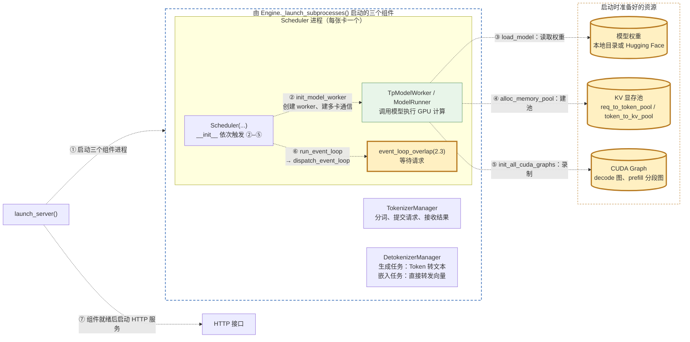
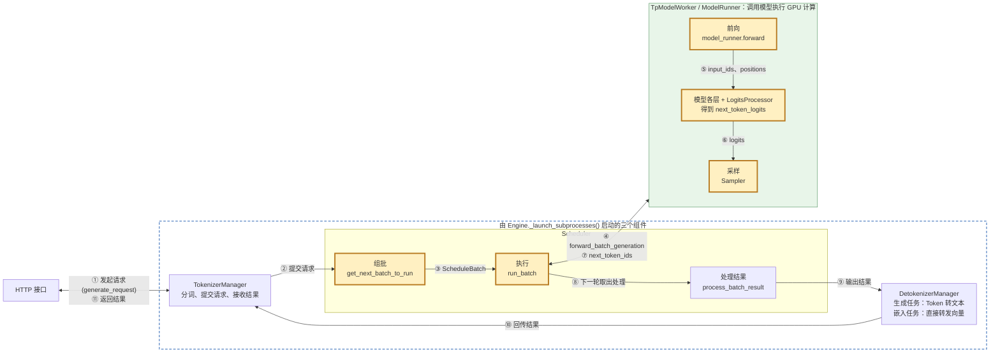
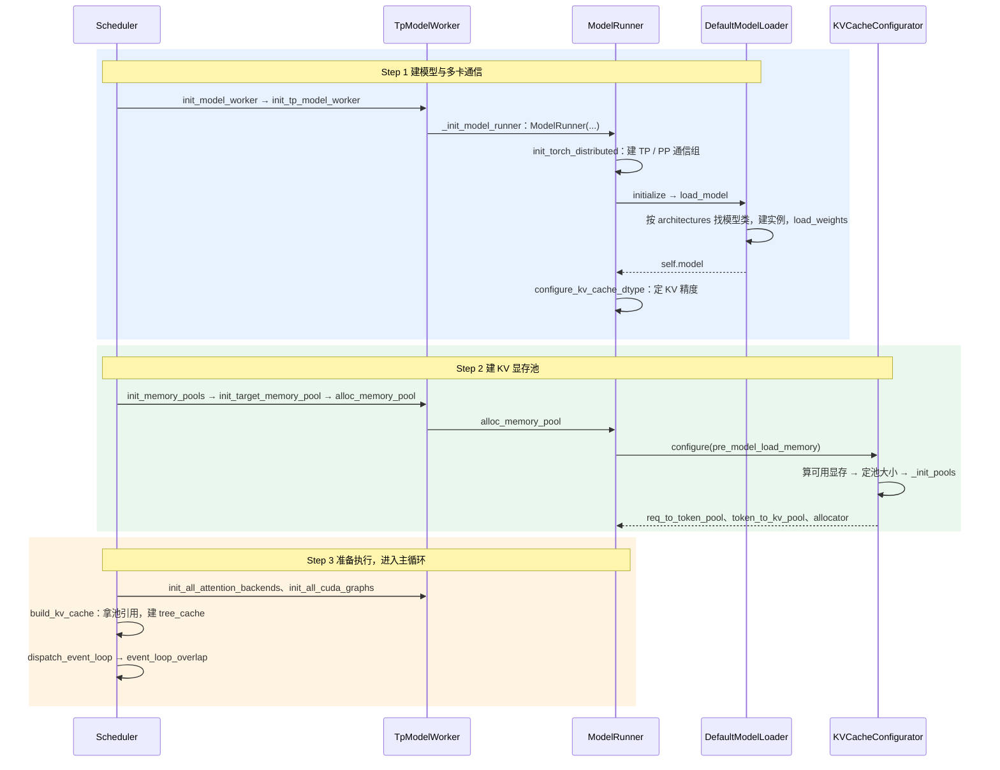
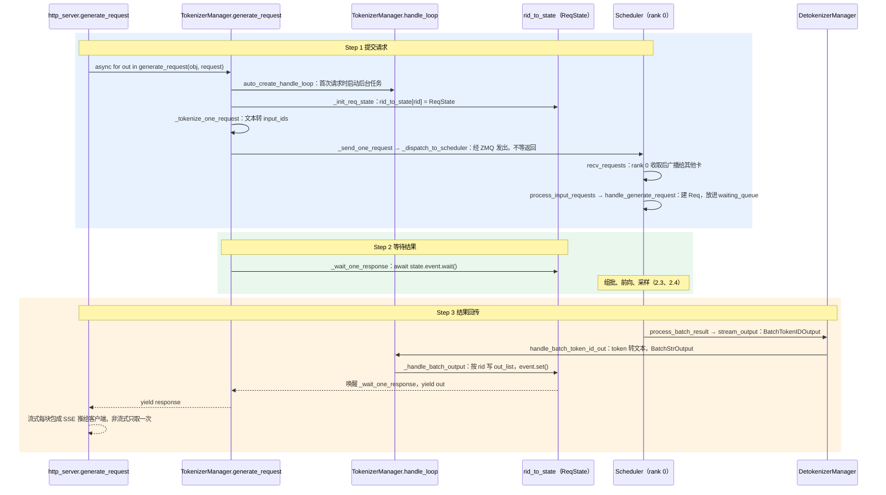
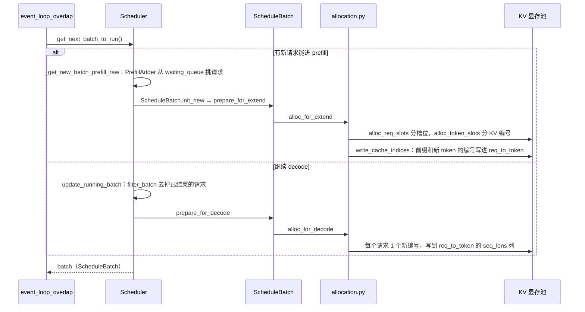
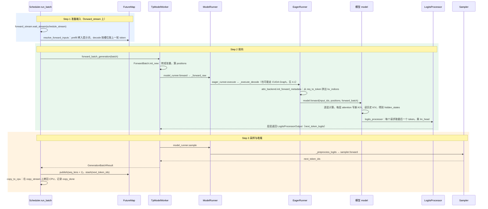
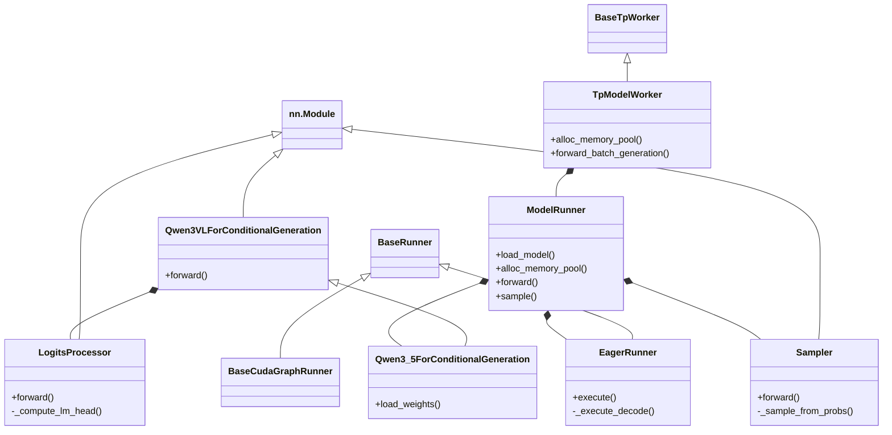
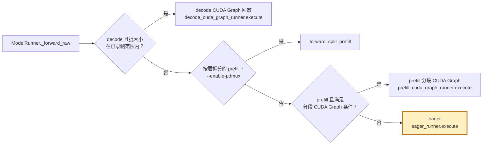
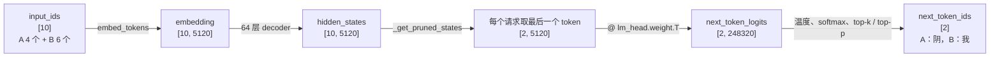

# 基础知识二：一次推理的全过程（启动、组批、前向与采样）

> 以 Qwen3.8-27B 为例：Scheduler 启动时加载模型、建显存池；之后每轮组批、前向、采样出每个请求的下一个 token。代码在 `python/sglang/srt/` 下，下文路径都相对这个目录

## 1. 在核心链路中的位置

### 1.1 启动阶段

启动只做一次，全是虚线箭头，①–⑦ 按发生顺序排列；黄色粗框是启动的产物，细节见 2.1。链路总结：

- 启动核心三组件链路：`launch_server.py#run_server`() -> `http_server.py#launch_server()`->`Engine._launch_subprocesses()`启动核心的三个组件 :
  - `scheduler.py#_launch_scheduler_processes()`：
    - 调度逻辑，包括给显卡编号、支持并行计算   
    - 初始化 `TpModelWorker/ModelRunner`：1）下载和加载模型；2）初始化多卡通信：支持各种并行计算策略
  - `TokenizerManager._init_()` 初始化 TokenizerManager
    - 保存着 rid_to_state (请求id及其对应的 请求状态/结果)
  - `detokenizer_manager.py#run_detokenizer_process() ->DetokenizerManager#_init()_` 初始化 DetokenizerManager

- ②–⑥ 都发生在 Scheduler 进程里：②–⑤ 由 `Scheduler.__init__` 依次触发，真正干活的是同一进程里的 TpModelWorker / ModelRunner；⑥ 是 `run_scheduler_process()` 在 `__init__` 之后调用 `scheduler.run_event_loop()`。
- ④ 的池大小按加载完权重后剩下的显存算。

### 1.2 一次请求的处理阶段

> 这种图仅仅用来了解不同组件之间的分工，具体的调用链路和方法见 2.2（提交请求与等待结果）、2.3（组批）、2.4（前向与采样）

实线箭头，①–⑪ 按发生顺序排列；双向连线的标签上行是去程、下行是回程。黄色粗框是本文讲的部分，处理结果和 DetokenizerManager 见 `managers/scheduler.py.run_batch.md` 与核心组件三。

- ①② 提交请求、⑩⑪ 结果回传见 2.2；③ 组批见 2.3；④–⑦ 推理是本文重点，见 2.4 和第 4 节。
- 默认开启重叠调度(Overlap Scheduling)：⑧ 晚一轮发生，本批的结果要等下一轮循环才由 `process_batch_result` 处理，CPU 处理时 GPU 已经在算下一批。

## 2. 浅层时序图(Sequence Diagram)

### 2.1 启动：加载模型、建显存池

- **Step 1 建模型与多卡通信**：`managers/scheduler.py` 的 `Scheduler.init_model_worker()` → `init_tp_model_worker()`，`managers/tp_worker.py` 的 `TpModelWorker._init_model_runner()` 里执行 `ModelRunner(...)`。
  - 多卡通信：`ModelRunner.init_torch_distributed()` 调 `distributed/bootstrap.py` 的 `init_distributed_environment(...)` 建全局进程组，再 `initialize_model_parallel(...)` 切出 `tp_group`、`pp_group`；GPU 张量用 NCCL 传，CPU 上的 Python 对象用 gloo 传。同时记下加载模型前的剩余显存 `pre_model_load_memory`。
  - 加载模型：`ModelRunner.load_model()` → `load_model_with_memory_saver()` → `model_loader/loader.py` 的 `DefaultModelLoader.load_model()`。`_initialize_model()` 里 `get_model_architecture()` 按 `config.json` 的 `architectures` 找到模型类（Qwen3.8-27B 是 `Qwen3_5ForConditionalGeneration`，以 `config.json` 为准），`model_class(**kwargs)` 建实例，再 `model.load_weights(weights)` 灌权重；本地没有权重时 `_prepare_weights()` 调 `download_weights_from_hf()` 下载。
  - 开张量并行(Tensor Parallelism，TP)时每张卡只存每层的一部分权重；开流水线并行(Pipeline Parallelism，PP)时每张卡只加载自己负责的层。
- **Step 2 建 KV 显存池**：`ModelRunner.alloc_memory_pool()` 里 `self.kv_cache_configurator.configure(pre_model_load_memory=...)`，由 Scheduler 触发、ModelRunner 创建。
  - `_profile_available_bytes()`：可用显存 = 当前剩余显存（权重已扣掉）− `pre_model_load_memory × (1 − mem_fraction_static)` − 多模态预留。
  - `config_from_budget()` 换算成键值缓存(Key-Value Cache，KV Cache)编号总数 `max_total_num_tokens`；`resolve_max_num_reqs()` 定槽位数，取用户 `--max-running-requests` 和显存上限里较小的；`_init_pools()` 创建三个池，结构见核心概念三。
- **Step 3 准备执行**：`init_all_attention_backends()` 初始化 attention 后端，`init_all_cuda_graphs()` 录制 decode 的 CUDA Graph 和 prefill 的分段 CUDA Graph；`Scheduler.__init__` 里 `kv_cache_builder.build_kv_cache()` 拿到池的引用并创建前缀缓存 `tree_cache`；最后 `run_scheduler_process()` → `dispatch_event_loop()` 选默认的 `event_loop_overlap`。
  - 省略：投机解码的草稿模型（`maybe_init_draft_worker`）、PD 分离、混合 Mamba 等分支。

### 2.2 提交请求与等待结果(TokenizerManager)

- **Step 1 提交请求**：`entrypoints/http_server.py` 的 `generate_request()` 路由按是否流式分两种取法。
  - 流式：`async for out in _global_state.tokenizer_manager.generate_request(obj, request)`，每块包成 `b"data: " + dumps_json(out) + b"\n\n"` 交给 `StreamingResponse`。
  - 非流式：`await _global_state.tokenizer_manager.generate_request(obj, request).__anext__()`，只取一次，拿到的就是完整结果。
  - 离线 `entrypoints/engine.py` 的 `Engine.generate()` 也调用同一个 `self.tokenizer_manager.generate_request(obj, None)`。
- **TokenizerManager 侧**：`managers/tokenizer_manager.py` 的 `TokenizerManager.generate_request()`。
  - `auto_create_handle_loop()`：首次请求时 `loop.create_task(print_exception_wrapper(self.handle_loop))`，启动后台接收任务，所有请求共用。
  - `_init_req_state()`：`state = ReqState([], False, asyncio.Event(), sub_obj, time_stats)`，`self.rid_to_state[rid] = state`；rid 已存在时报 `Duplicate request ID detected`。
  - `tokenized_obj = await self._tokenize_one_request(obj)` 分词，再 `self._send_one_request(tokenized_obj)` → `_dispatch_to_scheduler()` → `sock_send(self.send_to_scheduler, obj)`，发完立刻返回。
- **Scheduler 侧**：`event_loop_overlap` 每轮开头 `recv_reqs = self.request_receiver.recv_requests()`。
  - `managers/scheduler_components/request_receiver.py` 的 `_pull_raw_reqs()`：只有 rank 0（pp_rank、attn_tp_rank、attn_cp_rank 都为 0）执行 `sock_recv(self.recv_from_tokenizer, zmq.NOBLOCK)`，读空就退出；再 `_broadcast_reqs_across_ranks()` 发给其他卡。
  - `process_input_requests()` → `self._request_dispatcher(recv_req)` → `handle_generate_request()`：`req = Req(recv_req.rid, recv_req.input_text, recv_req.input_ids, recv_req.sampling_params, ...)`，`_add_request_to_queue()` 里 `self.waiting_queue.append(req)`，等 2.3 组批时挑选。
- **Step 2 等待结果**：`_wait_one_response()` 里 `await asyncio.wait_for(state.event.wait(), timeout=_REQUEST_STATE_WAIT_TIMEOUT)`。
  - 两种结局：被 `event.set()` 唤醒后往下走；或每 4 秒（`SGLANG_REQUEST_STATE_WAIT_TIMEOUT`）抛一次 `asyncio.TimeoutError`，只用来检查客户端是否已断开，断开就 `abort_request`，否则 `continue` 接着等。
  - `await` 只挂起当前协程，事件循环照常处理别的请求，不阻塞线程（见基础知识四）。
- **Step 3 结果回传**：
  - Scheduler：`process_batch_result()` → `process_batch_result_prefill()` / `process_batch_result_decode()` → `output_streamer.stream_output()`，流式按 `stream_interval` 决定发不发，请求结束时一定发，组成 `BatchTokenIDOutput` 发给 DetokenizerManager；只有 rank 0 真正发出。
  - DetokenizerManager：`event_loop()` 里 `sock_recv(self.recv_from_scheduler)` → `handle_batch_token_id_out()` 把 token 增量解码成文本 → `sock_send(self.send_to_tokenizer, output)`，详见核心组件三。
  - TokenizerManager：`handle_loop()` 里 `recv_obj = await async_sock_recv(self.recv_from_detokenizer)` → `_handle_batch_output()`，按 `recv_obj.rids` 逐个找到 `state`：
    - 累积：`state.append_text(delta_text)`、`state.output_ids.extend(delta_output_ids)`，全量结果一直攒在 `ReqState` 里。
    - 组装 `out_dict`：非流式未结束时为 `None`；结束时是 `{"text": state.get_text(), "output_ids": state.output_ids.copy(), "meta_info": ...}`。
    - `state.out_list.append(out_dict)` 后 `s.event.set()` 唤醒等待方：`event` 只通知，数据在 `out_list`。每攒满 `--batch-notify-size`（默认 16）个请求先通知一组并 `await asyncio.sleep(0)` 让出，剩下的在循环结束后统一通知。
    - 请求结束时 `del self.rid_to_state[rid]`。
  - `_wait_one_response()` 被唤醒后：
    - 取空积压：`out_list = state.out_list`、`state.out_list = []`、`finished = state.finished`、`state.event.clear()`，中间没有 `await`，`handle_loop` 插不进来。
    - 默认每个 `out_dict` 都是累计快照，取 `out_list[-1]` 即可；开 `--incremental-streaming-output` 时每块是增量，积压多块用 `_coalesce_streaming_chunks()` 合并。
    - `out` 是单个 dict；非流式只在 `finished` 时 `yield out` 一次，流式每次唤醒都 `yield out`。
  - `generate_request()` 里 `async for response in self._wait_one_response(obj, request): yield response`，把结果原样转交给上层。
- **异步生成器(Async Generator)**：`async def` 里有 `yield` 的函数，`generate_request`、`_wait_one_response` 和 http 层的 `stream_results` 都是；进程、线程、协程的区别见基础知识四。
  - 调用时只返回生成器对象，不执行函数体；`async for` 每轮隐式 `await gen.__anext__()`，等下一个值。
  - 每层要用 `async for` 取下层的值，自己也必须是 `async def`，所以三层都写了 `async`；异步生成器不支持 `yield from`，原样转交只能写成 `async for ... yield`。
- 省略：批量请求 `_handle_batch_request()`、多 tokenizer worker、PD 分离、请求中止(abort)等分支。

### 2.3 组批：分配槽位和 KV 编号(Scheduler)

- 选 prefill 还是 decode：`Scheduler.get_next_batch_to_run()` 先把上一轮的 prefill 批并进 `running_batch`，再试着组新的 prefill 批；没有新请求能进，就继续跑 `running_batch` 的 decode。
- prefill：`_get_new_batch_prefill_raw()` 用 `PrefillAdder` 按剩余槽位和 KV 编号挑请求，再 `new_batch.prepare_for_extend()`；提示词 token 先暂存在 CPU 锁页内存 `prefill_input_ids_cpu`，前向时再拷到显存(Host to Device，H2D)。
- decode：`update_running_batch()` 先 `batch.filter_batch()`；`check_decode_mem()` 不通过时 `retract_decode()` 退回部分请求；再 `batch.prepare_for_decode()`，`seq_lens` 加 1，`input_ids` 为 `None`，前向时从 FutureMap 取。
- 到这一步只分了编号、写了映射，K/V 内容要等前向时才写进去，见核心概念三第 4 节。

### 2.4 推理：前向与采样（重点）

- **Step 1 准备输入**：`managers/scheduler.py` 的 `Scheduler.run_batch()` overlap 分支在 `with self.forward_stream_ctx:` 里执行，先 `self.forward_stream.wait_stream(self.schedule_stream)`，等组批时的 H2D 拷贝完成（CUDA Stream 见核心概念二）。
  - `managers/overlap_utils.py` 的 `resolve_forward_inputs()`：prefill 执行 `batch.prefill_input_ids_cpu.to(batch.device, non_blocking=True)`；decode 执行 `batch.input_ids = future_map.output_tokens_buf[batch.req_pool_indices]`。
- **Step 2 前向**：`managers/tp_worker.py` 的 `TpModelWorker.forward_batch_generation()`。
  - `forward_batch = ForwardBatch.init_new(batch, self.model_runner, ...)`：把 `ScheduleBatch` 转成前向用的张量，算出每个 token 的位置 `positions`（decode 是 `seq_len - 1`），给旋转位置编码(Rotary Position Embedding，RoPE)用。
  - `out = self.model_runner.forward(forward_batch, ...)` → `ModelRunner._forward_raw()` 选执行路径，见 4.1。
  - `model_executor/runner/eager_runner.py` 的 `EagerRunner._execute_decode()`：先 `attn_backend.init_forward_metadata(forward_batch)`，再 `model_runner.model.forward(forward_batch.input_ids, forward_batch.positions, forward_batch, **kwargs)`。
  - 模型：`models/qwen3_vl.py` 的 `Qwen3VLForConditionalGeneration.forward()`，`self.model(...)` 逐层算出 `hidden_states`；有图片时先走 `general_mm_embed_routine()`，把图片向量拼进输入。每层 attention 里 `_set_kv_buffer()` → `MHATokenToKVPool.set_kv_buffer()` 写入新 K/V，再按 `kv_indices` 读出历史 K/V。
  - `layers/logits_processor.py` 的 `LogitsProcessor.forward()` → `_get_pruned_states()` → `_get_logits()` → `_compute_lm_head()`：`torch.matmul(hidden_states, lm_head.weight.T)`；开 TP 时再 all-gather 拼成完整词表。
- **Step 3 采样与收尾**：`TpModelWorker.forward_batch_generation()` 里 `batch_result.next_token_ids = self.model_runner.sample(logits_output, forward_batch)`。
  - `ModelRunner._preprocess_logits()`：`sampling_info.apply_logits_bias(...)` 加重复、频率等惩罚；有结构化输出(grammar)时屏蔽不允许的 token。
  - `layers/sampler.py` 的 `Sampler.forward()`：全部贪心时 `torch.argmax(logits, -1)`；否则 `logits.div_(sampling_info.temperatures)` → `torch.softmax(logits, dim=-1)` → `_sample_from_probs()` 里 `top_k_top_p_sampling_from_probs(probs.contiguous(), sampling_info.top_ks, sampling_info.top_ps, ...)`。
  - 回到 `run_batch`：`self.future_map.publish(future_indices, batch.seq_lens + 1)`；`_relay_forward_payload()` → `future_map.stash()` 写入 `next_token_ids`；`batch_result.copy_to_cpu(...)` 在 copy_stream 上拷回 CPU 并记录 `copy_done`；最后 `batch.input_ids = None`。
  - 之后 `event_loop_overlap` 把 `(batch.copy(), batch_result)` 放进 `result_queue`，下一轮 `process_batch_result()` 等 `copy_done` 后追加 token、判断结束、发给 DetokenizerManager。
  - 省略：投机解码、延迟采样、PP 中间段、只做 prefill 的打分请求、`_forward_isolation` 的快照恢复等分支。

## 3. 继承关系与职责

| 类                                 | 职责                           | 核心方法                                                    | 说明                                   |
| --------------------------------- | ---------------------------- | ------------------------------------------------------- | ------------------------------------ |
| `Scheduler`                       | 启动时触发建模型和显存池；每轮组批、提交前向       | `init_model_worker`、`get_next_batch_to_run`、`run_batch` | 一张卡一个 Scheduler 进程                   |
| `TpModelWorker`                   | 持有 ModelRunner，串起构造输入、前向、采样  | `alloc_memory_pool`、`forward_batch_generation`          | 开投机解码时还有一个草稿 worker                  |
| `ModelRunner`                     | 加载模型、建池、选执行路径、采样             | `load_model`、`alloc_memory_pool`、`forward`、`sample`     | 池在这里创建，Scheduler 拿引用使用               |
| `KVCacheConfigurator`             | 按显存算池大小并创建池                  | `configure`                                             | 池大小启动后不变                             |
| `ForwardBatch`                    | 前向用的输入                       | `init_new`                                              | 由 `ScheduleBatch` 转来                 |
| `EagerRunner`                     | 不用 CUDA Graph 的执行器           | `execute`、`_execute_decode`                             | 与 CUDA Graph 执行器同属 `BaseRunner`      |
| `Qwen3VLForConditionalGeneration` | 多模态模型的前向                     | `forward`                                               | Qwen3.8-27B 的类继承它，复用这个 `forward`     |
| `LogitsProcessor`                 | 把 `hidden_states` 变成 logits  | `forward`、`_compute_lm_head`                            | 自身没有权重，`lm_head` 由模型传入               |
| `Sampler`                         | 把 logits 变成 `next_token_ids` | `forward`、`_sample_from_probs`                          | 采样参数来自 `forward_batch.sampling_info` |

- `LogitsProcessor`、`Sampler` 没有权重也继承 `nn.Module`，是 PyTorch 的通用惯例：挂进模型树后跟着 `model.to(device)`、`model.eval()` 走，能加钩子，也能被 `torch.compile` 和 CUDA Graph 一起捕获。
- 模型类上 `forward` 的返回类型常写成 `torch.Tensor`，实际按情况返回 `LogitsProcessorOutput`（PP 最后一段）、`EmbeddingPoolerOutput`（嵌入模型）或 `PPProxyTensors`（PP 中间段），以函数体为准。

## 4. 前向的执行路径与数据形状

### 4.1 `_forward_raw` 选哪条路

- 学习时先看 eager：它直接调用 `model.forward()`，能一路跟进模型各层；CUDA Graph 回放的是启动时录好的同一个 `model.forward()`，看不到计算过程。
- CUDA Graph 把一整段 GPU 核函数(Kernel)的发起过程录下来，之后 CPU 只发一次回放，省的是 CPU 逐个发 kernel 的开销；适合 kernel 小而多、形状固定的 decode。prefill 每批 token 数不同，用分段 CUDA 图(Piecewise CUDA Graph，PCG)在 attention 处断开。
- `--disable-cuda-graph` 关闭 decode 的图，`--cuda-graph-backend-prefill=disabled` 关闭 prefill 的分段图；PD 复用(`--enable-pdmux`)是可选功能，主链路可以跳过。

### 4.2 一个例子：形状怎么变

请求 A「今天天气」4 个 token、请求 B「你喜欢吃什么」6 个 token，在同一个 prefill 批里；Qwen3.8-27B 的 `hidden_size` 是 5120，词表大小 `vocab_size` 是 248,320，共 64 层。

- `num_tokens`：prefill 是本次要算的输入 token 之和（前缀缓存命中的不算），decode 等于请求数；所有请求首尾拼成一列，不补齐，靠 `extend_start_loc` 区分边界。
- `hidden_size` 是每个 token 的向量长度，`vocab_size` 是词表大小，两者靠 `lm_head` 连接：词表里每个 token 一行 5120 维权重，和隐藏向量点积得到这个 token 的分数。
- 下一轮 decode：`input_ids` 是 `[2]`（「阴」「我」），`hidden_states` 是 `[2, 5120]`；「今天天气」「你喜欢吃什么」的 K/V 直接从 KV Cache 读，不用重算。

## 术语与生词

| 术语或单词                                          | 中文释义                                   | 简明英文释义                                                           |
| ---------------------------------------------- | -------------------------------------- | ---------------------------------------------------------------- |
| Prefill /ˈpriːfɪl/                             | 预填充：一次算完提示词的所有 token                   | Process all prompt tokens at once.                               |
| Decode /diːˈkoʊd/                              | 解码：每轮每个请求生成一个新 token                   | Generate one new token per request per step.                     |
| Forward /ˈfɔːrwərd/                            | 前向：输入经过模型各层算出输出                        | Run inputs through the model layers.                             |
| Logits /ˈloʊdʒɪts/                             | 模型对词表每个 token 打的原始分数                   | Raw scores over the vocabulary.                                  |
| Sampling /ˈsæmplɪŋ/                            | 采样：按分数选出下一个 token                      | Pick the next token from the scores.                             |
| Temperature /ˈtemprətʃər/                      | 温度：分数除以它，越大越随机                         | Divides logits; higher means more random.                        |
| Top-k / Top-p                                  | 只在分数最高的 k 个、或累计概率达到 p 的 token 里抽       | Restrict sampling to the best k tokens or to probability mass p. |
| Greedy /ˈɡriːdi/                               | 贪心：直接取分数最高的 token                      | Always pick the highest-scoring token.                           |
| Eager /ˈiːɡər/                                 | 即时执行：每个算子立刻发起 GPU kernel               | Launch each GPU operation immediately.                           |
| CUDA Graph                                     | 把一段 kernel 录下来、一次回放的 GPU 功能            | Record a kernel sequence once and replay it.                     |
| PCG（Piecewise CUDA Graph）                      | 分段 CUDA 图：在 attention 处断开录制，用于 prefill | CUDA graphs split at attention, used for prefill.                |
| Kernel /ˈkɜːrnl/                               | 核函数：在 GPU 上并行执行的一个函数                   | A function that runs in parallel on the GPU.                     |
| NCCL（NVIDIA Collective Communications Library） | NVIDIA 多卡通信库                           | NVIDIA's library for multi-GPU communication.                    |
| Hidden State /ˈhɪdn steɪt/                     | 隐藏向量：模型内部每个 token 的向量                  | The internal vector for each token.                              |
| LM Head（Language Model Head）                   | 语言模型输出头：把隐藏向量变成词表分数的权重                 | Weights that map hidden states to vocabulary scores.             |
| Embedding /ɪmˈbedɪŋ/                           | 嵌入：把 token id 变成向量                     | Turn a token id into a vector.                                   |
| RoPE（Rotary Position Embedding）                | 旋转位置编码：把位置信息加到 q、k 上                   | Encodes token position by rotating q and k.                      |
| H2D（Host to Device）                            | 主机到设备拷贝：CPU 内存拷到 GPU 显存                | Copy data from host memory to GPU memory.                        |
| TP（Tensor Parallelism）                         | 张量并行：每层权重切到多张卡上                        | Split each layer's weights across GPUs.                          |
| PP（Pipeline Parallelism）                       | 流水线并行：按层切到多张卡上                         | Split layers across GPUs.                                        |
| KV Cache（Key-Value Cache）                      | 键值缓存：已算出的 K、V，供后续 token 复用             | Saved keys and values reused by later tokens.                    |
| ZMQ（ZeroMQ）                                    | 进程间消息队列库，组件之间用它收发请求和结果                 | Messaging library used between processes.                        |
| SSE（Server-Sent Events）                        | 服务端推送：一个 HTTP 连接上按 `data: ...` 逐块推给客户端   | Server pushes chunks over one HTTP connection.                   |
| Async Generator /əˈsɪŋk ˈdʒenəreɪtər/           | 异步生成器：`async def` 里含 `yield`，用 `async for` 逐个取值 | An async function that yields values one by one.                 |
| Drain /dreɪn/                                  | 取空：把队列或缓冲区里积压的内容全部取走                  | Remove all items from a queue or buffer until it is empty.       |
| Atomically /əˈtɑːmɪkli/                        | 原子地：作为一个整体完成，中间不会被打断                  | As a single operation that cannot be interrupted partway.        |

