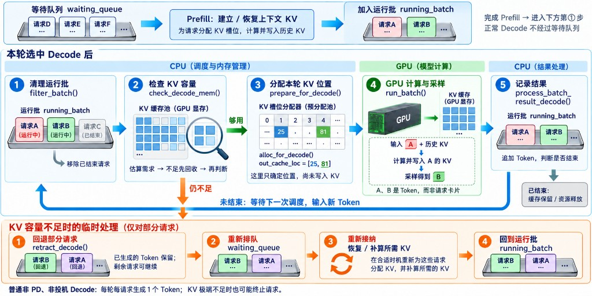

# 基础知识五：大模型中的 GPU（显存与并行计算）

图形处理器(Graphics Processing Unit，GPU)在大模型推理中承担大量数值计算；显存(GPU Memory)存放计算所需的数据。以 SGLang 的普通 Transformer 推理为例，可以先看清“存什么”，再理解“为什么算得快”。

## 1. 显存主要花在三个地方

| 用途 | 存什么、何时占用 | 核心代码入口 |
|---|---|---|
| 模型权重(Model Weights) | 各层矩阵等参数；启动时加载本卡所需权重，通常跨请求常驻，推理时主要读取 | [`ModelRunner.load_model()`](../python/sglang/srt/model_executor/model_runner.py#L1142) |
| 键值缓存(Key-Value Cache，KV Cache) | 各层历史词元(Token)的 K/V，避免后续生成重复计算；先建显存池，再分配池内槽位 | [`MHATokenToKVPool`](../python/sglang/srt/mem_cache/memory_pool.py#L1804) |
| 前向计算(Forward Pass)的中间结果与工作区 | 隐藏状态、注意力输出、算子工作区等；随批大小、序列长度和实现变化，部分缓冲区长期预留并反复复用 | [`ModelRunner.forward()`](../python/sglang/srt/model_executor/model_runner.py#L1597) |

这三类是理解主要用途的划分；实际占用还包括通信缓冲区、CUDA 上下文及内存分配器预留等。普通推理通常不计算梯度；训练还需要梯度(Gradients)、优化器状态等额外空间。

**KV 池不能吃光剩余显存。** [`KVCacheConfigurator._profile_available_bytes()`](../python/sglang/srt/mem_cache/kv_cache_configurator.py#L1817)在权重加载后的可用显存中扣除运行预留空间；概念上，`KV 槽位容量 ≈ KV 显存预算 ÷ 每个 Token 在本卡各层的 KV 字节数`，再考虑分页对齐和配置限制。

> “请求槽位数 × 最大上下文长度”主要决定 [`ReqToTokenPool`](../python/sglang/srt/mem_cache/memory_pool.py#L256) 的**编号索引表**尺寸，不等于要为这些位置全部分配 K/V 数据。表里存 KV 编号，KV 池里才存对应的向量。

## 2. 一个 KV 编号的生命周期

KV 编号(KV Index)标识池中的逻辑槽位，可定位本卡各层对应的 K/V。下面是普通 GPU KV 池的**概念状态机**，不是源码中的统一状态枚举；“回收处理”是操作入口，分页分配器则按整页归还容量。

```mermaid
stateDiagram-v2
  state "空闲 free_pages" as Free
  state "已分配、尚未写入" as Allocated
  state "请求正在使用" as InUse
  state "缓存保留、无活跃引用" as Cached
  state "回收处理 free&#40;&#41;" as Reclaim
  state "暂缓释放 free_group" as Deferred
  state "已释放待归并 release_pages" as Released
  [*] --> Free
  Free --> Allocated: alloc / alloc_extend / alloc_decode
  Allocated --> InUse: 前向计算，逐层写入 KV
  InUse --> Cached: 保留前缀，活跃引用归零
  Cached --> InUse: 命中前缀，增加锁引用
  InUse --> Reclaim: 请求结束，不再保留的槽位
  Cached --> Reclaim: evict 淘汰
  Reclaim --> Deferred: 正在批量回收
  Deferred --> Reclaim: free_group_end 结束批量回收
  Reclaim --> Released: 非批量回收，need_sort 为真
  Reclaim --> Free: 非批量回收，need_sort 为假
  Released --> Free: merge_and_sort_free
```

- **估算在实际分配之前，但不是某个编号的状态。** [`PrefillAdder.add_one_req()`](../python/sglang/srt/managers/schedule_policy.py#L1208)判断容量能否接纳请求，[`_update_prefill_budget()`](../python/sglang/srt/managers/schedule_policy.py#L864)更新预算；此时不代表已经拿到具体槽位。
- **分配编号与写入数据是两件事。** [`alloc()`](../python/sglang/srt/mem_cache/allocator/token.py#L54)或分页版本的 [`alloc_extend()` / `alloc_decode()`](../python/sglang/srt/mem_cache/allocator/paged.py#L172)先给出具体位置；计算得到 K/V 后，再经 [`set_kv_buffer()`](../python/sglang/srt/mem_cache/memory_pool.py#L2376)等路径逐层写入。
- **请求结束不等于立即释放。** [`RadixCache.cache_finished_req()`](../python/sglang/srt/mem_cache/radix_cache.py#L459)可保留前缀供复用；[`inc_lock_ref()` / `dec_lock_ref()`](../python/sglang/srt/mem_cache/radix_cache.py#L623)维护引用保护，共享前缀仍被其他请求使用时不能淘汰；无活跃引用的缓存可由 [`evict()`](../python/sglang/srt/mem_cache/radix_cache.py#L593)回收。
- **暂缓释放是批量处理。** [`free()`](../python/sglang/srt/mem_cache/allocator/token.py#L65)在批量回收期间把编号放进 `free_group`，[`free_group_end()`](../python/sglang/srt/mem_cache/allocator/base.py#L66)再统一归还；例如[处理同一批 Decode 结果](../python/sglang/srt/managers/scheduler_components/batch_result_processor.py#L913)时会这样做，减少反复合并编号的开销。
- **待归并是可选分支。** `need_sort=True` 时，归还的编号先进入 `release_pages`，[`merge_and_sort_free()`](../python/sglang/srt/mem_cache/allocator/base.py#L76)再合并排序到 `free_pages`；否则直接回到空闲池。`available_size()`计入 `release_pages`，不计入尚未统一归还的 `free_group`。

> 这里的释放通常只是让槽位可被重新分配，不会把整块 KV 池显存还给系统，也不要求立即清零旧 K/V；“归并排序”整理的是编号，不是在搬动 K/V 数据。

## 3. 前向计算中，还有哪些数据占显存？

| 中间数据 | 用途与代码对应 |
|---|---|
| 隐藏状态(Hidden States)、残差(Residual) | 当前 Token 的向量表示及跨层连接需要保留的数据 |
| 查询(Query，Q)、键(Key，K)、值(Value，V) | [`Qwen2Attention.forward()`](../python/sglang/srt/models/qwen2.py#L202)先投影出 QKV；Q 通常只服务当前计算，K/V 写入缓存前也可能有临时张量 |
| 注意力输出(Attention Output)、算子工作区(Workspace) | 存加权结果及计算所需临时数据；[FlashAttention](https://arxiv.org/abs/2205.14135)采用分块计算，避免把完整注意力分数矩阵存入显存 |
| 前馈网络(Feed-Forward Network，FFN)中间张量 | [`Qwen2MLP.forward()`](../python/sglang/srt/models/qwen2.py#L94)产生升维、门控及激活结果；混合专家(Mixture of Experts，MoE)还可能需要 Token 重排、通信缓冲区 |
| 词表分数(Logits)、采样缓冲区 | [`LogitsProcessor._get_logits()`](../python/sglang/srt/layers/logits_processor.py#L657)生成候选 Token 分数，后续采样使用 |

这些张量不一定同时存在或各占独立空间：例如 `qkv.split()`可以共享底层存储，缓冲区可以复用，融合算子可以省掉中间写回。MoE 的“激活参数(Active Parameters)”指本次参与计算的权重，和这里的“激活值(Activations)”不是同一概念；未被选中的已加载专家权重通常仍占显存。

## 4. GPU 为什么适合大模型计算？

**优势一：高内存带宽(Memory Bandwidth)，能持续供给大量数据。** 每轮前向需要读取权重、历史 KV，并读写中间结果；使用高带宽内存(High Bandwidth Memory，HBM)的数据中心 GPU，通常比通用 CPU 的主存系统更擅长持续搬运大量数据。这里说的是单位时间能传多少数据，不代表每次零散访问的延迟都更低。

**优势二：高并行计算吞吐量(Parallel Throughput)，能同时做大量相似运算。** 例如 `Y = XW`：`X` 的每一行是一个 Token 的向量，`W` 是权重。输入就绪后，输出矩阵不同位置、不同块的乘加可并行处理；GPU 能把这些块交给大量线程和专用矩阵计算单元，例如张量核心(Tensor Core)。大模型的矩阵很大、层数很多，组批后还有更多 Token，因此有足够多的工作可分摊。[NVIDIA 矩阵乘法说明](https://docs.nvidia.com/deeplearning/performance/dl-performance-matrix-multiplication/index.html)

并行计算仍须遵守依赖：后层要等前层结果，自回归生成的下一 Token 要等当前 Token。它主要利用**当前可执行计算内部**的并行性；中央处理器(Central Processing Unit，CPU)负责上层调度、提交任务，GPU 执行数值计算。普通即时执行路径可从 [`EagerRunner._execute_decode()`](../python/sglang/srt/model_executor/runner/eager_runner.py#L248)跟到 `model_runner.model.forward(...)`。

预填充(Prefill)一次处理很多已知 Token，通常更容易体现计算吞吐优势；小批量解码(Decode)每轮新增 Token 少，常更受权重和 KV 读取带宽限制。CPU 也能执行这些数学运算；GPU 是否更快、快多少，仍取决于批大小、数据搬运、算子和硬件，需要实测。[NVIDIA 推理优化说明](https://developer.nvidia.com/blog/mastering-llm-techniques-inference-optimization/)

## 术语与生词

| 术语 / 单词 | 中文释义 | 简明英文释义 |
|---|---|---|
| GPU — Graphics Processing Unit | 擅长大规模并行数值计算的处理器 | A processor designed for highly parallel computation. |
| KV Cache — Key-Value Cache | 保存历史 Token 的键和值供后续复用 | Stored attention keys and values reused in later steps. |
| bandwidth /ˈbændwɪdθ/ | 带宽：单位时间能够传输的数据量 | The amount of data that can be transferred per unit of time. |
| throughput /ˈθruːpʊt/ | 吞吐量：单位时间完成的工作量 | The amount of work completed per unit of time. |
| allocate /ˈæləkeɪt/ | 分配：把可用资源划给某个用途 | To assign available resources to a particular use. |
| evict /ɪˈvɪkt/ | 淘汰：移除缓存项以腾出空间 | To remove a cached item to make space. |

进一步阅读：[显存管理：槽位、KV Cache 与 FutureMap](<核心概念三：显存管理（槽位、KV Cache 与 FutureMap）.md>)。
