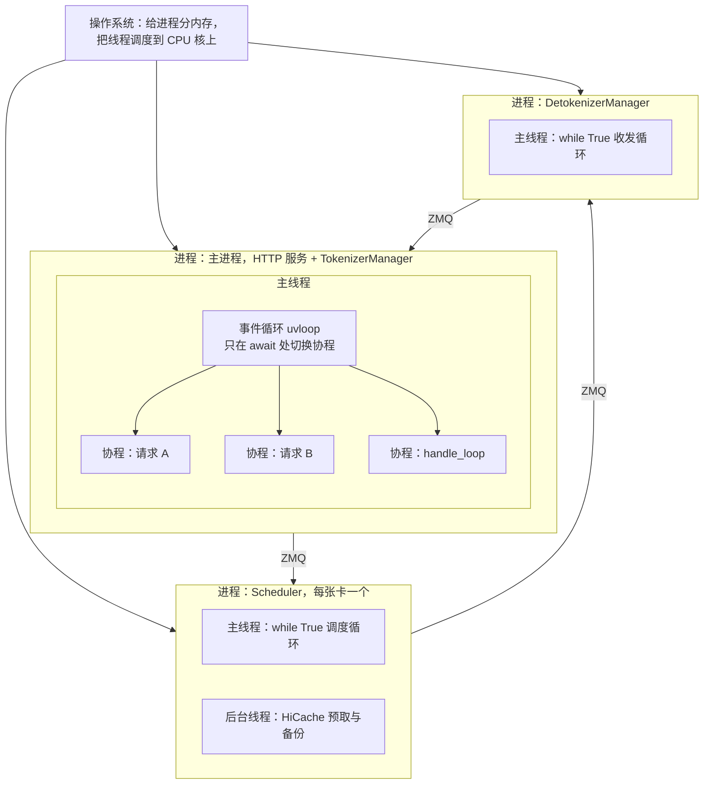

# 基础知识四：Python 中的进程、线程与协程

> 进程是操作系统分配内存的单位，线程是操作系统调度到 CPU 上的执行单元，协程是线程里由事件循环调度的任务。sglang 用多进程做并行（每张卡一个 Scheduler），用协程在 TokenizerManager 里同时等待大量请求。路径相对 `python/sglang/srt/`

## 1. 三者的关系

| 维度 | 进程(Process) | 线程(Thread) | 协程(Coroutine) |
| --- | --- | --- | --- |
| 是什么 | 操作系统分配资源的单位 | 操作系统调度的执行单元 | 线程里能暂停、恢复的任务 |
| 调度与切换 | 操作系统，随时切换（抢占式） | 操作系统，随时切换（抢占式） | 事件循环，只在 `await` 处让出（协作式） |
| 内存 | 互相隔离，靠 ZMQ 等通信 | 同进程共享 | 同线程共享 |
| 同时执行 Python 代码 | 能，每个进程一把 GIL | 不能，受 GIL 限制 | 不能，本就在一个线程里 |
| 适合 | CPU 密集、需要隔离 | 等 IO、调用会释放 GIL 的 C 库 | 大量并发的 IO 等待 |
| sglang 例子 | Scheduler、DetokenizerManager | HiCache 预取、备份线程 | 每个 HTTP 请求、`handle_loop` |

- GIL（Global Interpreter Lock）：同一进程同一时刻只有一个线程执行 Python 字节码；`time.sleep`、socket 读写、PyTorch 算子执行期间会释放，所以线程仍适合等 IO（Input/Output）。

## 2. 协程怎么轮流执行（全程只有主线程）

| 时刻 | 线程正在执行 | 发生了什么 |
| --- | --- | --- |
| t1 | 请求 A、B 的 `generate_request` | 各自 `_send_one_request` 后，在 `await state.event.wait()` 让出 |
| t2 | 无 | 所有协程都在等，事件循环等 socket 可读 |
| t3 | `handle_loop` | `await async_sock_recv(...)` 返回，`_handle_batch_output` 写 A 的 `out_list` 并 `event.set()` |
| t4 | 请求 A 的 `_wait_one_response` | 从 `await` 的下一行继续，取 `out_list`，`yield` 给 HTTP 层 |

- 对单个协程，`await` 前后按顺序执行，像同步；对线程，等待期间它在执行别的协程，不阻塞。
- 协程里调用 `time.sleep`、同步 `recv`、长时间 CPU 计算会卡住整个线程，所有请求一起停；所以 `managers/io_struct.py` 的 `async_sock_recv()` 用 `await socket.recv(...)`。

## 3. 语法速查

| 写法 | 作用 | sglang 例子 |
| --- | --- | --- |
| `async def` + `return` | 协程函数：调用得到协程对象，用 `await` 取结果 | `async_sock_recv()` |
| `async def` + `yield` | 异步生成器：用 `async for` 或 `await x.__anext__()` 逐个取 | `generate_request()`、`_wait_one_response()` |
| `asyncio.create_task(协程)` | 注册成后台任务，立即返回 | `auto_create_handle_loop()` 启动 `handle_loop` |
| `asyncio.Event` | `set()` 唤醒所有在 `wait()` 的协程，只通知、不存数据 | `ReqState.event` |
| `asyncio.wait_for(aw, timeout)` | 最多等 timeout 秒，超时抛 `asyncio.TimeoutError` | `_wait_one_response()` 每 4 秒检查客户端是否断开 |

- `async` 会传染：函数里写了 `await` 或 `async for`，自己就必须是 `async def`。
- 异步生成器不支持 `yield from`，转交下层结果只能写 `async for x in 下层(): yield x`。

## 4. 对应到 sglang

- **多进程**：`entrypoints/engine.py` 的 `Engine._launch_scheduler_processes()` 里 `mp.Process(target=run_scheduler_process_func, ...)`；`_set_envs_and_config()` 里 `mp.set_start_method("spawn", force=True)`，因为父进程用过 CUDA 后，fork 出的子进程不能再用 CUDA。
- **线程**：`managers/cache_controller.py` 的 `HiCacheController` 在开启 HiCache（Hierarchical Cache）时启动 `threading.Thread(target=self.prefetch_thread_func, daemon=True)`，搬 KV 不卡 Scheduler 主循环。
- **协程**：`entrypoints/http_server.py` 的 `uvicorn.run(app, ..., loop="uvloop")` 建事件循环；`managers/tokenizer_manager.py` 的 `_wait_one_response()` 执行 `await asyncio.wait_for(state.event.wait(), ...)`，`handle_loop()` 执行 `await async_sock_recv(self.recv_from_detokenizer)`，再由 `_handle_batch_output()` 写 `out_list` 并 `s.event.set()`。
- **不用加锁**：`rid_to_state`、`out_list` 只在主线程的协程之间读写，切换只发生在 `await` 处。
- Scheduler 的 `event_loop_overlap()`、DetokenizerManager 的 `event_loop()` 只是普通的 `while True` 循环，不是 asyncio 事件循环。

## 术语与生词

| 术语或单词 | 中文释义 | 简明英文释义 |
| --- | --- | --- |
| Process /ˈprɑːses/ | 进程：操作系统分配资源的单位 | A running program with its own memory. |
| Thread /θred/ | 线程：操作系统调度的执行单元 | The unit the OS schedules on a CPU. |
| Coroutine /ˌkoʊruːˈtiːn/ | 协程：能暂停、恢复的任务 | A task that can pause and resume. |
| Event Loop /ɪˈvent luːp/ | 事件循环：在一个线程里轮流执行协程 | Runs ready coroutines one at a time. |
| GIL（Global Interpreter Lock） | 全局解释器锁 | Only one thread runs Python bytecode at a time. |
| Preemptive /priˈemptɪv/ / Cooperative /koʊˈɑːpərətɪv/ | 抢占式 / 协作式切换 | Switched by the scheduler vs. by the task itself. |
| IPC（Inter-Process Communication） | 进程间通信，sglang 用 ZMQ（ZeroMQ） | Passing data between processes. |
