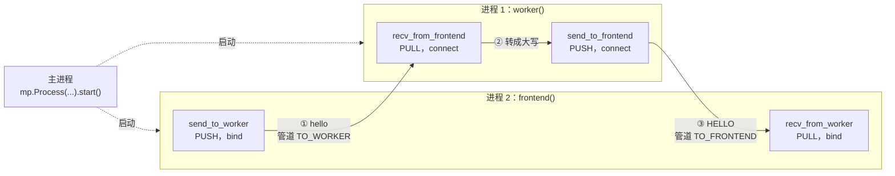

# 基础知识：ZeroMQ 进程间通信

ZeroMQ（`pyzmq`）是一个消息库：进程之间像寄快递一样收发消息（字节或 Python 对象），连接、重连、排队都由它处理。

## 1. 示例

```python
import multiprocessing as mp
import zmq

TO_WORKER = "ipc:///tmp/demo_to_worker" # 通信管道的地址，可以被多个进程复用收发信息
TO_FRONTEND = "ipc:///tmp/demo_to_frontend"

def worker():  # 工作进程：全部 connect
    context = zmq.Context()
    # 创建了一个 PULL 类型（只收）的 socket 对象、连接到 TO_WORKER 地址、收到发送给这个地址的消息
    recv_from_frontend = context.socket(zmq.PULL)
    recv_from_frontend.connect(TO_WORKER)

    # 创建一个 push 发送消息的 socket 对象，连接到 TO_FRONTEND、给这个地址发送消息
    send_to_frontend = context.socket(zmq.PUSH)
    send_to_frontend.connect(TO_FRONTEND)

    req = recv_from_frontend.recv_pyobj() # 阻塞等一条消息
    send_to_frontend.send_pyobj(req.upper()) # 直接将worker的输入转换成大写

def frontend():  # 前端进程：全部 bind
    context = zmq.Context()
    # TO_WORKER、发送消息
    send_to_worker = context.socket(zmq.PUSH)
    send_to_worker.bind(TO_WORKER)

    # TO_FRONTEND、接受消息
    recv_from_worker = context.socket(zmq.PULL)
    recv_from_worker.bind(TO_FRONTEND)
    
    # 用 pickle 序列化后发送，放进队列就返回
    send_to_worker.send_pyobj("hello") # 发送任务给worker
    print(recv_from_worker.recv_pyobj())  # 接收worker的结果

if __name__ == "__main__":
    worker_proc = mp.Process(target=worker)  # 进程 1：跑 worker()

    frontend_proc = mp.Process(target=frontend)  # 进程 2：跑 frontend()

    worker_proc.start()
    frontend_proc.start()
    worker_proc.join()  # 等两个进程都结束
    frontend_proc.join()
```

## 2. 图解



## 3. 概念

- **进程**：主进程用 `mp.Process` 启动两个子进程，分别跑 `worker()` 和 `frontend()`，两者同时运行；`join()` 等它们都结束。
- **Context**：每个进程自己创建一个，用来创建 socket。
- **socket**：进程里收发消息的对象，创建时决定类型：PUSH 只发，PULL 只收。
- **地址与管道**：`TO_WORKER`、`TO_FRONTEND` 是两条管道的地址（`ipc://` 开头，本质是本机文件）。一端 bind（监听），另一端 connect（连接），连上就形成一条单向管道；这里前端 bind，worker connect。
- **收发**：`send_pyobj` 用 pickle 把对象序列化后放进发送队列就返回；`recv_pyobj` 会阻塞，直到收到一条消息。

